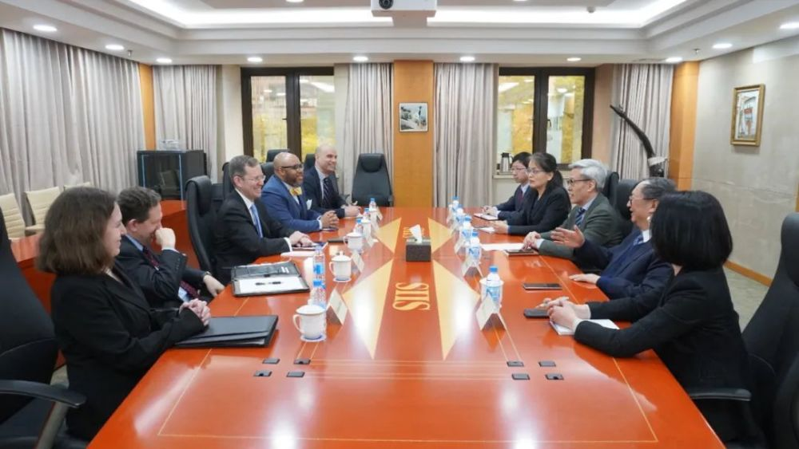
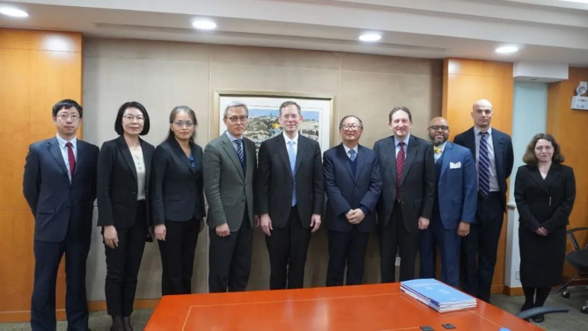

# 美国国务院“中国组”负责人低调来华，专家：或将为布林肯访华铺路

这几日，中国发展高层论坛2023年年会正在北京举行，伴随着这次会议，有多位美国商界、学界等的资深人士来到北京等地，并同中方各界别展开互动交流。

与此同时，一名美国国务院高级外交官员开启了他相对低调的访华行程。据澎湃新闻（www.thepaper.cn）记者多方获悉，美国副助理国务卿华自强（Rick
Waters）在刚刚过去的一周访问了中国香港、上海、北京等地，与学术界、商界人士密集会面交流，而他同时也是美国国务院新近成立的“中国事务协调办公室”（又名“中国组”，China
House）的负责人。

对此，香港《南华早报》援引学者分析称，此行是中美双方“工作层级沟通”的一部分。美国国务院官员通过与中方接触、咨询意见，或将为美国国务卿布林肯安排访华铺路。

走访京沪智库，就中美关系交换意见

_2023年3月22日，美国国务院中国协调员、副助理国务卿华自强（Rick
Waters）一行访问上海国际问题研究院。 微信公众号@上海国际问题研究院 图_

此次访华期间，华自强与京沪等多地学者进行了交流。据上海国际问题研究院微信公众号信息显示，3月22日，华自强一行访问了上海国际问题研究院，同该院院长陈东晓、学术咨询委员会主任杨洁勉会谈交流，双方就“中美关系等议题深入交换意见”。

在北京，华自强于3月25日应邀访问察哈尔学会，并与该学会专家学者举行闭门午餐会，就中美关系和地区局势交换了意见。察哈尔学会会长韩方明在午餐前单独会见了华自强一行。

澎湃新闻记者了解到，此行华自强还会见了其他中方人士，但并没有见诸公开信息。目前来看，华自强此访的更多行程和细节暂不明晰，但这是去年12月以来美国高级外交官首次访问中国。去年12月11日至12日，外交部副部长谢锋在河北廊坊同来访的美国国务院亚太事务助理国务卿康达、白宫国安会中国事务高级主任罗森伯格举行了会谈。从当时美国国务院的声明来看，康达、罗森伯格的访问是在美中领导人巴厘岛会晤的基础上，为布林肯原定于2023年初的访华行程做准备。

不过，在2月初“无人飞艇事件”后，美国国务院高官在电话吹风会上称，受中国无人飞艇进入美领空事件影响，布林肯已决定推迟访华行程。中方也强调，中美双方都没有宣布过什么访问，美方发布有关消息是美方自己的事情。

值得一提的是，在华自强此次访华之前，美方已释放出政府高级官员可能访华或期待沟通的消息。白宫3月20日表示，华盛顿和北京正在讨论美国财政部长耶伦和商务部长雷蒙多可能对中国进行的访问。此外，美国国家安全顾问沙利文3月13日也表示，期望拜登和中国领导人在接下来会通话。

对此，外交部发言人汪文斌此前回应称，沟通的价值和意义在于增进理解，管控分歧，不能为沟通而沟通。“美方应当拿出诚意，同中方相向而行，以实际行动推动中美关系重返正轨。”

美国国务院成立“中国组”，协调对华政策

此次访华的华自强除了担任美国国务院副助理国务卿外，还有一个值得注意的身份——主管美国国务院新成立的“中国事务协调办公室”（又名“中国组”，China
House）。实际上，在去年11月中美领导人巴厘岛会晤后，美国国务院于当年12月16日正式成立“中国组”，该机构由布林肯本人主持设立。

美国国务院发言人办公室在一份声明中称，“中国组”是布林肯现代化议程的重要组成部分，该议程的重点是使美国国务院能够迎接挑战并抓住未来十年的机遇。启动“中国组”旨在确保美国政府能“负责任地”管理与中国的竞争，为美国对华政策和战略的成功实施提供人才、工具和资源。

公开消息显示，“中国组”由约60至70人组成，由华自强主管，日常向美国常务副国务卿舍曼（Wendy
Sherman）及美国国务院亚太事务助理国务卿康达汇报。据美国有线电视新闻网（CNN）报道，“中国组”将扩大关注中国的外交官人数，还将有来自其他部门的美国政府人员在“中国组”轮流工作，使之成为一项跨部门的行动。

美国国务院官员此前表示，“中国组”取代的是美国国务院东亚和太平洋事务办公室框架下的中国事务部。虽前后两个机构都由华自强统管，但据专家与媒体分析称，这次改组使其层级已超越以往架构，成为美国国务院下跨局处的任务编组单位，显示了美国政府整合外交资源，加大对中国关注的决心。

需注意的是，在美国国务院设立“中国组”之前，五角大楼和中央情报局在过去两年间也陆续成立了专门针对中国的部门。2021年3月，美国国防部长奥斯汀设立的“中国工作小组”开始运行。当年10月，美国中央情报局局长伯恩斯宣布，将设立辐射中情局所有任务领域的“中国任务中心”。

在十四届全国人大一次会议期间，外交部长秦刚在谈及中美关系时指出，美国对华认知和定位出现了严重偏差，把中国当成最主要对手和最大地缘政治挑战，导致美国对华政策完全脱离了理性健康的正轨。

“美方的所谓‘竞争’，就是全方位遏制打压，就是你死我活的零和博弈。”秦刚当时强调，这样的竞争，就是以两国人民根本利益乃至人类前途命运为赌注的豪赌，中方坚决反对。

秦刚3月25日也在北京集体会见来访的美国友好团体和工商界人士时表示，中美关系是世界上最重要的双边关系，中美关系搞好了，世界受益；反之，世界遭殃。中方对发展健康、稳定、建设性的中美关系的态度没有变化，始终主张中美相互尊重、和平共处、合作共赢。

