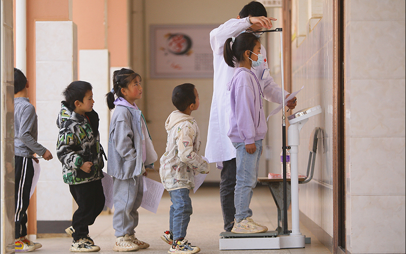

# 血脂检测列入小学常规检查，为何有必要“从娃娃抓起”？

_▲资料图。医护人员为小学生测量身高体重。图/新华社_

3月25日，由中国血脂管理指南修订联合专家委员会、国家心血管病专家委员会、中华医学会心血管病学分会、中国卒中学会共同修订的《中国血脂管理指南（2023）》发布，这是在《中国成人血脂异常防治指南（2016年修订版）》基础上，结合近年来最新研究数据和临床经验，时隔7年后的一次重大调整。

与旧版《指南》相比，新版《指南》增加和修订了很多内容，比如首次提出了“超高危”这个概念，进一步凸显血脂异常的高健康风险，利于“超高危”人群强化相关疾病治疗和健康管理等。这当中，让人更感惊讶的是新版《指南》明确，血脂检测应列入小学、初中和高中体检的常规项目。

在民众的心目中，血脂异常属于“成人病”“老年病”，与学生的关系不大。中学生接近于成年，让中学生常规检测血脂或许可以理解，血脂检测列入小学常规检查项目，这个确实超出了很多人的预料。

其实，小学常规检测血脂不仅必要，而且紧迫。有统计显示，我国6-17岁的儿童青少年超重肥胖率近20%，6岁以下儿童超重肥胖率超过10%。肥胖与血脂异常互为因果、如影随形，学生血脂异常的发病率与肥胖率相当，甚至更高。

天津市2021年的一项调查显示，幼儿园大班儿童血脂异常检出率7.4%；小学二年级学生血脂异常检出率13.5%。看看这些数据和小学里处处可见的“小胖墩”，就会理解和支持这一调整。

更要看到，儿童的不良生活与饮食习惯，还会为高血压、糖尿病、血脂异常冠心病、脑卒中等“老年病”埋下病根。

《中国居民膳食指南科学研究报告（2021）》显示，我国儿童青少年含糖乳饮料和饮料消费率在30%和25%以上，远远高于成人。缺乏父母陪伴的留守儿童，可能更是不知科学饮食为何物，他们受高脂食品和高糖饮料的危害更大。孩子们的饮食混乱程度，比成年人有过之而无不及。

儿童过多摄入油炸食品、甜食、含糖饮料，因过于依赖电子产品而缺乏运动等，不仅影响当下的健康指标，而且还会对身体造成一些不可逆的影响，比如长期的高血脂可导致动脉粥样硬化，进而导致血压增高。

此外，小时候养成的坏习惯还可能伴随一生，到老都要为之付出健康代价。良好的生活习惯要从小养成，从这个角度看，预防“老年病”也应该从“从娃娃抓起”。

新版《指南》发布之后，医生的诊疗、公共卫生项目的实施、基层的慢病管理等，都要作出相应调整。

相比医疗系统内部的调整，中小学将血脂检测等新规落到实处，面临的困难和付出的努力都要大得多。将血脂检测列入学校常规检查项目比较容易，但为学生制定科学的膳食计划、帮助学生养成健康的生活与饮食习惯等，不付出艰苦与细致的努力，不足以实现这些目标。

“从娃娃抓起”预防“老年病”，家长的作用更不容忽视。亲情陪伴是减少电子产品依赖的最好手段，健康的饮食也需要家长来提供。家长健康的生活方式，对于孩子也能起到潜移默化的作用。新版《指南》需要多方遵从执行，最应该学习领悟并照章行事的，其实是家长。

撰稿 / 罗志华（医务工作者）

编辑 / 刘昀昀

校对 / 刘军

