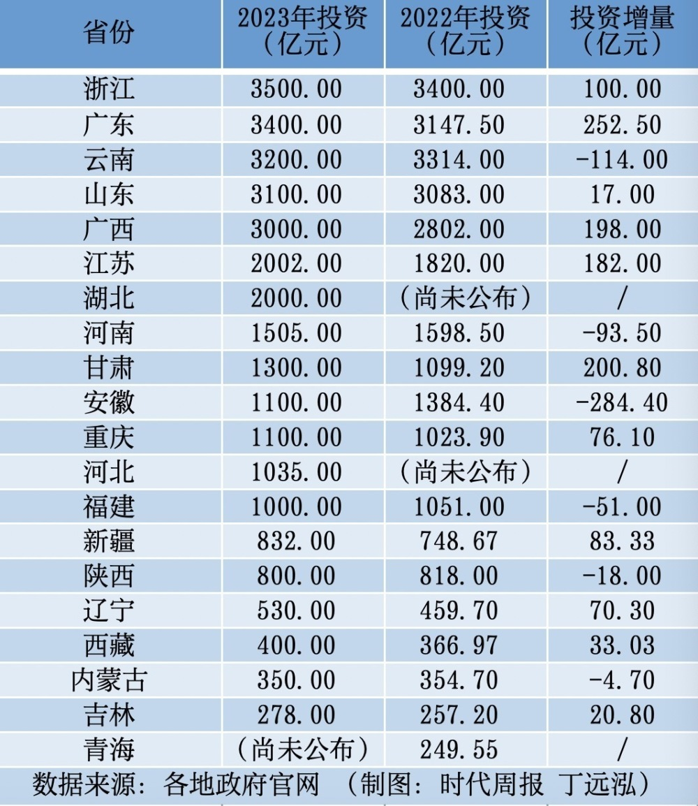
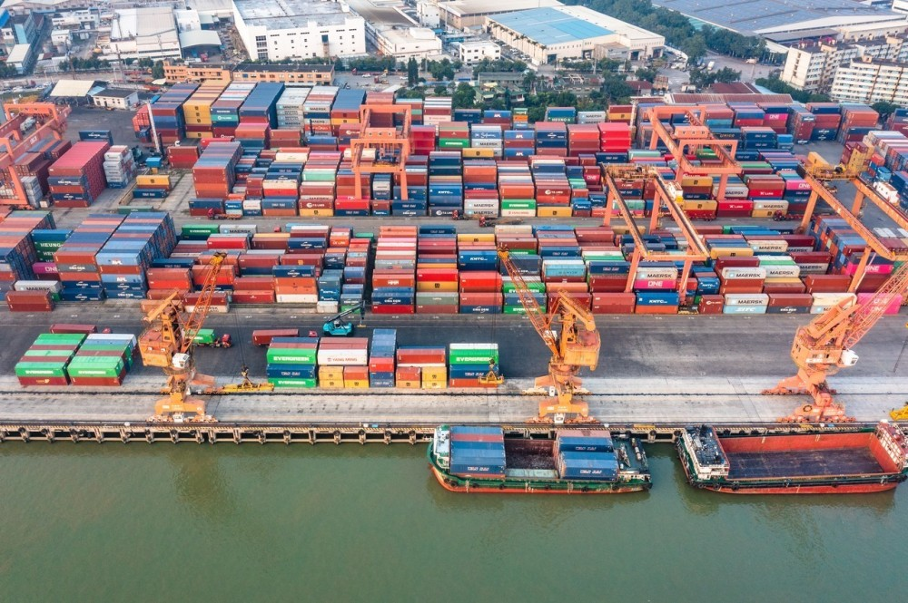

# 谁在疯狂修“路”？浙江今年计划投资3600亿居首 广东云南紧随其后

本文来源：时代周报 作者：丁远泓

要想富，先修路。

在所有的基础建设中，交通建设算得上是“排头兵”。

据时代周报记者不完全统计，目前，31个省份中已有19个公布了2023年的交通建设投资目标任务，18个省市自治区公布2022年的实际交通投资情况，并有江西、贵州和宁夏3个省份公布2023年的公路水运投资计划。

其中，在已公布的数据中，有5个省份的2023年预期投资超3000亿元，4个省份的2022年实际投资超3000亿元。

具体而言，浙江省的2023年预期投资将确保3500亿元、力争3600亿元，在各省份中排名最高。不仅是2023年，浙江在2022年的实际综合交通建设投资排名中，也同样位列第一。

_各省份交通建设投资情况_

不过目前看来，最有“野心”的省份是广东。

按照已有的官方数据，以2023年的投资计划减去2022年的实际投资金额进行增量计算和排名，广东成为唯一增量超250亿元的省份。

浙江计划投资排名第一

在目前已公布的各个省市自治区2023年综合交通投资目标中，浙江是唯一规划超3500亿元的省份。

根据浙江省2023年全省交通运输工作会议，浙江将确保全年完成综合交通投资3500亿元，力争3600亿元。

其中，浙江省公路水运投资将超2300亿元。新建成高速公路220公里、普通国省道260公里，新改建农村公路1000公里，新增沿海万吨级以上泊位5个、内河千吨级航道23公里。

这并不是浙江首次如此“大手笔”。其实自2019年综合交通建设投资首破3000亿元大关以来，浙江省的实际投资一直保持在3400亿元及以上。2020年，浙江省综合交通建设投资甚至达到3600亿元，同比增长17%。

_浙江计划投资排名第一
图源：图虫创意_

今年浙江定下的“高目标”，是为了推进世界一流强港和交通强省建设工程。

分开来看，浙江省想要推进的世界一流强港建设工程，是指在2027年，宁波舟山港要迈入世界强港第一方阵，成为浙江交通最大的特色、最核心的优势、最具战略性辨识度的标志性成果。

为此，2023年，浙江将实施“强港建设”攻坚行动，全力推进以宁波舟山港为核心的世界一流强港建设，确保货物、集装箱吞吐量达12.6亿吨、3400万标箱，国际航线数超250条，国际航运中心发展指数“保10争9”。

而在交通强省建设工程上，浙江将在未来五年投资2.7万亿元。届时，浙江的综合交通线网总里程将达15.6万公里，综合交通网密度将由目前的128.9公里/百平方公里，上升至147.9公里/百平方公里。

落在今年的规划，则是要统筹综合立体交通网建设，全力推动一批重大项目开工和推进一批重大项目建成。

浙江交通相关负责人表示，扩投资、抓项目，是促进经济回稳向好的关键举措，也是交通行业服务大局最核心的任务，可以说现在是浙江加快交通投资建设最有利的契机，也是大有可为的关键一年。

_浙江推进世界一流强港和交通强省建设工程
图源：图虫创意_

广东增量超250亿元

对比各省份去年的实际综合交通投资情况，和它们今年定下的目标，广东或许会是最有“野心”的那个。

总体而言，在17个既公布2022年实际投资额，又公布了2023年预期投资目标的省份中，有6个省份的增量为负，也就是2023年的预期投资低于2022年实际投资。此外，还有5个省份的投资增量在100亿元或以上。

其中，广东省2023年计划完成公路水路投资2300亿元、省管铁路投资1100亿元，相较于2022年实际公路水路建设投资2163.8亿元、省管铁路投资983.7亿元，其总体增量达到252.5亿元，比增量排名第二的甘肃高51.7亿元。

细究这一组数据，不难发现，省管铁路将是今年广东的最大发力点，其增量达到116.3亿元，接近于所有增量的1/2。

不仅如此，目前广东省的多项交通指标均位于全国前列：铁路运营里程达5328公里，高速铁路达2367公里，城市轨道交通运营里程达1333.5公里……

_广东增量超250亿
图源：图虫创意_

不过，广东省城乡规划设计研究院总工程师马向明对时代周报记者表示，虽然广东省铁路的总体运营里程能在全国排名前列，但是广东省总面积有近18万平方公里，常住人口也达到1.26亿，无论是地均水平还是人均水平都还有一定的增长空间。

根据广东省2023年全省交通运输工作会议，广东省将加快37项在建项目，计划建成8项511公里（含高铁349公里、城际铁路152公里，疏港铁路及专用线10公里），并计划新开工10项416公里。

在马向明看来，今年铁路方面投资的“重头戏”应该是广汕高铁和广湛高铁，前者预计于年内开通，后者正在全力冲刺建设。

“湛江和汕头属于省域副中心城市，均建有港口。如果能够利用高铁将这两个城市与广州相连，不仅有利于都市圈之间的交流，也有利于整个广东省应对全球化趋势。”马向明说。

5省份计划投资超3000亿元

3000亿元的投资不是一笔小数据，除了浙江和广东，山东、云南和广西也在2023年定下了3000亿元或以上的目标投资额。

例如，山东就在该省的2023年政府工作报告指出，要加快交通强国示范区建设，交通投资完成3100亿元以上。

事实上，山东在2022年全面展开基础设施“七网”行动，其交通投资就达到了3083亿元，共计2条高铁与联络线开通，3条高铁开工，7条高速通车，17条高速开工建设，同时济宁机场迁建基本完成，济南机场二期改扩建、枣庄机场等开工建设。

2022年山东省印发的《综合立体交通网建设行动计划》显示，到2025年，山东要初步建成现代化高质量综合立体交通网，成为东北亚乃至“一带一路”的综合交通枢纽。到2030年，交通基础设施综合发展水平居全国前列，有力支撑新时代现代化强省建设。

_5省计划投资超3000亿元 图源：图虫创意_

位于西部地区的云南和广西在各自的2023年交通运输工作会议中也提出了不低的目标，前者定为3200亿元，后者定为3000亿元以上。

在马向明看来，国家能够审批给广西和云南这么高的交通投资，原因之一是东南亚国家在中国对外贸易中的作用明显加强，而云南、广西都是中国毗邻东南亚的省份。

目前，中越铁路并轨，中老铁路的国际货运总量突破300万吨，中泰铁路工程也正在进行建设。

根据《“十四五”现代综合交通运输体系发展规划》，中国将强化面向俄蒙、东南亚、南亚、中亚等重点方向的陆路运输大通道建设。

不过，现阶段两者进行交通建设的目的，还有所不同。

众所周知，云南在基础设施方面存在短板，想要进行高质量发展，便需要加快综合交通基础设施补短板、强通道。

为此，云南在2022年的综合交通固定资产投资就达到3314亿元，超额完成年度目标任务，高速公路总里程达到10249公里，新改建农村公路1.9万公里，铁路运营里程达到4981公里。

今年，云南将加快“能通全通”剩余在建和“互联互通”开工项目建设进度，在公路、高铁、机场方面推进建设，并建设面向国际、辐射全国、覆盖全省的邮政快递寄递网。

而广西则是想要加快交通强区高质量发展。《广西综合交通运输发展“十四五”规划》提及，2025年，广西要建成“全国前列、西部领先”的“交通大省”。

一步一步，广西走得很扎实。

去年，广西新增高铁营业里程121公里，新增高速公路里程923公里，全面实现“县县通高速”。

今年，广西将在年内基本实现“市市通高铁动车”，年底高速公路通车总里程突破9000公里，二级及以上公路比重达78%。

广西壮族自治区交通运输厅党组书记、厅长刘可还表示，2027年年底，广西将新增38条、形成81条出省出海出边陆路大通道，内河港口货物吞吐量达2.3亿吨，综合交通网总里程突破21万公里。

一系列布局下，各省份的交通水平将进一步提升。

