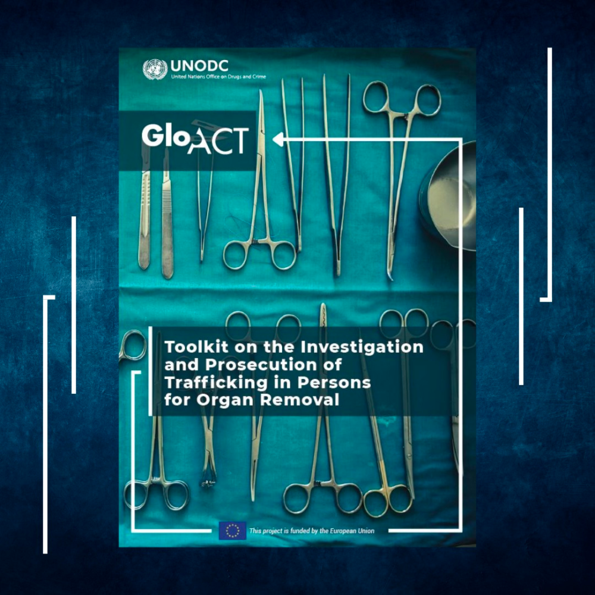
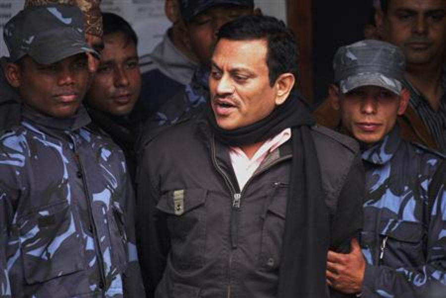

# 较真｜“噶腰子”并不完全只是都市传说，但去泰国旅游真的不必担心

**较真要点：**

  * _1_ 大部分流传的“偷肾传说”都是缺乏科学性和实操性的。不过一些媒体“非自愿的偷肾行为几乎不可能发生”的结论过于武断，根据联合国报告，“以摘除器官为目的的人口贩运活动”的确是存在的。
  * _2_ 所谓“多个网红去泰国男模餐厅后失联被噶腰子”是毫无根据的谣言，去泰国旅游总体上是安全的。中国领事服务网关于泰国治安的描述，是“社会状况整体较好，安全形势总体稳定。”
  * _3_ 去泰国打工会不会被“噶腰子”？据国内媒体梳理，境外犯罪组织诱骗国内求职人员出国后，往往从事电信诈骗、赌博、贩毒和色情等四类犯罪活动，尚未见被“噶腰子”的明确报道。

**查证者： 丁阳 ｜ 较真主笔**

“去一趟泰国，结果人被‘噶腰子’了”——这个话题最近引发了许多人关注。“噶腰子”这个无比吸睛的词，也成为热议对象。许多人在感到担忧的同时，也怀疑是不是真的有这回事。

**一、“噶腰子”绝大多数情况下只是都市传说**

“一觉醒来肾被偷了”，是一个经典得不能再经典的“都市传说”，从美国引进，在中国的流传有好几十年了。而且，很早就有关于这个说法的辟谣。1997年4月4日，美国肾脏基金会在其网页上就郑重声明，当时在美国流传的“偷肾事件”是缺乏科学性的，专家指出——

“肾脏移植是一个非常复杂的过程，仅器官匹配性一项就需要诸多检查，而这一切都必须在取肾之前进行。因此，即便犯罪团伙私下盗取了器官，肾移植手术的成功率也是微乎其微的。”

“肾移植的供体和受体匹配性检查最起码要花费12个小时，而网络上流传的盗肾故事中，受害者在被迷药麻醉后仅仅几个小时就醒来发现失去双肾，实在是相当荒诞可笑的。”

“人体器官的摘取、运输和移植是一个极其复杂的过程，需要先进的检测仪器(如检查DNA匹配的设备)、精确的时间测定以及方方面面的人员支持，所有这一切是不能在合法医疗机构之外实施的。”

对于“偷肾都市传说”，上面这些说法是非常有力的反驳。这两天一些科普媒体在辟谣“噶腰子”时，也重申了上述说法。

**二、但“非自愿的偷肾行为几乎不可能发生”过于武断，“以摘除器官为目的的人口贩运活动”的确是存在的**

有媒体进而断言，“简单地说，肾的配型难度让非自愿的偷肾行为几乎不可能发生。出门旅游被取走的肾这种谣言大可不必相信。”

非自愿的偷肾行为真的“几乎不可能发生”吗？这个说法，恐怕有些武断。

联合国毒品和犯罪问题办公室在2022年10月27日发布了一个工具包，用于调查和起诉“以摘除器官为目的的人口贩运活动”。

_图注：联合国毒品和犯罪问题办公室发布的工具包封面，该工具包用于调查和起诉以摘除器官为目的的人口贩运活动_

该办公室的人口贩运报告称，“长期以来，以摘取身体器官为目的的贩卖活动一直处在暗处，调查很少，起诉的情况更少。”2010 年至 2018
年期间，多个国家发现了大约300
名以摘取器官为目的的人口贩运受害者，并且北非、南亚和东南亚、中美洲和欧洲均有报告称存在以摘取器官为目的的贩运活动。值得注意的是，报告还指出，“官方数据肯定低估了这种现象的严重程度”。摘取的器官主要就是肾，少数情况下是肝。

毒品和犯罪问题办公室指出，这是一项复杂的犯罪活动。正是由于缺乏识别和调查这种复杂犯罪的专业知识，导致了严重程度被低估。

为什么说这是“复杂”的犯罪活动呢？因为参与其中的，往往包括外科医生、护士、配型的准备人员，并且在合法的医疗环境中进行。前面提到的那些科学方面的门槛，对于犯罪集团而言，在特定的情况下是可以解决的。

据《卫报》报道，2008年，印度就破获了一起长期的、严重的盗肾犯罪事件，移植交易在一家私立医院进行，报道称至少有 500
个肾脏被非法移植。受害者是来自德里附近村庄的贫穷劳工，他们被工作邀请引诱到私人诊所，结果被告知需要的是肾脏，可以得到报酬。一些拒绝的人被强迫摘取了肾脏。

_图注：印度盗肾犯罪事件的主谋阿米特·库马尔被抓获时的照片_

毒品和犯罪问题办公室发布的工具包明确表示，一种犯罪情形是“在被害人不知情或不同意的情况下摘除器官”，犯罪者使用了武力、威胁或使被害人麻醉，来实施摘除。还有一种情形是，“在受害人不知情或不同意的情况下，采用欺骗和欺骗手段，以提供医疗为借口摘取器官”。此外还有五种情形，都带有强迫性质。

这些情形，受害者都不是自愿献出了自己的肾。

**三、存在“噶腰子”，不代表被贩卖后，就会遭遇“噶腰子”**

首先，“噶腰子”传说之所以传得轰轰烈烈，依附于“东南亚人口贩卖猖獗”这个大传闻，“噶腰子”是作为被贩卖后最让人担心的一个结果，而广泛流传的。

“东南亚人口贩卖猖獗”是不是事实呢？一定程度上是的，近期发生的多起中国青年在缅甸失联，就是典型代表。一些犯罪集团为了吸引劳工，打出高薪的幌子，结果就有人被高薪陷阱骗过去了。这类事情高发于缅甸，但并非只有缅甸，柬埔寨、孟加拉国、马来西亚都有人口贩卖记录。根据联合国毒品和犯罪问题办公室
(UNODC) 发布的 2016 年全球人口贩运报告，超过 85% 的受害者是从东亚和太平洋地区被贩运的。

但需要指出的是，从目的角度看，“噶腰子”在人口贩卖中的比例是比较低的。根据联合国2022版全球人口贩卖报告，在2020年已发现的所有36488名人口贩卖受害者中，“摘除器官”的比例是0.2%，大概有70多人。尽管这个数字有可能被低估，但总的来说，人口贩卖更多的目的还是用于强迫劳动、性剥削、强迫犯罪等等。

_图注：2020年全球人口贩卖的36488名已知受害者中，“摘除器官”的比例是0.2%，引自《2022版全球人口贩卖报告》_

这也可以从媒体对案件的梳理得到印证。据最高人民检察院主管杂志《方圆》的一篇报道，境外犯罪组织诱骗国内求职人员出国后，往往从事电信诈骗、赌博、贩毒和色情等四类犯罪活动。比如成为境外电信网络诈骗集团的“话务员”，成为境外赌博集团的“客服小弟”，成为跨境贩毒集团的“马仔”，或被逼接客卖淫或参与淫秽色情网络平台运营，等等。

上述这些状况当然十分糟糕，但与“噶腰子”还是有区别的。截至目前，国内尚缺少受害者被诱骗贩卖后，被“噶腰子”的明确报道。

**四、旅游与打工存在本质区别，去泰国旅游总体上是安全的**

除去被贩卖后遭遇“噶腰子”的几率较低之外，大家还需要意识到，不同目的出国，其安全系数存在本质的不同。

正如前所述，被境外犯罪集团贩卖，往往与求职有密切的关系，这就给了犯罪集团可乘之机。有跨国打工需求的人，通常所处的社会、经济阶层都较低，其维护自身安全、利益的能力也相对较差，因此当这些人被跨国犯罪集团通过话术诱骗出国到缅甸等地，从事强迫劳动或犯罪活动时，暴露的风险较低。

毕竟，对于受害者来说，他们确实还是去了“打工”，只是带有强迫成分，且人身自由受到限制，但在犯罪集团的威逼利诱下，是可以通过欺骗稳住自己的家人的，这跟传销活动难以被识别是同样的道理。

因此，如果有人高价招揽你去泰国“打工”，是务必需要警惕的。事实上，泰国也的确是一些“打工陷阱”的中转站。

但出国旅游与出国打工存在着本质的不同。旅游者如果莫名其妙失踪，或者突然联系家人说自己跑去异国打工，会引发家人的警觉，从而有可能引发国际关注。对于犯罪集团而言，这显然是应当尽力避免的。而且，要诱骗一个旅游者，联系的成本、话术的成本也是比较高的
，对于犯罪集团来说根本不划算。

另外，如果旅游者被诱骗贩卖，对于当事国家的国际形像来说，会构成重大打击。就拿这次“噶腰子”风波联系最密切的泰国来说，仅仅目前出现了相关传闻，泰国高层就非常重视，总理出面要求澄清不实信息。事实上，所谓“多个网红去泰国男模餐厅后失联被噶腰子”的确是毫无证据的谣言。

_图注：著名的泰国男模餐厅，将该餐厅与“噶腰子”联系起来纯属谣言_

那么泰国旅游安全形势的真实情况如何呢？

据中国领事服务网，关于泰国的“旅行风险等级和安全提醒”，目前泰国现有红色（极高风险）地区3个，其他地区均为蓝色（低风险），红色地区是指泰国南部的动荡区域，本身就不是旅客常去的目的地。而关于泰国治安的描述，则是“社会状况整体较好，安全形势总体稳定。”

中国香港是去泰国旅游的大户，香港政府保安局目前关于泰国的外游警示等级是“有威胁迹象”，但列举的与警示相关的事件，大部分与旅游者没有直接关系。

美国领事事务局关于泰国的风险警示，较为具体，提到“扒窃、抢包和入室盗窃等借机犯罪在泰国时有发生”“针对外国人的谋杀、强奸和袭击事件时有发生”“租赁诈骗在泰国的确存在”，还提到泰国一些酒吧会威胁游客支付高价，以及一些宝石骗局、信用卡骗局等。但总的来说，“针对外国人的暴力犯罪相对较少”。而且美国对泰国旅游风险的整体评估是最安全的“1级”：采取正常的预防措施。

以上这些风险警示，均没有提到关于“人口贩卖”。

总体来说，去泰国的旅游者是不必过于担心的，更不用担心被贩卖，乃至被“噶腰子”。

**版权声明：本文系腾讯较真独家稿件，未经授权，禁止媒体转载。欢迎个人转发至朋友圈。**

