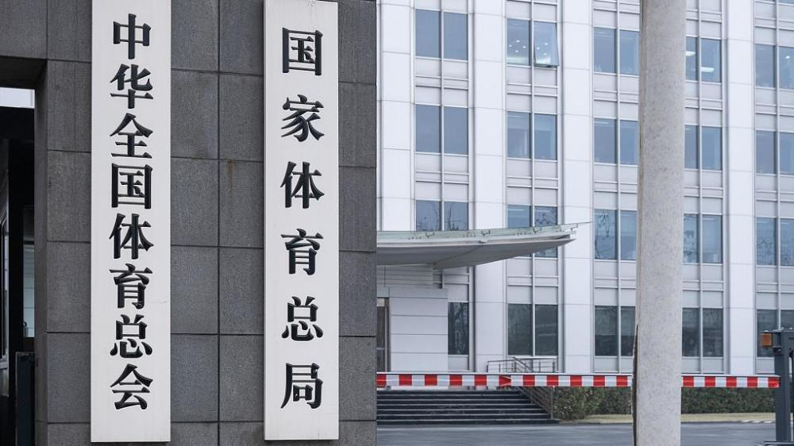

# 针对足球腐败对体育总局党组开展的机动巡视是什么意思？有哪些手段？

3月27日晚，新华社公布了二十届中央第一轮巡视对象。经党中央批准，二十届中央第一轮巡视将对30家中管企业党组开展常规巡视，对5家中管金融企业党委开展巡视“回头看”，对国家体育总局党组开展机动巡视。

中共中央政治局常委、中央巡视工作领导小组组长李希3月27日出席全国巡视工作会议暨二十届中央第一轮巡视动员部署会并讲话。

李希强调，对国家体育总局开展机动巡视，要聚焦履行党的领导职能责任、贯彻落实体育强国建设重大决策部署情况，深入查找、推动解决体育领域特别是足球领域腐败问题和深层次体制机制问题，为建设体育强国提供有力保障。

那么什么是机动巡视呢？

澎湃新闻记者注意到，其实，早在2017年6月，中纪委网站就曾刊文介绍过什么是“机动式”巡视。“三个词九个字”，谈起“机动式”巡视，中央巡视组同志开门见山，言简意赅。

这“三个词九个字”就是“小队伍”“短平快”“游动哨”。

“小队伍”指的是每个机动小组5至6人，每个人都是有效“火力点”。“短平快”指的是高效精准突破，直接冲着重点专项问题去。“游动哨”指的是哪里问题反映突出就去哪里，出其不意、攻其不备。

从李希的讲话来看，这次对国家体育总局党组开展机动巡视直接就是冲着“深入查找、推动解决体育领域特别是足球领域腐败问题和深层次体制机制问题”去的，目标明确。

那么“机动式”巡视， 中央巡视组用了哪些“招儿”？

中纪委网站介绍，深入开展“机动式”巡视，有效发挥“机动式”巡视政治“显微镜”、政治“探照灯”作用，中央巡视组亮出三个“招儿”。招式一：抓住关键有的放矢，避免剑走偏锋；招式二：盯住要害机动灵活，不搞面面俱到；招式三：创新方式窥斑见豹，当好“守更人”。

中纪委文章介绍，“机动式”巡视的巡视组进驻后，盯住单位“关键”部门，精准出击、精准发力。在召开动员会的同时，组织力量深入被巡视单位综合、党务、业务等部门，调取有关资料。从阅看资料入手，了解领导班子结合本单位实际，落实中央重大决策部署和习近平总书记系列重要讲话精神的情况，快速梳理，快速固化，从中发现贯彻落实不够坚决、不够到位的有关问题线索。

巡视中，抓住“关键”问题，精准突破。巡视组结合被巡视单位的历史、文化、体制等特点，抓住涉及被巡视单位核心职能履行的重点问题，深入了解情况，查找政治偏差，实现精准突破，找准了不够坚决、不够到位的具体问题。

从李希的讲话来看，对国家体育总局开展机动巡视，就是要为建设体育强国提供有力保障。

另外，“机动式”巡视就是要盯住要害机动灵活。

盯住关键岗位人员，开展正面谈话，单刀直入了解情况。集中时间对权力比较集中的关键岗位人员开展巡视谈话，坚持问题导向，明确提出要求，请他们客观地向巡视组提供本单位、本部门、本岗位权力行使过程中存在的问题，从中了解到一些重要情况和问题线索。

盯住要害部门，深入了解情况。在开展面上谈话期间，集中听取被巡视单位要害工作部门行使权力情况汇报，明确要求汇报中强化问题意识，用高标准衡量部门工作，自查部门权力行使过程中存在的突出问题和薄弱环节。在此基础上，巡视组及时梳理情况，研究分析，从中发现不正确使用权力的突出问题及具体表现。

