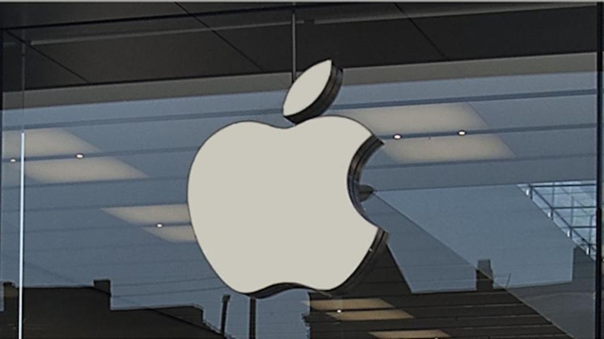

# 预计年销量100万台？苹果向高管展示近年来最重要的混合头显新产品

苹果公司的混合现实（MR）头显设备距离上市更近了一步。

当地时间3月26日，据彭博社记者马克·古尔曼（Mark
Gurman）称，苹果公司上周在总部史蒂夫・乔布斯剧院向公司约100位高管展示了其MR混合现实头显设备——苹果数年来最为重要的一款新产品，结合了虚拟现实（VR）和增强现实（AR）技术。

古尔曼表示，苹果进入混合现实领域的努力需要数年才能看到成效，该公司希望头显设备能遵循苹果智能手表的发展轨迹。

文章提到，头显设备向这群被称作“Top
100”的高管进行了演示，这意味着其在6月公开发布之前立下了一座“重要里程碑”。对于混合现实团队来说，这是一个可以围绕继iPhone、iPad、Mac和Apple
Watch之后下一代主要平台来召集领导者的机会。

文章透露，这并不是“Top
100”第一次看到头显设备。自2018年以来，苹果公司的技术开发团队每年都会谨慎地向公司高层展示该产品，本次展示不再像此前那般低调，而是选择在史蒂夫・乔布斯剧院举行，这也表明其公开宣布的日子已经临近。

“演示非常精美、炫目，并且令人激动，但许多高管都清楚，苹果公司在进军这个新市场时面临的挑战。”文章表示，苹果公司的Mac、iPod、iPhone、Apple
Watch
和iPad等产品，其实是对消费者已经十分熟悉的产品做了优化。相比之下，混合现实融合了增强现实和虚拟现实，仍旧是一个新兴领域，苹果必须向消费者解释，他们为什么需要这样一款头显产品。

此外，从产品自身来看，该设备的起价或将高达3000美元（约合人民币2万元），却缺乏明确的“杀手锏”应用程序，还需要每隔几个小时更换一次外部电池，同时有测试人员认为其某些设计不合理。

基于上述原因，苹果公司的高管们“在公司内部采取了一种现实的态度”，认为“这不会是一款发售就热卖的产品”，可能会遵循与Apple
Watch类似的发展轨迹。高管们预计，随着改款头显的迭代以及低价版本的推出，消费者的兴趣会逐渐浓厚。

文章透露，苹果正在准备一款成本减少一半的版本，以及一款性能更高的版本，这两款产品都将在首款头显发布后的两年内问世。此外，苹果相信其头显产品第一年的销量将达到约100万台，以3000美元计算的话，即30亿美元的营收，但由于设备成本高昂，其利润将几乎为零。

去年12月份，知名苹果分析师郭明錤在推特发文称，其最新调查指出，因为“软件相关问题”，苹果混合现实头显设备可能会推迟到2023年下半年才量产出货，郭明錤还预计苹果头显2023年的出货量将少于50万部。

