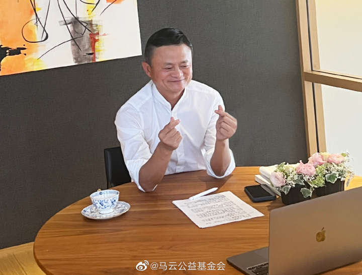

# 马云回国，现身杭州谈ChatGPT：要用AI去解决问题，而不是被AI控制

3月26日，有网友爆料称，在杭州文一路隧道中目击阿里巴巴和蚂蚁集团创始人马云先生，“确信其已回国”。

该目击者拍摄了一段视频并上传至短视频平台，“该人系马云先生无疑”。
对此，有媒体报道，该车内人士分别为马云、阿里巴巴集团董事会主席兼首席执行官张勇以及蚂蚁集团执行副总裁邵晓锋。

马云今天出现在云谷，和校园长们讨论了一个话题。

就在最近，来自云谷的学生给教材主编写了一封信还登上了社交媒体。主编回信给孩子们，“再次感谢同学们认真和勇于质疑的精神。”

新一轮的技术变革对教育带来的挑战与机遇，是云谷一直在认真思考的课题。校园长们说，云谷从创校以来，一直在探索如何在人工智能快速发展的时代为孩子提供面向未来的教育。

马云说，ChatGPT这一类技术已经对教育带来挑战，但是ChatGPT这一类技术只是AI时代的开始。我们要用人工智能去解决问题，而不是被人工智能所控制，虽然人的体力、脑力比不过机器，但机器只有“芯”，而人有“心”。

他说，工业时代是知识驱动，知识的竞争；数字时代，是智慧驱动，是创造力和想象力的竞争，是领导力、担当力、责任的竞争，是独立思考的竞争。

4年师范，6年老师，马云在任何场合都不掩饰自己对教育的热爱。他曾说，教师是他最喜欢的职业，希望能够有一天重新回到学校当老师，这次回到云谷，他把学校又好好地走了一遍。

马云其实一直没有远离学校，而是以各种方式参与和支持教育。他创办的马云公益基金会，把支持乡村教育作为重点方向，激励越来越多的优秀人才投身乡村教育。他创办云谷，用素养教育来帮助孩子找到一生中最大的热爱，成为最好的自己。

近一年来，媒体先后报道，马云前往荷兰、日本、东南亚泰国等多个农业研究机构考察农业渔业技术。

据媒体报道，马云在日本期间，在研究养殖渔业的技术运作，后又在对农业和食品行业表现出了浓厚的兴趣。春节期间，有媒体报道，马云曾现身香港街头采买年货。

2023年1月，马云近期再与泰国首富、正大集团(Charoen Pokphand
Group)资深董事长谢国民会面。马云上月曾到访泰国曼谷考察正大集团，并获谢国民亲自接待，此次是二人在不足一个月间第二度会面，引发外界对于二人投资合作的猜测。

据悉，正大主要以农牧食品、批发零售、电讯电视三大事业为核心，同时涉足金融、地产、制药、机械加工等10多个行业。

2023年2月，社交媒体上出现马云在澳大利亚与交往43年的莫利一家的合照。经媒体向阿里巴巴内部人士求证，马云当时身在澳洲。

_马云和澳洲友人合影在社交平台被发布_

在澳大利亚，这一家外国友人与马云延续了四十多年的友情，他们正是43年前在西湖边和中学生马云合影的莫利一家。

_莫利一家与马云合影_

2023年3月，马云来到斐济的行程被多位本地网民拍到，并纷纷po到社交媒体上。斐济旅游局CEO希尔（Brent Hill）就立即发社交平台表示欢迎。

_斐济旅游局CEO希尔（Brent
Hill）发文欢迎马云。_

近一年的公开报道中，马云曾表示农业科技和乡村教育公益是其接下来的工作重心。

2022年，5月10日是阿里亲友日。有员工在阿里巴巴内网发帖，当天，马云在阿里园区和部分一线员工就公益及农业话题进行了交流。

去年12月30日，马云公益基金会举办乡村教师“腊八之约”，马云连续第8年参加。

