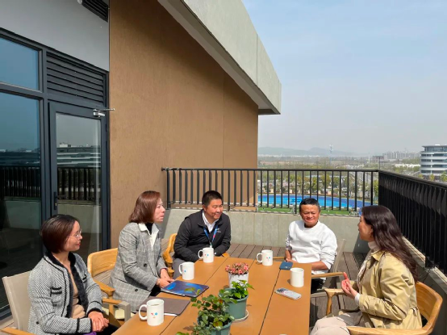

# 马云归国，隐身两年已是阿里“局外人”

_马云与云谷学校校长交流 来源：云谷教育_

作者丨程潇熠

编辑丨康晓

出品丨深网·腾讯新闻小满工作室

马云回国，第一站没有去阿里巴巴集团，而是去了阿里合伙人2017年创办的15年制“非营利性”国际化学校——云谷学校。

“我们要用人工智能去解决问题，而不是被人工智能所控制。”3月27日，马云和云谷学校的校长们聚在一起探讨“技术变革对教育的挑战与机遇”时说，ChatGPT只是AI时代的开始，虽然人的体力、脑力比不过机器，“但机器只有‘芯’，而人有‘心’”。

类似的观点，马云在2019年与马斯克的45分钟“激辩”中也提到过，他认为想要在人工智能时代生存下来“爱商”要高。“机器可以取代保姆，但不能取代母爱；机器可以取代护士，但不能取代关爱。”

退休近四年，马云离阿里越来越远，离农业与教育越来越近。

蚂蚁上市风波后，从2021年开始，马云开启全球农业考察之旅。2021年9月，前往浙江省嘉兴平湖参观农业大棚；10月19日，首次出国前往西班牙考察农业和与环境问题相关的技术；10月26日，造访荷兰研究机构，考察农业技术；2022年，参观日本海洋养殖大学，研究海洋养殖技术；2023年年初，马云又被泰国网友拍到参观一家海虾养殖工厂，照片中的马云和其他工作人员一样穿着白褂和雨鞋，肤色黑了不少。

2023年3月26日，马云终于结束了两年多的海外考察，落地杭州，有报道称，由现任阿里董事局主席、CEO张勇和蚂蚁集团执行副总裁邵晓锋专程接机。

不过此时不论对于阿里还是蚂蚁集团而言，马云已是局外人。

**马云隐身，因蚂蚁始，由蚂蚁终**

马云两年的“隐身”，因蚂蚁集团开始，又因蚂蚁集团而结束。

回国两个月前，马云已切断了自己与蚂蚁集团关系。1月7日，《一致行动协议终止协议》等多份文件签署后，马云放弃了蚂蚁集团的实际控制权，三年前后者估值曾高达2.1万亿元。蚂蚁集团相关管理层成员也不再担任阿里合伙人，强化与股东阿里集团的隔离。

有前阿里员工告诉《棱镜》自2022年10月起，蚂蚁就和阿里完全隔离、独立，员工内部直接转岗通道关闭，只能离职后再入职；蚂蚁的工牌也进不了阿里集团的园区；此前绩效特别好的阿里员工，年终奖会额外授予部分蚂蚁期权，目前这一激励方式也已取消。

有蚂蚁员工在上述采访中乐观预计，整改完成后可重启上市，预测时间从2023年至2025年不等。蚂蚁上市盛宴或将重新开启，但马云注定缺席。

马云隐身的两年多时间中，随着阿里股价暴跌，马云个人身家缩水了1694亿元。

2022年新财富500人榜显示，马云以1327.2亿元财富排名第14位，跌出前十名。而在2022年马云曾以3021.4亿元的身家登顶首富。阿里集团股价从2020年10月最高点319.32美元/股跌到了如今的86.9美元/股（截至3月26日美股收盘），最低点曾达58.1美元/股（2022年10月24日股价）。

如今马云的回归只在二级市场引起了短暂的“异动”。马云回国消息确认后，阿里巴巴港股曾一度转涨至5%，带领科技股跌幅收窄，但后续走跌，截至3月27日港股收盘，阿里微跌0.06%，报收85.25港元/股。

早在创业初期，马云便对自己的人生有明确的规划：50岁前赚钱，50岁后做公益。从实际行动来看，马云可以说从40岁开始谋划退休。

2006年，阿里巴巴引入了职业经理人，41岁的马云将总裁让位给卫哲。2013年，48岁的马云将CEO位置交接给了陆兆禧（花名：铁木真，已退休）。2014年，阿里用合伙人制度代替职业经理人制度，淡化“创始人”概念，马云和蔡崇信设为永久合伙人，其余为暂时合伙人。2015年张勇（逍遥子）接替陆兆禧出任阿里集团CEO。2019年，马云正式卸任董事局主席一职，张勇接任。

“为了这一天，我认真准备了10年。今天不是马云的退休，而是制度传承的开始。不是一个人的选择，而是制度的成功。”马云彼时称。交棒张勇一年后，马云从阿里披露的董事会成员名单中消失，彻底退出阿里董事会，截至目前，马云在阿里只保留了永久合伙人这一身份。

**张勇时代：最有权力13人只剩其一**

张勇全盘接手阿里后进行多次组织架构动刀，如今的阿里可以说是已完全从“马云时代”走出，进入到了“张勇时代”。

一位阿里内部人士告诉《深网》，从阿里近两年的人事变化可以看出，张勇大权在握，成为真正的阿里掌舵人。

阿里的组织架构近些年一直保持着一年一调整的节奏。2019年前的两次组织架构调整中，张勇都扮演着重要角色，但在2019年及以后，张勇才称得上是从执行者变成“真正领袖”。

2019年12月19日的组织架构变革中，阿里的权力体系被再次集中。拥有向张勇直接汇报权限的高管有所减少，蒋凡及戴珊被赋予更高权限；散落在各个业务主体的投资部（除蚂蚁金服战投部）被全部划归于集团投资部统一管理，包括饿了么、菜鸟、阿里健康、阿里影业等业务的投资部。

“曾经在阿里巴巴，不能动的是马云和蔡崇信，现在的阿里巴巴，不能动的是张勇。或许在这次调整过后，张勇会拥有一支属于自己的中供铁军。”一位阿里人士曾对《深网》表示。

据《财经》披露，阿里经济体发展执行委员会由张勇亲自牵头，统一阿里巴巴所有经济体战略。成员共计13人，被称作是“阿里巴巴最有权力的13个人”。其中经济体发展执行委员会的13人分别是张勇、井贤栋（王安石）、张建锋（行癫）、蒋凡、胡晓明（孙权）、王磊（昆阳）、戴珊（苏荃）、倪行军（苗人凤）、黄浩、王帅（奔雷手）、邵晓锋（郭靖）、武卫、童文红。

马云隐身三年中，这一名单产生了剧烈的变动。据《深网》不完全统计，业务及管辖内容未变的仅有张勇一人。

主要业务及管辖内容未变，但因为蚂蚁上市失败正在与集团做更多切割的蚂蚁系三人：蚂蚁集团董事长兼CEO井贤栋，蚂蚁集团执行副总裁邵晓锋、蚂蚁集团CTO倪行军，蚂蚁集团数字金融事业群总裁黄浩。

业务产生巨大变动的有，受网红出轨事件影响的蒋凡，受蚂蚁上市未果事件影响的胡晓明，受本地生活业绩影响的王磊，随着to
B业务变动逐渐掌控更多权限的戴珊，受阿里云“宕机事件”影响离开阿里云转任达摩院院长的张建锋等五人。

除此之外，阿里CPO（首席人力资源官）童文红将在今年4月1日卸任。武卫卸任CFO，由徐宏接替。公关市场体系负责人王帅此前有消息称内部宣布退休，阿里方面并未对此作出回应。

“张勇时代”，阿里被拼多多围追堵截、“二选一”重罚、“性侵事件”风波等多个事件重创。下淘宝、天猫两大阿里支柱营收与利润同时走弱，阿里“动物园的小动物”们开始自食其力。

开源节流之下，阿里利润连续三个季度大幅超过市场预期，最新财报（截至2022年年底的2023财年第三季度财报）显示，阿里剔除股权和摊销费用后的利润达530亿元，远高于市场预期的470亿元。

马云带回来的农业技术或将帮阿里打开新的赛道。

据35斗梳理，阿里数字经济体涉农业务颇多，包括农资供应、农业种植、农业养殖科技服务、乡村数字基建、农产品上行、电商直播带货、农产品物流、新零售等。35斗将其概括为：深度参与农产品种植，服务农产品从农地到餐桌、农资从工厂到农地。同时，蚂蚁金服、阿里云、菜鸟等提供金融、云计算、物流等“基础设施”服务。

今年2月23日，阿里投资通用型生物育种平台博瑞迪，瞄准中国种子被长期“卡脖子”的问题。

马云曾在2015年提出“亩产一千美金”计划，“我非常尊敬袁隆平先生，他把亩产做到了千斤，我们希望通过互联网的手段，通过我们这一代人的努力，把亩产做到一千美元，土地将成为农民真正的财富来源。”

**腾讯新闻出品内容，未经授权，不得复制和转载，否则将追究法律责任。**

