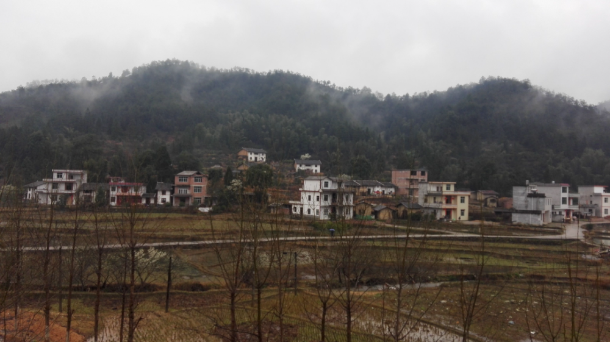
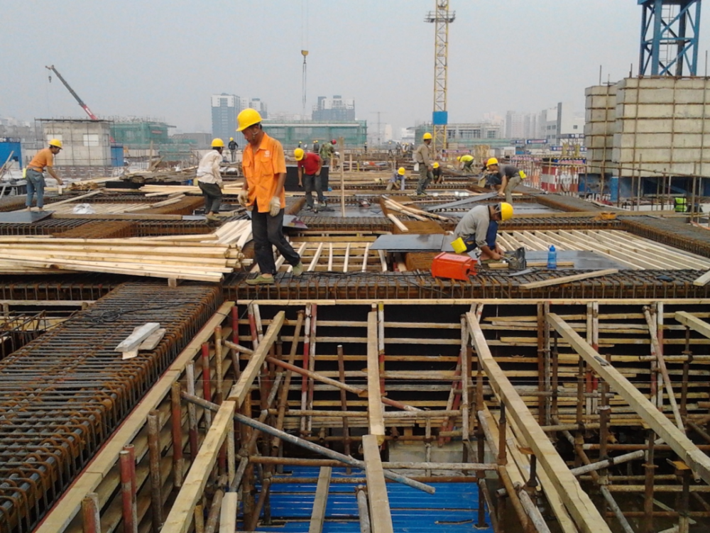
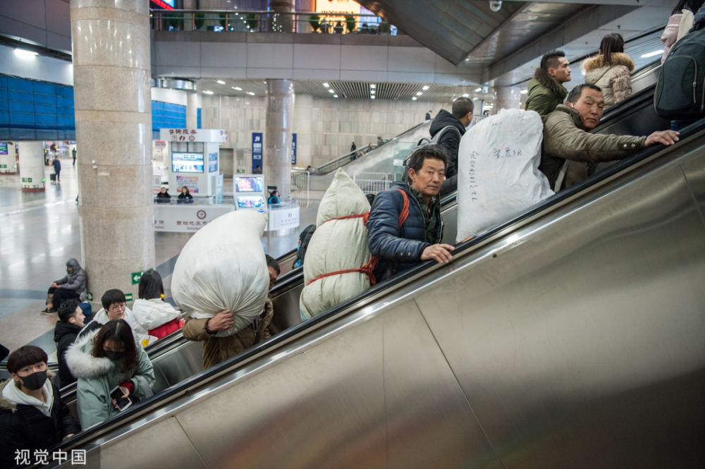
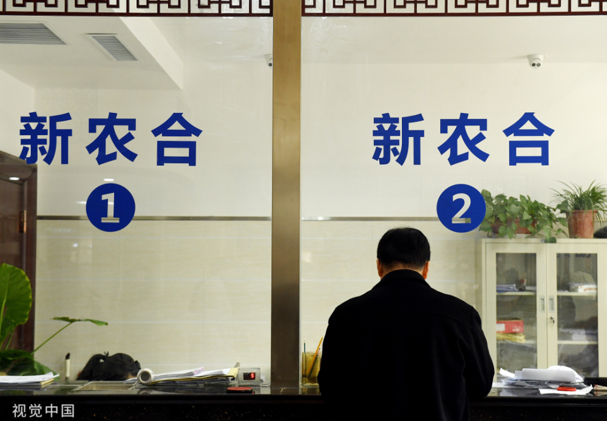

# “清退令”背后：8000万超龄农民工，无工可打、无地可依、无休可退

_「清退令」下，60岁以上的建筑工人逐渐离场_

从2019年开始，上海、天津等地针对60岁以上的建筑业农民工发出了「清退令」。据媒体报道，今年2月，为了继续打工，一位64岁的老建筑工谎报年龄，办了假证。一大批超龄农民工流向了零工市场，像二三十岁的年轻人一样，做起了「日结」。

国家统计局发布的《2021年农民工监测调查报告》显示，2021年全国农民工总量2.93亿人，平均年龄41.7岁，50岁以上占比27.3%，将近8000万人。对这一数量庞大的群体而言，继续就业、退休与养老的困境，近在眼前。

超龄农民工群体也进入了王欧的视野。王欧是华中师范大学社会学院的讲师，研究的主要方向是劳工社会学。他来自江西省永丰县，上世纪90年代末，他的父母顺应打工潮南下广东，在流水线上、城中村里度过了十余年。2013年，在清华大学读博士时，王欧的目光聚焦在了熟悉的农民工群体上，他开始以社会学的视角，重新审视父母的打工生涯、城乡迁移的经历和其他农民工亲友的故事。

为什么在别人领退休金、颐养天年的时候，他们还要继续干活？「清退令」颁布的逻辑是什么？如何影响了他们的生活？超龄农民工，最终该往何处去？我们和王欧聊了聊，以下是他的讲述。

我出身在一个农民工家庭，父母是第一代进城务工的农民。这是我研究和关注农民工的缘起，他们的经历很有代表性，能帮助我更好地理解这一群体的特征、行动的逻辑。

我的老家在江西省永丰县，交通不便，没有火车站，到市里需要坐接近两个小时的大巴。小时候，家里一共五口人，我、弟弟、父母和患眼疾的奶奶，主要靠父母种地维生，有时父亲也会开拖拉机去工地上拉货，挣一些钱。

但稻谷始终难以支撑五个人的生活，当时农业税还没取消，我和弟弟得上学，一年光是两个人的学费就得上千块。家里的房子也只建了一层，红色的土坯房，春天潮湿，雨水会透过砖头渗进屋子里。

_江西的一座留守村庄（来源：王欧）_

上世纪90年代，打工潮兴起，我的四个姨妈和表哥先后去了珠三角，在毛线厂织毛线，或是进电子厂装零件，收入翻了几番。我爸妈也按捺不住，跟着表哥到了深圳龙华的大浪街道，那里聚集着很多永丰人，织起了一片紧密的同乡网络。

到了深圳，我妈先是像大多数人一样进了厂，早晨六七点上工，晚上九十点回家。玩具厂、针织厂、小的五金作坊，她都待过。我爸自由懒散，不愿意被束缚在流水线上，跟着我表哥承包了几个工厂的废料处理，不忙的时候，就磴着安了喇叭的小三轮，走街串巷收二手物品。不久后，我妈也和我爸、表哥一起干起了废料处理的活。他们也不时到工厂、码头做临时搬运工，靠着繁重的体力付出，一次挣几百块钱。

当时父母的收入不太稳定，不过总体还不错，平均下来一年能有七八万。我们兄弟俩的学费解决了，家里的房子也陆续盖起了第二层、第三层。

现在回想起来，其实他们在深圳的工作和生活是很边缘的，没有劳动合同，更谈不上什么社会保障。我印象很深的是，我爸爱和同乡们一起喝酒吃肉，长期喝那种很廉价的劣质白酒，大概在2010年左右得了痛风和胃病，但他没有医保，不敢去公立医院，就找了城中村里的一个赤脚医生，赤脚医生只会给他打抗生素、吃止痛药，把他的身体搞得越来越差。

_深圳的城中村（来源：视觉中国）_

正好那时深圳的地价上涨，很多工厂外迁到东莞等周边城市，收废料的活渐渐少了，我爸妈一起回了永丰。回家没多久，我爸又病倒了，脑出血，得做开颅手术。尽管在老家有新农合，可那时能报销的不多，压力全堆在我妈身上。

那几年老家引进了一些工业，我妈一边种地，一边进了一个浙江老板开的布厂“洗布”。布厂经营的是二手布，老板从国外运来一车一车的窗帘布、汽车布，然后用化学药品把它们溶解、褪色，晾干、重新上色后再利用。

在老家的工厂里，很少见到年轻的面孔。大多数工人的境遇都像我妈一样，五六十岁的农村人，孩子外出读书或打工，还没结婚生子，需要他们继续积累财富，为房子、彩礼或将来的其他开支做准备。老家年轻人中男多女少，这些年彩礼节节攀升，成为父母一代人的沉重负担。他们同时还面临其他的压力，比如家人的疾病等等。

这个群体就是我们现在所称的「超龄农民工」。在他们的观念里，一辈子都要干活。以前是在农村干农活，现在外头的回报率更高，就到外面干活。50岁、60岁并不构成停止工作的门槛，只要还能动就会继续工作，直到干不动或者病倒的那一天为止。

_流水线上的农民工（来源：视觉中国）_

一些人不理解，他们为什么做出这样的选择？到了年纪就退休养老不好吗？

最直接的原因有两个。首先是农村传统的代际关系，年纪大的人往往一直在给下一代输送资源，而不是向下一代要资源。

我做田野的时候，接触过一对来自四川乐山的夫妇，很典型。他们年轻时在工厂打工，生了儿子后钱不够花，换到了薪资更高、工作更辛苦的建筑工地。儿子留守在家，上初中就辍学了，不太争气，夫妻俩想给他在县城买一套房子，一平米五六千块，体面点的至少要五六十万，儿子将来结婚也要钱。夫妻俩四五十岁了，干活很拼，夏天最热的时候，其他工友还在板棚里午休，他们会带头上工。

再就是与当前的社保制度有关。像我父母这样的农民工，几乎都没有城镇职工养老保险，有的人会自己缴新农保。以江西为例，最低档一年300元，最高档一年6000元，绝大多数人交的是最低档，60岁后一个月只能领100多元。这样低的标准，如果不继续打工挣钱，怎么维持生计？

还有医疗保险，农村有新农合，费用每年都在涨，一年交360元，报销的比例是有限的。2014年，我爸第二次脑出血，进了ICU，自费花了十几万，家里的钱花光了，病没治好，人也去世了。

所以，与其说是超龄农民工自主选择了「不退休」，不如说是他们对子女的责任、对养老和对生病的隐忧，迫使他们在别人颐养天年的时候，继续不停工作。

但在现实生活中，我们很明显地能感知到，整个劳动力市场对超龄农民工越来越封闭了，年纪越大，能找到的工作越少。

根据我这十年来的观察，在城市正规的用工市场，制造业的工厂不会要45岁以上的工人，服务业类似，他们只想要年轻人。更不用说送快递、送外卖——大多数五六十岁的农民工连手机都玩不来。有一种说法，保安、保洁、保姆是超龄农民工的出路，现在这些职业从业者的年龄的确也在慢慢变高。但无论是市政部门的环卫工人也好，平台雇佣的家政人员也好，但凡正规一点的部门，基本上年龄都要在60岁以下。

很长一段时间里，对他们来说，建筑业是为数不多的、相对开放的行业。为什么这么说？跟这个行业的用工方式相关。

建筑行业基本上是分包制，甲方分给乙方，乙方分给次级乙方，次级乙方找大包工头，大包工头找小包工头，小包工头再从老家带农民工去，层层分包，一串带一串。他们基本上不签劳动合同，有学者研究过，全国各地建筑工人的合同平均签订率只有17.4%，最低的是郑州，只有6.8%。

不正规的用工制度，为超龄农民工敞开了一道口子。再加上建筑工的活又苦又脏、单一枯燥，生活半径局限在工地和板房，年轻的农民工大多不会选择这个行业，所以我们看到的很多都是四五十岁往上的工人。

_北京建筑工地上的木工（来源：王欧）_

2015年，我和同学跑了几十个北京的工地，做了快一年的调研。我们发现搞建筑的农民工，还有两个比较突出的特点。

一是家里的经济压力都比较大，像我前面讲的那对四川夫妇，不只是背着儿子的房贷、彩礼，丈夫还是上门女婿，意味着他们还有四个老人需要赡养。负担重，所以更愿意选择繁重的、危险的、回报较高的工作。

二是他们大多家里都还有土地。因为建筑业都是项目制的，一个工程一个工程地干，这个月做完了，可能要间隔两三个月才有新的活，空出来的时间他们可以回老家干农活，不至于无所事事。老家没地的、没工作的时候没地方去的，包工头也不爱招，因为这种人不稳定。

随着上海、天津等地「清退令」的出台，建筑业的大门也对他们关闭了。「清退令」三个字看起来很刺眼，我研究了一些地方具体的条例，保障安全是最主要的考量，担心年纪大了容易出意外，造成工伤，甚至死亡。出发点或许是好的，但想要解决安全的问题，需要有更全面的配套建设。

_工地上忙碌的工人（来源：视觉中国）_

在北京调研时，我参与过一起超龄农民工的工伤纠纷。那是一个60岁出头的河北老工友，当时他参与了门头沟一个四合院的改建，院子里搭了三层脚手架，他从第三层摔下来了，摔断了脊椎，被送到附近的医院抢救。包工头赶过来，把他转到了一家熟悉的私人医院，留下几千块钱就跑路了，不见人影。费用花完后，家人只好把他接回了河北老家。

一个偶然的机会，我们碰到了这位老工友的儿子，带着他去找了公益律师。律师去工地取证、提起诉讼、找了劳动局，推动案子进入了法律程序。幸运的是，在法庭上，尽管没有合同，但根据包工头每天记的工分，法官认定了事实上的劳动关系，判了120万的赔付。到最后，老工友只拿到了50万，剩下的钱一直执行不下来。

这个案例里，其实可以看到，一起安全事故的预防、发生、事后的处理，有很多环节是更迫切、更有空间去改进的，比如建筑工地的规范管理、完善的合同与工伤保险、对用工方的约束等等。我认为，比起一刀切地把他们赶出建筑工地，压缩他们的就业空间，不如优先把其他的工作给做好，最起码的，放宽年龄的限制，给超龄的工人们也买上意外保险。

根据国家最新的统计数据，2021年50岁以上的农民工将近8000万，是一个庞大的社会群体。未来的十年里，这8000万人将会逐渐步入60岁，他们的去处在哪里？

农民工最常见的流动轨迹是，从城市返回乡村。城里没活了，回家种地是退路。而现实情况是，很多工人老家的地被征用了。尤其前些年城市建设用地增减挂钩的政策出来以后，大量远离城郊的农民也被征地，搬进楼房，离原来的耕地越来越远，失去了继续务农的条件。随着农业机械化、集约化的发展，也不再需要那么多劳动力的投入，即便有地，回家没太多事可做，回报率也低。

还有一部分人，会去家乡的小城市或县城「过渡」。拿建筑业的工人举例，他们会到没有「清退令」的地方继续搞建筑，近些年，县城发展房地产，有很多新建的小区楼盘，会吸纳一部分超龄返乡的建筑工。像我妈之前在的县城工业园，有布厂、石灰厂、木材厂、制药厂，提供的大部分是流水线和苦力的岗位，也是超龄农民工常见的选择。

返乡的农民工（来源：视觉中国）

七八年前，我妈不再打工。我爸去世没多久，在上海郊区打工的弟弟结婚有了小孩，她跟着弟弟去了上海和浙江生活，帮忙带孩子。

虽然在大城市里打了很多年工，但她始终是一个边缘的、游离在城市主流生活之外的人，融入不了。刚到上海时，她不适应，和上海本地人基本不说话，没有朋友和业余生活，经常给我打电话哭。后来弟弟在临近上海的浙江平湖买了房子，那是一个县级市，有很多和我弟弟类似的在上海买不起房又想在城市边缘安个家的工人，也聚集着很多本地进城的乡下人，我妈很快和他们的父母打成了一片，一起跳广场舞、打牌、逛地摊、玩短视频。

我妈现在59岁了，在江西老家，她每年交360元的新农合、300块的新农保。等到60周岁，每个月能领到100多块的养老金。至于现在，除了家里几亩地每年有固定的农业补贴外，没有别的收入。

新农合是大多数农村老人唯一的医疗保障（来源：视觉中国）

去年，我妈感染新冠后身体出了点问题，血压一下飙到180，把家里人都吓坏了。当时去了平湖的公立医院，虽然没有花很多钱，但全是自费。医院单子上我妈的身份和地址信息，还是让我难过，她在平湖生活多年，身份还是农民，地址还是老家那个村子。那次之后，我提出，和弟弟每个月给她攒个一两千块，作为她的养老钱。没想到我妈直接拒绝了，她还是保留着农村那种传统的观念，觉得自己还能动，没必要。

作为农民工的后代，我期许在超龄农民工还有余力的时候，城市的就业市场能对他们更加开放和包容，更下层的县乡一级，能有更多的产业去承接这部分劳动力。等到了「干不了」的那一天，他们能更有保障地度过老年生活，而不是只能依靠自己和孩子。这是我们整个社会都需要思考和解决的问题。

运营 | 何城

撰稿 | 周小琪

监制 | 传举

