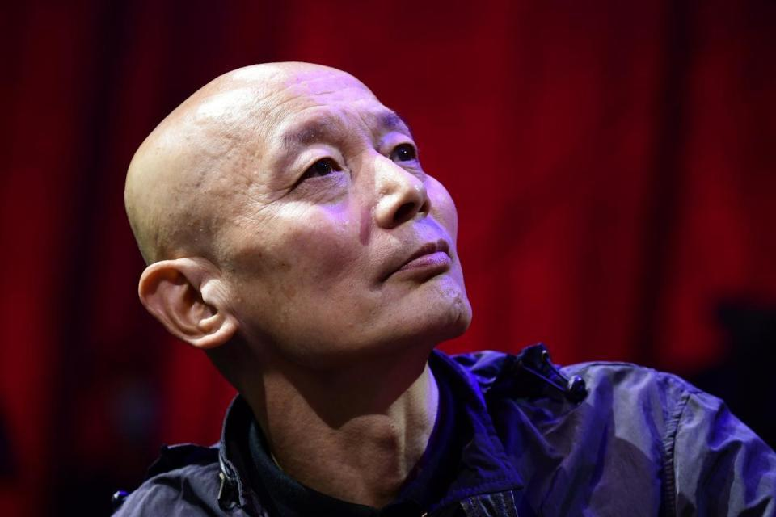

# “葛优躺”侵权官司6年544起，葛优几乎全胜获赔759余万

_2020年，葛优在《我和我的家乡》首映礼上。图文无关。
（视觉中国/图）_

“葛大爷教你四种姿势” “‘躺’着能工作，‘躺’着能赚钱”“假如葛大爷也炒股……”这些都是出现在裁判文书网上有关“葛优躺”网络侵权责任纠纷案判决中的内容。

“葛优躺”曾是2016年的网络热词。知名演员葛优在电视剧《我爱我家》中扮演纪春生，该角色在剧中将身体完全瘫在沙发上的放松形象被网友命名为“葛优躺”。许多新媒体账号都曾以此蹭热点营销，相关表情包随处可见。

2023年3月16日，随着昆明航空针对 7年前的“葛优躺”配图文章公开发布致歉声明，“葛优躺”再次引发关注。可以发现，不少企业因使用“葛优躺”图片涉诉赔偿。

南方周末以“葛优躺”为关键词在中国裁判文书网检索发现，截至2023年3月22日，与之相关的民事案件判决文书共600份，涉及544起案件，案由均是葛优起诉企业使用“葛优躺”照片侵犯其肖像权。544起案件中，葛优胜诉率达99.6%，仅有两起案件一审因取证程序瑕疵未判定企业侵权，另有一份判决仅判企业道歉无需赔偿。542家企业在赔礼道歉的同时，赔偿葛优经济损失、合理维权成本等共计759.4392万元。

值得注意的是，这些侵权文章大多发布于2016年，有企业于2022年涉诉出庭时表示惊讶，数年前发布的文章至今仍在有效诉讼期内吗？删除文章后，仍需为侵权文章付出高额赔偿吗？

_（赖子欢/图）_

542家企业平均赔偿14012元

根据裁判文书信息，2016年“葛优躺”成为网络热点期间，蹭热点的企业涉及各行各业：某挖掘机公司强调“躺”着赚钱，附上该公司的挖掘机系列产品；汽车公司称家用轿车的后排也能完成“北京瘫”动作；中医按摩店则介绍“葛优躺”对身体造成哪些伤害；等等。

按照年份分布比例，南方周末随机抽取100份判决文书进行分析。100家被告企业中，商务服务业、批发业及软件和信息技术服务业出现频次最高，此外汽车销售、建筑装饰、餐饮等其他行业也有分布。

这些判决文书中，一审的起诉方均为葛优，代理律师主要出自北京市律通律师事务所、北京市大都律师事务所及北京市爱申律师事务所，南方周末记者联系其中多位相关律师，均以“涉及当事人隐私”为由未受访。

葛优方起诉企业未经授权许可擅自在微信公号等平台发布的文章中使用其多张肖像图片，旨在利用网络热点“葛优躺”和原告的社会知名度引人关注。此外，葛优方强调，这些内容具有明显的业务导向和商业属性，极易使众多浏览者及消费者误认为原告与被告存在某种合作关系，侵犯了原告依法享有的肖像权。

针对此类侵害肖像权行为，葛优方要求企业公开道歉及赔偿，赔偿包括经济损失赔偿、精神损害抚慰金以及合理维权成本等。根据南方周末整理的裁判文书，葛优索赔总额以155000元、205000元居多，最高索赔经济赔偿30万元、合理维权成本1万元。

大部分法院判决认定被诉公司侵犯葛优肖像权，至于葛优主张的赔偿，则因双方未提供具体损失、获利证据，往往由法院综合被诉企业对葛优肖像的具体使用方式、数量、范围、时间和影响酌情确定。

对此，葛优方主张其肖像具有很高的商业价值，提交了诸如“葛优”百度百科内容打印件以证明其知名度及影响力。而有的被诉企业方则说明无主观故意，只是紧跟社会话题，出于对葛优演绎的角色的喜爱才发布相关内容，且微信公众号阅读量小，影响范围小等。

不少公司甚至表示“委屈”，提出“涉案文章阅读量为15人”“涉案文章发布当天的浏览量为5人6次，发布后第一周的浏览量为7人8次”“公众号已于2019年3月8日停更”等等。

受理法院普遍认为葛优主张的金额过高，不予全部支持。根据南方周末统计，542家企业平均赔偿14012元，54.8%的案件赔偿额度在“1万至2万”区间，26.7%的案件赔偿额度在“5000至1万”区间。对于合理的维权成本费用，法院根据葛优是否提供费用证明如公证费发票等，对部分费用予以支持。

最高赔偿额出现在2020年，北京互联网法院判令一家村镇银行向葛优赔偿经济损失80000元及合理开支2000元。该案赔偿金额由法院根据具体案情酌情判定，裁判文书并未提及判罚较高的原因。

企业方和葛优方都曾因对判赔金额不满提出上诉。2022年，一份由北京市第四中级人民法院作出的二审判决中，葛优一方上诉表示，一审判赔5000元数额过低，既不能弥补上诉人的损失，又无法有效惩戒被上诉人的行为，还会导致此类侵权行为增加。葛优代理律师通过检索一审民事判决相关案例称，2020年12月17日—2021年11月30日间，类似案件平均经济赔偿数额为22178.57元，5000元的经济赔偿远低于平均水平，更是低于最低判决。但最终二审法院未对此作出改判。

_（赖子欢/图）_

诉讼时效如何计算

在“葛优躺”相关案件中，是否超过诉讼时效为另一个争议焦点。在2021年一份判决书中，临汾市某文化传媒公司上诉称，转载“葛优躺”相关文章的时间为2016年7月8日，葛优起诉时间是2021年2月3日，距发文时间已相距四年半，超过法律规定的诉讼时效。根据民法典规定，向人民法院请求保护民事权利的诉讼时效期间为3年。

在按年份随机抽取的100起案件中，涉诉文章发布于2016年的便有93起。而葛优方一直坚持维权，取证时间分布在随后数年间，如2020年取证的案件有31起，2021年取证的案件18起，共占比49%。

在上述临汾某文化传媒公司相关案件中，法院认为，基于人格权被侵害产生的停止侵害、恢复名誉、赔礼道歉、消除影响等请求权，不适用诉讼时效的规定。其次，根据现有证据，案涉文章发布于2016年7月8日，但葛优一方取证时间为2020年12月7日，案涉文章于2020年12月删除，综合以上事实，葛优一方本案中关于赔偿损失的请求权，未超过法律规定的诉讼时效。

对此，北京大成（南京）律师事务所律师刘邓向南方周末记者解释，民法典规定的3年诉讼时效，起算点为侵权行为结束时，即该微信公号停止继续刊发、使用“葛优躺”照片的时间点。如果2016年至今该微信公号并未对相关侵权行为进行修改或删除，则该行为属于持续性、未完结的侵权，葛优有权追究其侵权责任。

至于删除文章，刘邓认为这属于事后补救行为。侵权行为自2016年文章发布时便已经发生，至2020年删除时终结，此后3年内葛优皆有权追究该公众号的侵权责任。但该公号删除文章的行为可视为弥补过错、减小损失的行为，有利于降低其需要承担的赔偿数额。

在544起案件中，唯一一起仅被判公开道歉、无需经济赔偿的案件便存在主动道歉的情节。在葛优与中国联通泰州分公司一案中，后者曾收到葛优的律师函，删除涉案文章后，主动回函致歉。北京互联网法院据此认为，联通泰州分公司主观过错较小，且积极弥补过错，未造成损失扩大，加上涉案文章影响范围有限等原因，未支持葛优的经济损失赔偿请求。

600份裁判文书中，北京市法院受理此类案件最多，达到579份，其余散见于广东、上海、浙江等地。有涉诉企业在庭上质疑葛优批量告状，是否涉嫌恶意诉讼。

刘邓认为，这一问题需要具体问题具体分析。当前部分明星艺人出于对肖像权和公众形象的维护，往往会选择通过诉讼的方式制止他人丑化、污损、伪造个人肖像，该行为系维护自身合法权益的正当手段。

另外一种情况是，部分明星艺人会将肖像权维权业务“打包”给法律咨询公司，由其使用网络搜索软件在社交媒体上寻找可能的侵权方，并从中选择具备赔付能力的侵权主体进行诉讼、索赔。刘邓觉得，从一般人的朴素情感上，该行为涉嫌“碰瓷”、滥用诉讼权利，但目前这一情况属于司法空白领域，尚无限制性规定，因此葛优有权在合法尺度内继续主张权益。

北京星权律师事务所律师甄景善则认为，其中涉及两个概念的价值判断，一个是人格权的神圣不可侵犯，一个是企业生产经营权的维系，而自然人人格权的价值位阶应当高于企业的商业价值位阶，最终的裁判金额应当是一个兼顾公平与效率的结果。

对于普通公众而言，更关心自己使用“葛优躺”表情包是否会被追责。对此，刘邓认为，是否面临侵权的关键在于是否“公开”。如果未经葛优允许，公开使用与其肖像有关的表情包，且不属于民法典第一千零二十条规定的合理使用情形时（合理使用情形包括为个人学习、艺术欣赏、课堂教学或者科学研究；为新闻报道、国家机关依法履行职责、展示特定公共环境；为维护公共利益或者肖像权人合法权益），该行为构成肖像权侵权。但如果在非公开场合（例如私聊、小组讨论）仅用于聊天、表达个人情绪时，该行为不构成侵权。

南方周末记者 刘怡仙 南方周末实习生 刘蕾岑 胡怡芹 高逸佳

