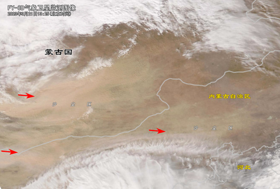

# 三问今年最强沙尘侵扰 植被好转为何挡不住漫天黄沙

_风云三号气象卫星监测今年以来强度最强沙尘过程的图像。中国气象局供图_

当干燥的大风，卷起裸露的地表沙尘，并疯狂吹向城市，此时就是一幅漫天黄沙的景象，严重时可被称为沙尘暴。由此带来的是空气质量恶化、交通运输受阻，还可能会引发健康问题，让人出现诸如喉咙干痒、呼吸困难、咳嗽等症状。

刚刚过去的这一周，我国北方地区再次遭遇大范围沙尘天气。

中央气象台环境气象室主任张碧辉告诉中青报·中青网记者，3月19日至23日的沙尘过程，是2023年以来强度最强、影响范围最广的一次，影响20个省（区、市），影响面积超过485万平方公里。其强度达到强沙尘暴级别，是2000年以来3月第三强。

这样的沙尘侵扰，仅仅是一次偶然的天气过程？在已经实施天然林保护、建立三北防护林的今天，沙尘天气为何仍然侵扰不断？在大风扬沙的日子，人们又应当怎样防护？

面对又一轮的沙尘来袭，不少人抱有这样的疑问。

**此轮沙尘天气是否异常，风沙从何而来**

3月19日，这一轮的沙尘天气在新疆初露端倪。

20日到21日，大风卷着沙尘自西向东。到了22日，中央气象台发布了大风降温预报和沙尘暴黄色预警。23日，沙尘转而向南。24日，南下的冷空气给南方带来了强对流天气。

“今年3月以来，我国已经出现4次沙尘天气过程，对于3月来说属偏多情况，但如果针对整个春季来说，还需要关注未来4月、5月的天气情况。”中央气象台首席预报员张涛说。

在整个沙尘过程期间，部分地区出现沙尘暴，局部地区出现强沙尘暴，最低能见度不足100-200米。

张涛提到，本轮冷空气造成的大风和降温，主要影响我国西北、华北、东北等地，带来6℃至8℃降温，特别是内蒙古和东北部分地区，降温幅度可达10℃。

在北方，一些网友晒出黄沙漫天的街景照片时，南方一些网友同时晒出了鸡蛋大小的冰雹照片。

“之所以出现大风沙尘天气，是因为当前大地回暖，日晒使得地表松动，春季又恰好是冷空气大风频发的季节。”张涛说。

在接受中青报·中青网记者采访时，张碧辉解释道，3月是沙尘天气高发期，一旦降水偏少、气温偏高、多大风天气，加之植被尚未返青，配合裸露的沙源地地表条件，就容易出现大范围沙尘天气。

具体到这一次，张碧辉说，今年3月中上旬，蒙古国和我国西北沙源地气温较常年同期偏高5-8℃，基本无降水，地表无积雪覆盖，导致大范围地表裸露，加之今年蒙古气旋强度偏强和冷空气活动较多，在气旋及其后部冷空气东移过程中，强烈的大风卷起沙尘，通过高空输送，南下东移，在我国东北地区、华北、西北地区以及黄淮、江淮地区沉降形成沙尘暴、扬沙、浮沉等天气。

用中国科学院大气物理研究所季风系统研究中心副主任魏科的话说，沙尘过程是正常天气现象，人类更多的是通过种种方式降低其影响，但沙尘难以从根本上消除。

“中亚干旱区的气候态难以根本改变，大风天气难以根本改变，早春不稳定的天气也难以根本改变。”魏科说，“热带东风的环流可以把撒哈拉沙漠的沙子跨过大西洋，一路吹到南美洲亚马孙地区。亚洲中部沙漠里的沙尘，可以一直被吹到越过日本。”

_风云四号气象卫星监测今年以来强度最强沙尘过程的图像。中国气象局供图_

**北方植被覆盖率提升，为何沙尘天气仍难以根治**

有关此次沙尘天气，社交平台上不少人提出疑问：我们建的三北防护林为啥没挡住沙尘？森林覆盖率从5.05%提高到13.57%，沙尘天气为何还是难以根治？

三北防护林工程，是指在我国西北、华北和东北地区建设的大型人工林业生态工程，从1979年开启，预计到2050年完成，历时73年。如今，这一工程已经进行了40多个年头，累计完成造林面积超过3000万公顷。

魏科告诉中青报·中青网记者，三北防护林的作用是固定地面，保护土壤，目前已经取得卓越成效，毛乌素沙地甚至即将从陕西版图上“消失”。

但此次沙尘主要来自蒙古国南部戈壁滩，顺着高层的北风下来，高空可达4000米以上，被席卷至我国华北地区。在这种高度上，防护林的胡杨和梭梭树完全无法阻挡。

据国家气候中心气候预测室研究员丁婷解释，近年来，我国北方植被大为增加，生态环境明显改善，总体上有利于侵袭我国的沙尘次数逐步减少。但蒙古南部的戈壁沙漠也是影响我国沙尘的重要源地，2022年植被生长季，蒙古降水较近20年同期偏少，沙源地植被覆盖较差，地表裸露缺乏植被保护。

此外她认为，今年沙尘天气主要和近期大气环流异常有关。今年春季前期气温明显回暖，3月初出现了一次极为罕见的回温天气，导致前期的冻土层沙土出现快速融化。

“3-4月本就是北方大风高发季节。在一定的大风条件下，造成沙尘源地的沙尘多次输送至我国，这是今年多次出现严重沙尘天气最直接的原因。”丁婷说。

关于近些年我国沙尘天气变化的大趋势，丁婷给出一组数据：2018-2022年期间，我国北方平均的沙尘总次数和沙尘暴次数都比2013-2017年平均多，但这并不能认为是沙尘暴出现了明显变多的趋势。

“从更长时间尺度来看，21世纪前十年，沙尘总次数和沙尘暴次数均明显多于近10年。这表明，现阶段仍处在影响我国沙尘减少的大背景下。”丁婷说。

她同时提到，沙尘频次还受到中高纬度大气环流的直接影响，因此会呈现出一定的年际变化特征，例如2017年和2022年春季沙尘暴次数均仅有一次。

“沙尘天气是长期的气候背景、地理背景以及短期的气候变化等各种综合因素共同作用形成的。”张碧辉说，从我国所处的地理环境来看，我国北方地区以及邻近国家和地区都有比较大面积的沙源地存在，在沙源地存在的先天条件下，再结合气候因素，尤其今年春季前期的温度明显偏高，有利于地表解冻，再加上地面大风作用，会非常有利于沙尘卷扬，并在气流输送之下，大量的沙尘粒子向下游地区传输沉降。

张碧辉告诉记者，在气候变暖的背景下，北方沙源地春季前期气温偏高，非常有利于沙源地沙土变得疏松，增加了沙尘天气发生的可能性。

**在大风扬沙的日子，我们应当如何应对**

中国气象局预计，接下来的两个月，蒙古国南部至内蒙古中西部沙源地降水偏少，气温较常年同期偏高，且有蒙古气旋阶段性南下影响，利于形成沙尘天气。预计我国北方地区沙尘过程次数较近10年同期偏多，沙尘强度总体与近10年持平。

几乎每一次沙尘天气过后，都会使空气、水源受到污染，土地质量下降，甚至造成生态环境的破坏。

张碧辉建议，4-5月我国北方遭遇沙尘天气的风险较大，需密切关注天气预报，及时做好防护，降低沙尘天气对交通、农牧业、人体健康及城市运行的影响。

“加大科技攻关和部门合作，加强对沙尘起源、沙尘输送动力等机理研究和沙尘天气数值模式预报技术的研究，提升预报预警服务水平。进一步加强沙源地生态治理、沙尘天气监测预报预警评估和沙尘灾害应急处置之间的联动和互动，为防灾减灾和科学精准治沙提供支撑。”张碧辉说。

来自中国气象局的最新预报显示，3月31日至4月2日，我国西北地区、华北、东北地区等地自西向东，还将有一次沙尘天气过程。

气象专家建议，要做好防风加固、交通安全管理和人体健康防护工作，注意防范森林草原和城乡火灾。针对沙尘天气的具体防御措施，包括及时关闭门窗、携带口罩，纱巾等防尘用品、做好精密仪器的密封工作、把易被风吹动的搭建物固紧、妥善安置易受沙尘暴影响的室外物品等等。预防沙尘暴，需要所有人共同努力，减少对环境的破坏。

“我们现在的监测手段，可以提前5到7天，就能比较准确地预知天气过程。沙子在那边一飞起来，这边立刻可以观测到。但是现有的技术手段只能做到预警，无法将它消除。”魏科还提到，目前超级计算机可以预演计算沙尘的路径。

他感慨道：“处于中亚内陆干旱荒漠区的下游，条件就是这样，我们可能还是需要慢慢学会跟沙尘天气共处。”

中青报·中青网记者 张渺 来源：中国青年报

来源：中国青年报

