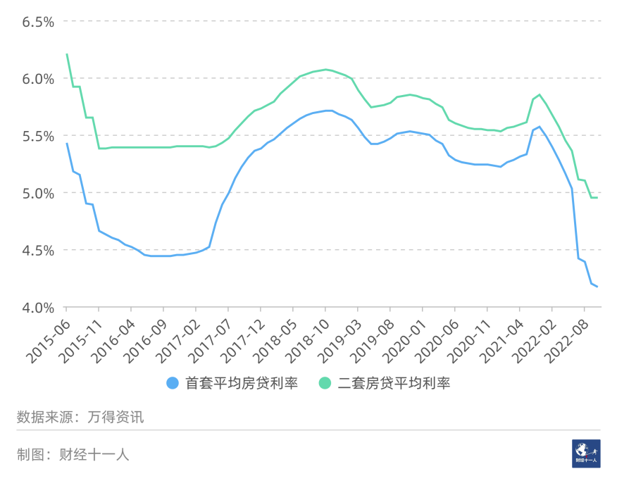
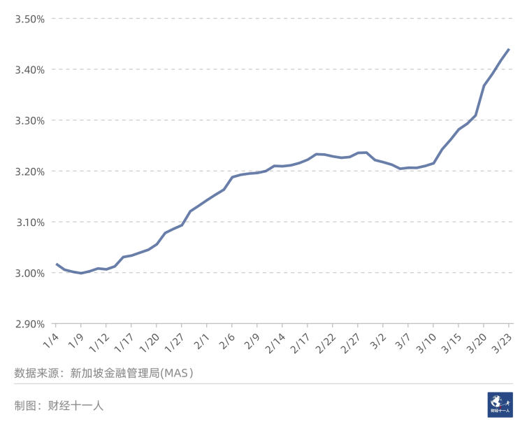
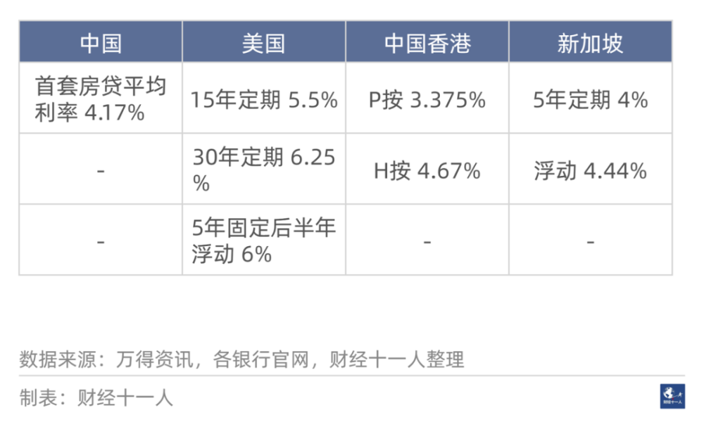
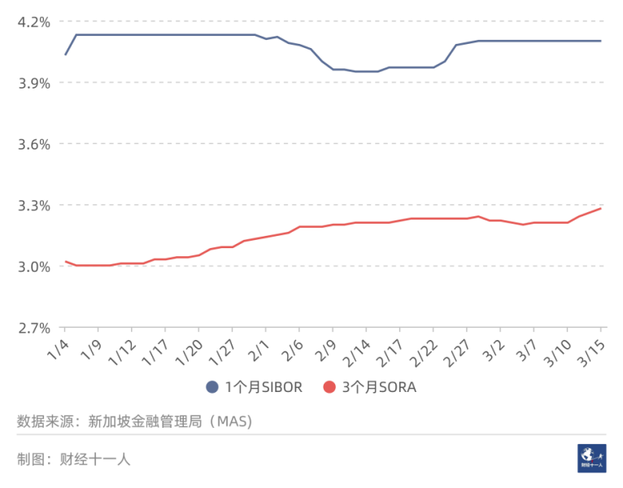
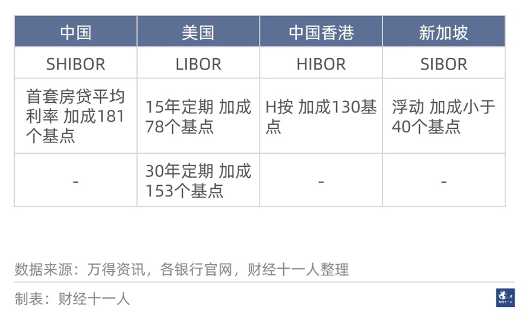

# 中国房贷利率降了又降，为什么还是高

**文 | 陈汐 刘建中**

房子是大部分中国人一生中最大的一笔支出。

因为款项巨大，购房者往往需要贷款。贷款利率的高低会显著影响购房支出。以贷款100万元，30年期，等额本息还款为例，利率5%与利率4%相比，购房者累计多支付约21.4万元。

**也就是说，利率差了一个百分点，就要多还本金的21.4%。**

因为贷款利率直接地并且显著地影响购房支出，所以调整房贷利率可以调节购房需求。2021年以来，中国房地产市场持续低迷，需求大幅萎缩。为刺激购房需求，从2021年11月开始，伴随着数以百计的房地产宽松政策，中国内地房贷利率也持续走低。

如图1所示，中国全国首套房贷平均利率从5.57%降为目前4.17%，全国二套房贷平均利率从5.85%降为4.95%。

_图1:
全国首套和二套房贷平均利率_

中国人民银行货币政策司司长邹澜曾公开表示，2022年12月新发放个人住房贷款利率全国平均为4.26%，较上年同比下降1.37个百分点，是2008年有统计以来的历史最低水平。

那么在降了又降之后，中国目前的房贷利率还高不高？

我们把中国内地的房贷利率和美国、新加坡、中国香港这些发达国家或地区的情况，做一个简单比较。结论如下。

中国房贷利率的绝对数值不高

2019年央行颁布新的住房利率政策后，国内房贷利率大多以LPR（贷款市场报价利率）为定价基准，然后加上一定的基点形成。一个基点为0.01%，即万分之一。

比如2021年8月，5年期以上LPR为4.65%，假设加成120个基点，则房贷利率为5.85%。加点在整个还款周期中会一直不变。如果5年期以上LPR降至4%，那么贷款利率为5.2%。

LPR由18家银行报价而来。这就像18位评委，每人打一个分数，去掉最高分和最低分，然后计算出最终得分。LPR分为1年期和5年期以上两个类别。贷款5年以下，以1年期LPR作为基准。但是大部分国人贷款时长会超过5年，这时贷款利率会以5年期以上的LPR作为基准。

因为LPR是浮动的，所以中国房贷利率是一种浮动利率。

最新的LPR较之前有所下降，目前数值为：1年期3.65%，5年期以上4.3%。银行加点也下调了很多，甚至可以为负。

2022年9月29日，人民银行和银保监会发布通知，符合条件的城市政府，可自主决定在2022
年底前，阶段性取消当地首套房的房贷利率下限。需要符合的条件是，评估期内新建商品住宅销售价格环比和同比连续3个月均下降。

2023年1月5日，央行延长了以上政策的有效期，这相当于将临时性政策延长化，甚至常态化了。

所以，满足以上条件的城市自主决定首套房贷利率的下限。比如，郑州当前主流首套房贷利率为3.8%。这相当于加成为 -50个基点（3.8% - 4.3% =
-0.5%）。天津首套房贷利率为3.9%，这相当于加成为 -40个基点（3.9% - 4.3% = -0.4%）。

目前，全国首套房贷平均利率4.17%，可以作为当前中国内地房贷的利率参考值。和其他国家或地区的房贷相比，4.17%高吗？

**单看数值，其实不高。**

**先看美国，2023年3月23日，美国具有代表性的银行——美国银行** （Bank of America） **给出的房贷报价情况如下。**

30年固定房贷利率，报价6.25%；

15年固定房贷利率，报价5.5%；

5年固定利率，5年之后每半年调整一次的浮动利率，报价6%。

仅从数值看，美国的房贷利率显著高于中国内地。

**再看中国香港，2023年3月22日，代表性银行——汇丰银行** （00005.HK） **给出的报价情况如下。**

参考优惠利率的贷款利率（通常被称为“P按”），报价为3.375%。

这里的优惠利率（Prime
loan）非常类似于中国内地的LPR。汇丰银行房贷的计算公式是P值-2.25%，即在P值基础上，降低225个基点。汇丰当前的P=5.625%，所以计算得出“P按”贷款利率为3.375%。（5.625%
- 2.25% = 3.375%）

香港还存在另一种以HIBOR（香港银行同行业拆借利率）为基础的贷款利率（通常被称为“H按”），汇丰报价为4.67%。

这种参考HIBOR利率的贷款方式，利率会每月调整。汇丰银行的计算公式是1个月的HIBOR数值+1.3%。2023年3月22日，1个月HIBOR为3.37%，所以计算得出“H按”利率为4.67%。（3.37%+1.3%
= 4.67%）

从数值看，中国香港“H按”利率高于中国内地，“P按”利率低于中国内地。

**最后看新加坡，2023年3月23日，代表性银行——星展银行** （DBS） **给出的报价情况如下。**

5年的固定房贷利率为4%。（新加坡各银行几乎都不提供周期大于5年的固定房贷利率。）

新加坡另一种房贷是以SORA为基础的浮动房贷利率，报价为4.44%。

SORA为新加坡平均隔夜利率。星展银行的浮动利率计算公式是，3个月的SORA数值+1%。2023年3月23日3个月的SORA数值为3.44%，所以计算得出的浮动房贷利率为4.44%。

图2是2023年以来SORA的走势。

_图2:
新加坡3个月SORA的走势图_

从数值看，目前新加坡房贷5年固定利率低于中国内地，浮动利率高于中国内地。

_表1:
当前中国内地与美国、中国香港、新加坡的房贷利率对比_

综合来看，和美国、中国香港、新加坡的房贷利率相比，中国当前的房贷利率不高。

**但是，考虑到美国、中国香港、新加坡都处于加息周期，而中国处于降息周期，所以还需要换一个角度去比较，这时结论会有所不同。**

从成本加成看，中国内地房贷利率较高

一个商品卖的贵不贵，除了看绝对的价格，还可以看，价格与成本之间的差值。可以说，差值越大，这个商品卖的越贵。

“银行间拆借利率”可以看作是商业银行借入一笔资金的成本，即“边际资金成本”。
**房贷利率减去这个成本，衡量的是银行在成本上加成了多少。也可以认为，加成的数值越大，房贷利率越贵。**

比如，A国资金成本为1%，房贷利率4%，那么加成了3%，即300个基点。B国资金成本为3%，房贷利率5%，那么加成了2%，即200个基点。

虽然，B国房贷利率高于A国，但因为A国的加成更高，实际上银行赚的更多，从成本加成的角度，可以说A国的房贷利率更贵。

以上这种衡量标准，似乎有些强词夺理，但是，这种标准或许更为客观。可以想象，如果未来上述A国的资金成本变为4%，而A国银行要保持盈利状态，那么其房贷利率就会变为7%（4%+3%=7%）。

**我们以这个新标准，衡量中国内地的房贷利率贵不贵。**

中国内地的资金成本，以1个月SHIBOR（上海银行间同业拆放利率）为基准。用SHIBOR作为基准的好处在于，这个指标在其他国家或地区都有对应物，比如在美国可以是LIBOR，在中国香港是HIBOR，在新加坡是SIBOR。

2023年3月，1个月SHIBOR的平均值为2.36%，中国内地5年期以上首套房贷平均利率为4.17%，因此加成为181个基点，即1.81%。（4.17%-2.36%=1.81%）

如表2所示，2023年3月的加成是2018年下半年以来的最低值。2018年下半年平均加成为283个基点；2019年平均加成为276个基点；2020年平均加成为308个基点；2021年平均加成为298个基点；2022年平均加成为276个基点。

_表2:
2018年下半年以来，首套房贷平均利率与1个月SHIBOR之间的差值_

**下面看看美国的情况。**

美国2023年3月份，1个月LIBOR（伦敦同业拆借利率）的平均值为4.72%。以美国银行报价为参考，15年定期房贷利率为5.5%，加成为78个基点，即0.78%（5.5%-4.72%=0.78%）；30年定期为6.25%，加成153个基点（6.25%-4.72%=1.53%）。

而且需要注意，中国内地的房贷利率是跟随LPR浮动的，本质上是浮动利率。在浮动利率条件下，银行承担的风险较小。而对于银行，长时间的固定利率带来的风险要大于浮动利率。

**所以，美国15年或30年固定利率的风险大于中国的房贷利率。而美国15年固定利率仅在成本基础上加78个基点，30年加153个基点。中国房贷加成181个基点，与美国相比较高。**

**再看看中国香港的情况。**

香港有两种房贷利率，“P按”和“H按”。其实对银行来说，两种方式在风险收益上是等价的。所以只看一种即可。我们看“H按”。

以汇丰银行为例，“H按”为1月HIBOR+1.3%，HIBOR就是香港银行的“资金成本”，所以汇丰银行的加成为1.3%，即130个基点。香港其他银行和汇丰银行加成相等或相近，比如渣打银行和汇丰银行的数值完全一致。

**中国内地加成为181个基点，高于汇丰银行的130个基点。所以即使降了多次之后，中国房贷利率仍比中国香港高。**

**最后看看新加坡的情况。**

和香港一样，仅看新加坡的浮动房贷利率即可。

新加坡以星展银行为例，其浮动房贷利率为3个月SORA +1%，3个月SORA与1个月SIBOR（新加坡银行同业拆放利率）之间存在比较稳定的关系。

_图3：新加坡1个月SIBOR与3个月SORA之间的关系_

从图3不难看出，2023年以来，1个月SIBOR通常比3个月SORA高60个基点以上，所以，3个月SORA
+1%，仅相当于在SIBOR的基础上加了不到40个基点。

**所以，新加坡的房贷利率加成低于中国内地房贷利率。**

表3是中国内地、美国、中国香港、新加坡在资金成本基础上的加成对比。

_表3:
中国内地、美国、中国香港、新加坡的房贷利率加成对比_

有人会问，在比较房贷利率时为何不考虑通货膨胀？这是因为利率作为资金成本已经将通货膨胀因素考虑在内，不需要单独考虑了。

**综上，和美国、中国香港、新加坡相比，从绝对数值看，中国内地目前的房贷利率并不高，但中国内地的房贷利率在资金成本上的加成仍然较高。**

