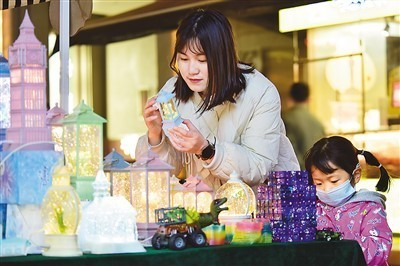

# 北京、上海、杭州等地近期明确将有序放开设摊、允许外摆——商业外摆，“摆”出品质和烟火气

_3月21日，北京市三里屯某商铺门口，人们在就餐聊天。苏明辰摄_

_日前，在安徽省合肥市蜀山区井岗镇1912东西街，市民在摊位上选购物品。胡朝群摄（人民视觉）_

正值大地回温，春暖花开。遇上好天气时，摆在室外的桌椅总是格外抢手。临街而坐、晒晒暖阳、打量街区城市是许多消费者中意的春日休闲选择。

近期，北京、上海、昆明等地明确将有序放开设摊、允许商业外摆。这将给城市消费带来哪些改变？

**丰富商业供给，提升城市繁荣度**

3月12日，北京三里屯太古里，路侧空间较为宽敞的树荫下，咖啡桌整齐排列，消费者三三两两聊天、会友、阅读、品尝糕点。“天气暖和了，在户外坐坐，多舒适啊！”“好友约会，来杯户外咖啡，聊天逛街两不误。”一些顾客这样告诉记者。

对消费者来说，类似的商业外摆是别具魅力的消费形式。而对更多来来往往的行人来说，这是城市商圈热气腾腾的生活气息和商业活力。从特色早市、夜市、后备箱集市到特色风情街区、城市沿河景观带等，一些外摆点甚至成为网红时尚打卡地，不断吸引眼球、聚集人气。

不少城市瞄准了其中的机会。今年以来，北京市印发《清理隐性壁垒优化消费营商环境实施方案》，提出制定实施商圈外摆经营管理规则，在重点商圈组织开展外摆试点。上海市公布《关于进一步规范新时期设摊经营活动的指导意见》（征求意见稿），允许设摊开放区有序设摊。此外，杭州、昆明、厦门、成都等地近年也纷纷探索商业外摆模式，增强市场活力。

设摊管理一直是城市管理难题之一。这些城市为何纷纷主动“放开”？上海市在《关于进一步规范新时期设摊经营活动的指导意见》（征求意见稿）的起草说明中介绍，自上世纪70年代至今，上海设摊管理经历了“还路于民”“分类管理”“源头治理”“精准治理”四个阶段，无序设摊已处于可控状态。近年来，人民群众对“烟火味”的需求颇有期待，出现了外滩枫径、安义夜巷、凯田路夜市以及商业体沿街外摆位等具有特色的商业形式，新型设摊兴起的同时，需要建立新的管理规范。

“多地放开商业外摆、允许有序设摊，本质上是丰富商业供给、满足消费者多样化需求的一种方式。”中国社科院财经战略研究院市场流通与消费研究室主任依绍华对本报记者说，这一方面提升了消费便利度和满意度，方便商家快速响应消费需求，另一方面可以有效增添城市的烟火气，提升商业活跃度和繁荣度，更大程度激发消费潜力。

**满足休闲消费、品质消费的需要**

许多国际消费大都市设有著名的商业外摆区。比如，巴黎街头大大小小咖啡馆的露天座位、洛杉矶购物街区的临街餐厅外摆、纽约著名的街头餐车、伦敦购物中心的屋顶天台……这些外摆，不仅是消费场所，也成为城市气质的一部分。

究竟什么样的商业外摆能聚集人气、拉动消费？消费者青睐啥？

“要有特色，有亮点，值得一去”“要好吃好逛好玩儿，最好还能拍照打卡，增强社交属性”“安排在城市沿河景观带、潮流街区也可以，相当于多了一条到访理由……”采访中，许多消费者谈到不同观点，但总而言之，有特色很重要。

实际上，一些城市在设定商业外摆和新型设摊要求时，也明确了鼓励的方向。比如，上海提出划定设摊开放区时，设置特色点、疏导点、管控点。其中，特色点是以新型业态为主，符合城市高品质要求，品牌化、主题化、特色化的集市、夜市、外摆位、限时步行街等点位。北京市则要求特色经营活动要符合首都城市功能定位、经济发展与文化特色。

北京市相关部门负责人专门谈到，推进“外摆”试点主要是满足群众休闲消费、品质消费的需要，不是“地摊儿”。可以看出，新型业态、特色经营、高品质，是这一轮多地放开商业外摆的鼓励方向。

商业外摆如何摆出品质？

“内容与形式并重。”依绍华认为，首先，外摆的商品和服务，要精心挑选、注重品质；其次，外摆远不是“支个摊儿”这么简单，要在外观上精心设计，与街区的环境风格一致，注意营造氛围和格调，提升美观度。此外，充分利用数字经济、智慧零售等创新形式，提升商业外摆的吸引力，打造消费流量的入口。

**与城市规划相协调，跟消费者拉近距离**

一些地方探索放开商业外摆后，也有市民担心：会不会影响市容市貌、周边群众生活会不会受到影响？换言之，商业外摆和城市治理之间的关系如何平衡？

“商业外摆肯定不能任意为之，而应该遵从城市管理的系列规范，与城市的整体布局、规划相协调。各城市管理方也要与商户做好充分的沟通和协商，共同打造‘叫好又叫座’的‘摊位经济’。”依绍华说。

近期多地出台商业外摆相关政策，同时也明确了“红线”和实施原则。比如，上海市要求综合考虑市民需求、市容环境卫生、交通安全、公共安全、食品安全、“菜篮子”供应保障等因素，方可划定设摊开放区。北京市要求，在重点商圈开展特色经营活动，应按照“规定时间、规定区域、限定品类”的原则，不破坏市容环境卫生，不露天烧烤，不侵占绿地，不占压盲道，不占用道路停车泊位，不影响居民生活和安全出行。厦门发文，对处在背街小巷、次干道和交通流量适宜地区的餐饮、服装、鲜花水果、生鲜食品等店面开放“适当跨店经营”申请，并由属地职能部门上门划定“经营外摆”的时间和区域范围。

有条件地放开，对此，商户怎么看？

“可以增加经营空间，又可以招揽生意，何乐不为？”北京市朝阳区一家烧烤店老板说，“做餐饮，外摆肯定是能拉流量，政策有了明确规定，让大家都有据可依。”还有的餐厅老板算了算账，按外摆4张桌子算，一个晚上，每张桌子翻台6到8次，可以多接待二三十桌客人，几个员工的成本就挣出来了。

业内人士分析，商业外摆延伸着商户的服务半径，有效展示实物商品、服务商品、体验商品，同时也可以创新各种场景，既能引流，也可以起到促进销售的重要作用。

“商业外摆就像‘街头小品’，是城市功能的延伸。在不同的地方，你能看到不同的商业气质，外摆会拉近城市与消费者的距离，带给大家亲切感。目前，国民经济恢复向好，希望商业外摆能摆出更多烟火气，带回熙熙攘攘的人流。”依绍华说。
（记者 李 婕）

来源：人民日报海外版

