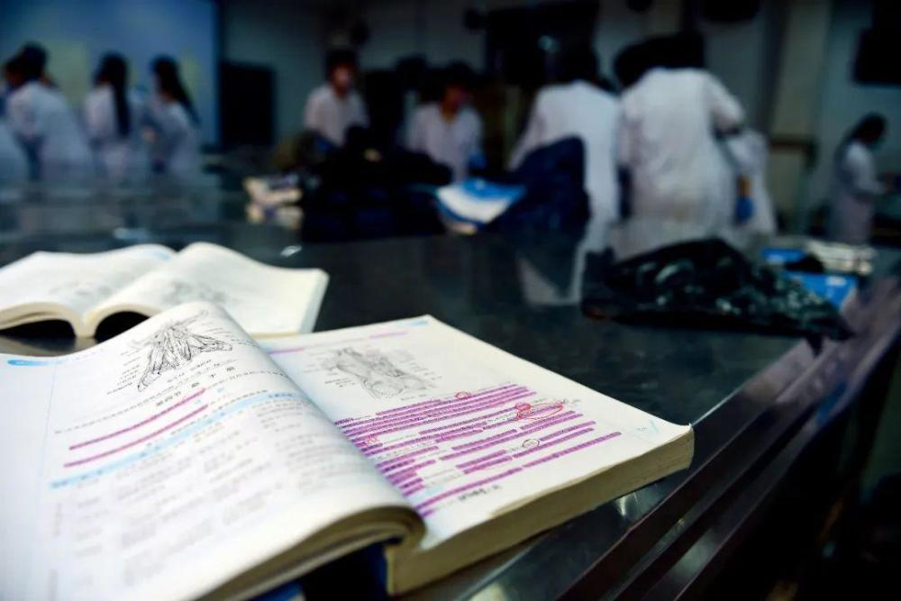

# 医学生培养了八年，为何还不会看病？

“现在患者红细胞比积是21％，你会选择输血吗？”

“不会。”

“18％。”

“患者严重贫血，我会输血。”

“你的意思是红细胞比积18％就该输血，21％就不需要输血吗？”

这段对话来自《我在美国当医生》一书，描述的是美国一家医院，考生参加住院医师培训模拟考试时的场景。“患者是活的，手术正在进行，一切都是动态的，回答问题也应该是动态的。如果用一个数据来决定是否输血，在临床上是失败的。”作者写道。

近年来，国内每年从普通高校毕业的医学生逐年增加，2016年至2020年累计毕业392万人。但一直以来，国内医学生培养面临着学制多、学位混杂、住院医师规范化培训（以下简称规培）缺乏统一标准等问题。

日前，中办、国办印发《关于进一步完善医疗卫生服务体系的意见》，其中提到，要加强医教协同，落实毕业后教育和继续教育，完善住院医师规范化培训制度。

“医学教育系统一直没有被清晰化。这也是为何国家花大力气培养很多医学生，但最终会看病的人没那么多的根本原因。”中国科学院院士、中国科学技术大学附属第一医院院长葛均波对《中国新闻周刊》说。

学制多、学位混杂

张曼本科和硕士均毕业于广州当地一所有名的医学院，经历了“5+3”一体化培养，即5年临床医学本科和3年专业硕士，读研期间同时接受规培。2021年，张曼专硕毕业，如今成为广州当地一家三甲医院的乳腺科医生。

医学教育具有自身的特殊规律性，国内外公认是由院校教育、毕业后教育和继续教育组成的连续统一体，其中，毕业后的医学教育又分为规培和专科医师规范化培训（以下简称专培）两个阶段。专硕并轨规培的医学生，一方面在医院规培轮转，受医院管理，本质上又是硕士生，归学校管理。

读研期间，张曼要完成规培，才能拿到规培结业证书、执业医师资格证、专业硕士毕业证书、专业硕士学位证书，俗称“四证合一”。

张曼所经历的“5+3”一体化学制，是国内目前主流的医学生培养模式，2015年，这一模式在国内设立。当年，教育部等六部门联合印发的《关于医教协同深化临床医学人才培养改革的意见》要求，从该年起，停止七年制临床医学专业招生，调整为“5+3”一体化临床医学人才培养模式。

_2017年9月19日，山东青岛一所大学临床医学专业大三的学生，在上入学以来的第一堂局部解剖课。图/视觉中国_

目前，国内医学生培养的学制还包括三年制专科、五年制本科、临床医学八年制本博连读（下简称八年制）等。葛均波表示，八年制等同于医学精英教育，全国仅有十余家院校开设。但实际上，八年制学生用于写论文的时间只有半年左右，有的学生论文水平可能达不到博士毕业要求。

如果读完本硕，再读博士，同样面临这一问题。科研型医学博士一般三年毕业，第一年要学基础课，第二年做实验，之后，准备毕业论文。在葛均波看来，由于时间紧张，这一阶段医学生所写论文大多是重复别人做过的东西，缺乏创新。

苏州大学原校长、从事分子免疫学和病毒学研究的熊思东对《中国新闻周刊》说，医学院培养的是经过医学教育、具有医学知识的学生。现在他比较担忧的是临床医学科学化的趋势。对八年制学生而言，除了学习基础课程和医学基础知识，毕业后还要完成3年规培，才能开展临床工作。规培要在医学院的附属医院进行，有些医院接纳学生的数量有限，这就导致有些学生在医学院教育后，有可能没机会完成规培，部分人最终会选择从事科研工作。

熊思东表示，现在很多高校的医学教育“眉毛胡子一把抓”，求高贪大，从三年制改为四年制，四年制改为五年制，如今甚至延长至十年制。这一基础上，有的高校还要求学生获得双博士学位，即MD和PhD，前者为临床医学博士学位，后者为学术型的博士学位。“一刀切的医学生培养体制需要调整，并非所有医生都要8年甚至更久培养时间。”熊思东说。

在美国，学生本科期间要先读四年理工科或其他专业，再报考医学院，即“4+4”模式。美国“4+4”模式培养的医学生不一定非要写论文，毕业相当于MD。

高磊是美国一名心脏科临床医生，也是北美华人医师联盟主席、美国心脏病学会专家会员（FACC）。他告诉《中国新闻周刊》，美国“4+4”八年制医学教学模式也一直被美国业内诟病。有观点认为，这种培养方式花费更多资金和更长时间，并非培养医生的最好途径，而且，全世界只有美国这样做。

国内部分高校也在不断探索与美国类似的“4+4”学制。上海交大医学院早在2002年，开启了“4+4”培养临床医学博士模式，迄今为止，已连续招生20年。2018年9月，北京协和医学院正式实施“4＋4”学制改革，同年，试点班开始招生。但前述两所医学院“4+4”模式的招生人数一直不多。2023年，上海交大医学院和北京协和医学院分别招生25名、18名。

在高磊看来，国内医学学位的复杂性反映在对医学生和医生的要求模糊，过度强调了科研的重要性，反而对于医生治病救人的本质有所忽视。中国在医生培养方面设置了太多学位制，打乱了自己的培养系统。

上世纪90年代，葛均波曾在德国学习、工作长达10年。1990年，他从上海医科大学博士毕业后，被公派至德国美因兹大学医学院联合培养。1995年，他开始担任德国埃森大学医学院心内科血管内超声室主任。葛均波认为，自己走了很多弯路。在他看来，应合理缩短医生的培养时间，让其在尽可能短时间内掌握各亚学科知识，成为一名好医生。

葛均波观察到，在德国，临床医学并非是大家熟悉的本科-硕士-
博士制，而是类似于一个总学时为6年零3个月的大学学习课程，得到的毕业证书也并非一般学位证或毕业证，而是行医资格证。整个临床医学学习阶段被分为临床预备课程2年、临床课程3年、临床实习1年。临床实习阶段，要在各个科室轮转，出科室时，达到一定临床考核指标。

葛均波分析称，国内应把硕士、博士合并培养，因为单纯读医学硕士很难学到“真材实料”。一名医学生完成5年医学教育和3年规培，完全可以获得临床医学专业博士学位。5年阶段要学医学基础，3年阶段在每一个科室轮转学习各个系统的疾病，整个培养期间不硬性要求做科研。

规培该如何进行？

1994年，高磊从国内一所高校的临床医学本科毕业，当时他应聘到苏州的一家医院工作。“当时我注意到，苏州已经有比较好的住院医生培训计划，虽然存在一定局限性。”他告诉《中国新闻周刊》。

从医学院毕业后，高磊入职苏州一家医院的心内科，当时先经历了3年的内科各科室轮转，涉及呼吸内科、消化内科、心血管内科等细分科室。完成轮转后，才有机会成为专科医生。轮转期间，医院给每人发笔记本，接触的病历和临床操作次数都要记录清楚，每科轮转结束时，带教老师会在本子上签字。轮转具体安排由医院医教科负责，个人还是归属于心脏科，工资由心脏科发，还可以拿到心脏科的基本奖。每年卫生局会组织一次住院医生知识考试。

_桂林医学院医学生毕业前的临床技能考核。图/中新_

“这算是当地规培早期的雏形，总体感觉当时培训很正规。师生关系也融洽，老师愿意教学生，我获益匪浅。”在高磊的印象中，那时像胸穿、腹穿、骨穿等普通内科操作，他可以熟悉到闭眼操作。

2013年12月，原国家卫计委等7部门联合下发《关于建立住院医师规范化培训制度的指导意见》（以下简称《指导意见》），标志着国内正式建立、实施规培制度。2014年，原国家卫计委先后印发《住院医师规范化培训管理办法（试行）》等系列配套文件，初步构建起国内规培的政策体系，使其更具操作性。

《指导意见》指出，到2015年，各地要全面启动规培工作。到2020年，所有新进医疗岗位的本科及以上学历临床医师，均须接受规培。

在熊思东看来，近十几年来，国内的规培是规范、成系统的，和较早开始实施规培的西方国家相比，中国做得并不逊色。高磊认为，尽管现在规培整体做得不错，但各个地方没有同一性，出现复旦模式、华西模式、协和模式等，缺乏全国统一标准。

生活在南方某城市的李洲，现在是一名三甲医院病理科的副主任医师。距离他从医学院本科毕业，已过去20年。2007年，他所在的医院推荐他以定向培养的方式读研究生。李洲回忆，2010年硕士毕业时，正好赶上当地开展规范化培训的第一年，他所在医院那年也成立了儿科和妇产科两个规培基地。

李洲表示，一些医院开展规培，更多从自身需求出发，并未过多考虑规培后医生返回自己医院，规培内容是否对口的问题。

2017年，他曾到一座县城出差，当地一家医院院长告诉他，“我把医生送到你们医院规培。规培时在你们医院学习的是微创的腹腔镜手术，但县城医院没有相应条件开展这类手术。规培医生回到县城后，还要重新学习开腹手术”。在李洲看来，这样“不对症”的规培，使得培训完，医生回到所在医院的临床意义打了折扣。

葛均波分析说，目前，国内规培制度已完全建立，但执行时又存在问题。比如一名本科毕业的临床医学学生，不考研情况下直接进入规培阶段，需要在消化科、呼吸科等多科室轮转，之后通过执业医师执照考试，可以开始看病。但规培这3年，这名医学生没有学位，最后只能拿到执业医师执照。这和当时同一批考研、考博的医学生又有点“脱节”。

现在全国不同地方、不同医院的规培时间仍不一致，有的医院两年，有的医院三年。葛均波提出，这方面全国应统一，不能说在一线城市规培要三年，到了其他城市就降低标准为两年。

各地规培基地的水平参差不齐。熊思东分析，综合实力强的医院规培质量好一些，但全国医学生规培的规模很大，这导致这些医院远远不能满足需求，因此会向下级医院扩展。熊思东称，有的科室、有的医生带的规培生数量过大，他印象中，有的科室规培生数量则达上百名，甚至一名医生带的规培生就有几十名，导致规培医生缺乏精细指导。

“各个医院对规培把握的严格程度不一样。”张曼说，有的医院特别严格，严格按照规培轮科计划进行；有的医院很“划水”，规培医生3年都在自己导师的科室，如果医院完全不把关的话，规培手册都自己填，最后出科室的表格，找科室主任签字就能通过。

赵琳是上海市一家三甲医院的规培医师，她对《中国新闻周刊》说，“现在很多规培医生，都没上过临床，只会书本上的东西，可病人又不会按着书本生病。”

“规培生的收入并不高。”李洲说，他所在的医院，2010年～2012年期间，规培生一个月所有收入仅一两千元。现在他所在医院规培生月薪水涨到5000元/月左右，主要得益于当地政府和医院的补贴。

广州工作的张曼算了笔账，她规培时每个月的所有“收入”大约总计2000元，这其中还包括学校发的助学金、学校每月学费返还等。张曼表示，各个医院规培待遇差别很大，月薪从几百元到几千不等。如果医院不提供住宿，这一收入在大城市租房都不太够用。

除了规培，近年专培的推广也在逐渐加大，即在5年医学类专业本科教育、3年住院医师规范化培训的基础上，依据相关要求进行2～4年的专培。

2015年，原国家卫计委等8部门印发《关于开展专科医师规范化培训制度试点的指导意见》。2022年12月7日，国家卫健委发布的对于政协委员的“提案答复函”中提到，专培制度试点工作2016年正式启动，先后选了呼吸与危重症医学、心血管病学、神经外科、内科危重症医学等10个代表性较强、社会需求较大的专科作为试点，共遴选224家专培基地，累计培训专科医师7500余人。

“进行过专培的医生，并不意味着水平就更高，大部分医院也没有硬性规定，一定要进行专培。”葛均波表示。五六年前，为和国际接轨，他联合其他几名政协委员呼吁，在国内成立专培试点。

在美国，学生获得MD学位后，进入住院医师培训阶段，不同专业时间不同，内科系统需要3或4年，外科系统需要5至7年。此外，美国医学从业者需要经过3次医学资格考试才能获得医师执照，考试内容覆盖理论和实践。

现在全国范围内，专培还没有正规化。葛均波认为，是时候回顾下，看能否制定一套标准化的制度，对什么人群需要专培、从什么阶段开始专培。通常，医学生毕业进入医院五年后，就可以申请升至主治医师。他思考过，是否主治医生职位以上的医生就不需要专培。不过，主治医生这一群体在医院占比很高，如果不进行专培，这一群体的知识面掌握得可能并不那么全面。

到底需要什么样的医生？

目前的医学生主要由三大类院校培养，包括综合型大学的医学院、传统独立的医学院、职业高中及大中专院校的涉医涉卫院校。熊思东指出，从数量上看，每年培养出的医学生足够满足全国需求。不过，医学院毕业的学生并非全部从事医疗卫生工作，因此出现毕业生多于医院需求的现象。

让熊思东明显感受到的一个趋势是，医学院对学生的培养方式是同质化的，都向培养顶级医生的方向走，有条件上，没有条件创造条件也要上。现在从事全科、社区医养结合的贴近老百姓的医生越来越少，而去顶级三甲医院成了大部分医学生梦寐以求的选择。客观情况是，现在基层医生高度缺乏，顶级的三甲医院很多医生挤破头却进不去。

“如今医学毕业生想进入大医院很难。”北京大学第一医院神经内科主任医师孙永安在接受《中国新闻周刊》采访时表示，去年他所在的神经内科，接到了七八十份简历，但最终只有一个招收名额。李洲所在的医院在当地属于大型三甲医院，今年一个普通技术员岗位现在已有十几名硕士报名应聘。

李洲认为，规培的一些具体细化政策上，国家卫健委应更多征求一线临床医生的建议。他认为，虽然各地规培体系不一的现象虽已逐步得到纠正，但年轻医生为此付出不少精力和代价。

据张曼了解，她所在医院一些外科主治医生，主刀手术的机会很少。越是大医院，这种现象越普遍。张曼现在在乳腺科做的大部分工作，跟规培阶段其实没太多区别。她说，“就是能做一些小手术，有工资了。”

“医学教育体制改革，不是简单的缩短还是拉长医生培养时间的问题，而需要进行医学教育结构再造。”在熊思东看来，一方面，医生培养要有注重更扎实的基础，可以从非医学本科专业的大学生中选择要培养的人才，保持医生持续学习的能力；另一方面，让医生能获取更精准的医学知识，使其具备合适的岗位胜任力。

张曼所在的医院，想要进一步晋升，更多看的还是论文，发了多少篇研究，医生临床操作水平能力在晋升考核体系中并不占优势。“手术好坏无法量化，名头很大的医生，可能手术做得一塌糊涂。”她说。赵琳所在医院招人一般不招“四证合一”的医生，而是倾向于招收科研实力强的医生。

“国外基本上80％的医生不需要做科研。”高磊分析说，他有PhD和MD的双学位，但他在美国做医生十几年了，很少接触科研，大部分时间都用在给患者看病上。

葛均波认为，不同医院对医学人才的需求不一样。大型三甲医院承担了更多科研任务，对各地县医院来说，没有必要一定要考核医生的论文水平，或者将学位门槛设得很高。因为现在老百姓看病，80％的人到县医院，对县级医院而言，看好病更重要。现在很多医院要求医生既会看病，又会做科研，实际上没有必要。

葛均波指出，以美国为例，美国华裔心脏协会的医生，一般有自己的独立诊所，更多进行日常看病，不太涉及科研，也有一些专门做学术科研的医学科学家。哈佛医学院等高校学科带头人，可能两者兼顾。在国内，临床医生做科研，似乎是一种常态，也是国内人才评价和晋升的重要指标，想要改变这点需要从考核机制入手。

他建议，相关部门应开一个研讨会，由国家教育部、卫健委和知名学者组成的顾问委员会一起共同参与，一起讨论制定标准化的医学培养流程。因为这涉及到学科教育、医学专业知识的应用，需要各个领域专家参与其中，这样才能弄清楚弊端在哪，进行改进。

孙永安认为，医学教育体系改革需要漫长的时间，需要多部门配合推进。现在比较关键的是，尽快建立有效的临床评估体系，让临床医生有足够的时间参与到临床疾病诊治，培养更多真正能看病的医生。

熊思东分析，要在医学生的结构和质量方面下大功夫，特别是前者。明确未来需要什么岗位的医生，然后进行结构性调整，适应不同岗位、不同层级医生的需求。此外，应建立全国范围内医生岗位的预警制度，及时了解哪些医生岗位缺人，予以培养，避免时间上太过滞后。

（张曼、赵琳、李洲均为化名）

实习生李金津对此文亦有贡献

发于2023.3.27总第1085期《中国新闻周刊》杂志

杂志标题：医学教育改革，如何培养更多好医生？

记者：牛荷

