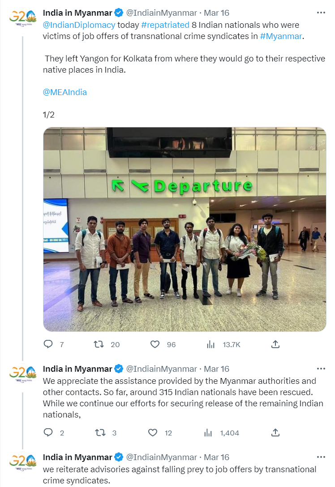
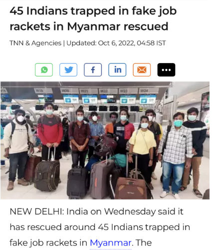
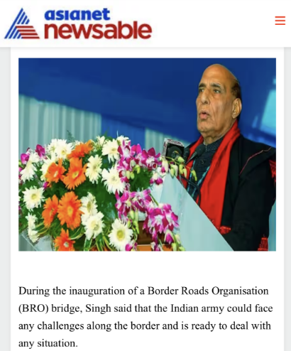

# 印度从缅甸解救315名电诈人员，威胁“踏平缅北”？说法不准确

速览

  * _1_ 网传“印度军队携带武器进入缅甸电信诈骗园区解救315名被困人员”“在双方交涉过程中，印度军队击伤击毙缅甸诈骗园区武装人员”“印度驻缅甸大使馆表示采取军事行动‘踏平缅北’”等说法并不准确。
  * _2_ “315”这一数字为印方成功从缅甸解救出从事电信诈骗人员的总数，最近一次营救行动中的人数为8人。
  * _3_ 印度驻缅甸大使馆对缅甸当局在此次行动中提供的援助表示了感谢，并未提及双方在交涉过程中发生军事冲突及人员伤亡。
  * _4_ 网传照片中的 “印度驻缅甸大使”并非大使索拉布·库马尔本人，而是印度国防部长拉杰纳特·辛格，照片拍摄于2023年1月3日边境道路组织大桥落成典礼。

事件背景

近日，有中文网络和社交平台视频称，据印度驻缅甸大使馆消息，印度军队携带武器进入缅甸电信诈骗园区，解救出315名被困人员，并在交涉过程中与园区武装人员数次交火，成功击伤击毙多名园区武装人员。相关消息还声称，印度驻缅甸大使馆表示，缅北只要敢绑架印度人，印方将毫不犹豫地采取军事行动，甚至会“踏平整个缅北”。

_相关报道截图_

明查

**“315”这个数字从何而来？**

印度驻缅甸大使馆在2023年3月16日发布推文称，“今日遣返了8名印度侨民，他们是缅甸跨国犯罪集团提供工作机会的受害者”，并对缅甸当局和其他知情人士提供的援助表示感谢，推文中并未提及双方在交涉过程中发生过军事冲突。印度驻缅甸大使馆还表示，到目前为止，已累计共有315名印度人获救，但没有指出统计该数字的起始日期。

_印度驻缅甸大使馆推文相关截图_

同时，使用谷歌图像搜索（Google Image）对文章中的照片进行反搜，可以发现这张照片最早出现在2022年10月6日发表于《印度时报》（Times of
India）一篇标题为《45名被困缅甸虚假工作的印度公民获救》的报道中。根据《印度时报》的报道，印度外交部发言人阿林丹·巴奇（Arindam
Bagchi）发布推文表示，在印度驻缅甸大使馆和缅甸驻泰国大使馆的共同努力下，现已有32名印度人被成功营救，另有其他13名印度公民被解救并抵达泰米尔纳德邦（Tamil
Nadu，位于印度南部的邦）。

_《印度时报》相关报道截图_

**图片中的人是谁？**

经核查，社交平台流传照片中的“印度驻缅甸大使”并不是索拉布·库马尔大使本人（Saurabh Kumar），而是印度国防部长拉杰纳特·辛格（Rajnath
Singh），该图片拍摄的背景为2023年1月3日拉杰纳特·辛格在边境道路组织（Border Roads
Organisation）大桥落成典礼上的讲话，并非网传说法中“印度或将对缅甸采取军事行动”、“踏平缅北”的发言。

_Asianet
News相关报道截图_

_印度驻缅甸大使索拉布·库马尔_

截至发稿，用缅甸语、印地语和英语对网传说法中
“印度驻缅甸大使”“拉布·库马尔”“缅甸”“军事行动”等关键词进行检索，除社交平台和自媒体有类似说法流传外，并未显示其它主流媒体的相关报道，在印度驻缅甸大使索拉布·库马尔的社交平台账号上也没有找到相关发言。

综上所述，网传“近日印度军队携带武器进入缅甸电信诈骗园区解救315名被困人员”“在双方交涉过程中，印度军队击伤击毙缅甸诈骗园区武装人员”“印度驻缅甸馆表示采取军事行动‘踏平缅北’”等说法并不准确。

“315”这一数字为印方迄今从缅甸成功解救出从事电信诈骗人员的总和，并非最近一次营救行动中的人数；印度驻缅甸大使馆对缅甸当局在此次行动中提供的援助表示了感谢，没有提及双方在交涉过程中发生军事冲突；网传照片与网传说法也毫无关联，印度驻缅甸大使索拉布·库马尔的照片为印度国防部长拉杰纳特·辛格在边境道路组织大桥落成典礼上的发表讲话的现场照片。目前，没有官方消息显示印方或将对缅甸采取军事行动。

