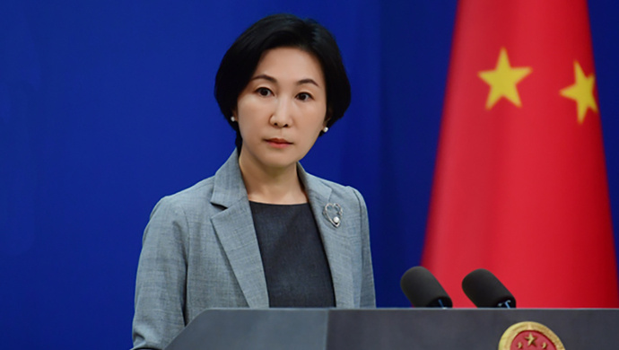

# 外交部回应所谓“中国债务陷阱”：向中国泼脏水，我们绝不接受

北京日报客户端 | 记者 刘晓琰

3月28日，外交部发言人毛宁主持例行记者会。

有记者提问，近日发布的一项研究显示，中国在2008年至2021年期间花费2400亿美元援助22个发展中国家。不过，随着近年来援助数额的上升，不少国家难以偿还用于“一带一路”基础设施建设的贷款。中方对此有何回应？

_图源：外交部_

“受诸多外部因素的影响，近来发展中国家的债务风险显著上升，一些人借机炒作所谓中国的‘债务陷阱’，贷款不透明，向中国泼脏水，我们绝不接受。”毛宁回应指出。

毛宁称，中国始终致力于为发展中国家的经济社会发展提供支持，资金不足是制约不少国家繁荣振兴的瓶颈问题。中国立足各国的发展诉求，将对外投融资合作的重点放在基础设施生产建设等领域，帮助发展中国家提升自主可持续的发展能力。多年来，中方帮助了非洲国家兴建和升级铁路超过1万公里，公路近10万公里，桥梁近千座，港口近百个，有力地促进了各国的经济发展和民生改善，给当地人民带来了实实在在的好处。

毛宁表示，中国始终基于公开透明的原则，同发展中国家开展投融资合作。中方按照市场规律和国际规则行事，尊重有关国家意愿，从来没有强迫任何一方借款，从未对任何国家逼债，不会在贷款协议中附加任何政治条件，更不寻求任何政治私利。中方重视债务的可持续性问题，同有关国家合作发布了“一带一路”融资投指导原则，债务可持续性分析框架，助力共建国家提升债务管理能力。

毛宁指出，迄今为止，没有任何一个合作伙伴认可所谓“一带一路”造成“债务陷阱”的说法，中国始终尽己所能帮助发展中国家缓解债务负担。习近平主席宣布，从国际货币基金组织增发给中国的特别提款权中，拿出100亿美元转借给非洲国家，有关工作正在积极推进。中方全面落实二十国集团的缓债倡议，缓债总额在二十国集团成员中最大，并同有关成员一道参与了国别个案的债务处理。

毛宁称，世界银行统计数据显示，发展中国家主权债务中多边金融机构和商业债权人占比超过8成，当务之急是这些机构按照共同行动、公平负担的原则参与债务处理。

“在债务问题上，谁是发展中国家真诚可靠的朋友，谁是别有用心的谣言制造者，广大发展中国家体会最真切，国际社会的有识之士看得很清楚。“毛宁说到。

