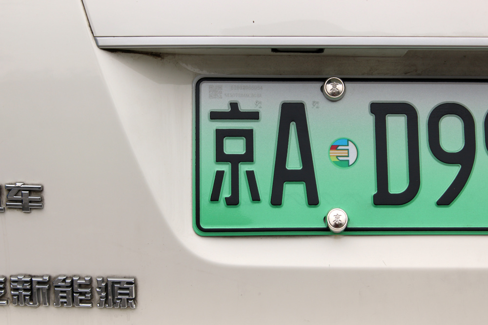

# 新能源“绿牌”或在2年内取消？乘联会秘书长崔东树回应：建议同车同权

每经记者：董天意 每经编辑：孙磊

3月28日，有关“最丑绿色车牌或在2年内取消”的话题登上热搜。有媒体报道称，全国乘用车市场信息联席会（以下简称乘联会）秘书长崔东树表示，乘联会已经向国家有关部门提出了合并“蓝牌”“绿牌”的建议，并且预计未来两年就将成为现实。

对此，崔东树回应《每日经济新闻》记者表示：“我们（乘联会）提出的是同车同权。”

所谓“绿牌”，即新能源汽车专用号牌。该类型牌照最早于2016年12月1日，由上海、南京、无锡、济南、深圳等5个城市试点发放，2018年起在全国范围内推广应用。符合条件的纯电动车和混合动力车，均可获发新能源汽车专用牌照。

眼下，国内新能源汽车市场持续火热。乘联会数据显示，2月的国内新能源乘用车批发销量达49.6万辆，同比增长56.1%，环比增长27.5%，厂商批发渗透率达30.6%，较2022年2月的21.6%渗透率提升了9个百分点。其中，2月自主品牌新能源乘用车渗透率为45.7%。

有观点认为，新能源车相关政策优惠是刺激其市场需求的重要助力之一，而取消“绿牌”本质上是让竞争回归市场主导。随着“国补”取消，为燃油车和新能源车进一步营造公平竞争环境，上述举措也将有利于产业的健康发展。

有网友认为，取消“绿牌”或意味着新能源汽车也将缴纳车辆购置税及养路费，并且在部分城市开始参与实施尾号限行。对此，有网友留言称：“就是因为有优势才放弃油车，都平等了，谁还用电车。”“北京这边不限行是买新能源车的刚需之一。”

_图片来源：新浪微博_

但也有网友表示：“绿牌太丑了，建议取消。”“（绿牌）看着感觉就不值钱的样子，没有高级感。”

_图片来源：新浪微博_

值得一提的是，关于取消“绿牌”的提议并非首次。去年12月，中国城市交通协会就曾建议将新能源汽车专用绿牌取消，让所有车辆统一使用蓝色标识牌，同时新增标识新能源车的统一字母前缀。

在此之前，已有部分省份和城市陆续对新能源汽车相关政策进行调整。2021年6月，广州市发改委就曾发布《关于进一步完善新能源汽车信息管理工作的通知（试行）》（征求意见稿），明确广州车主购买新能源车上绿色号牌需要先获得市发改委发放的《广州市新能源汽车信息管理凭证》；上海市自2023年1月1日起，消费者购买插电式混合动力（含增程式）汽车的，不再发放专用牌照额度。

而除取消“绿牌”外，关于调整新能源汽车税收优惠政策的讨论也在增加。去年8月，乘联会就曾公开表示，我国对电动车征税将是必然趋势。

_图片来源：视觉中国_

“传统燃油车的车购税10%、按发动机排量征收的最高40%的消费税、按成品油每升征收1.52元的成品油消费税和其他正常税收、这些都是汽车行业对经济发展和国家税收的贡献。”乘联会方面表示，未来燃油车保有量剧烈萎缩后，国家税收的缺口仍将需要电动车税收体系的支撑，电动车的购买和使用阶段，乃至报废环节的征税是必然趋势。

据了解，目前我国车辆购置税的计算公式为10%×[发票价/(1+增值税率13%)]，4S店一般提供给消费者的快捷计算方式为车辆发票价/11.3，以购买一辆开票价格15万元的新能源车为例，免征的购置税约为1.32万元。

而我国对于新能源汽车的扶持规模和成本也是巨大的。工信部相关数据统计显示，2016~2022年间，国家每年给予新能源汽车的补贴金额从8.6亿元增长至105.4亿元，总额已经超过300亿元。在此背景下，我国新能源汽车保有量也从2012年底的2万辆增长到如今超千万辆的规模。

事实上，随着全球新能源汽车销量的快速增长，已有部分国家计划对其规划税收政策。瑞士政府曾于去年7月表示，该国正计划对以电力和其他替代能源为动力的车辆征收新税。据了解，目前瑞士道路基础设施所用的资金，一部分来自汽油和柴油等燃料的税收，但是随着越来越多的电动车出现在道路上，这部分税收必然将下降。瑞士政府要求交通部提出建议，为公路建设和养护所需的资金找到更可持续性的来源。我国海南省也于近期出台了《公路里程费收费系统》的征求意见，意见中提到海南省将针对新能源汽车“养路费”问题，展开收费模式的改进和探索。

此外，乘联会方面认为，我国电费价格低和居民电价优惠带来的电动车使用成本低是电动车的最大优势，消费者受电动化车使用成本低的驱动购买电动车，而智能化需求主要体现在中高端的需求特征。随着电动车销量的不断攀升，乘联会方面预测，我国下一步或将完善居民阶梯电价制度，逐步缓解电价交叉补贴，使电力价格更好地反映供电成本，还原电力的商品属性，从而形成更能充分反映用电成本、供求关系和资源稀缺程度的居民电价机制。

每日经济新闻

