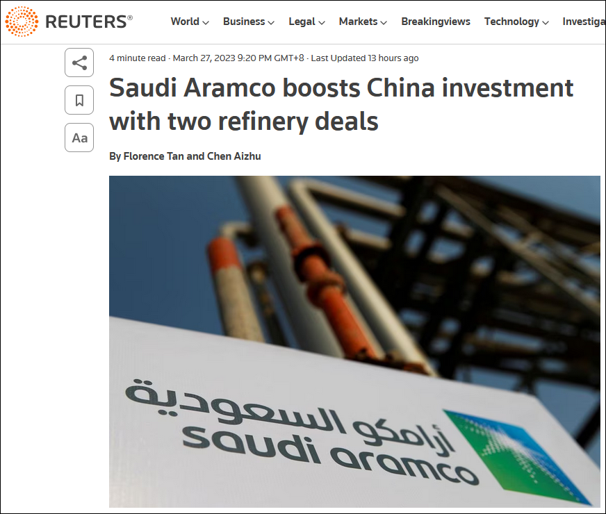
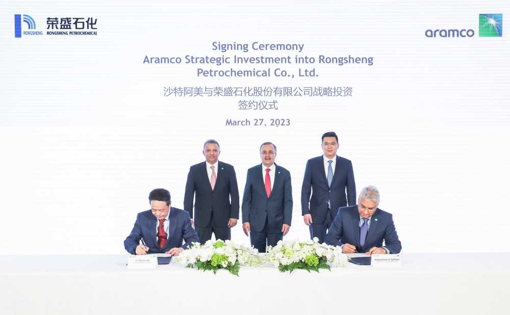
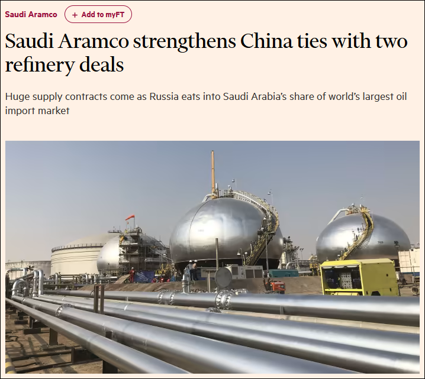
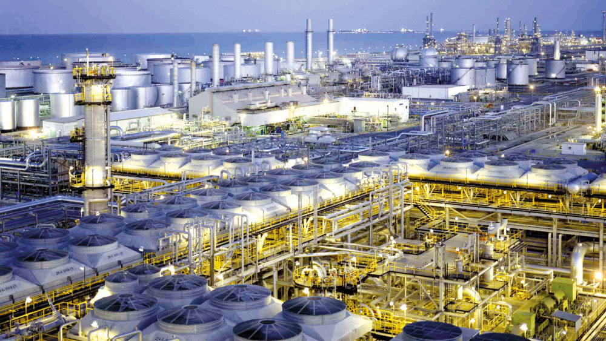

# 沙特阿美接连豪掷重金在华投资，总额超1000亿人民币

【文/观察者网 熊超然】当地时间3月27日，全球最大石油公司——沙特国家石油公司（Saudi
Aramco，沙特阿美）宣布已签署协议，将以36亿美元（约合246亿元人民币）收购中国荣盛石化10%的股份，该协议还包括沙特阿美向荣盛石化子公司浙江石油化工有限公司（浙石化）供应48万桶/日的原油，为期20年。

值得注意的是，沙特阿美此番以溢价近九成入股荣盛石化，荣盛石化28日开盘迎来一字涨停，油气产业链逆市大涨。26日，这家沙特石油巨头还宣布，耗资122亿美元（约合837亿元人民币）与另外两家中国企业在辽宁省盘锦市设立合资公司，并在中国东北建设日产30万桶的大型炼油化工联合装置。

英国《金融时报》和路透社指出，这些交易有望使沙特阿美每天向中国增加供应约69万桶原油，巩固其作为中国最大原油供应商的地位。路透社还认为，沙特阿美接连豪掷重金在华投资，凸显出沙特与中国日益加深的关系。

报道还进一步指出，美国长期都是中东地区主导力量，而本月初中方主导的“沙伊北京和解”则震撼了中东局势。同时，沙特和阿联酋等海湾国家都已表态，不愿在当前复杂的全球局势下选边站队，而是希望合作伙伴多样化，重点关注本国国家经济和安全利益。

_路透社报道截图_

**溢价近九成入股中企，沙特阿美接连豪掷重金在华投资**

3月27日晚，中国民营石化龙头企业荣盛石化发布公告称，公司控股股东浙江荣盛控股集团有限公司与沙特阿美的全资子公司AOC签署《股份买卖协议》，拟将其所持有的公司股份10.13亿股（占截至协议签署之日公司总股本的10%加一股股份），以24.3元/股的价格转让给AOC，对价总额246亿元。

据悉，相关交易预计将在年底前完成，一些手续和程序仍有待同意和批准。

这一转让价格，较荣盛石化27日当天的收盘价12.91元/股溢价超88%。本次股份转让对价的支付方式为现金支付，资金来源为AOC自有资金。买方于交割日一次性向卖方付款。28日，荣盛石化开盘一字涨停，油气产业链也逆市大涨。

沙特阿美下游业务常务副总裁穆罕默德·卡塔尼（Mohammed Y. Al
Qahtani）表示，这一交易展现了其公司对中国长期投入和对中国石化行业基本面的信心，同时也承诺了向中国最重要的炼油商之一浙石化提供可靠的原油供应。

_3月27日，荣盛石化与沙特阿美签署全面、深化战略合作协议。图自荣盛石化官网_

此前一天（26日），沙特阿美还联手北方工业集团、盘锦鑫诚实业集团，计划在辽宁盘锦建设大型炼油化工一体化联合装置，成立名为华锦阿美石化有限公司的合资公司，三方持股比例分别为30%、51%和19%。据悉，该合资公司包括一座日加工能力为30万桶的炼油厂和一座年产165万吨乙烯与200万吨对二甲苯的化工厂。

对于这项耗资122亿美元（约合837亿元人民币）的项目，沙特阿美总裁兼首席执行官阿敏·纳瑟尔（Amin
Nasser）表示，该公司希望成为中国长期能源安全和高质量发展的全面能源和化学品来源。

**“沙伊北京和解震撼中东，投资凸显中沙关系日益加深”**

事实上，去年也是在3月，沙特阿美计划在中国东北合作开发一座大型炼油设施的消息就已经出现。而当时，俄乌冲突刚刚爆发不久，迫于国内能源价格飙升，美国总统拜登寻求与沙特等国讨论石油出口问题，但通话请求遭到拒绝。

英国《金融时报》和路透社不约而同地指出，26日和27日分别宣布的这两项交易，有望使得沙特阿美每天向中国增加供应约69万桶原油，巩固其作为中国最大原油供应商的地位。

不过，这两家英国媒体提出的一些关注点也值得注意。《金融时报》就“意有所指”地表示，这些巨额原油供应合同签订之际，正值俄罗斯“蚕食”沙特在中国的市场份额。

报道援引中国海关数据称，今年1月和2月，俄罗斯超过沙特阿拉伯，成为中国最大的原油供应国，日供应量约200万桶。而同一时间段，沙特阿拉伯对中国的原油日供应量约为170万桶，低于去年同期的约180万桶。

_《金融时报》报道截图_

路透社也称，沙特和俄罗斯对于中国市场的竞争日益激烈，并认为沙特阿美的投资凸显出，沙特与中国的关系正在加深，这引起了沙特传统盟友美国的安全担忧。

路透社进一步指出，本月早些时候，沙特和伊朗这对中东地区的“宿敌”在中国的斡旋之下，同意重新建立外交关系，中方在这一外交突破中发挥的作用震撼了中东局势，此前美国长期是该地区的主导力量。

沙特和阿联酋等诸多海湾国家都表示，在全球政治日益两极化的当下，不会选边站队，希望合作伙伴多样化，以服务于本国国家经济和安全利益。

**中沙经济联系不断加深，美元全球贸易主导地位或走弱**

作为世界上最大的石油公司，沙特阿美于2019年年底在沙特证交所上市，通过IPO筹集了256亿美元，创下了全球史上规模最大的首次公开募股（IPO）。路透社称，此举被视为沙特“2030年愿景（Vision
2030）”经济多元化计划的支柱，该计划旨在吸引外国投资。

沙特王储曾在一次采访中表示，沙特在加强与中国、印度和俄罗斯的关系，尽管与拜登政府存在一些分歧，但美国仍然是战略伙伴。

去年3月，沙特阿美首席执行官纳赛尔曾表示，目前中国的石油需求已经非常接近新冠疫情大流行之前的水平，在未来50年乃至更长的时间内，沙特阿美仍把保证中国能源安全当作其首要任务。

_全球最大石油公司——沙特国家石油公司 图自沙特阿美官网_

彭博社此前报道曾指出，沙特是上世纪70年代所建立的石油美元体系的“支柱”，该体系依赖于以美元为原油出口定价。数十年以来，沙特这一全球最大石油出口国一直保持与美元挂钩，但如今也正在寻求加强同包括中国在内的重要贸易伙伴的关系。

一段时间以来，中国和沙特的经济联系不断取得积极进展，已成为沙特最大的贸易伙伴。去年12月，中沙两国相继举行了中国－阿拉伯国家峰会、中国－海湾阿拉伯国家合作委员会峰会和元首会晤，并签署了共建“一带一路”倡议与“2030愿景”对接实施方案。

特别是在此期间，中方不但表示愿同沙方加强能源政策沟通协调，扩大原油贸易规模，加强勘探开发等合作，还在首届中国 -
海湾阿拉伯国家合作委员会峰会上表示，将继续从海合会国家扩大进口原油、液化天然气，加强油气开发、清洁低碳能源技术合作，开展油气贸易人民币结算。

路透社也注意到了这些，在其报道中指出，近期这些交易正是自去年12月以来所宣布的最大规模交易，中方呼吁开展油气贸易人民币结算，此举将削弱美元在全球贸易中的主导地位。

**本文系观察者网独家稿件，未经授权，不得转载。**

