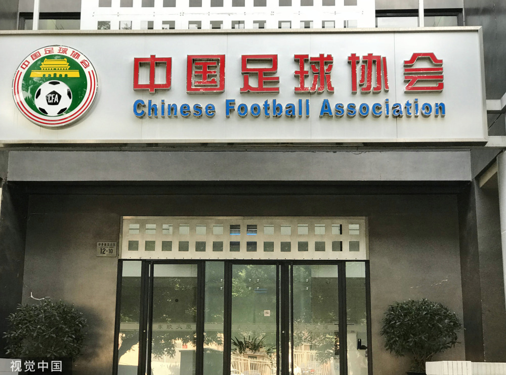

# 罕见！中央巡视为何点名足球腐败？

中新网北京3月28日电(记者
阚枫)中央巡视组又要来了。3月27日晚，官方公布了二十届中央首轮巡视对象的名单，36家单位的党组(党委)被纳入本轮巡视，巡视的形式有三种：常规巡视、巡视“回头看”和机动巡视。

在同一轮巡视中运用三种巡视形式，这在以往较为少见。

具体来看，纳入二十届中央首轮巡视常规巡视的有30家中管企业，它们涵盖了航天、能源、电力、通信、粮食等事关国计民生的重点领域。诸如，公众熟知的“三桶油”(中石油、中石化、中海油)，三大运营商(中国移动、中国联通、中国电信)等等。

纳入本轮巡视“回头看”的是5家中管金融企业：中国投资有限责任公司、国家开发银行、中国农业发展银行、中国光大集团股份公司、中国人民保险集团股份有限公司。

除了常规巡视和“回头看”，本轮巡视还将对国家体育总局党组开展机动巡视。

三种巡视有何侧重？

在3月27日召开的全国巡视工作会议暨二十届中央第一轮巡视动员部署会上，这个问题予以明确。

——对中管企业开展常规巡视，要聚焦企业党组织坚持党对国有企业全面领导、履行全面从严治党主体责任等情况，着力查找影响制约高质量发展的主要矛盾、突出问题。

——对金融单位开展“回头看”，要深入检查落实上一轮巡视整改要求的实际行动和成效，督促金融单位把巡视整改与学习贯彻党中央关于金融改革的部署要求结合起来，推动解决金融领域存在的突出问题。

——对国家体育总局开展机动巡视，要聚焦履行党的领导职能责任、贯彻落实体育强国建设重大决策部署情况，深入查找、推动解决体育领域特别是足球领域腐败问题和深层次体制机制问题，为建设体育强国提供有力保障。

二十大后，中央巡视组再出发，为何首选它们？

在专家看来，这个问题的答案其实写在二十届中央纪委二次全会的公报中。

今年1月10日，二十届中央纪委二次全会公报公布，在谈及下一阶段党风廉政工作的重点领域时，公报提到，突出重点领域，深化整治金融、国有企业、政法、粮食购销等权力集中、资金密集、资源富集领域的腐败。

“从近年查处的案件来看，金融、国企这些领域的腐败问题会对国家资源造成重大破坏、重大损失，甚至引发系统性风险，粮食购销等领域的腐败问题和不正之风，则关乎百姓切身利益。”中央党校(国家行政学院)教授竹立家说。

如专家所言，以粮食购销领域为例，今年1月，中央纪委国家监委印发《关于深化粮食购销领域腐败问题专项整治工作的意见》，强调要持续加大粮食购销领域腐败问题惩治力度，对涉粮问题线索开展清底式“回头看”，应查尽查、一查到底。观察本轮中央巡视，巡视对象就包括中国储备粮管理集团有限公司等。

除了重点领域，还有重点问题。

本轮中央巡视中，国家体育总局是唯一一家被机动巡视的对象。上述巡视动员部署会上，“足球领域腐败问题”还被特别点了出来。

先说机动巡视，这并非新鲜词汇。

2017年2月，十八届中央第十二轮巡视就首次探索了“机动式”巡视。当时，中央纪委国家监委网站介绍，“机动式”巡视呈现出小队伍、短平快、游动哨的特征，“有备而去、目标明确，聚焦重点专项问题，在短时间内挖深吃透突出矛盾和问题”“哪里问题反映突出就去哪里，出其不意、攻其不备”。

一段时间以来，中国的足球反腐备受关注。去年11月以来，国足前主帅李铁、中国足协主席陈戌源等多人落马，本轮巡视开启之前，3月24日，官方就同日宣布了中国足协纪律委员会主任王小平和竞赛部部长黄松被查的消息。

“足球领域腐败问题，社会关切度高，问题反映集中，本次中央巡视点名足球腐败，体现出中央巡视的问题导向特征，巡视形式会更加机动灵活，及时回应社会关切，将常规监督与有的放矢相结合。”竹立家说。(完)

