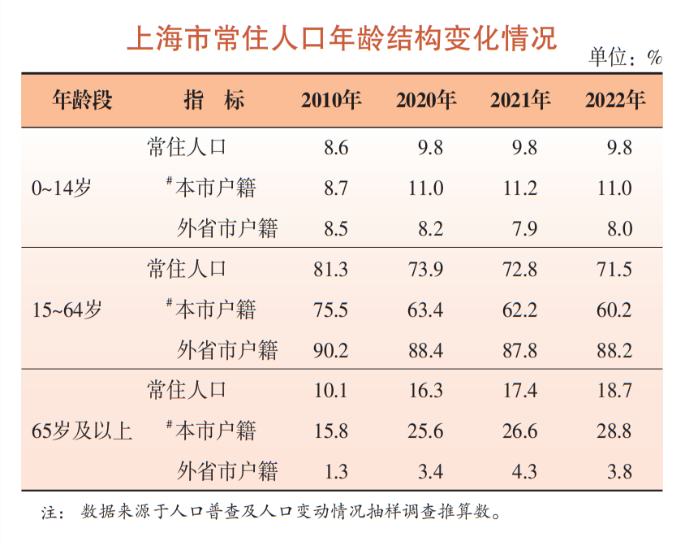
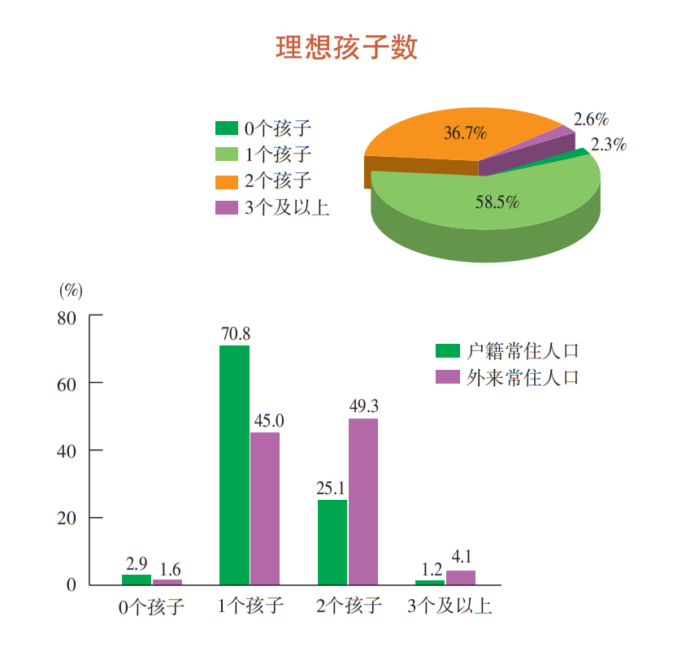
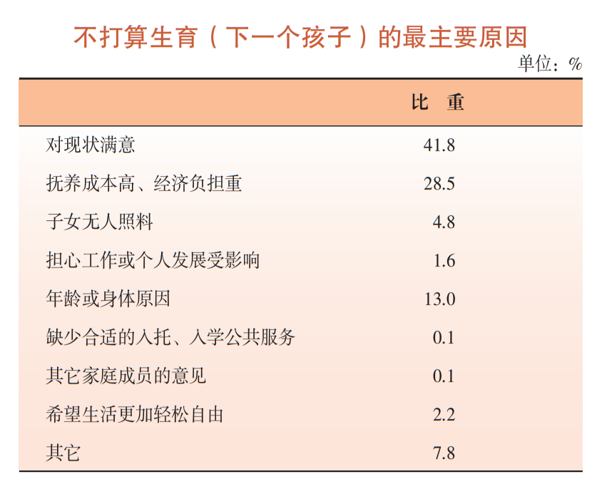

# 老龄化加剧！70.8%上海户籍常住人希望只有一个孩子

每经编辑：黄胜

据“上海统计”3月28日消息，上海去年常住人口为2475.89万人，其中，外省市户籍人口1006.26万人，在沪外省市户籍常住人口中，安徽省近五年占比均超20%，位列第一。

另外，2022年上海市60岁及以上占比25%，相比较2021年，上海市人口老龄化问题进一步加剧。从理想孩子数来看，49.3%上海外来常住人口希望有两个孩子，70.8%上海户籍常住人希望有一个孩子。

_图片来源：每日经济新闻
资料图_

外来常住人口减少了25.73万人，安徽人占比连续五年位列第一

统计显示，2021年末，上海全市常住人口为2489.43万人。其中，户籍常住人口1457.44万人，外来常住人口1031.99万人。
**对比之下，2022年上海全市常住人口减少了13.54万人；外来常住人口减少了25.73万人，户籍人口增加了12.19万人。**

图表显示，按占比排序，2022年和2021年在沪外省市户籍常住人口主要来源地分别为 **安徽、江苏、河南、四川、江西、浙江、山东。**

据澎湃新闻，上海市统计局透露，在沪外省市户籍常住人口中， **安徽省近五年占比均超20%，位列第一。**
从2018年到2022年，在沪外省市常住人口中安徽人口分别占比为28.5%、28.3%、23.2%、24.1%、23.2%。
**但从数据看，虽然安徽人口在沪占比多年居于首位，但其数量呈现下降趋势。**

老龄化进一步加剧，70.8%上海人希望有一个孩子

**统计显示，2022年，上海市60岁及以上占比25%，65岁及以上占比18.7%。相比较2021年，上海市人口老龄化问题进一步加剧。**

与此相关，统计显示，2022年上海全年常住人口出生10.8万人，出生率为4.35‰；死亡14.8万人，死亡率为5.96‰；
**常住人口自然增长率为-1.61‰；从理想孩子数来看，49.3%上海外来常住人口希望有两个孩子，70.8%上海户籍常住人希望有一个孩子。**

关于不打算生育（下一个孩子）的最主要原因，统计显示，有41.8%的人是对现状满意， **有28.5%的人则是因为抚养成本高、经济负担重。**

另外，2022年，上海全市户籍人口平均期望寿命达到83.18岁。其中，男性80.84岁，女性85.66岁。

**相比上一年，上海全市户籍人口平均期望寿命下降了0.93岁，**
根据世界卫生组织发布的《2022年世界卫生统计》报告显示，目前，全球人均预期寿命最长的国家是日本，能够达到84.3岁。

**对比之下，上海人口平均期望寿命已超过不少发达国家，接近全球最高水平。**

每日经济新闻

