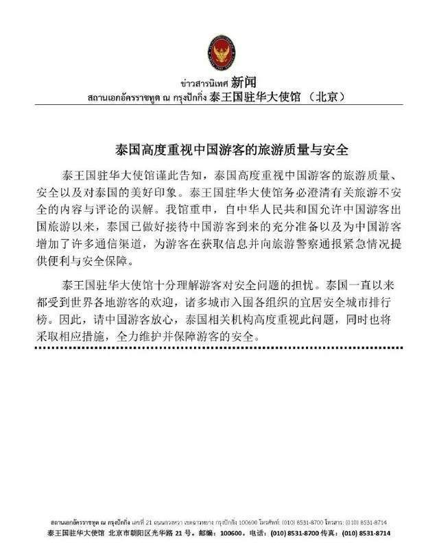

# 赴泰旅游“谣言风波”后，探访泰国“网红”餐厅

夜幕降临，曼谷一家网红餐厅里，数十个身穿整洁红衣的服务生如往常一样摆开桌椅，为即将登台的乐队布置好舞台，点亮彩灯。不一会店里已座无虚席，前来放松度周末的泰国客人和满心好奇的中国游客“平分天下”。

这家泰国餐厅正是近期被某些自媒体账号贴上“赤裸裸的陷阱”、“拐卖中国游客”、“噶腰子”等标签而被推到风口浪尖的男模餐厅。近日，参考消息记者来到了这家餐厅探访。

**一条视频引发的网络流言**

3月初，一位自媒体博主在社交媒体上发布了一段视频。该视频声称，现在去泰国旅行非常不安全，更将这家近期很火的“男模”餐厅形容为一个“赤裸裸的陷阱”——女生可能遭受意外，比如被“噶腰子”、或拐卖到其他地方，直接被当作东南亚贩卖器官等行为的“工具人”。

这段视频如多米诺骨牌般引发热议，很快各种充斥着“网红、失踪、人贩子、噶腰子”关键词视频在网络上流传开来。一些人秉着“宁可信其有，不可信其无”的想法，支持“恐泰论”，不过也有不少人主张泰国旅行并不是网上所传的样子。

面对铺天盖地的流言，泰国国家旅游局成都办事处相关工作人员回应称，关于这些网络流传的说法皆为谣言。泰国驻华大使馆也亲自下场发表声明。

泰国驻华大使馆说，“泰国高度重视中国游客的旅游质量、安全以及对泰国的美好印象。泰王国驻华大使馆务必澄清有关旅游不安全的内容与评论的误解。我馆重申，自中华人民共和国允许中国游客出国旅游以来，泰国已做好接待中国游客到来的充分准备以及为中国游客增加了许多通信渠道，为游客在获取信息并向旅游警察通报紧急情况（方面）提供便利与安全保障。”

泰国驻华大使馆还强调，“泰王国驻华大使馆十分理解游客对安全问题的担忧。泰国一直以来都受到世界各地游客的欢迎，诸多城市入围各组织的宜居安全城市排行榜。因此，请中国游客放心，泰国相关机构高度重视此问题，同时也将采取相应措施，全力维护并保障游客的安全。”

在该事件经过几天的发酵后，一些发布过相关内容的账号在视频平台被标注出账号存在争议，请谨慎甄别的提示。而被传失联的旅泰博主也陆续报了平安，账号IP大多也已回到国内。

_▲泰国驻华大使馆发表声明（@泰国驻华大使馆微博）_

**餐厅负责人笑谈“只想静观其变”**

餐厅的负责人那拉功在接受参考消息记者采访时说，由于听不懂汉语，餐厅方也是看到泰国媒体对该视频的转译为泰文的报道和一些朋友帮忙翻译后，才知道自己成了当下中国社交媒体泰国话题上的“流量密码”。

“我们只是一个正常经营的小餐厅，很难在跨国人口贩卖这等庞大的指责上澄清什么，因为根本没有那回事。我们不打算起诉，也不会发任何声明，只想静观其变，看谣言哪天不攻自破。”那拉功笑道。

他告诉记者，餐厅已经开了6年，当时泰国极少有这一类型的餐厅，自己想出了让阳光俊朗的男服务生传菜、表演歌舞等作为噱头吸引客人。“过去的几年，我们的主要客人都是泰国人。直到去年，一些在泰的中国网红博主来餐厅拍了些视频，在中国网络上被大量转发，今年中国开放出境旅游以来，餐厅马上吸引了大批中国游客，以至于许多泰国客人一桌难求，需要提早排队预定。”

那拉功说，新加坡、马来西亚、中国台湾的客人也赶上这波热潮前来，而刚恢复团队出境游的中国旅行团更是带着一车车客人来打卡拍照，让从未做过海外市场，尤其是中国市场营销的餐厅方“受宠若惊”。

近日在中国网络上高频出现的这些“男模”服务生们告诉记者，3月中旬以来，来餐厅的中国游客减少了一半，餐厅的声誉的确因近日流传的视频受损。“如果我们餐厅真像谣传那样，不可能今天还能正常营业。我们打开门做生意，大家如还有疑虑，可以亲自来吃饭看表演，体验一下餐厅的服务。来这里的中国游客都热情友好，我们一如既往欢迎中国游客。”

这家被中国网红推火，却同样被某些网红造谣的餐厅在被谣言“妖魔化”的同时，也因此吸引了一些希望一探究竟的中国游客，总体生意没有受到很大冲击。

_▲餐厅现场图片。（摄/陈家宝）_

**“用自己的眼睛去感受真实的泰国”**

抹黑该餐厅、劝退中国游客别来泰国的相关视频日前在社交媒体上已被下架。这些传播量高达数百万次的视频不仅引起泰国官方注意并发表声明澄清，还在泰国社会引发激烈讨论，一度激起网民的对立情绪。

泰国国家旅游局局长育他沙接受参考消息记者采访说，近日的这些视频的确影响了中国游客的赴泰意愿，尤其是热衷于参考网红推荐的自由行客人，大概减少了15%，但截至本周，中国游客的签证申请量已经恢复正常。

“这些博主造谣的用意何在，我们无法揣测。随着时间推移，谣言会消弭，清者自清，我们并未过多担心。在泰国，一个游客失踪都会成为大新闻，所谓‘每年失踪人口高达几十万’是无稽之谈。透过这次事件，我们很欣慰、感激，看到喜爱泰国的中国人，包括游客、媒体、各行各业就这些谣言给出公正的判断，以正视听。中泰一家亲从来都在两国人民的互信和践行中得到最直观体现。疫情数年，人员交流的恢复难能可贵，我们会更加呵护两国友好的氛围和刚刚恢复的旅游交流，继续与中国旅游部门加强合作，整顿旅游市场的不规范行为，为中国游客提供安全的环境，有质量的旅游产品和崭新的旅游体验。”他说。

据悉，今年1月至3月25日，泰国迎来不到46万中国游客，大部分为自由行旅客。与疫情前的2019年一年突破1000万人次的势头相比，仍相去甚远。

育他沙说，目前中国游客数量还在缓慢恢复中。疫情三年，泰国许多旅游设施都还未恢复，旅游用车、酒店、服务人员数量、航班等都还未恢复到疫前水平，供给方成本仍然居高不下，游客可选择性不高，导致总体价格上涨。

“两国旅游交流还有很大的恢复空间。‘泰国贵得去不了’、‘泰国旅游不安全’等信息不对称的认知盛行网上，正体现了沟通的重要性。我们希望畅通信息渠道，让两国人民有更好的沟通环境，更希望愿意了解泰国的人们亲身来体验，用自己的眼睛去感受一个真实的泰国。”他说。

_▲当地时间2023年2月13日，泰国曼谷，在素万那普国际机场，乘客们正在等待领取行李。视觉中国_

**给普通游客的几点“小贴士”**

泰国旅游企业协会主席徐纳麟告诉参考消息记者，除了航班不足，机票价格贵外，三年疫情下许多从前主要面向零元团的购物店多已倒闭，现在的中国旅行团泰国游产品里很少有这些购物点，因此报团价格恢复正常旅游产品的物价，加上通货膨胀，全球物价高涨，这都让一些将泰国视为廉价目的地的游客产生心理落差。

“至于‘噶腰子’和诈骗，邻国的确有这样的网络，也有泰国人被骗去过当地。但在泰国发生，我还从未听过。”这位出生于泰国的华裔如此说道。

他说，近期泰国的确发生了几起绑架案，但具体情节都与泰国旅游安全没有太大干系。“泰国作为‘微笑之国’从未改变，素来重视中国游客，今年终于盼得中国游客归来，‘欢迎中国亲人前来’的标语随处可见，因一些个案去否定一个国家的友善并不公平。”他建议心存担忧的游客自行组成小包团，让旅行社安排车与酒店，自行规划喜欢的行程。

徐纳麟也给出了一些建议：“坐出租车先问好计价方式，不妥则换车；晚上谨慎出行；不要去偏僻的地方，这些须注意事项在全世界旅游都适用。若泰国旅游真存在巨大的安全隐患，它就不会成为世界知名的旅游强国。”“泰国在安全上还是较有保障的，旅游秩序也是良好的。作为世界知名的旅游资源大国，还是应该可以成为中国游客出境游的优先选择之地。”他说。

采访中，记者遇到了来自上海的中国游客小茵（化名）。尽管受近期舆论的影响，小茵心中多少有些忐忑，但她还是开启了普吉海岛之旅。谈起到达泰国后的真实感受，她告诉记者，风光旖旎都是其次，最令她触动的是泰国人的友善。“小店老板会追着游客归还他们遗下的手机和钱包，司机为了能让自己看到海边最美的落日特意绕岛一圈。旅途中暖心的小瞬间足以让整个行程和日后回忆洒满阳光。”

“人与人之间的信任与善意，就像这里从不缺席的阳光一样。希望大家走出‘买买买’的商业圈，走近泰国人们，相信自己的体验，用心感受他们的民风和待客之道。”她说。

来源：参考消息

