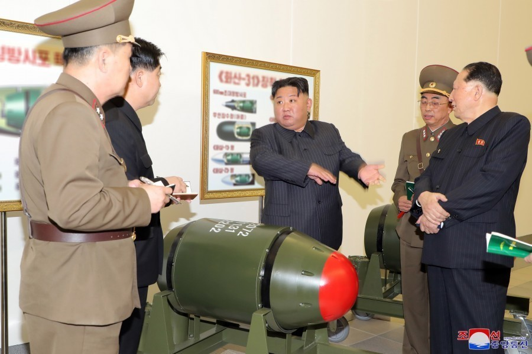
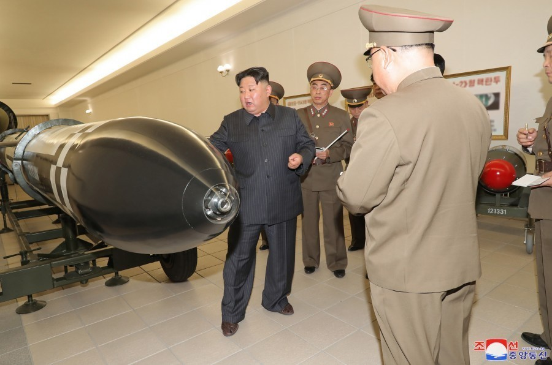
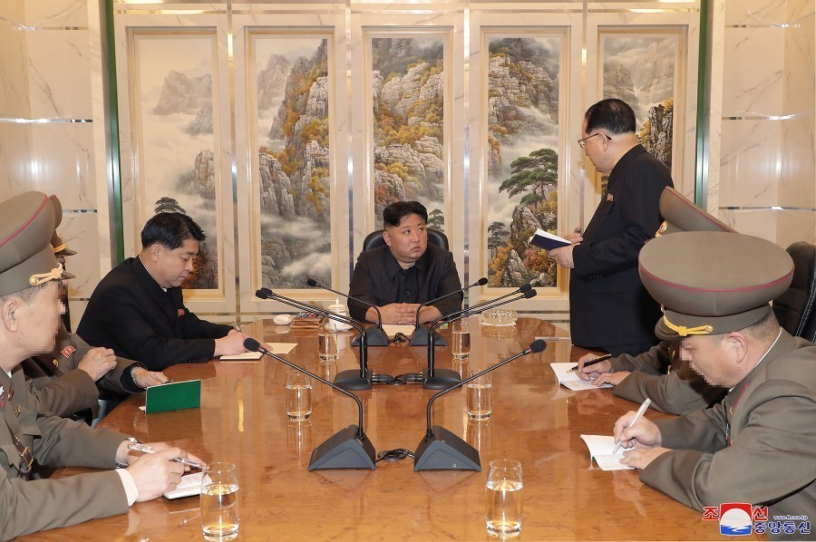
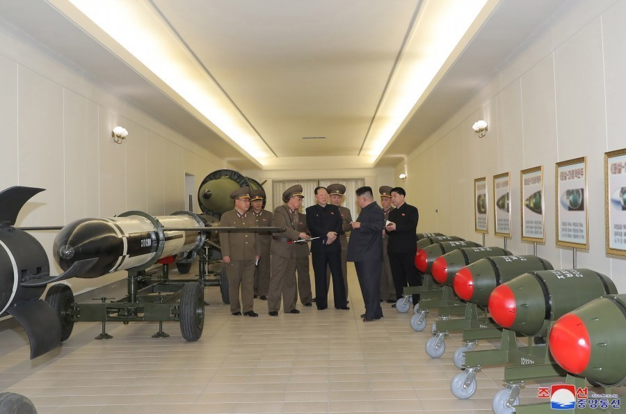
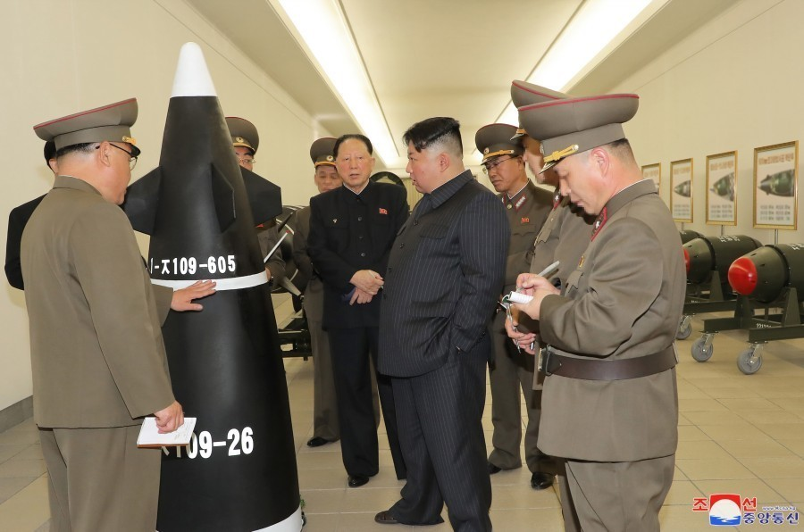

# 金正恩视察朝鲜核武研究所，审阅核反击作战计划

（观察者网讯）据朝中社3月28日报道，朝鲜劳动党总书记、国务委员长金正恩27日指导了核武器兵器化工作。朝鲜劳动党中央委员会第一副部长洪承武等党中央委员会军需工业部工作人员、核武器研究所和导弹总局工作人员参加了活动。

_金正恩身后背景板上标注为“火山-31”_

_金正恩指导核武器兵器化工作
本文图源：朝中社_

报道称，朝鲜民主主义人民共和国核武器研究所向金正恩汇报了根据朝鲜劳动党第八次代表大会和党的八届六中全会提出的核武器发展方向和战略方针，从质和量两方面加强共和国核武力的近期工作情况和生产情况。

在现场，金正恩具体了解根据核武器运用手段和作战目的以及打击对象的新型战术核武器的技术数据及结构作用特点、与各种武器系统的互换性，并详细询问了通过最近的核反击假想综合战术训练，在科学性、可靠性和安全性上已得到严格验证的国家核武器综合管理体系“核扳机”的信息化技术状况。

此外，金正恩还审阅了拟定的核反击作战计划和命令书。

金正恩表示，核武器研究所按照朝鲜劳动党党中央要求利用各种手段在多种作战空间统合运用核武器的战略构想和意图，为使朝鲜的核武力壮大成为能够应付任何核紧急情况的可靠力量竭尽努力，并取得了重大成果。

金正恩强调，朝鲜核武力拥有强大遏制力，目标对手是战争与核惨祸本身，而不是任何一个国家或特定的集体；朝鲜劳动党的核力量增强路线完全旨在维护国家的安全和地区的和平与稳定。

另据朝中社28日报道，朝鲜于25日至27日进行了水下战略武器体系试验，27日进行了导弹试射。

**本文系观察者网独家稿件，未经授权，不得转载。**

