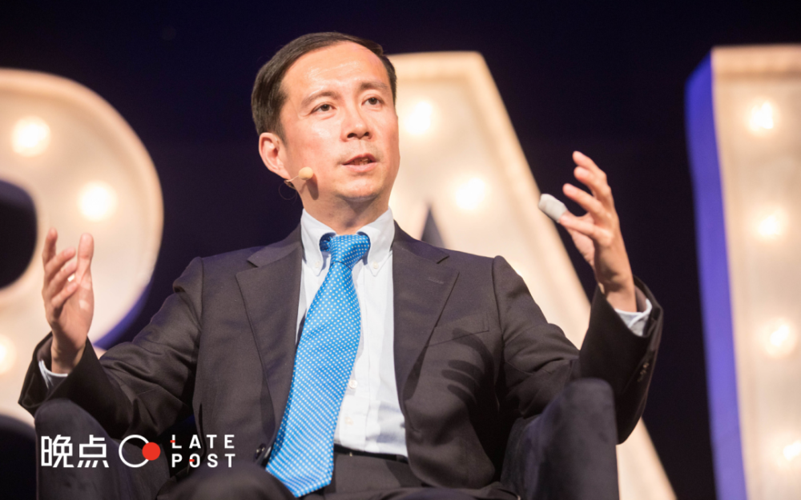

# 阿里巨变：更独立的业务，更放权的CEO

阿里集团CEO张勇将不再包揽这家公司的一切。

**文丨管艺雯 宋玮 祝颖丽**

**编辑丨黄俊杰**

3月28日，阿里创始人马云被报道出现在杭州的次日下午，阿里巴巴集团召开总裁会，宣布了大规模改组计划——阿里将设立六大业务集团，这些业务未来可以独立融资甚至上市募股。

《晚点LatePost》了解到，这是一场由阿里巴巴董事局主席兼CEO张勇启动的组织变革，马云没有出席总裁会。

调整后，阿里依然是一家上市公司，法律主体、财务主体没有变化。新成立的六大业务集团大多延续自已有的业务板块。

但调整后，各业务集团分别设立了CEO，并将成立单独的董事会。这些业务集团CEO将不再直接对张勇汇报，而是对各自的董事会汇报。

一位阿里人士称张勇花了几年时间做准备，这一次调整计划始于2023年初，“阿里24年的发展历史上前所未有，变化最大。”另一位阿里人士形容这次的调整是一场“巨变”，是翻天覆地的变化。

一位前阿里高管形容，这是化整为零，“对于一个求变的集团而言是正确的策略。”但他同样认为，这么大的变阵应该不是张勇能做决定的，“我估计要马云协助才能拍板。”

上一财年，整个阿里集团完成的成交额（GMV）为8.3万亿元。中国人网上购物总额有快一半通过它的淘宝、天猫完成。到2022年结束的时候，整个阿里集团共有239740名员工，是腾讯集团的两倍多。

这家庞大的公司同时经营着线上零售、线下商超、线上批发、物流、云计算等商业模式和团队基因完全不同的生意。

张勇接管整个阿里集团后曾设置多种机制，试图解决阿里“太大”带来的问题。

但频繁调整组织结构并不能挡住更具活力的竞争对手。根据《晚点LatePost》从分析师和相关公司内部获得的测算数据，拼多多和抖音电商2022年的GMV之和近4.5万亿元，相当于阿里国内电商业务的一半以上。

而文娱、外卖、酒旅等业务也没能在整个阿里集团的庇护下挑战行业领先的对手。同时环境也发生了变化，饿了么、盒马等业务已经不能使用淘宝庞大的用户数据。

此次调整，有可能解决阿里的组织问题，让阿里各业务集团CEO承担更多责任。

面对拼多多、抖音这样执行力更强的年轻公司，阿里各业务各自为战同样面对巨大的挑战。但在多位阿里人士看来，“相比‘合’在一起，‘分’是一个更好的选择。”

**阿里集团CEO不再管理阿里的一切**

阿里在2021年底设立了四大业务板块，并分别确定了各自的分管大总裁，当时这四人在内部被阿里员工称为“0.5层组织”，如果0层是CEO张勇，1层是事业群，那么分管大总裁就是位于其中的“0.5层”。

而这次调整后，《晚点LatePost》了解到，张勇在内部称，“0.5层将要变成真正的0层组织。”

这意味着作为阿里集团董事局主席兼CEO的张勇将不再管理阿里的一切，每个业务集团的CEO需要对各自的经营结果负总责，不再向张勇汇报，而是向各自的董事会汇报。

按照“1+6+N”的组织结构，阿里将分为三层——“1”就是一个阿里巴巴的上市公司主体、6个业务集团以及多家独立的业务公司。

调整的背景是：在外部竞争上，它的对手环伺，而阿里各方面的增速都在放缓甚至减少；在内部，阿里已经成长为多业务、多业态的超大型组织，这些业务特质不同，面临的市场环境不同、客户不同、发展阶段也不同，过去很多年，在阿里的大体系之下，多数业务处于亏损状态，靠着淘宝和天猫赚来的钱长大，如今当这些业务彻底独立，他们必须学会自力更生。

六个业务集团分别是云智能集团、淘宝天猫商业集团、本地生活集团、菜鸟集团、国际数字商业集团、大文娱集团，它们覆盖的具体业务包括：

云智能集团，由阿里巴巴集团董事长兼CEO张勇兼任CEO。主要业务包括：阿里云智能、钉钉、天猫精灵、达摩院等，营收占比8%（数据来自2022年第四自然季财报）。

淘宝天猫商业集团，戴珊（花名：苏荃）任CEO。主要业务包括国内电商业务大淘宝（淘宝、天猫、阿里妈妈）、B2C零售事业群、社区团购业务淘菜菜、淘特和国内贸易（CBU）等，营收占比69%。

本地生活集团，俞永福担任CEO。主营业务包括高德、飞猪、饿了么，营收占比5%。

菜鸟集团，万霖担任CEO。营收占比7%。

国际数字商业集团，蒋凡任CEO。主要业务包括东南亚电商平台Lazada、帮助商家在海外卖货的全球速卖通（AliExpress）、国际贸易（ICBU）等，营收占比8%。

大文娱集团，樊路远（花名：木华黎）任CEO。营收占比3%。

除去这六个集团，阿里集团还有多家独立的业务公司。包括盒马、平头哥、阿里健康、大润发、银泰、瓴羊等。其中盒马已经在筹备独立上市。

不是每个集团都一定能离开阿里独立生存。比如阿里集团财报将天猫的88VIP列为大文娱业务付费用户增长的主要动力之一。在集团支持下，该业务去年四季度的收入依然在下滑6%、亏损10亿元。

《晚点LatePost》了解到，在独立的六大业务集团和业务公司各自的董事会中，张勇可能会加入到部分董事会中，但目前这些集团和公司的董事会人选暂未确定。

张勇在过去几年已经退出滴滴、微博等被阿里投资的公司的董事会。他也不在列大润发和阿里健康的董事会——它们都是阿里控股的独立上市公司。

阿里健康董事会名单（不包括独立董事）

朱顺炎，董事会主席、执行董事。阿里健康CEO。

屠燕武，执行董事。阿里健康CFO。

沈涤凡，执行董事。阿里健康COO。

李发光，非执行董事。阿里集团资深财务总监。

大润发董事会名单（不包括独立董事）

黄明端，董事会主席、非执行董事；原大润发CEO。

林小海，执行董事。大润发CEO。

韩鎏，非执行董事。阿里集团同城零售副总裁。

刘鹏，非执行董事。阿里集团副总裁，B2C零售事业群总裁。

目前尚不清楚，在未来成立的阿里各业务的董事会里，张勇是否会有任职。

和张勇一样，不再负责阿里一切的还有这家公司的中后台职能部门。

2015年张勇设立“大中台、小前台”战略，希望建设统一的技术架构、产品支撑体系、安全体系、服务体系来支撑阿里多种多样的业务，希望提高前台业务的效率。6年后，张勇在内部直言阿里的业务发展太慢，中台要变薄。

现在，阿里的中后台职能部门将全面做轻做薄，这些职能部门将按照具体业务特点，进入对应的业务集团和独立业务公司，而涉及到它们共同需要的中后台职能，这些职能部门将以专业服务公司的模式来提供服务。

张勇今天在公司内部向员工们表示，过去阿里的很多核心能力都是基于中台战略，但今天，组织需要加速、决策需要加速、市场响应需要加速，为了让业务跑得更快，“过去的生产关系需要转换，大家的心态要有所变化，真正为自己的业务而战。”

**张勇的探索，阿里治理结构的变迁**

2015年5月，马云将阿里集团CEO一职交给张勇，四年后他又卸任董事局主席一职。此后，张勇亲力亲为，不只是管理阿里主业，他曾每月飞去东南亚开两天会，指挥Lazada的具体业务；也曾每周听取盒马汇报，关心只有几十家门店的社区团购试验业务盒马邻里有何进展；他还曾直接去饿了么上海总部开会，在饿了么，曾经专门有一间张勇的办公室。

马云曾说，阿里就算做到102岁，也不应该超过5万员工。他卸任CEO时，阿里只有不到4万人，只有三大核心业务（B2B、淘宝、菜鸟）。

之后8年，阿里的员工人数翻了6倍，年收入翻了11倍。此间，阿里先后收购了优酷、高鑫零售（大润发）、饿了么等业务，变得大而复杂。而大，本身就是一个问题。

张勇很多年都是中国互联网最繁忙的CEO，很长时间内，一度有30多人向他直接汇报。

“像阿里这种又大、竞争对手林立、创始人又不在一线的公司，确实面临着一个非常大的治理难题。”一位阿里管理层称。

张勇试图探索更有效的治理方法。2015年开始，他的探索主题是“大中台、小前台”，出发点是解决公司大而低效的问题。他说，“希望不是重复造低级别的轮子，而是更高效地、造出更多不同的轮子来。”

在“大中台、小前台”的基础上，2017年-2019年间，张勇引入委员会这一组织以加强治理。在这三年，阿里越来越走向“一个阿里”。到2019年，阿里又设立了一个13人的经济体发展执行委员会，以阿里CEO张勇为首、蚂蚁集团董事长兼CEO井贤栋为其副手，共13人，下设五委四办，五委四办横穿、纵穿整个阿里和蚂蚁集团。

该委员会在当时一度被视为阿里在业务层面的组织最高机构，重点在于业务的顶层设计，目的是统一阿里和蚂蚁的战略，实现“统一指挥、统一发展、统一对敌”。尽管蚂蚁早在2011年已经和阿里拆分。

但委员会本质是一种跨部门跨事业群的协作沟通单位，并没有对权责清晰划分。在多位阿里员工的感知里，这一声势浩大的发展执行委员会并没有实际发生作用。依然是“逍遥子和他的总裁办”在做业务决策。

随着阿里和蚂蚁逐步切割，2020年起，13人的经济体发展执行委员会已停止运作。

在此前后，张勇在内部就“大一统”导致的低效和组织僵化进行密集反思，随之而来的是将中台变薄。2021年7月，阿里的“百年阿里合伙人面对面”现场，张勇称，中台太厚的话，前台很难独立发展、快速跑起来。

2021年起，阿里进入了新阶段——“多元化治理结构下的经营责任制”开始推行。张勇在内部多个场合表示，让各业务负责人自己算好账。他在去年初的CTO线管理大会称，“把大锅饭的锅变小，每个人一口锅，清清楚楚。锅里就这点米，就这点水，就煮出来这点饭。”

他认为推行经营责任制的作用是让业务在经营和资源上更好闭环，本质是“让参与业务的各方能更好取舍”。

变革是业务需要，也是环境需要。同年，阿里因不正当竞争被政府处罚182亿元。张勇公开表示，“我更坚定了应该全方位改革——改革我们的业务，改革我们的组织，改革我们的机制。”

此后，张勇试图持续放权，2021年12月，张勇在他和近20位事业群总裁之间，增加了4个分管大总裁——戴珊、张建锋、俞永福和蒋凡，由他们分别负责阿里的四大业务板块（中国数字商业、云与科技、生活服务和海外数字商业）。

这一全新的组织结构确实发挥出了作用，让各业务板块的权力、责任更明确。同时，各个大总裁对经营全局负责，因地制宜独立制定不同的业务策略，应对竞争。

但这还算不上是真正意义上的分权。比如，总预算怎么花，总裁们可以自己定。但总预算是多少，还是要集团批。一位阿里的高管说，很多重大业务决策还是由张勇决定，“CEO拍板，总裁会更多是传达、同步”。

用张勇自己的话说，“分管大总裁，是代表我和集团在授权范围内分管一部分业务。”

从2015年至今，对于阿里这样一家拥有复杂业务的集团如何有效治理，作为CEO的张勇一直在探索解决方案，他的确解决了一部分问题，但又没有解决真正的问题。

“阿里过去没有真正的分，也没有真正的合。”上述阿里人士称。

阿里集团有合伙人制度，允许创始团队任命公司董事会多数席位的权力，进而也可以决定公司高管的任命。马云与蔡崇信，是29名阿里合伙人中唯二的永久合伙人。

但马云在把阿里交棒给张勇之后，他在具体业务层面，是“真正放手”。

现在也到了张勇作为管理者，在业务上真正放手的时刻。

相关阅读：

深入解读：阿里24年来最重要的组织变革

张勇内网解读阿里变革，“条件成熟一个，上市一个”

张勇启动阿里组织变革：设立六大业务集团，全面独立经营

