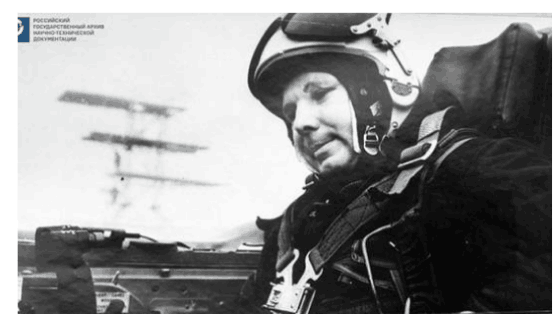
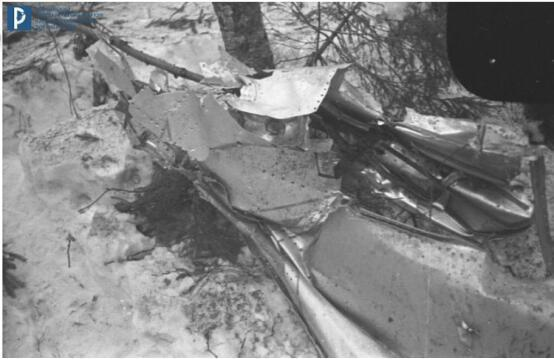
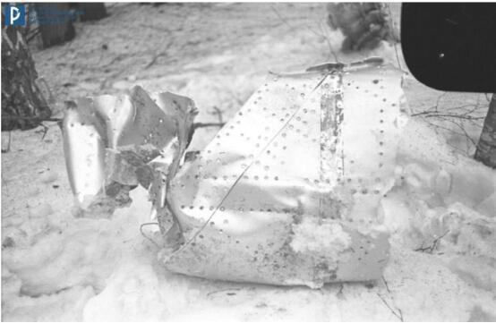
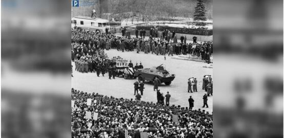

# 首批图片曝光！俄公布“人类进入太空第一人”加加林坠机事故现场

【环球网报道 记者
张晓雅】据“今日俄罗斯”（RT）报道，俄罗斯国家档案馆当地时间3月27日公布了全球首位绕地球飞行的苏联宇航员尤里•加加林遇难地点首批照片。

_图为加加林在米格-15喷气式战机的驾驶舱内
图自俄罗斯国家档案馆_

加加林于1961年乘“东方１号”飞船进入太空，绕地球飞行一圈后返回地面，是人类进入太空的第一人。1968年3月27日，加加林因一架双座喷气式飞机坠毁而罹难，留下妻子和两个年幼的女儿。为纪念加加林首次进入太空的壮举，俄罗斯把每年的4月12日定为宇航节，在这一天举行隆重的纪念活动。

RT称，那次坠机事故的官方原因从未正式宣布，也因此导致了各种各样的猜测，包括操作失误或与气象气球相撞，甚至是遭遇“不明飞行物”（UFO）。而俄方调查委员会在事故发生的第二天拍摄的现场照片此前从未曝光过，照片显示，坠机现场碎片散落，但这些照片几乎没能为这场悲剧提供更多线索。↓

_坠机事故现场图 图自俄罗斯国家档案馆_

报道说，新公布的照片还包括加加林葬礼上的一张照片。这位苏联宇航员和他的副驾驶都被葬在莫斯科标志性的地标红场。↓

_加加林葬礼相关照片
图自俄罗斯国家档案馆_

