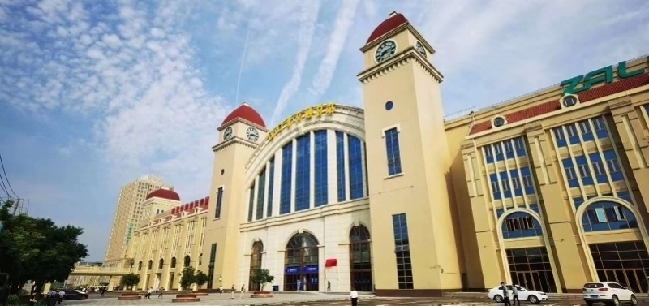
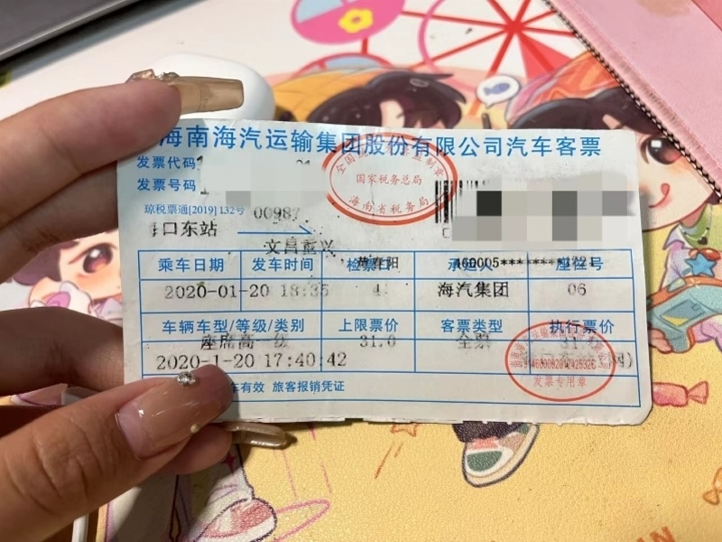
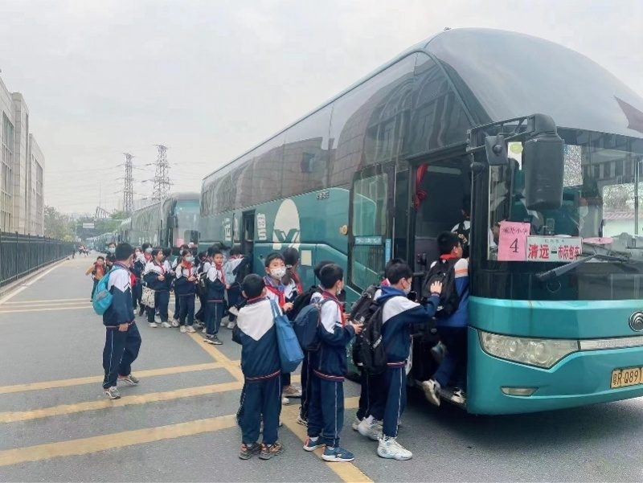

# “关停潮”里的客运站：市场多重冲击之下，各地探索转型求生

近期，承载着许多海南人记忆、运营超过30年的海口汽车东站计划关停的通告，引发不少人关注。位于武汉的汉口北客运中心也一度传出即将关停的消息，虽然截至目前没有关停，但经营情况不佳的问题仍然存在。在此前，安徽、四川、广东等多地已陆续关停多家汽车客运站。仍在运营的客运站，也有不少缩小了规模。

近年来，随着全国各地陆续传出汽车客运站关停的消息，人们在怀念曾经记忆的同时，也开始关注背后的经营困境与市场需求变化。高铁、网约车、私家车等多样化的出行方式，以及人们对出行时效性、便利性提出的更高需求，正对客运站运营模式带来巨大冲击。

“关停潮”背景下，客运站未来的出路在哪？虽然规模缩小，但仍然存在的用户需求如何满足？南都、N视频记者多方采访了解到，有客运站运营方已先行一步做出探索。有企业拓展站外服务，通过进校园、进厂区、进社区、进企业、进旅游景点的“五进”策略，开展定制专线业务，为乘客提供更优质的服务。也有企业下沉乡镇村，与快递企业共享运力，开展“客货邮”业务，在保障山区居民出行需求的同时，实现县内公交和“镇通村”农村客运效益最大化。

**关停**

今年2月22日，海口市交通运输和港航管理局发布《关于征求关停海口汽车东站、调整客运线路始发站点意见的通告》（下称《通告》）称，海口海汽运输有限公司申请拟于2023年4月份关停海口汽车东站，并将海口汽车东站始发的客运线路调整至海口省际总站（汽车西站）发班运营。

公开资料显示，海口汽车东站于1992年投入使用，多年来，发班车辆主要覆盖海南东线的多个市县及乡镇，正在营运海口-文昌（快车）、海口-琼海长坡、海口-
三亚、海口-定安（快车）、海口-万宁新中、海口-黄竹（快车）等20多条线路。

南都记者注意到，在“海口市12345政务服务便民热线”网站上，近期出现不少希望海口汽车东站不要关停的诉求。就上述《通告》的意见征求阶段已于3月24日结束。27日，海口汽车东站工作人员告诉南都记者，该站仍在正常运营，也确实收到即将关停的消息，但尚未收到具体关停时间的通知。同日，海南海汽运输集团股份有限公司相关负责人向南都记者表示，海口汽车东站预计会在未来一两个月内正式关停，具体日期有待进一步通告。

远在中部地区的武汉，也一度传出汉口北客运中心即将关停的消息。有信息显示，当地交通运输部门发布公告称，根据经营单位的申请，汉口北客运中心将于今年3月15日起终止经营。

_汉口北客运中心。（图片来自湖北公路客运集团股份有限公司）_

不过，就在3月14日，湖北红安县客运总站发布消息称，“为了更好地方便旅客出行，优化汉口北经商环境，汉口北客运站前期计划于2023年3月15日关停营业，现取消关停计划正常运营”。27日，汉口北客运中心工作人员告诉南都记者，目前该中心仍在运营，“暂时还没有关”，但运营时间相较以前缩短。南都记者查询发现，客运售票平台上也还在出售从该中心出发的班次车票。

红安县客运总站工作人员告诉南都记者，汉口北客运中心下午提前结束运营，每天15时后，回红安的客车不再进站，而到站前广场发流水班。

据湖北公路客运集团股份有限公司介绍，汉口北客运中心建筑面积约13.6万平方米，位于武汉黄陂汉口北专业市场群东北角，出行方向主要集中在武汉周边及省内中短途线路——新洲、黄冈、红安、浠水、团风、麻城等地。黄陂区人民政府官网介绍，按照设计该中心日均发送旅客3万人次，最高峰可达6万人次，客运班线覆盖17个省和直辖市。

2020年5月31日，汉口北客运中心正式运营。一个月后，武汉新荣客运站宣布关停，6月30日，该站发出最后一班车，其在营的26条班线、105个班次整体调整至汉口北客运中心。

南都记者注意到，在此前，安徽、四川、广东等多地已陆续关停多家汽车客运站。而仍在运营的客运站，也有不少缩小了规模。

**曾经**

随着海口汽车东站将要关停的消息传出，当地不少居民表达了不舍。南都记者注意到，有网友在社交平台与其“告别”，称海口汽车东站曾陪伴他们度过读书、毕业、工作、爱情的时光，见证了几代人的故事。一位海南网友表示，“在海口汽车东站长大，见过它的繁华也看到了它的衰落。曾经那么拥挤热闹的车站终是湮没在时代发展的潮水中，回忆里依稀还能听到广播站播报即将出发的班次。”

来自海南省屯昌县的白先生向南都记者回忆，2015年至2022年，他经常从约80公里外的老家坐大巴到海口上学，也会从海口汽车东站坐车返程。7年的时间里，一张海口汽车东站到屯昌的车票只要28元，这里已经成为他青春的一部分。

_有乘客晒出曾经的车票纪念海口汽车东站。_

“以前等车的时候客运站都没位置坐，后来等车的人慢慢变少了，2020年上半年开始旅客数量明显大不如前。”
白先生说，随着拼车出现，他也慢慢习惯花50元打车回家。对于海口汽车东站的关停，他感觉“既是无奈也是一种必然”。

也有人向南都记者反映，海口汽车东站关停给他们的出行带来不便。居住在海南文昌的王小姐表示，她的孩子在海口上学，每周末都从海口汽车东站坐车返回文昌的家，既方便又实惠。“如果让孩子到海口汽车西站乘车，距离将会远很多”。

吴磊在清远市新城汽车客运站从事大巴车驾驶员多年，在他的回忆里，曾经的客运站非常热闹。他告诉南都记者，“以前线路非常多，到广州有好多条客运班线，我以前跑过广州花都、番禺、海珠的班线。”

“我们客运站16个客车卡位都是满的。春节、清明、国庆等节假日，基本上当时的售票窗口都有18到20个。”那时候，吴磊常常从清远到花都，一天跑三个来回，乘客多的时候，有时还要增加一个来回。

跑6时30分最早班线的时候，吴磊都会在5时50分之前到达客运站，到调度室报到、接受调度员的问询告知，然后测量血压、做是否饮酒测试以及其他的运营准备工作。

在他一大早到达客运站时，通常已经有不少乘客在此等候了。他的乘客以前多半都是在广清两地之间通行的，有的是在清远居住，在广州工作的上班族，他们通过客运班车通勤；有的是去广州的医院看病的病人；周五周日和节假日，在广州上学的学生就更为集中。

“说实话也是挺有感触的，大家都挺不容易的，那么早去广州工作、看病、上学，各有各的辛酸。”吴磊感慨地说，大客车驾驶员这个岗位，让他看到了人生百态，而客运班车起到了交通运输行业的保底功能，让有需要的乘客能够有最基础的交通工具可以选择。

“虽然如今客运站的经营面积比以前大大缩小了，但学生、老人以及对出差消费标准有限制的公务出行群体，仍有不少选择客运班车，我们从清远到广州的单程票价基本在40元左右。”吴磊说。

**冲击**

当前，客运站面临来自多方面的冲击，关停或缩小规模都是运营方在市场影响下所做的生存考量。

海南海汽运输集团股份有限公司相关负责人告诉南都记者，目前海口汽车东站进站乘车的旅客急剧减少，运营长期处于亏损状态，是公司决定关停客运站的主要原因。“东站关停，其实我们也很遗憾，如今交通越来越便利，旅客出行方式也变得多样，如长途选择高铁、短途选择网约车等，大家也看到东站门前大量的网约车，旅客乘坐客运班车的数量确实在急剧减少，所以我们也要适应时代的发展。”

汉口北客运中心虽未关停，也面临运营困境。武汉市交通运输局方面向南都记者透露，近年来汉口北客运中心“没有什么客人，经营情况不是蛮好”。

汉口北客运中心毗邻汉口北国际商品交易中心，后者设有服装城等十大专业批发市场，被称为“新汉正街”。在该中心品牌服装城经营的商户告诉南都记者，来自湖北孝感、仙桃的客商到其店里进货，“只要能坐高铁的，都不会去坐长途汽车。”此外，近年来服装批发生意也在转型，线下“打货”逐渐转到线上选款交易，很多客商不用再过来。

家在红安县的胡先生告诉南都记者，其女儿在武汉市洪山区读书，经常往返两地。新荣客运站关停前，女儿习惯搭乘客车到该站再去学校，“那里离市中心没多远，以前新荣客运站生意还挺好”。班车被调整至汉口北客运中心后，女儿坐客车的次数越来越少。

“从红安坐客车到车站，再转车到洪山，半天都到不了学校。”胡先生称，汉口北客运中心距离武汉市中心较远，从外地搭乘客车到武汉的旅客，前往市中心还要费时乘车兜转，“太不方便了”。从2021年起，其女儿开始搭乘顺风车往返两地。

“以前基本是我们打开门，乘客自己来坐车。”清远市粤运汽车运输有限公司经营多个汽车客运站，包括吴磊所在的新城客运站。高铁、轻轨的开通，对客运站经营带来很大冲击。该公司党委副书记罗跟梅告诉南都记者，公司以前经营从清远到深圳和珠海的班线较多，客流量也较大。高铁和轻轨开通以后，深圳、珠海班线班次减少了。

与此同时，随着网约车服务和私家车逐渐普及，道路客运站对站运输服务模式的弊端也显现出来。罗跟梅介绍，根据以前“车进站、人归点”的班线客运规定，线路只能是客运站到客运站。“现在人们生活水平提高了，对出行服务的要求更高，对价格的敏感度降低，网约车点到点、门对门的服务模式更加便捷。”

在这样的背景下，罗跟梅所在公司在清远经营的客运站减少了三个，其中英德旧站、寨岗、连南的三个客运站变更为“招呼站”营运，相应功能也缩减，仅提供途经班线的配客功能。

另一边，在广东梅州的大埔粤运汽车运输有限公司总经理陈东，也深刻体会到了大埔汽车客运站由旺到淡的巨大变化。他告诉南都记者，在2010年以前，山区居民前往珠三角，都是通过到客运站乘车。现在，人们出行的选择变多，客运站的客流量也逐渐减少。“从2010年开始客运站的功能在慢慢弱化。”如今，客运站的实际经营面积已经大大缩小。

**转型**

市场冲击下的客运站出路在哪？虽然规模缩小，但仍然存在的用户需求如何满足？

广东工业大学土木与交通工程学院副教授王小霞向南都记者指出，时代的变迁，人们出行需求的改变，以及运输市场竞争加剧，对客运站的转型升级提出一些新要求，包括提供如约服务，满足乘客出行的多样性、时效性、舒适性、安全性、便利性等。“除此之外，虽然有的客运站关停了，还是可以用来改善城市公共交通服务，比如可以作为如约巴士的集散站点。”

南都记者注意到，有客运站运营方已先行一步做出探索。

每个工作日的早上6点半，家住清远美林湖的叶先生都会在家楼下乘坐楼巴，并在8点前到达位于广州越秀区的公司上班，下午下班后再乘坐楼巴回家。单程票价只需15元，如果购买月票、套票之类的，单程票价能降到9元。有时候需要加班，还可以在小区业主群向物业管理员反馈，请对方向运输公司申请增加或延迟班车。

“我们对客运站就没那么依赖，因为去客运站太远了。其实客运需求一直都在，现在只是服务方式改变了一下，我看这些班车基本都有很多人坐。”叶先生说。

罗跟梅告诉南都记者，公司很早就意识到了客运站在经营上面临的困境，早在2017年就开始寻求改变和转型。“我们的经营人员会主动出击，去了解市场需求，去调查评估进而开发新的业务。”例如，2018年，该公司进驻美林湖，开通往返广州和深圳的5条专线，服务人们上班通勤；2019年开通清远往返广州大学城的班线，2021年开通清远往返华南农业大学、华南理工大学五山校区的班线，方便学生群体出行。

_清远市粤运汽车运输有限公司开展定制专线服务。_

“我们现在主要是拓展站外服务，通过进校园、进厂区、进社区、进企业、进旅游景点的‘五进’策略，开展定制专线业务，为乘客提供更优质的服务。”罗跟梅介绍，在推出丰富定制专线的同时，公司也持续推进对连南、连山、连州、阳山、清新等交通不便利的地区，提供“镇到村”农村客运服务，保障山区居民安全出行。

陈东经营的大埔汽车客运站也把目光锁定山区内部，将客运服务下沉到乡镇村。他介绍，通过公交服务连通县城到乡镇，再由“镇通村”客运班线连通基层乡村，为山区居民出行做好托底保障。

大埔汽车客运站空余出来的场地，则引入快递公司、车辆检测站等。陈东告诉南都记者，这样一方面能为公司增加场地租赁收入，另一方面也有助于公司未来的发展。目前，陈东所在的公司正与“三通一达”和邮政快递合作开展“客货邮”业务，即通过运输网络、运力资源共享，利用县内公交和“镇通村”农村客运车辆，与快递协会合作，开展“物流到村”的配送业务，将快递中转至各镇村，不仅有利于解决农村居民收、发物流快件难的问题，也实现了县内公交和“镇通村”农村客运效益最大化。

海南海汽运输集团股份有限公司相关负责人也表示，关停海口汽车东站后，下一步将考虑在东站附近设置简易客运驿站，这些驿站可能采用“定制化”模式运营，即采用预约制，乘客提前预约后到驿站乘坐，车辆只限商务车。“目前这个方案已提交上级审批，但最终的方案还需要时间。无论如何，我们也并非一关了之，后期也会根据民众的意见不断作出优化调整。”

出品：南都即时

采写：南都记者 陈燕余毅菁 张林菲实习生 陈宇龙付冰洁唐秀雅

