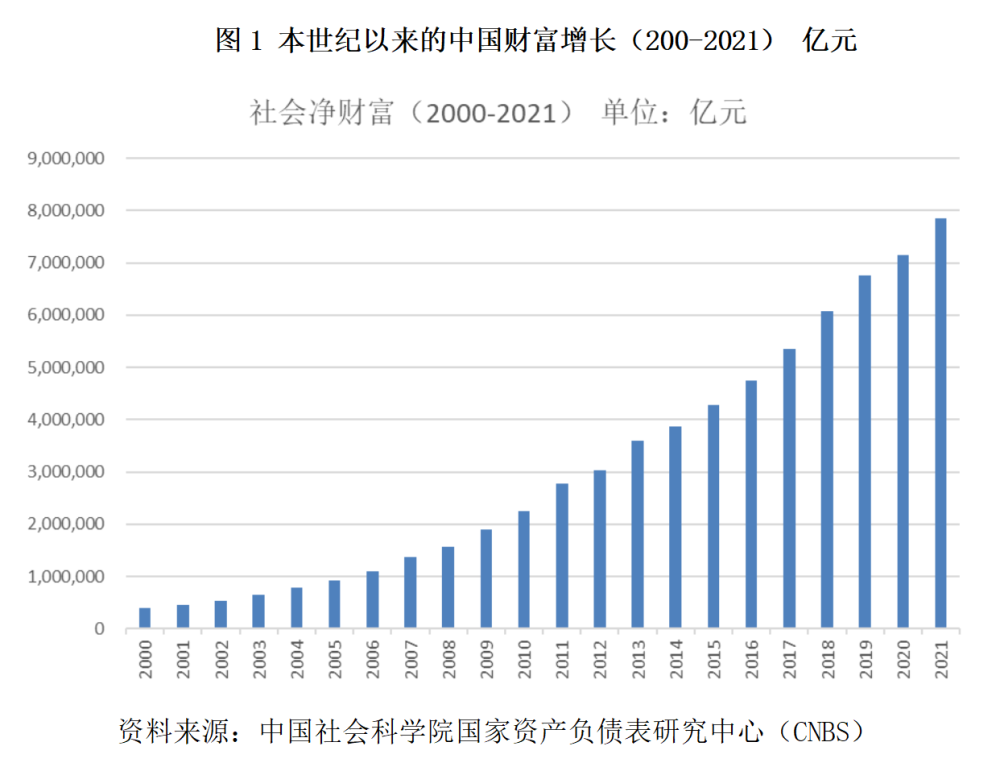
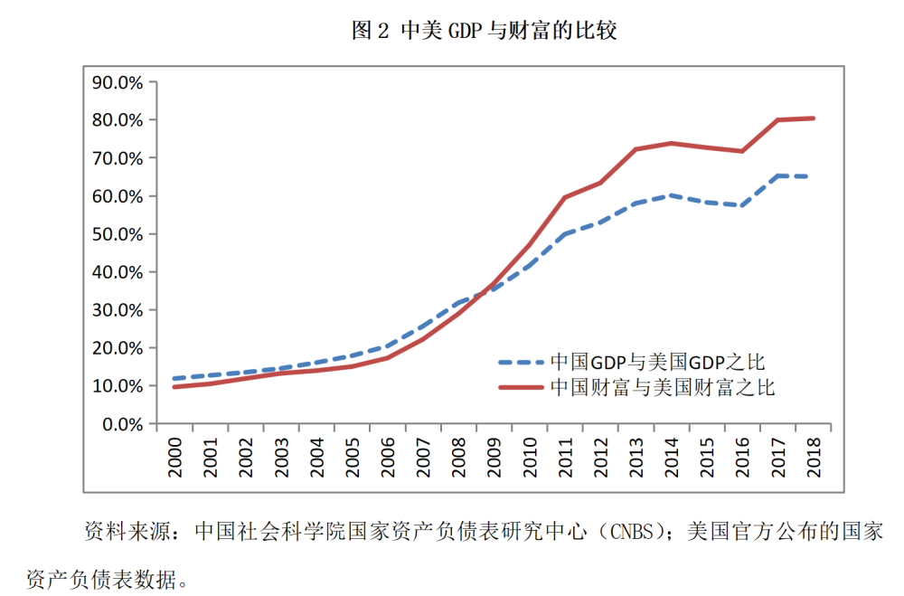
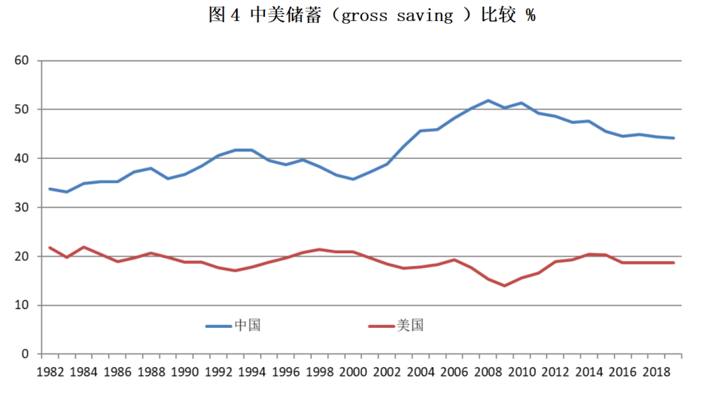
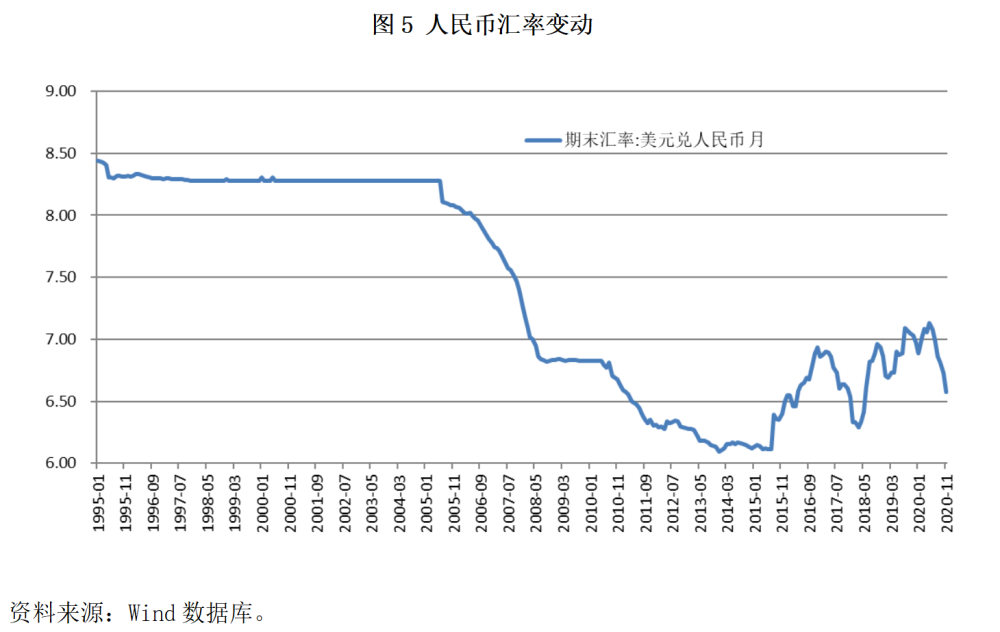
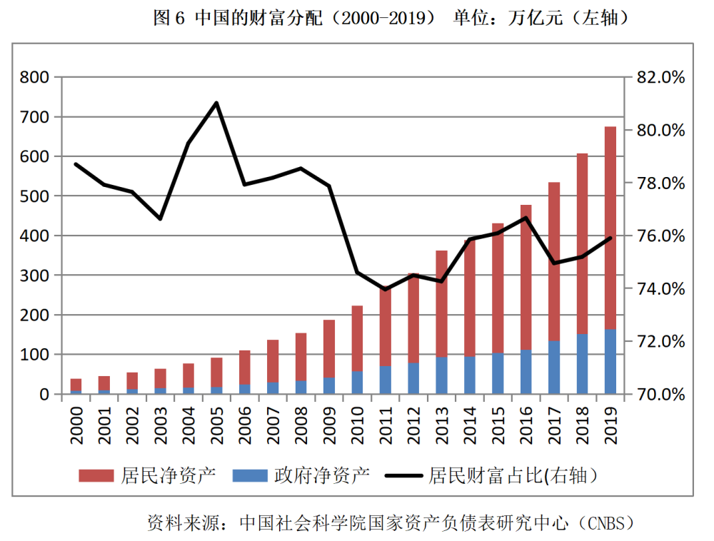
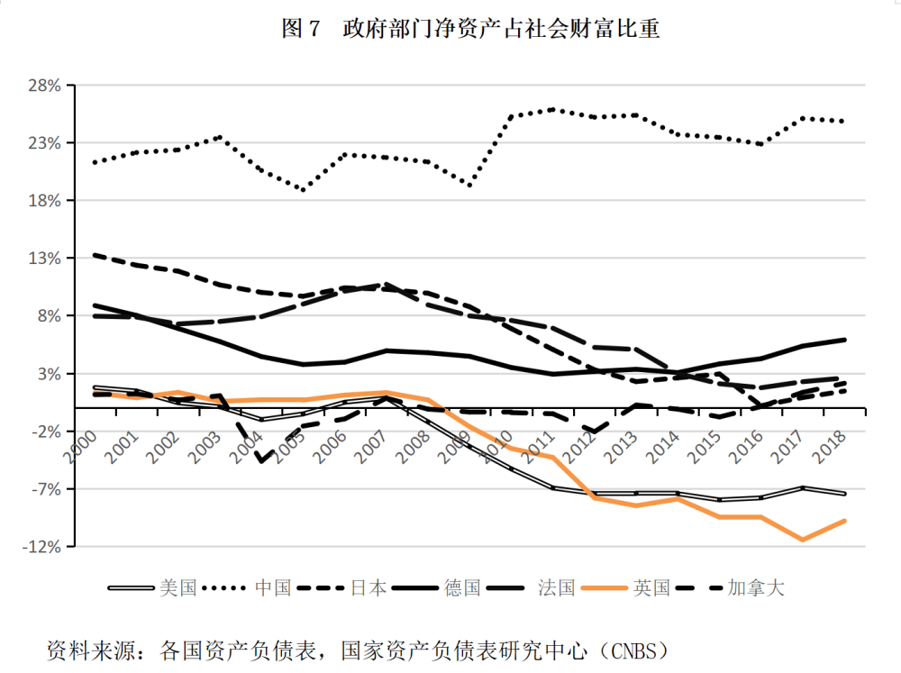
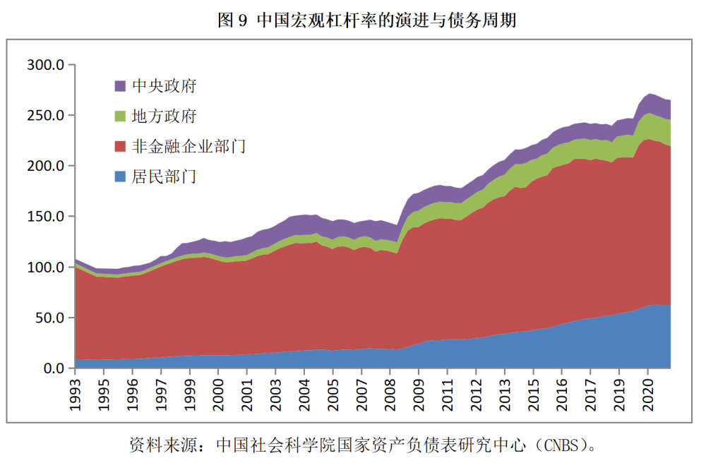
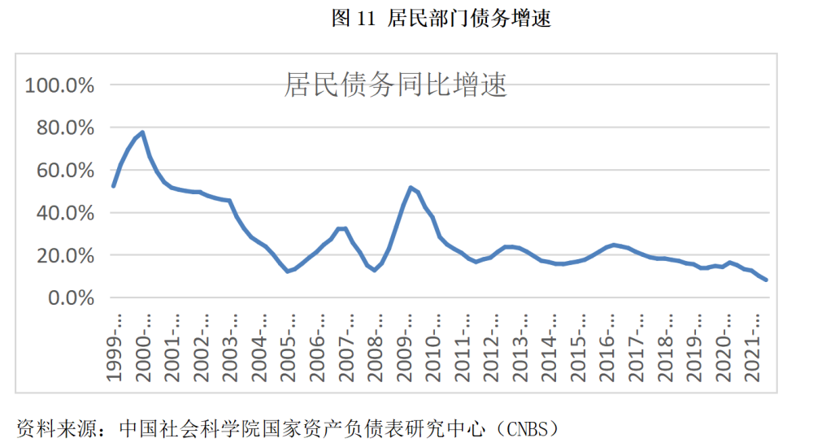
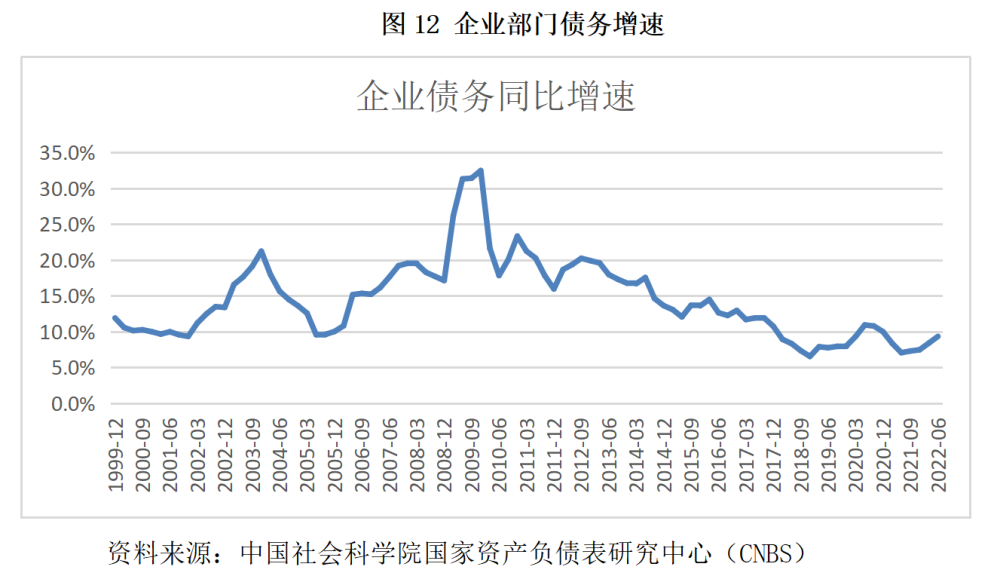

# 中国国家财富已超美国？张晓晶：审慎看待，从人均角度看占美国比重不到20％

**划重点：**

  * _1_ 二战以来，还没有任何一个国家的财富存量如此接近美国
  * _2_ 中国房地产价值占国民财富比重约40%多，房价不会一路下跌
  * _3_ 对超额利润征重税不妥，会大大削弱民营资本的创新激励

**长安讲坛总第393期演讲专家｜张晓晶，论坛成员、中国社会科学院金融研究所所长、研究员**

**编者按：**

中国经济50人论坛成员张晓晶，现任中国社会科学院金融研究所所长、研究员；国家金融与发展实验室主任；中国社会科学院研究生院教授、博士生导师；入选国家“万人计划”哲学社会科学领军人才，文化名家暨“四个一批”人才，享受国务院特殊津贴。张晓晶教授领衔编制并定期发布了中国国家资产负债表，长期跟踪研究宏观经济形势。他曾获第十一届、第十二届“孙冶方经济科学奖”、首届“孙冶方金融创新奖”、第五届“中国软科学奖”以及第六届“张培刚发展经济学奖”。

在第393期长安讲坛，张晓晶做了一场主题为“资产负债表视角下的中国发展：潜力与挑战”的演讲。他梳理了国家财富和资产负债表这个“大账本”，又进行长时段的国际比较，以此揭示财富结构变化的一些规律。

据统计，2019年，我国675.5万亿的社会净财富中，居民部门财富为512.6万亿，占比76%；政府部门财富为162.8万亿，占比24%。

在张晓晶看来，在各部门（主要是私人部门）债务增速大幅趋缓之际，防止资产负债表“躺平”甚至衰退、稳住经济大盘则成了当务之急。

他建议，现在政府部门的杠杆率不到50%，即便加上隐性杠杆（即地方隐性债务），仍有比较大的空间。因此就政府部门资产负债表而言，可以更加积极有为，同时要注意部分居民资产负债表出现收缩的现象，以及企业部门资产负债表的衰退风险。

「“长安讲坛”是中国经济50人论坛创办的经济政策讲坛。2021年-2023年，长安讲坛独家与腾讯合作。腾讯新闻将就该系列讲坛提供独家报道，敬请关注。」

更多精彩内容，请查看张晓晶演讲实录：

**资产负债表视角下的中国发展：潜力与挑战**

**张晓晶**

今天讨论一个很重要的主题：国家资产负债表。记得上次长安讲坛也涉及到类似主题，但今天的角度不一样，数据也有了进一步的更新。最近发生很多事情，包括疫情冲击，俄乌冲突等，这些都需要耗费大量财力来应对。因此，看一看国家资产负债表这个“大账本”就显得非常有必要了。

一、财富何以如此重要

习近平总书记在总结党的百年重大成就时指出，新时代的一个伟大成就，就是“为实现中华民族伟大复兴提供了更为完善的制度保证、更为坚实的物质基础、更为主动的精神力量”。这里“坚实的物质基础”，用财富积累来衡量最为贴切。

**财富估算作为国家治理之必要构成早已有之。这一方面是出于税收的需要，另一方面，则是国力比较与国际竞争（甚至战争）的需要。**
约350年前，英国古典经济学家威廉·配第以“政治算术”敬献国王，其初衷乃基于英、法、荷兰的财富比较，为英国争夺海外市场和殖民地树立信心。正如马克思在《政治经济学批判》中指出的：“当荷兰作为一个贸易国家还占着优势地位，而法国似乎要变成一个称霸于世的贸易强国的时候，他在《政治算术》的一章中就证明英国负有征服世界市场的使命”。

国际关系理论专家米尔斯海默在《大国政治的悲剧》中强调了财富与权力的关系：财富很重要，因为如果一国没有金钱和技术来准备训练并不断使其战斗部队现代化，它就不可能建立强大的军事力量，而且，发动大国战争的代价非常巨大。美国在1941-1945年抗击轴心国就耗费了约3,060亿美元，这一数字是其1940年国民生产总值的三倍。因此，国际体系中的大国总是处在世界最富裕的国家之列。滑铁卢战争后的100年间，法国和德国的相对财富变化很大程度上解释了它们之间军事权力的转移。

长期以来，综合国力比较都是以经济总量（一般由国内生产总值来衡量）作为主要依据。但财富相比于GDP，在衡量一国综合实力方面无疑更具有代表性。越来越多的研究也将国际竞争置于财富比较之上。发表于2020年《华盛顿季刊》的美国智库报告直言不讳地指出：“中国一直在寻求财富，以增强党和国家的力量。随着中国变得越发自信，中国现在正试图利用自身力量来重塑经济关系，使中国的财富相对于美国进一步扩大，从而继续积累其国家实力”。

皮凯蒂在他的《21世纪资本论》中，把财富与资本等同起来。他特别指出，那种认为只有直接用于生产过程的财富才能称为"资本"的说法并不准确。他反对将"非生产性"的居民住宅排除在资本之外。有人认为居民住宅不像"生产性资本"
(工业厂房、写字楼群、机器、基础设施等)那样，可以被公司和政府所使用。事实上，所有形式的财富都是有用的、生产性的，同时也反映了资本的两种主要经济功能（既有存储价值，也能作为一种生产要素）。居民住宅提供了"住宅服务"，而服务的价值可以用等价的租赁费用来衡量，因此居民住宅可以被视为资本。其他的资本可以作为公司和政府的生产资料来生产产品与服务(需要投入厂房、办公室、机器、基础设施等)。在发达国家，这两种形式的资产大约各占了资本存量的一半。

**因此，财富的重要性也可以通过资本存量对于增长的重要性来体现。就我国而言，资本存量的重要性尤为突出。**
改革开放前，中国经济增长主要归因于资本投入，TFP对经济增长的贡献微乎其微、甚至为负。张军扩（1991）发现1953-1977年资本对GDP增长的贡献率为86.96%，TFP贡献率仅为0.16%。Zhu（2012）对中国人均GDP增长率的构成因素分解，发现1952-1978年资本产出比的贡献为116.15%，TFP的贡献为-72.03%。改革开放后，多数研究认为中国经济增长的资本贡献率在50%以上，而TFP贡献率在30%以下，资本积累是经济增长的主要动力。蔡昉（2013）将1979-2010年中国经济增长的贡献因素分解为资本（61%）、人力资本（6%）、劳动力（9%）、TFP（24%）。李平等（2013）利用纯要素生产率法测算发现，1978-2010年资本投入和TFP对经济增长的年平均贡献率分别为57.86%和33.14%。许宪春等（2020）估算出1985-2015年资本投入对中国经济增长的贡献为67%，TFP对GDP
增长贡献了24%。王小鲁（2000）发现1979-1999年资本贡献率为61.45%，TFP贡献率为17.59%，而张军和施少华（2003）估算的同时期TFP贡献率为28.9%。赵昌文等（2015）指出1978-2000年资本贡献率在50%-66%之间，TFP贡献率在26%-38%之间。

表1显示，资本存量对潜在增长率的贡献由1980年代初的30%多一点扩大到2016-2020年的接近60%。

未来三十年，资本在推动中国经济增长方面的贡献率仍将稳定在40%-60%的高水平区间。特别值得注意的是，随着人口老龄化加速、人口峰值提前到来，劳动力的贡献持续为负，即使加上人力资本的贡献，人口对潜在增长的净贡献也在不断下降，且在2040年以后趋于负值，这就意味着资本存量的贡献仍需保持在一个相当高的水平；与此同时需要技术进步和TFP贡献来弥补，而技术进步，很大程度上也与资本存量有关系。

进一步而言， **在促进科技自立自强过程中，资本特别是民营资本能够发挥十分重要的作用。市场经济中的资本要素具有风险承担功能，是创新发展的重要驱动力量。**
众所周知，创新是一项不确定性强、失败概率大的高风险活动。因此，一个经济体要想走上创新驱动发展道路，就必须在清晰界定产权的前提下用好资本的风险承担功能，从而有效地分担风险，应对前沿创新的高度不确定性，推动技术进步和效率改善。

根据中央精神，国有企业要成为创新的策源地，国有资本显然要在创新中发挥重要作用。但国有资本跟民营资本在创新方面的激励机制是完全不一样的。就国有资本而言，创新的成本与收益往往不对等。一般来说，创新成功了，做出正确决策的企业家（或领导）并不能获得与投资收益较为对等的回报，而投资失败了，却需要为此承担责任，甚至丢掉乌纱帽。

这个收益跟成本不对等就会导致国有资本其实在创新方面动力是非常不足的。相比而言，民营资本的成本与收益是较为对等的。因为成功了，民营资本就会获得超额利润，这就会提供足够的创新激励。
**最近有人提出是否要对超额利润征重税，这可能是不妥的，因为这会大大削弱民营资本的创新激励。毕竟，民营资本失败了，也可能会血本无归，这些都需要民营资本自己来承担。**

这里讨论财富的重要性谈到了资本，是因为当前在资本认识上还存在一些误区或者说模糊地带。如果将其放在财富积累、科技创新、国家强盛这个高度，则能更好地把握资本的地位和作用。没有资本的健康发展，没有大量的资本形成，哪里有长期增长，哪里有财富积累？

二、从未有一国财富如此“接近”美国

经过新世纪20年的发展，我国GDP从2000年的10万亿，攀升到2021年的114万亿，复合年均增长率为12.3%。财富存量则由2000年的不到39万亿攀升到2021年的785万亿，复合年均增长率15.4%。

财富增速快于名义GDP增速，更快于实际GDP增速。由于GDP是流量指标，财富是存量指标，从这个意义上，中国经济的“流量赶超”已经让位于“存量赶超”！

通过中美财富比较，可以加深我们对于中国经济存量赶超的理解：在21世纪的第一个10年（2000-2009），中国的GDP占美国比重一直高于中国财富占美国比重；但2009年之后，这一情况发生逆转，中国财富占美国比重就一直高于中国GDP占美国比重。

**2000年的时候，中国财富占美比重仅为9.6%，2018年占比达到80%。二战以来，还没有任何一个国家的财富存量如此接近于美国。**
而根据麦肯锡的最新估算，2020年世界整体的净资产达到510万亿美元，增至2000年（160万亿美元）的约3倍。

按国家来看，中国达到120万亿美元，增至17倍。而从份额来看，中国排在首位，占比23％，美国排名第二，占比17％（89万亿美元），日本占比7％（35万亿美元）。中国的国家财富2020年达到美国的1.3倍。

**中国的财富存量比GDP以更快的速度增长，似乎有违直觉。因为一直以来，对中国经济增长质量的质疑，包括GDP中的水分，都会得出中国的财富增长要比GDP增长更慢。但事实并非如此。中国财富积累速度如此之快，主要有两大原因：一是资本形成效应，二是估值效应。**

首先，中国具有相对更高的储蓄率。中国的总储蓄率（Gross
saving）长期保持在40-50%之间，2018年达44.6%；而美国的总储蓄率不及中国的一半，2018年仅为18.6%。其余各主要经济体储蓄率大体处于30%以下水平。

储蓄率决定了中国与其他主要经济体之间资本积累速度的差异。近20年来，中国的资本形成率年平均为40%左右，也就是说，总产出中有将近四成比例通过投资形成了财富积累，而发达经济体的产出则大多用于消费，新增资本积累的比例较小。因此可以说，中国是以少消费多积累的代价获得了较快的财富增长。

其次是估值效应。估值效应除了一般的资产价格波动、折旧等，还包括币值的波动。近20年来，股市波动以及房价变动，在很大程度上影响到估算效应，但这显然不是解释中美财富增长差异的主因，因为它们同样会影响到美国的财富变化。

综合来看，币值因素在中美财富比较中更显重要。2005年7月汇改以来，直到2015年7月，10年间人民币相对美元的较大幅度升值（美元兑人民币的汇率从2005年6月的8.27，升值到2015年7月的6.12），这是造成中国财富占美国比重较快上升的重要因素。币值变化并非完全外生的扰动因素，长期而言，币值变化也是一国实力的反映。因此，人民币相对美元升值本身也体现出中国国力的上升。

2018年中国社会净财富占美国的80%（按麦肯锡的说法，已经超过美国）。这是中国国力强盛的重要指针，但也要防止这可能成为“中国威胁论”、“修昔底德陷阱”的新证据。
**因此，要审慎看待中美财富比较。**

首先，统计口径视角。考虑到美国财富数据中未计入政府土地价值，从可比性角度，我们将国有建设用地价值扣除（2018年为31.5万亿人民币，约合4.6亿美元），那么，2018年中国的财富规模将缩减为84万亿美元，占美国财富的比重由原来的80%下降为76%。
**再考虑到中国人口差不多是美国的4.3倍，从人均角度看，中国财富占美国比重则还不到20%。**

其次，财富效率视角。财富存量是产生收入流量的基础。财富收入比越高，单位财富所产生的收入越低，产出效率相对越低。我国财富收入比自2000年的350%一路上升到2018年的613%，折射出财富效率的较快下降。

而美国财富收入比，由2000年的462.7%上升到2007年的575.3%，然后回落到2018年的514.2%。比较而言，美国财富效率下降幅度显著低于中国。财富效率下降反映出存量资本的误配置，这也提示了未来中国存量改革的方向。

第三，财富流动性视角。财富突出的是市场可交易，因此流动性是非常重要的。有人建议在财富中就不要把所有土地都放进去，因为交易性很差。就中国而言，一个比较突出的问题是我们持有大量美国国债，这是我们国外净财富的一个重要构成。一般情况下，美国国债的流动性是非常好的，但是遇到极端情况（比如战争），它是有可能被冻结的，因此这个流动性就要打折扣。其财富价值就可能要乘上一个小于1的系数才更合理。

最后，多维度财富考察。《21世纪资本论》的作者皮凯蒂领衔的团队估算结果表明：中国财富占美国比重在2015年就已经达到76%。世界银行基于自然资本、生成资本与城市用地、无形资本以及国际投资净头寸作为财富构成所作的研究结果显示：2005年中国财富占美比重为11.5%，这与国家资产负债表研究中心的估算结果（15.0%）较为接近，而与皮凯蒂的结果（33.4%）有很大差距。

联合国环境规划署（UNEP）等倡导的包容性财富显示：自1990年以来，中国财富占美国比重一直处在60%以上，且上升态势并不十分明显。多维度的财富考察反映出：就全球而言，对于财富的估算还没有统一的标准（相对而言，国家资产负债表方法的规范性与接受度都更高），估算结果相差较大，因而对于某一项结果的解读要慎重。

三、财富分配与财富结构

**首先我们来看居民部门与政府部门的财富分布情况。**

2019年，我国675.5万亿的社会净财富中，居民部门财富为512.6万亿，占比76%；政府部门财富为162.8万亿，占比24%。从时间序列来看，居民财富占比呈现波动，2000-2005年呈上升态势，2005-2011年呈下降态势，2011-2019又呈上升态势。2000-2009年居民财富平均占比为78.4%，而2010-2019年平均占比下降为75.2%。因此，
**从新世纪的前10年与后10年比较来看，居民财富占比下降了2.8个百分点（见图6）。**

根据国家资产负债表的编制方法，社会净财富按一定比例分配到居民和政府手中；企业部门的净资产根据居民和政府的股权持有比例进行分割，最终也归于居民或政府所持有，企业部门净值为零。以这样的视角对财富分配进行国际比较（见图7），可以发现：

第一，2008年国际金融危机暴发以来，发达经济体政府的资产净值呈下降趋势，英美进入了负值区间；而中国相反，危机以后，政府财富占比还略有上升。

第二，中国政府净资产占比远远高于几个主要发达经济体。英、美政府净资产是负值，日本、法国和加拿大政府持有净资产占比在0-5%之间；德国政府持有资产的比例略高，2018年为6%。而中国政府的净财富占比大体上超过20%。

_注：对各国非金融企业、金融机构部门和国外部门的资产净值作了划分，按照居民和政府部门所占比例划分到这两个部门，即将未被物化的剩余索取权按照股权比例进行划分，从而只剩居民和政府持有资产净值。_

**我们进一步考察居民部门内部的财富分配情况。**

瑞士信贷《全球财富报告2021》显示：中国财富基尼系数从2000年的0.599持续上升至2015年的0.711，随后有所缓和，降至2019年的0.697，但2020年疫情冲击下再度上升至0.704。最近的一项研究，基于住户调查数据（CHIP2013和CEPS2012、CFPS2016），计算出居民财产基尼系数分别高达0.619和0.736。

他们进一步通过富豪榜数据补充部分缺失的高收入人群，所得的财产基尼系数进一步提高，甚至达到0.8左右。另有研究通过四轮中国家庭金融调查（CHFS）发现：
**在中国财富差距扩大的驱动因素中，房产差距是最大的解释因子，能够解释财富不平等的70%**
；并且随着时间推移，房产差距对财富不平等的解释力还在增大。此外，基于“世界不平等数据库”(World Inequality
Database)提供的关于中国等五大经济体顶端10%人群财富分布数据，2000年，中国这一富裕人群的财富尚不足各类人群合计的50%，低于同期美国、法国、英国、俄罗斯等国。

但在此之后，
**中国的财富分配从一个相对较为平等的水平快速上升，并已经明显超过英、法等较为侧重社会公平与福利的欧洲国家，接近俄罗斯、美国的水平。中国顶端10%人群财富拥有量占居民财富总量的比重，由2000年不到0.478上升到2011年的0.667；2011年之后趋于基本稳定。**

我们再来看一看我国的财富结构。长时段的国际比较，能够揭示财富结构变化的一些规律，也有助于我们认清当前（房地产）财富所处的一个阶段。

**有一种说法是，2018年中国的房地产价值就已经达到65万亿美元，超过美国、日本、欧盟的总和。这个庞大的数字如何得到并不是很清楚，但显然是高估了。我们估算的房地产价值大约是200多万亿人民币、不到300万亿人民币，占国民财富的比重是40%多一点。**

这个占比到底高不高，进行一下国际比较是有意义的。我们考察发达国家从18世纪以来的国家资产负债表，发现了一个有意思的规律：除了一战、大萧条、二战期间房地产财富有很大损失之外，大部分时间农地财富加上房产财富占国民财富的比重大体维持在50%左右（除美国之外，英、法、德、加的占比都超过了50%，法国甚至超过了60%）。

而且，在早期，是农地财富占比高，房产财富占比低；二战以后，农地财富占比不断下降（占国民财富比重下降到1%或略高），房产财富快速上升且占到国民财富比重达到50%左右。麦肯锡的研究进一步支持了这一判断：2020年，包括土地在内的住宅房地产价值几乎占到全球净财富的50%；而包括企业和政府大楼以及与之相关土地在内的价值又占到额外的20%。

**中国目前房产价值占国民财富比重40%，并不是说我们太低了，房价还要不断上涨，而是说，从中长期来看，随着经济发展和富裕程度提高，住房财富占国民财富的比重还会有所上升。**
这就会提供了一个较为稳定的预期：即短期内房价的向下调整以及波动是不可避免的，但房价不会一路下跌，房产价值不会大幅缩水；如果目光放得更长远一些，那么房地产价值占整个国民财富的比重还处在上升阶段。

接下来我们就要看一看未来的财富构成变化。房地产价值占比的上升是一种可能的变化，还会有其它的变化。比如说，新技术革命带来的变化，以及生态制约带来的变化。新技术革命方面，创新使得专利商标等轻资产价值会提升，数字化使得相关的数据资产虚拟（virtual）资产价值占比会提高，而传统的机器设备等硬件资产价值占比可能会下降。地球面临的生态制约以及国内的双碳目标，使得自然资本价值会有所提升，绿水青山更容易成为金山银山。

世界银行关于《变动中的国民财富》报告中指出，就财富结构而言，在低收入国家，自然资本占了全部财富的近一半（47%），而在高收入的OECD国家，人力资本占了七成，自然资本仅占3%。不过，这并不意味着OECD国家自然资本量就少。

事实上，就人均而言，OECD国家的自然资本是低收入国家的3倍。世界银行的研究表明，随着收入水平的提高，一般而言自然资本占比会下降，而人力资本占比会上升。
**不过，人类发展的生态制约可能会改变这一趋势，导致对生态资源或自然资本的价值重估，从而重塑全球的财富构成。**

四、债务积累与资产积累的同步与分离

和发达国家相比，中国的经济发展呈现出资产积累与债务积累同步的鲜明特色。

在工业化主导时期，资本积累体现在厂房、机器设备等固定资本的增长上，这个时候，企业部门债务攀升较为明显。在城镇化主导时期，资本积累主要体现在城市基础设施与房地产发展上，而这个时期，居民部门债务（主要是抵押贷款）与政府部门债务（主要是地方政府隐性债务）有了较快增长。尽管将工业化与城镇化区截然分开并分出一个先后阶段可能与事实不符（二者的重叠时间或许会更长），但这么处理只是想表明：不同阶段资本积累与债务积累的方式或有所不同，但都体现出二者的同步：即一方面我们看到了债务的增长，另一方面，我们也看到了资本的增长。

中国社会科学院国家资产负债表研究中心（CNBS）的数据显示，我国社会总负债由2000年的54.7万亿上升到2019年的980.1万亿，后者是前者的17.9倍。与此同时，我国社会总资产也有了快速的积累，由2000年的93.6万亿上升到2019年的1655.6万亿，后者是前者的17.7倍。由此可见，中国债务攀升与资产积累可以说是“同步的”，连步幅也都差不多。也因为如此，中国净财富（即社会总资产减去社会总负债）的复合年均增速达到16.2%，超过了同期名义GDP复合年均增速12.8%。

值得指出的是，中国的债务与资产同步积累的过程，与主要发达经济体是有较大区别的。
**这里的关键差异在于：发达经济体的政府负债更多地是用于社保、转移支付、补贴低收入群体，因此未能形成相应的资产，而中国地方政府负债（包括大量融资平台）主要是用于投资、基础设施建设，从而债务增长与资产形成是同步的。**
这一点与中国快速增长时期的高储蓄、高投资完全契合。正是有了高储蓄---收入中用于消费的部分较少，用于积累的部分较多，才有了高投资---
通过资本形成，完成财富积累。

而在发达国家，债务积累与资产积累却不是同步的。它们遇到的是资本形成不足问题，这一点自1970年代以来就受到西方经济学界的关注。OECD的数据显示，随着1970年代到1980年代实际利率的上升，发达国家总投资率出现下滑，就10国平均而言，总投资率由1960-1969年的24.5%下降到1993年的19%。

解释资本形成不足的原因很多，一个重要的因素就是金融自由化带来金融业大发展以及金融与实体经济的脱离。此外，人口老龄化导致政府债务负担加重，但却不会因此而形成大量资产，这也导致债务与资产积累的不同步。

通过对比，我们能看到债务积累与资产积累在工业化阶段、城镇化阶段保持同步的“中国特色”，但也出现了这样的担心：到人口老龄化阶段，二者可能要出现分离了。概括起来，未来我国债务积累与资产积累不同步的原因主要有四个方面。

第一，信贷密集度上升。也就是说，单位信贷产生的收入在下降，即信贷增长与收入增长出现了喇叭口。这里的原因有很多，一个重要的方面是为现存资产融资导致的信贷扩张对产出增长作用甚微。以现存资产为抵押的信贷业务绝大多数为房地产抵押贷款。这部分信贷虽然也有一些用于新房的购买（从而支持新增房地产投资），但更多的却是对存量房产的购买（这部分支出不计入GDP，且不形成新的投资）。

数据显示，即便发达经济体完全不进行新建房地产投资，银行信贷同样会集中于房地产融资。
**截止到2010年，17个发达经济体房地产信贷接近全部银行信贷的60%。由此，当为现存资产（特别是房地产）融资导致信贷扩张时，往往并不伴随着新的投资，因而仅仅是信贷增长，却没有相应的产出增长。**

第二，大量债务用于还本付息而非扩大投资。由于债务规模庞大，利率相对较高，利息负担很重（见图8），导致新增债务主要用于还本付息，不能形成新增投资。

第三，随着中国经济增长由投资驱动模式转向消费驱动模式，大量债务攀升用于支持消费而不是投资，这和发达经济体曾经走过的路较为一致，必然导致债务积累与财富积累的分离。

最后，人口老龄化以及共同富裕考量带来的影响。随着人口峰值的提前到来加上人口老龄化加速，养老保障缺口不断扩大，形成政府的或有债务；共同富裕考量，使得在政府收入增速下降情况下，更多的发债主要用于支持转移支付、居民消费等方面。这个时候，由债务攀升到资本形成，就出现了缺口。

以上几个因素共同作用，使得债务攀升与资产积累产生分离。这意味着，
**尽管债务积累与资产积累同步是中国经济快速增长时期的鲜明特点，但这个特点也将会随着中国进入新的发展阶段而发生变化。我们需要用动态的眼光来审视中国的发展。**

五、杠杆率周期与资产负债表“奋斗”

（一）中国的杠杆率周期

自上个世纪90年代以来，中国经历了债务的不断积累与宏观杠杆率的较快攀升；既有相对平稳阶段，也有去杠杆阶段，但总体上是一个上行态势，这一定程度上反映了中国经济发展的阶段性特征，也反映了较为鲜明的体制性特征。

从1993年至2020年，宏观经济杠杆率由107.8%上升至270.1%，27年间上涨了162.3个百分点，年均增幅为6个百分点。根据宏观杠杆率演进的特点以及未来走势，大体上可以将中国杠杆率周期分为以下六个阶段（见图9）。

**1.平稳加杠杆阶段。**
1993年至2003年，这10年里杠杆率共增长41.6个百分点，平均每年增长4个百分点。这段时间债务和广义货币的增速较高，而名义GDP增速自1997年以来徘徊在10%附近，由此导致杠杆率的激增。此外，上个世纪末的亚洲金融危机以及本世纪初的互联网泡沫破灭加上2003年的非典，对于杠杆率的上升都有一定的刺激作用。

**2.自发去杠杆阶段。**
2003至2008年，这5年间杠杆率下降了8.2个百分点。这段时间名义GDP高速增长，增速最低的年份也达到了16%，最高达到23%；名义GDP增速超过了债务和货币增速，实体经济杠杆率下降。这5年去杠杆过程的最大特点是债务温和上升伴随经济快速增长，这是全球经济大繁荣与中国经济上升周期相重合的阶段。相比于后来的“强制”去杠杆，2008年之前的5年去杠杆是一个自发的过程，甚至也可以称之为“好的”去杠杆，即并未伴随经济的痛苦收缩。

**3.快速加杠杆阶段。**
2008年至2015年，这7年时间里杠杆率增长了86.1个百分点，平均每年增长超过12个百分点（是27年间年均增幅6个百分点的2倍）。2009年由于四万亿的启动，债务出现了跃升，当年债务增速高达34%，而名义GDP增速则回落至9%，随后债务增速持续下滑但名义GDP增速下滑速度更快，2015年名义GDP增速跌到了最低点的7.0%。这段时期的主要特点是债务增速在开始两年出现跳升后持续下降，但名义GDP增速以更快的速度下降。分部门来看，非金融企业杠杆率的增速最高，由2008年的95.2%增加到2015年的151.2%，7年急升56个百分点。

**4.“强制”去杠杆阶段。**
2015年10月中央提出降杠杆任务，但2016年实体经济杠杆率仍上升了12.4个百分点，金融部门杠杆率也还在上升，去杠杆未见实效。原因大略有三：一是当时提出去杠杆，虽然在认识层面达成共识，但在实践层面，却还没有找到抓手和着力点，从而2016年就呈现出去杠杆较难推进的局面。二是，2016年一季度GDP增长6.7%，创28个季度新低，也让相关政府部门在执行去杠杆任务时产生顾忌，有放水之嫌。三是居民杠杆率出现加速上涨，2016年居民杠杆率上升5.7百分点，而之前每年上升不过2到3个百分点，增幅几近翻番。去杠杆真正略有成效的是2017年，总杠杆率仅比上年微升2.4个百分点，并出现了局部去杠杆。2018年杠杆率下降了1.9个百分点，是真正的去杠杆。

**5.结构性去杠杆（或稳杠杆）阶段。**
2017年、2018年扼制住了过去10年杠杆率快速攀升的态势，去杠杆初见成效。但正是在这个时候，中美经贸摩擦加剧导致经济下行压力加大，再加上2018年去杠杆较猛产生了一定的负面效应，中央提出结构性去杠杆和稳杠杆。事实上，结合后来的疫情暴发，稳杠杆的提法是相当务实与明智的。2019年杠杆率上升了6.1个百分点，回到了27年平均的轨迹；2020年在疫情冲击下，杠杆率大幅攀升了23.6个百分点，已经不再能用稳杠杆来概括了。

**6.杠杆率将步入上行周期。**
2021年的宏观杠杆率从2020年末的270.1%降至263.8%，全年下降了6.3个百分点，实现较大幅度去杠杆；名义GDP增长了12.8%，债务仅增长10%，接近于1991年以来的最低债务增速（2018年最低，为9.6%）
**。**
考虑到2020年杠杆率大幅攀升了23.6个百分点，2021年相比2019年仍有17.3个百分点的上升，想恢复到疫情前水平还要假以时日。事实上，考虑到未来经济下行压力较大，宏观杠杆率将步入上行周期。三方面因素导致经济下行：第一，疫情仍为最大的不确定性因素，影响经济复苏；第二，全球格局加速演化，中美竞争加剧，产业链供应链安全考量等影响，使得外部制约因素凸显；第三，国内面临结构转型、人口老龄化、共同富裕和双碳目标，导致潜在增长中枢的下行。基于以上，一方面，政策聚焦稳增长，作为分子的债务增速会上升；另一方面，从十四五甚至更长一个时期来看，增速换档仍会持续。分子分母的一增一减，宏观杠杆率将会步入上行周期。

（二）通过资产负债表“奋斗”稳住经济大盘

如果说在2015年中央提出降杠杆以来，防范系统性风险特别是高杠杆率风险一直是经济工作的重中之重，那么，
**在各部门（主要是私人部门）债务增速大幅趋缓之际，防止资产负债表“躺平”甚至衰退、稳住经济大盘则成了当务之急** 。

**一是总债务增速并不高，没有搞“大水漫灌”。**
当前实体经济总债务（即宏观杠杆率的分子）增速大概在10%，相比过去平均水平并不高，甚至还要低很多。一般来说，比较高的增速水平大概要到15-20%甚至更高，自2009年国际金融危机以来一直到2015年底去杠杆政策的实施，基本就是这么个情况。因此可以说，当前总债务增速温和，我们的政策并没有形成所谓的“大水漫灌”。

**二是居民部门杠杆率相对稳定，部分居民资产负债表出现收缩。**
相对其他部门，居民部门的债务增速较低，二季度只有8%左右，而增速最高时可以接近40%－60%。之前提到的一些月份出现抵押贷款出现负增长，就是一个典型的例子。另外，“停贷”、“断供”等现象，也都表明部分居民的资产负债表出现了收缩。

**从流量角度看，**
受经济下行的影响，部分居民可支配收入严重下滑，但名义债务支出是刚性的，导致偿债比例上升。今年上半年居民人均可支配收入为18463元，同比增速降至4.7%。与此同时，债务还本付息的支出并不会下降，导致居民的偿债率（还本付息规模/居民可支配收入）不断上升。

在债务平均18年久期的假设下，今年第二季度末我国居民部门偿债比率为11.4%，剔除经营贷调整后的偿债比率为8.7%。2015年以来，在发达国家居民部门偿债比率普遍下行的环境下，我国居民部门偿债比率有较大幅度上升。偿债比例加大，居民在还本付息后的真实可支配收入也会相应下降。

**从存量角度看，**
部分地区房价下跌，使得居民资产端恶化。受经济下行及房地产市场调控的影响，2021年下半年后住房价格不再上涨，其中三线城市的平均价格相比于2021年6月份的高点还略有回落，三线以下城市回落的幅度更大。

房产作为居民资产的重要构成，其价格的回落会导致居民资产缩水，带来居民资产负债表的恶化。
**当前，部分地区出现“断供”和“停贷”现象，尽管其背后的原因是复杂的，但部分居民资产负债表恶化必定是一个不可忽略的重要因素。**

过去30年，居民杠杆率一直处在逐步上升的态势。在去（稳）杠杆的背景下，居民杠杆率也几乎没有过下降，成为艰难时期的“奋斗者”。居民杠杆率更多与居民抵押贷款有关，这一杠杆率的“坚韧”更多展示的是房价的“坚韧”，但未来房地产预期可能会改变这一态势。

尽管如此，在房地产市场保持相对平稳（并未出现明斯基时刻）的情况下，住房抵押贷款不会负增长；政府积极推动普惠小微贷款的增长，居民的个人经营性贷款仍将较快上升；并且，疫情终会过去，消费也会逐步恢复，短期消费贷的增长也是可期的。基于这些考量，居民杠杆率会保持平稳甚至略有上升，居民部门资产负债表不会陷入衰退。
**就居民部门资产负债表而言，要稳杠杆，尤其需要通过房地产的基本稳定，以及政府在住房保障方面承担更多责任来促进居民部门稳杠杆。**

三是企业部门的债务增速不到10%，已经处在资产负债表衰退的边缘。当前企业部门杠杆率居世界之最，达到160%左右。一是因为大量融资平台债务之前归政府部门，而现在划归企业部门；二是国企跟民企完全不同，国企债务占企业部门债务差不多七成左右，甚至更高，这是一个非常重要的现象。如果担心企业资产负债表衰退，那么主要还是民企的资产负债表衰退。近期民营投资下滑非常严重。
**就企业部门资产负债表而言，关键在于调动民间投资的积极性，激发市场内生动力。**

首先，目前房地产和平台经济还处在一个政策预期不太稳定的阶段，政府提出要促进房地产和平台经济健康发展，但在现实层面上还存在很多问题亟待解决。其次，可根据“十四五”规划102项重大工程、国家重大战略等明确的重点建设任务，选择具备一定收益水平、条件相对成熟的项目，采取PPP等多种方式吸引民间资本参与。最后，仍需通过存量改革，打破垄断以及产业准入限制，给民营经济更大的发展空间。

**四是政府部门仍有加杠杆的空间。**
相较于私人部门资产负债表，表现最为积极的是政府部门。从数据来看，政府部门债务增长率是企业部门和居民部门平均增长速度的2倍左右，那两个部门债务增速只有8%到10%，而政府部门为20%。这是个好现象，并且它可以更加积极。现在政府部门的杠杆率不到50%，即便加上隐性杠杆（即地方隐性债务），仍有比较大的空间。因此
**就政府部门资产负债表而言，可以更加积极有为。**

从债务角度看，政府部门还有充足的主动加杠杆空间，特别是中央政府应继续加杠杆，部分接替地方政府的隐性债务扩张以及支持居民保障性住房建设。从资产角度看，公共部门应继续盘活存量资产，扩大有效投资。去年5月国办印发了《国务院办公厅关于进一步盘活存量资产扩大有效投资的意见》（19号文），强调有效盘活存量资产，形成存量资产和新增投资的良性循环，对于提升基础设施运营管理水平、拓宽社会投资渠道、合理扩大有效投资以及降低政府债务风险、降低企业负债水平等具有重要意义。

可盘活的公共部门存量资产包括：（1）存量规模较大、当前收益较好或增长潜力较大的基础设施项目资产，如交通、水利、市政设施、产业园区、仓储物流等；（2）存量和改扩建有机结合的项目资产，包括综合交通枢纽改造、工业企业退城进园等；（3）长期闲置但具有较大开发利用价值的项目资产，包括老旧厂房、文化体育场馆和闲置土地等，以及国有企业开办的酒店、餐饮、疗养院等非主业资产。针对负债率高的地方政府和国有企业，可以通过REITs、PPP、产权交易、国有资本投资运营、兼并重组等方式来积极盘活。政府部门资产负债表的积极有为，是当前实施逆周期调节、扩大有效投资、稳住经济大盘的关键。

