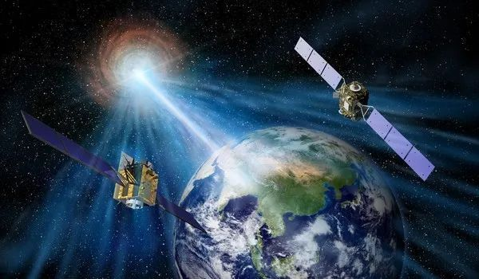
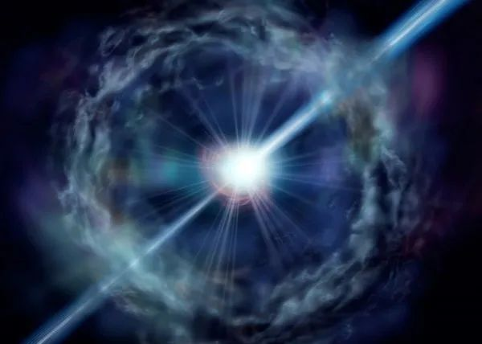

# 中国科学家领衔，精确探测迄今最亮伽马射线暴，系千年一遇天体爆发

北京时间3月29日凌晨2点，中国科学院高能物理研究所（简称高能所）与全球40余家科研机构联合发布对迄今最亮伽马射线暴（简称伽马暴）GRB
221009A的研究成果。高能所牵头研制的慧眼卫星（Insight-
HXMT）和极目空间望远镜(GECAM-C)成功地在硬X射线和软伽马能段对该伽马暴的瞬时辐射和早期余辉进行了国际最高精度的测量，不仅发现其具有迄今观测到的最大亮度，将伽马暴的亮度纪录提升了50倍，而且发现其各向同性能量也打破纪录，相当于在1分钟内释放8个太阳质量的全部能量，还揭示其产生了极为狭窄、极端明亮、接近光速运动的喷流，对这个千年一遇的天体爆发的研究做出了独特贡献。本项工作由中国科学院粒子天体物理重点实验室牵头的国际合作团队完成，成员来自中国、美国、意大利、法国、德国等30余家研究机构，论文通讯作者为高能所熊少林研究员、张双南研究员以及美国内华达大学拉斯维加斯分校张冰教授（论文已在线发布于arXiv:2303.01203）。

值得指出的是，在对该历史性伽马暴的观测中，高能所牵头建造的高海拔宇宙线观测站（LHAASO）与慧眼卫星和极目空间望远镜开展了天地联合观测，其中，高海拔宇宙线观测站利用其大量的甚高能观测数据，做出了多项重要首次发现，将稍后发布。

_图1：慧眼卫星和极目空间望远镜观测迄今最亮伽马暴示意图_

伽马暴是宇宙大爆炸之后最剧烈的爆炸现象，包括两种类型，一类产生于很大质量恒星的核心坍缩爆炸，持续时间通常长于2秒，此次发现的伽马暴即属于此类；另一类产生于两颗极端致密天体（中子星、黑洞等）的合并爆炸，持续时间通常短于2秒，并同时发出引力波。这两类天体爆炸均能产生一颗黑洞或中子星等极端致密天体，其通过极强引力吞噬周围物质并以接近光速从两极喷射物质，形成一对相反方向的喷流。喷流内部的激波或磁重联等过程加速带电粒子产生伽马射线辐射，称为瞬时辐射。喷流和周围的星际介质相互作用也能产生辐射，称为余辉。只有喷流恰好对准地球时，人类才有机会探测到这些辐射。

自从1967年人类发现首个伽马暴以来，已探测到近万例伽马暴。2022年10月9日，包括高能所牵头建造的空间和地面观测设备在内的全球众多天文设施均观测到这个迄今最亮的伽马暴（编号GRB
221009A），其产生于距离地球24亿光年的宇宙深处。该伽马暴具有极端的亮度和相对较近的距离使其成为名副其实的千年一遇的历史性事件。

我国专门为探测伽马暴和引力波电磁对应体而建造的极目空间望远镜和我国首台空间X射线天文望远镜慧眼卫星联合，在硬X射线和软伽马射线能段精确刻画了该伽马暴从前兆辐射到主暴、耀发以及早期余辉的各个关键阶段的辐射性质。其中，极目空间望远镜正好处于能够记录极高伽马射线流强的特殊观测模式，避免了因极端亮度而容易产生的各种仪器效应（包括数据饱和丢失、信号堆积、死时间过大等），成功对该伽马暴极端明亮的主暴进行了完整而精确的探测。而慧眼卫星配备的高能X射线望远镜凭借其在兆电子伏能区最大的有效面积，成功探测到该伽马暴，并获得了其前兆辐射和早期余辉的高质量数据。

基于极目空间望远镜的精确观测数据，研究团队发现该伽马暴具有迄今探测到的最高的亮度，并将伽马暴亮度纪录提升了50倍！由于伽马暴距离地球十分遥远，对于它发出的所有伽马射线来说，我们探测到的只是沧海一粟。通常我们无法知晓伽马暴向我们视线之外的方向辐射了多少能量，假设伽马暴向各个方向辐射了几乎相同数量的伽马射线，那么根据我们探测到的伽马射线和伽马暴的距离，可计算该伽马暴向各个方向发出的所有伽马射线的总能量，即各向同性能量。研究团队发现这个伽马暴的各向同性能量也打破纪录，超过了10的55次方尔格，相当于在1分钟内释放8个太阳质量的全部能量！

慧眼和极目的联合观测结果可以推测，该伽马暴的余辉由慢衰减到快衰减的拐折出现得非常早，意味着产生伽马射线的喷流非常狭窄，是人类探测到的最狭窄的伽马暴喷流之一。研究团队认为，极为狭窄的喷流可能是该伽马暴看上去极端明亮的原因之一。因此，本次慧眼和极目的观测研究对于深入理解这种极端宇宙爆发现象提供了崭新视角。

_图2.迄今发现的最亮伽马射线暴（GRB 221009A）想象图_

慧眼卫星和极目空间望远镜均由高能所提出和牵头研制。慧眼卫星由李惕碚、吴枚等人于1993年提出项目建议，2011年获得工程立项。其研制得到了国家国防科技工业局民用航天科研经费和中国科学院“空间科学”（一期）战略性先导科技专项的共同支持，高能所负责卫星有效载荷、地面应用系统和科学研究工作，航天科技集团公司五院为卫星总体单位。自2017年6月15日发射升空以来，慧眼卫星已在轨稳定运行超过5年，已在黑洞、中子星、快速射电暴等领域取得一系列重要成果。

“怀柔一号”极目(GECAM)卫星是中国科学院“空间科学”（二期）战略性先导科技专项支持的机遇型空间科学项目，由高能所于2016年提出项目建议，2018年获得工程立项。参与本次发现的是极目系列的第三个载荷（编号GECAM-C），其于2022年7月27日搭载中国科学院微小卫星创新研究院牵头研制的空间新技术试验卫星（SATech-01）发射入轨。极目系列卫星采用了一系列创新的探测技术，并开创性地使用北斗导航系统短报文服务实现星地准实时通讯，已发现一大批伽马暴、磁星爆发、快速射电暴的高能对应体、太阳耀斑以及地球伽马闪等高能爆发现象。

本项研究获得了科技部重点研发计划项目、国家自然科学基金等项目的资助。

