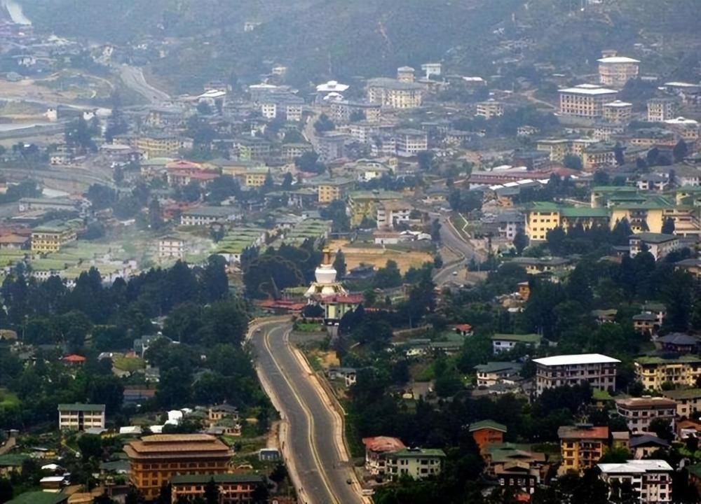
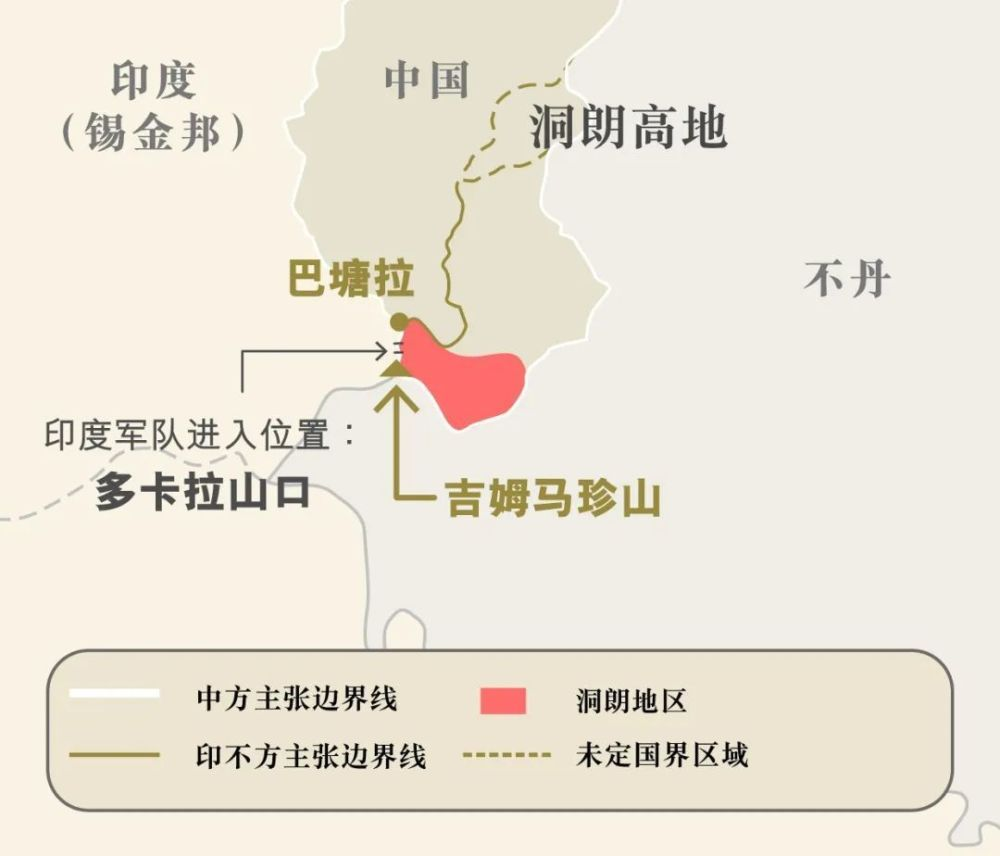
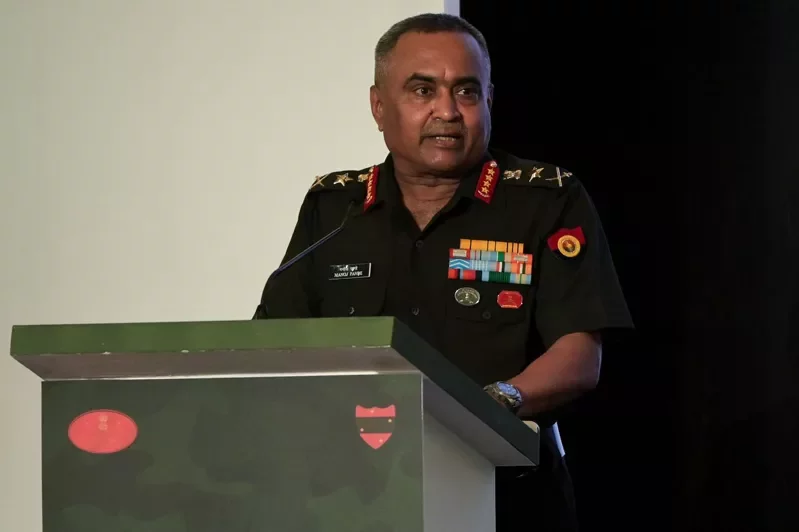

# 中国边界谈判取得重大进展？

**执笔/刀剑笑**

不丹首相洛塔·策林远在布鲁塞尔的一番涉华表态，在印度国内一石激起万层波浪。

**再过一两轮谈判，中国和不丹就可能解决边界问题了？**

主要印媒都被策林释放的这一信号惊着了。它们先是不愿相信，回过神后就是对新德里可能“失去不丹”一阵恼羞成怒，又是污蔑中国“胁迫”不丹让步，又是臆测不丹可能“丧权割土”……

策林首相还说，媒体上有关中方“闯入”不丹领土修建道路等基础设施的大量传闻不实，他否认所谓中国“侵犯”不丹领土的说法。

这一公开表态可以说是硬生生打了一众印媒的脸：

**究竟哪些“媒体”散布大量这样的谣言？不丹首相没有挑明，但不少印媒已不由自主地自己对号入座。**

当然，不丹首相这次表态中，也掺杂了有关边界争议尤其洞朗地区的错误提法。

但即便是这样，印度主要媒体仍不“领情”。

1

再过一两轮谈判，不丹和中国“可能就将划定边界线了”。

策林的这个表态显然让不少印媒感到惊讶。

这位不丹首相刚刚对欧洲进行了为期数天的访问。从报道量上看，他这一路的行程并没引起印度媒体太多“兴趣”。

但有意思的是，策林在布鲁塞尔期间接受比利时自由报的一篇采访文章一发出来，立即引爆印度舆论：

**原因，就是策林开诚布公地谈了与中国边界谈判的问题。**

策林的意思已经表达得相当清楚，但《印度教徒报》记者29日还挺不愿相信似地在报道中写道，不丹首相这番言论“暗示”可能很快就与北京达成边界问题解决方案。

但哪还用得着“暗示”，策林已经再明确不过地挑明了。

不丹和中国并不存在什么“严重边界问题”，他在采访中进一步解释，“只是一些领土还没完成划界”，因此“不得不就此进行磋商并划出一条边界线”。

不丹首相这番说法，与中方有关两国边界问题的表述可以说是“无缝对接”：

2004年由我外交部条约法律司编著的《中华人民共和国边界事务条约集——中不卷》中写道，中不边界从未以条约或协定正式划定，但两国间存在着一条传统习惯线，边境地区基本稳定。

**换句话说，中不边界问题并不复杂是两国的共识。**

但问题的解决却很缓慢。两国的边界谈判从1984年就开始在北京和不丹首都廷布轮流举行，至今已经20多轮。如果再考虑到前4轮谈判就对有争议的领土达成了指导性意见，双方谈判后续进展如此多艰就更奇怪了。

一个不复杂的问题为什么被搞得看起来很复杂呢？

**新德里的介入和百般破坏是一个众所周知的原因。**

资料显示，中不双方过去并非没有机会达成一些可操作性方案。1996年第11轮边界谈判，中方提出两国争议地区北部490多平方公里归不丹，西部260多平方公里归中国。

了解情况的学者说，不丹政府当时对此态度积极。

但因建议划归中国的西部争议地区与印度锡金邦为界，也因新德里基于1949年印不之间不平等的《永久和平与友好条约》而对不丹各种干涉和控制，廷布后来不得不对这一提议表示“谨慎”，相关方案没能走向现实。

这是印度阻挠中不解决边界问题的典型例子之一。

两个月前，1月10日到13日，两国边界问题专家组第11次会议刚刚在云南昆明举行。事实上，以2021年10月签署关于加快边界谈判“三步走”路线图的谅解备忘录为一个标志性节点，中不边界问题磋商被“注入了新动力”，谈判进程明显加快。

**不过，“印度因素”仍是一个挥之不去的破坏因素。**

即便最近两天报道不丹首相的最新表态，不少印媒仍延续多年来的那套说辞，鼓噪中国在洞朗等本国领土上建村、修路等是“改变现状”，甚至是所谓“侵犯不丹领土”。

**只是，策林首相对于类似说法也有明确回应。**

他说，媒体上流传着很多“中国在不丹领土上兴建设施”的消息，但那些设施根本“不在不丹”。不丹已经明确澄清过，所谓中国“入侵”不丹的说法纯属子虚乌有。

已经看到不丹首相作出这样的表态，主要印媒还在报道中不停鼓噪类似虚假消息，不得不说，这种主动把脸凑上去挨扇的“大无畏精神”真是令人佩服。

2

有关洞朗地区的表态，是策林这次受访尤其刺激印度舆论的另一要点。

洞朗“是中国、印度和不丹的一个交汇点”，这位首相在采访中称，不能指望不丹“独自解决这个问题”，“我们有三方呢”。

**首先必须指出，策林这个“三方”说法并不符合事实。**

洞朗这个地方，因为2017年中印洞朗对峙事件，很多人都熟悉了。它的西边与印度锡金邦相邻，南边与不丹王国相接。这个地区毫无疑问地属于中国，一直也都在中国有效管辖之下。

**虽然具体划界未定，但对洞朗属于中国，中不双方并不存在分歧。**

至于“印度也是洞朗争议一方”的说法，中方也早基于史实进行过严词驳斥和详细说明：

根据1890年《中英会议藏印条约》规定，洞朗地区毫无疑问属于中国领土。印度独立后继承了这一历史界约。印度历届政府也多次以书面形式予以确认，承认双方对锡金段边界线的走向没有异议。“甚至1962年，在这一段边界也是相安无事的”。

**洞朗地区既不是印度的，也不是不丹的，而是中国的。这一点再清晰不过。**

那为什么不丹首相突然又提起这个“三方论”呢？

**一位南亚问题学者猜测，很可能是廷布最近又感受到了来自印方的某种压力。**

2007年不丹修订与印度的“友好条约”，抹去了“不丹外交接受印度指导”的条款。当时一些评论认为，不丹将由此获得相当程度的外交独立自主。但现在看，军事、内政和经济等各个领域深受新德里影响甚至把持的不丹，一时仍难摆脱“印度阴影”。

不丹首相声称中印不三方一起解决洞朗争议，已是违背事实并迎合印方的歪理了。

**但尴尬的是，印度舆论并不“领情”，反而各种指责策林这样说是“给了中方平等的发言权”。**

洞朗属于中国并一直在中方实际控制下，但印方先是挑起争端，现在又连中方说话的机会都不给了？较之否认锡金段历史界约，印度舆论的蛮横和跋扈可谓变本加厉更进一步。

**一些仍对2017年非法越境但没占到一点便宜耿耿于怀的印媒，这两天各种歇斯底里：**

一会儿指责不丹在洞朗问题上“采取更务实方式”将使印度付出代价，危及印度东北部西里古里走廊安全；一会儿又污蔑中国“胁迫”不丹在领土问题上让步，暗示不丹如果跟中方达成边界协议就是“割让领土”……

不愿看到中不两国解决边界问题甚至走向建交，不甘“失去不丹”，但又预感浩荡大势难以阻挡，印媒真是肉眼可见的无奈和焦虑。

就在不丹首相的表态在印度国内发酵的同时，27日，印度陆军参谋长马诺杰·潘德在印度一所大学发表演讲时“警告”：

随着中美关系恶化，中印边境紧张局势恐演变成更大冲突。

**这话什么意思？明摆着就是想趁中美博弈升级继续讹中国。**

前面提到的南亚问题学者指出，印度这些年来在边界问题上的一贯做法，就是把非争议地区硬说成争议地区，把非灰色地带硬说成灰色地带，通过扩大争议范围和加剧解决难度，无中生有地造成一张牌来，以此在领土上占点便宜或在其他问题上逼迫中国让步。

它能得逞吗？6年前的洞朗对峙事件已经给出答案。

目前，印度官方还没对不丹首相的表态做出回应。但有印媒说，新德里将会密切关注中不两国尤其洞朗地区那条边界线画在哪里。

但事实上，它也就只有“关注”一下的份儿了。

**因为所谓洞朗问题真是跟印度一毛钱关系没有。**

**图片来自网络**

