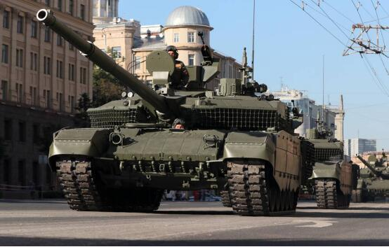

# 俄媒：俄军已接收数百辆先进坦克，性能比乌军坦克更优

【环球网报道 记者
李律杉】据俄罗斯卫星通讯社报道，一位消息人士当地时间29日告诉该媒体，俄罗斯武装部队已接收到数百辆用于在特别军事行动区作战的先进坦克，主要是T-90M“突破”坦克，其性能优于乌军坦克，至少与国外最先进的坦克处于同一水平。

“到目前为止，俄罗斯国防工业已经向战区交付了数百辆刚刚从装配线上下来的崭新的坦克，这些坦克主要是T-90M‘突破’坦克，以及深度现代化改进的T-72B3M坦克。”报道援引该消息人士的说法称，“就其技术特性而言，在包括武器装备、火控系统、防护、机动性和态势感知能力等方面，这些坦克至少与国外最先进的坦克处于同一水平”。

_乌克兰战场上的T-90M“突破”坦克
图源：俄罗斯国家近卫军官方账号_

该消息人士还补充表示，“与此同时，我们还可以自信地说，T-90M和T-72B3M在作战特点上完全优于乌克兰军队现在拥有的坦克，或在不久的将来从北约国家接收的那些坦克”。

_T-90M“突破”坦克
资料图_

报道提到，该消息人士还透露，这些T-90M和T-72B3M坦克配备了附加的反应装甲，能起到在几乎所有方向保护坦克的作用。

_T-72B3M坦克
资料图_

据俄新社今年1月报道，俄军在特别军事行动期间在赫尔松方向动用了最新的T-90M“突破”坦克。俄军坦克手们认为，T-90M是特别行动中使用的最佳坦克，明显胜过乌克兰军队的装备。该媒体介绍称，T-90M是世界上最先进的坦克之一。它拥有新炮塔、新一代反应装甲、新火炮、现代化通信工具、更强大的发动机和其他许多新东西。

与此同时，乌克兰国防部今年3月27日宣称，乌克兰空降兵部队已经收到来自英国的“挑战者2”主战坦克、美国的“斯特瑞克”和“美洲狮”装甲车以及德国的“黄鼠狼”步兵战车。乌军同时还发布了乌军获得这些装备的合影照片。就在乌克兰高调宣布接收英美德装甲车辆的同一天，德国国防部也确认，来自德国的18辆“豹2A6”主战坦克已被送往乌克兰。西方媒体普遍猜测，这些重型装备将用于乌克兰即将发动的春季攻势。

