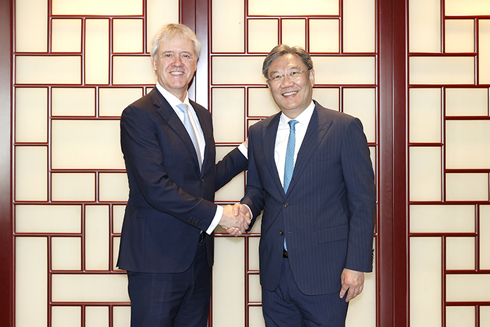

# 光刻机龙头ASML全球总裁来中国了！见了商务部部长，还交流了这些

来源：e公司

3月28日，商务部部长王文涛会见荷兰阿斯麦公司（ASML）全球总裁温宁克。商务部官网消息，3月23日-28日，王文涛相继会见了高通、苹果、宝马等超10家外企高管。

_（图源：商务部官网 ）_

王文涛强调，中国坚定不移推进高水平开放，愿为包括阿斯麦公司（ASML）在内的跨国公司来华发展创造良好营商环境，并提供高效服务。希望阿斯麦坚定对华贸易投资合作信心，为中荷经贸合作作出积极贡献，并共同维护全球半导体产业链供应链稳定。双方还就阿斯麦在华发展等议题进行了交流。

证券时报·e公司记者留意到，上述会面距离3月8日荷兰政府发布有关即将出台的半导体设备出口管制措施进一步的信息刚过去20天。这些新的出口管制措施侧重于先进的芯片制造技术，包括最先进的沉积设备和浸润式光刻系统。

作为全球光刻技术的领导者，ASML成立于1984年，目前在16个国家和地区超过60个城市设有办公室，员工超过3.5万人。

如今，ASML占据了全球60%以上光刻机市场份额，也是全球唯一一家能够供应7nm及以下先进制程所需的EUV光刻机厂商。1988年至今，ASML在中国大陆的全方位光刻解决方案下的装机量已超过1000台，相应员工数量也超过了1500人。

谈及有关新的出口管制影响，ASML在3月9日给证券时报·e公司记者发来的声明中表示，由于即将出台的法规，ASML将需要申请出口许可证才能发运最先进的浸润式DUV系统。这些管制措施需要一定时间才能付诸立法并生效。

“基于相关公告、我们对荷兰政府许可证政策的预期以及当前的市场形势，我们预计这些管制措施不会对我们已发布的2023年财务展望以及于去年11月投资者日宣布的长期展望产生重大性影响。”ASML阐述。

ASML在3月9日的声明中还强调：“新的出口管制措施并不针对所有浸润式光刻系统，而只涉及所谓‘最先进’的浸润式光刻系统。尽管ASML尚未收到有关‘最先进’的确切定义的信息，我们将其解读为我们在资本市场日会议上定义的‘关键的浸润式光刻系统’，即TWINSCAN
NXT：2000i及后续推出的浸润式光刻系统。

此外，我们要指出，先进程度相对较低的浸润式光刻系统已能很好满足成熟制程为主的客户的需求。最后，ASML的长期展望的基础是全球长期需求和技术趋势，而不是对具体地域的预期。”

值得注意的是，自2019年以来，ASML的EUV（极紫外线）光刻系统已经受到限制。

事实上，自3月8日荷兰政府发布即将出台上述出口管制措施这一信息以来，相关事件动态一直受到外界关注。

**3月16日，在商务部召开的例行新闻发布会上，有媒体提问：近日荷兰外贸与发展合作大臣施赖纳马赫尔向荷兰议会致函称，将限制半导体技术的出口，以保护国家安全。请问商务部对此有何评论？**

对此，商务部新闻发言人束珏婷表示，中荷双方近期就双边经贸合作及相关问题保持沟通。

近年来，个别国家为维护自身霸权，不断泛化国家安全概念，滥用出口管制措施，甚至不惜牺牲盟友利益，胁迫一些国家对中国采取贸易保护做法，人为推动产业脱钩断链，严重阻碍了世界经济复苏和发展。

束珏婷表示，希望荷方从自身长远利益和公平公正市场原则出发，恪守国际经贸规则，不滥用出口限制措施，同中方共同维护全球产业链供应链安全稳定，维护中荷两国和双方企业的共同利益。

数据显示，在2021年，中国大陆就已是ASML第三大市场，约占其2021年全球营业额14.7%（即27亿欧元），2021年中国大陆的出货量占其全球出货量的16%。

在2022年9月的一次专访中，谈及在中国市场发展，ASML中国区总裁沈波曾对证券时报·e公司记者表示：
**“我们认为，中国对于全球发展半导体产业是非常重要的组成部分，抛开非市场的外在因素，从公司本身角度而言，我们对于中国市场的投入和支持是非常坚定的。”**

