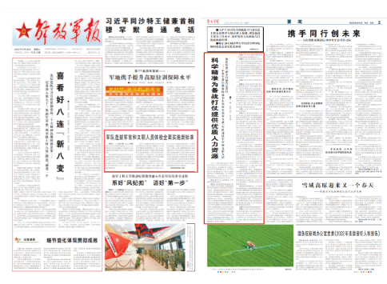

# 军队选拔军官和文职人员体检全面实施新标准！

**解放军报讯（记者孙兴维、通讯员张鹏）** 经中央军委领导批准，近日，中央军委机关有关部委联合下发通知，全面实施新的军队选拔军官和文职人员体检标准。

该标准是军队选拔补充军官（含军队院校从地方应届毕业本科生中招录入伍攻读研究生人员）、军队院校招收生长军官学员和直读研究生军官学员、军队招录聘用文职人员的体检工作的基本依据，对于把好军队人员入口身心素质关具有重要作用。

近年来，随着部队备战打仗深入推进，新型作战力量类型不断增多，专业技术兵种精准征集数量加大，对官兵身心素质提出更高要求，需要统筹考虑适龄青年身体素质现状、不同类型部队岗位个性化需求，对军队相关人员选拔性体检标准进行优化调整，有利于科学精准为部队提供合格军官和文职人员。

新标准包含一项通用标准和两项补充标准，通用标准包括外科、内科、耳鼻咽喉科、眼科、口腔科、妇科、精神心理、医学影像、医学检验等，作为新入伍（入职）人员身心素质的基本条件。在通用标准基础上，围绕不同军事作业岗位对军官、文职人员身心健康特殊需求，详细规范相应补充项目标准，选拔军官补充标准主要规范装甲、特战、航海、航空等特殊作业岗位补充项目标准；选拔文职人员补充标准综合考虑年龄、性别和工作性质等因素，对通用标准部分条款进行适当放宽，明确管理类和专业技术类部分岗位补充项目标准，确保相关选拔体检标准的科学性、精准性。

科学精准为备战打仗提供优质人力资源

——中央军委后勤保障部卫生局有关负责人就《军队选拔军官和文职人员体检标准》相关问题答记者问

■张 鹏 解放军报记者 孙兴维

为进一步做好军队选拔军官和文职人员体检工作，切实把好军队人员入口身心素质关，促进部队战斗力提升，经中央军委领导批准，近日，中央军委机关有关部委联合出台了《军队选拔军官和文职人员体检标准》。这个标准有哪些新变化？记者专题采访了中央军委后勤保障部卫生局有关负责人。

**记者：请问什么是选拔体检，与健康体检有哪些区别？**

**负责人：**
选拔体检是指依据规定标准，对受检人员的生理和心理健康状况进行综合性检查，评定其是否合格的专业活动。健康体检是指运用医学方法和手段，进行健康检查和评估，早期发现疾病线索和健康隐患，并进行健康指导的医疗保障活动。与健康体检相比，选拔体检有以下特点：一是标准特殊，军队人员健康体检明确具体体检项目但没有判定标准，而选拔体检围绕军队人员不同身份属性、作业岗位类别对人员身心素质特殊要求，对各项身体心理指标是否符合岗位需要提出详细判定标准；二是形式特殊，选拔体检期间需对体检场所进行封闭式管理，对于有异议的结果设有专门机构进行复检鉴定，军队人员健康体检没有相关要求；三是结果特殊，选拔体检涉及人员淘汰，而健康体检不涉及人员淘汰。

**记者：修订军队选拔军官和文职人员相关体检标准的契机是什么？**

**负责人：**
近年来，随着部队备战打仗深入推进，新型作战力量类型不断增多，专业技术兵种精准征集数量加大，对官兵身心素质提出更高要求，同时文职人员身份由原来的非现役调整为军队人员重要组成部分，需要统筹考虑适龄青年身体素质现状、不同类型部队岗位个性化需求，对军队相关人员选拔性体检标准优化调整，科学精准为部队提供合格兵员。

**记者：该标准适用于哪些对象和工作？**

**负责人：**
《军队选拔军官和文职人员体检标准》适用于军队选拔补充军官、军队招录聘用文职人员的体检工作。具体讲，主要包括军队院校招收生长军官学员、直读研究生军官学员、军士学员和从地方应届毕业本科生中招录入伍攻读研究生人员，军队直接选拔招录普通高等学校应届毕业生，军队招录聘用各类文职人员，以及大学毕业生士兵提干对象、优秀士兵保送入学对象、军校应届毕业学员等人员的体检、复检及医学终级鉴定等工作。

**记者：该标准与现行标准相比有哪些调整变化？**

**负责人：重新组合框架结构。**
将现行《军队院校招收学员体格检查标准》《军队聘用文职人员体格检查通用标准》进行科学整合，形成1项通用标准以及选拔军官、选拔文职人员等2项补充标准。通用标准包括外科、内科、耳鼻咽喉科、眼科、口腔科、妇科、精神心理、医学影像、医学检验等多个章节；选拔军官补充标准主要规范装甲、特战、航海、航空等若干特殊作业岗位补充项目标准；选拔文职人员补充标准综合考虑其年龄、性别和工作性质等因素，对通用标准部分条款适当放宽，同时明确管理类和专业技术类部分岗位补充项目标准。

**优化标准宽严适度。**
对影响服役的颅脑外伤等重大疾病、当前适龄青年常见性传播疾病及其并发症后遗症，以及脊柱侧弯等容易引起矛盾纠纷伤病，进一步细化明确判定标准，增加了晕血不合格标准；根据我军武器装备发展和医疗技术进步，对于不影响军事作业的胆石症微创手术、精索静脉曲张手术、子宫肌瘤剔除术等部分微创手术，以及耳鼻咽喉科、眼科、口腔科、妇科、心电图、超声等部分标准条款进行了适当优化。

**全面规范医学用语。**
依据最新国际疾病分类标准，全面规范各类医学专业用语；根据最新国际相关专科指南，调整规范心率、传染性疾病、精神类疾病等部分条款的合格标准；依据最新的国际行业指南，进一步细化区分了精神障碍、心理障碍的界限，并规范诊断术语。

**提高鉴别诊断操作性。**
区分生理性和病理性伤病，分别明确鉴别诊断标准；将部分辅助检查由退兵鉴定直接依据调整为辅助依据，如粪便检查结果结合地区流行病综合判定，尿素超出参考区间上限应当结合尿常规、肌酐等检验及临床检查综合判断。针对在体检中难以发现的疾病史、家族史或者疾病线索，增加病史调查表，作为针对性排查确认和退兵配套依据。

**记者：该标准还有哪些特殊要求？**

**负责人：**
《军队选拔军官和文职人员体检标准》明确，军队直接选拔招录备战打仗急需军官、特招地方专门人才担任军官，军队直接引进高层次人才、特殊专业人才为文职人员，经认定后，身高、体重、视力体检标准可适当放宽。

_刊于3月29日《解放军报》1、2版_

来源丨解放军报、学习军团（ID：xuexijuntuan）

监制丨欧灿 张晓辉

编审丨刘建伟 严珊 钱宗阳

责编丨韩杰 周舟

