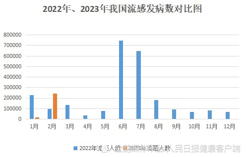

# 国家疾控局发布今年2月法定传染病疫情概况：感染人数最多的为流感

人民日报健康客户端 记者 王艾冰

3月28日，国家疾控局发布2023年2月全国法定传染病疫情概况，人民日报健康客户端记者注意到，2023年2月，全国（不含香港、澳门特别行政区和台湾地区）共报告法定传染病624685例，其中流行性感冒感染人数最多，为240687例，占全部感染病例数的比例为38.53%。

_2022年、2023年我国流感发病数对比图。_

据中国疾控中心数据，2022年2月我国流行性感冒感染人数为98696例，2023年的感染人数为去年同期的2.4倍。但是，2022年1月的感染人数为230714例，可见，去年的流行性感冒感染人数较多的月份比今年早1个月时间。

_3月16日，北京丰台区马家堡社区卫生服务中心提供流感检测服务，一名居民正在采集咽拭子样本。牛宏超摄_

据新华社消息，3月20日，中国疾控中心病毒病所国家流感中心主任王大燕表示，继此前我国流感活动水平有所升高后，目前已监测到有几个省份流感活动高峰出现拐点，开始下降。“今年较往年约晚2个月进入流感流行季。”王大燕表示，主要有两方面的原因，一是因为防控新冠病毒的措施同时对季节性流感防控也非常有效，使得流感等其他呼吸道病毒流行受到一定程度压制；二是由于近3年甲型H1N1亚型流感病毒未在我国流行，导致人群对流感病毒的预存免疫力有所降低。

“去年因为新冠疫情，大家的防护意识非常好，所以原本去年12月份、今年1月份可能到来的流感小高峰有所延后，流感病毒在其免疫逃逸能力、毒性等不变的情况下，易受行为方式的影响。”北京佑安医院感染综合科主任医师李侗曾告诉人民日报健康客户端记者，那段时间大家一般都自行居家隔离，很少参加聚会、旅游等外出活动，但是2月份之后，这些活动逐渐增多，所以流感感染人数也随之增多。

_2022年、2023年我国法定传染病甲乙丙类总计发病数对比图。_

2023年1-2月，我国流行病感冒感染人数255957例，而2022年1-2月我国流行性感冒感染人数共329410例。仅看1、2月份数据，今年的流感人数低于2022年。但按照去年数据，我国流感感染人数在6、7月还会有一个高峰。

