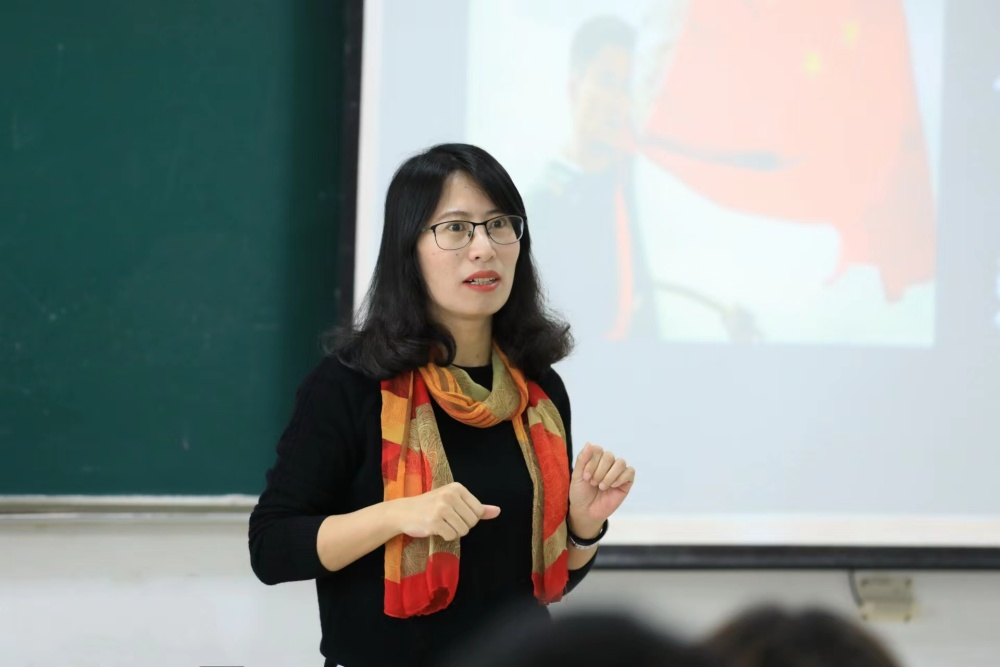

# 大兴调查研究，专家认为：与形式主义、官僚主义有关

近日，中办印发了《关于在全党大兴调查研究的工作方案》（以下简称《方案》），明确提出，要力戒形式主义、官僚主义，不搞作秀式调研，为新形势下扎实深入开展调查研究提出了明确要求。“大兴调查研究”新风扑面，引起广泛关注和讨论。那么，为什么在当下要提出这一要求？社会上存在哪些问题需要去调查研究？做调研，又需要怎样的方法论？

带着这些问题， **腾讯新闻专访江西财经大学财税与公共管理学院欧阳静教授。**

**核心要点：**

① 现在重提大兴调查研究，我认为的确是因为当前形式主义和官僚主义严重。那些只是为了完成项目的研究对政策的出台，不仅没有促进作用，可能反而带偏政策的取向。

② 形式主义来源于“指挥棒”问题。上级检查怎么来评价你？原本应该是要找群众谈心，是要了解具体效果的，但现在却看你有没有材料，有没有制度。

③ 现在倡导大兴调查研究，某种程度上是田野研究方法，也是定性研究方法。调查研究的核心不在于获取多少数据和资料，而是发现问题，解决问题。

④ 我很多学术灵感都来自民间，做学术，只是用学术的语言把民间智慧进行了转换而已。

_欧阳静教授_

**问：调查研究是党的传家宝，历史上，1961年曾提出大兴调查研究。今天，又是在什么样的背景下，发这个文件？或者说，为什么要大兴调查研究？**

欧阳静：现在重提大兴调查研究，我认为的确是因为当前形式主义和官僚主义严重。中央曾将2019年作为“基层减负年”，解决形式主义突出问题为基层减负，但如今脱离实际的情况仍比较多。

我的研究领域是基层治理。 **基层执行的一些政策和考评往往容易脱离实际。**
比如，前段时间去一个乡镇，那里山上条件其实很难种菜、很难开荒。但国土部门的航拍拍到了规定要复耕的地方，结果没有复耕。按航拍照片，农民得去种上菜，进行“整改”，但那菜很难成活。再比如说危房改造，空心村有老房子几十年没人住，但如果房子墙壁上有一条裂缝，按规定就要各种鉴定。类似这样的问题，脱离农民实践，容易导致浪费。

再援引我在《简约治理》一文中的总结，一些地方人居环境整治：要求对农村房屋“穿衣戴帽”，即墙面刷成统一的颜色，盖统一格式的屋顶；鸡鸭必须圈养，鸡舍必须用竹子围成所规定的样式；猪圈必须用火砖砌墙，盖琉璃瓦顶，在指定区域搭建成统一的样式……因为按规定所建的鸡舍和猪圈不仅费用高，而且离家远，不方便喂养和管理，导致很多留守老人不得不放弃饲养。

_图源：视觉中国_

不单单是政府部门，学术圈、研究界等很多领域也存在形式主义。能够沉下心真正做调查研究的学者其实并不多，有些人去调研，也就一两天、两三天。这种走马观花式的调研特别多。问他们为什么要去调研，因为手上有项目，调研是为了完成项目。所以，现在做项目和做研究不是一回事了。
**那些只是为了完成项目的研究对政策的出台，不仅没有促进作用，可能反而带偏政策的取向。**

**问：《方案》点出报喜不报忧、层层陪同、扎堆调研，作秀式、盆景式和蜻蜓点水式调研等问题。那么，形式主义出现的原因和机理是怎样的？**

欧阳静：形式主义的根源有很多方面，大家都知道形式主义不好，但为什么要去做？

**第一个问题，形式主义来源于“指挥棒”问题。**
这个指挥棒或者标准，是导致形式主义重要的原因。上级检查怎么来评价你？原本应该是要找群众谈心，是要了解具体效果的，但现在却看你有没有材料，有没有制度。一些基层干部，把大量时间花在怎么做材料、遣词造句上，有的为考核准备的材料一米多高，有的打印材料都可以拉成车。

高校考核跟基层政府的运行差不多。比如教学评估、一流学科建设评估，都有相关的考核指标，考核指标这个指挥棒告诉你，达到它的标准，就合格，超过标准就优秀，于是就会出现为了达到标准而出现的“包装”等形式主义。拿高校本科教学成果奖为例，很多时候是为了去评这个奖而评这个奖，因为只要得了奖考核指标中就能加分。于是就会出现各种包装、打造等与本科教学质量提升不相关的形式主义。

**第二个问题，为什么考核部门会设计这个标准？**
考核标准表面上特别简单、评价客观，避免了主观，这其实也导致了官僚主义。上面的人来考核下面的人，不是通过实际工作，你做了什么事，更不是通过深入群众，听群众的评价，而是通过一些看得见的简单化、标准化和操作化的指标，就会出现群众的口碑和实现的“成绩”不相符的现象。而那些群众不认可的“成绩”大多也是形式主义。

**问：除了形式主义问题，现在的调查研究还存在哪些问题？**

欧阳静：调查研究的核心不在于获取多少数据和资料，而是具备问题意识，了解基层真实情况，发现问题、解决问题。

我在高校讲定性研究方法。现在倡导大兴调查研究，某种程度上就是我们这种田野研究方法，也是定性研究方法。但是，在学界和高校，田野调查研究方法是非常非主流的，很边缘的。

现在主流的方法是定量，搞数据、模型。比如一些大学的课程设计中，方法课都叫计量统计、数据模型。一些学生把自己当做数据收集员，读博士的时间主要就在找数据，然后通过模型软件，做出论文。但学生说，做论文的模型软件可以帮你需要什么结果就可搞出什么结果，实在对不上，就编数据。“数据”从哪里来？很多是从网上获得，不是从实践中获得。但学生们坚信，如果没有数据就搞不了“研究”，发不了论文。但找数据不是真正的调查研究。
**因为要去找数据其实代表你的命题已经成立了，甚至已经有结论了，只是想找个数据来证明和包装一下。**

_图源：视觉中国_

因此，调查研究，前提要具备问题意识，能够区别什么是真问题，什么是假问题。现在学生普遍缺少问题意识，下基层调查，就是去收集材料、搜集数据。
**真正的调查研究是发现问题，发现了问题，跟着这个问题走，去寻找原因和解决困惑，在解决困惑过程中，各种因果关系、各种关联就出来了。**

党的历史上，《中国社会各阶级的分析》《湖南农民运动考察报告》《寻乌调查》《反对本本主义》等，都是调查研究的典范，都是解决真问题的。

**问：您常年从事基层调研，有不少传播力很广的作品。可否分享做调研研究的方法论？**

欧阳静：做基层调查研究，要把自己当做一个“小白”，对基层毫无所知，去基层呆一个礼拜就发现好多问题、好多困惑。

我第一次去乡镇时，就有这样的感觉：这乡镇怎么跟我书本上完读的全不一样啊？有困惑之后，接下来是怎么解决，方法如下。

**第一，参与式观察。**
我做博士论文调研时，在桔镇待了一年，把自己当成基层干部。开始没人搭理我，所以第一个月，我没有任何目的，就让基层干部群众认识我，跟他们一起下乡、开会、工作……啥都干，我带着谦虚的心态，成为了一个实习生。同时，我把过程中产生的疑问，在晚上记下来。

**第二，访谈。**
博士论文期间，我一一访谈了40多个干部，每个人至少一次访谈，这是正式访谈。还有非正式访谈，比如吃饭聊天时，去抓住机会问。冬天农村有烤火，我经常和他们一起烤火聊天。不知不觉地，乡镇干部不把你当成一个调查者，而是把你作为一个倾诉的对象，敞开了心扉。各种场合你都是非正式访谈的场景。调查研究不能走马观花似的，感觉一天跑了几个地方，其实你没办法在一天之内深度了解一个问题。很多人调查一下去就召集一堆人座谈。我的经验是座谈很难了解到真实的东西，因为那么多人很容易讲那种普遍性的东西。我几乎不做座谈而是访谈，经常一天访谈两个人，上午一个，下午一个。

以上两个方法，简单而又不简单，简单是指没有什么技术门槛，不简单则是需要你的虚心、交心和用心。

我调研的桔镇，很多干部都是我的朋友，10多年来，我跟他们维持了很好的关系。我有疑惑的话，可以随时问，可以随时到他们那儿去，但我现在去那儿就不需要待那么长时间，因为我已经有经验了。

**问：“高手在民间”，基层治理领域调研中，是否从群众、干部那里获得过一些民间智慧？**

欧阳静：我很多学术灵感都来自民间，来自群众和基层干部。我做的学术，只是用学术的语言把民间智慧进行了转换而已。比如，我做政府治理研究和博士论文，提出“策略主义”的概念，这个概念完全出自基层干部给我的启示。
**我与基层干部相处期间，他们说得最多的一句话就是：“我不管你用什么方法，只要不犯法，摆平就行，搞定就行。”**
我就从学理上分析他们到底摆平啥、搞定啥。原来，基层政治运作的逻辑既不是按照韦伯科层制的程序主义运作，毕竟程序主义还怎么去摆平搞定？也不是传统意义上的简约主义。我就把它转成了“策略主义”：变通和非正式运作。并且能理解在复杂的基层社会，不能只讲法治逻辑，它还是人情社会，需要变通，需要法理和情理融合，需要非正式运作。

我所在的以贺雪峰教授为核心的研究团队，长期坚持田野调查，有大量优秀的调查报告，这些报告所提出的对策也不都是我们提出的，都是总结基层干部的方法。

基层干部其实也愿意与我们聊天，觉得我们替他们发声了，他们有参与感、价值感。事实上，团队中很多调研报告形成了内参，获得了高层重视，推动了基层治理。

还有人问我为什么热心去做田野调查？因为你粘贴复制是没办法寻找到意义的， **走入基层，走入民间就能发现巨大的意义。** （完）

