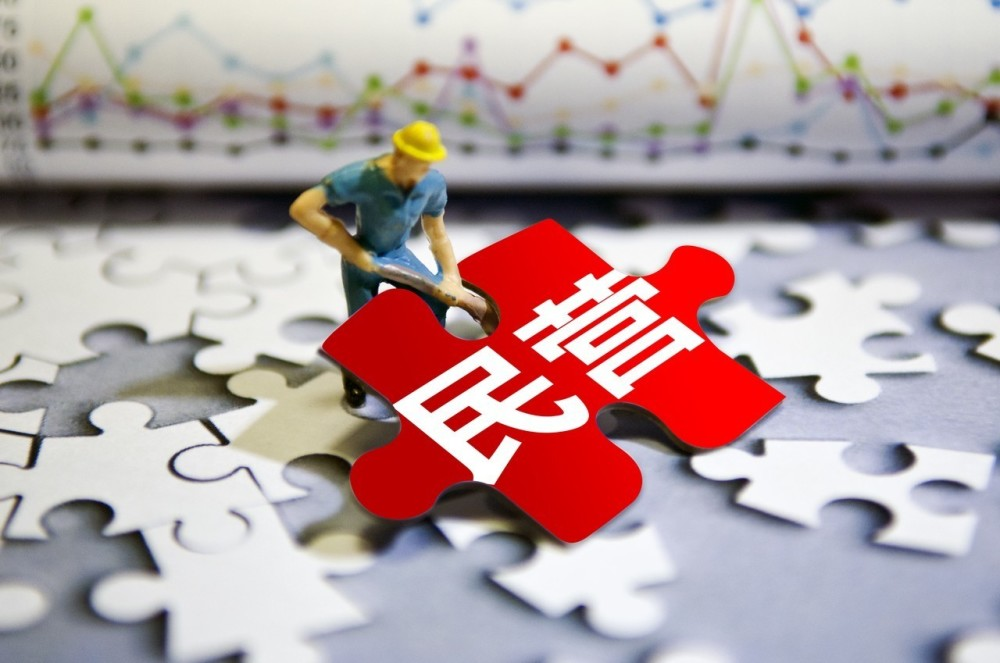

# 海南提出涉案民营企业家“能不捕的不捕”，专家：不是搞特权

**划重点：**

  * _1_ 海南把这一政策放到民营经济的背景下，“有人认为这只是针对民营企业家的、是搞特权，其实不是这样的，一定要澄清这个观念。”
  * _2_ 不光是民营企业家，对所有人都应该是这个原则。
  * _3_ 除海南之外，近期全国多地都相继出台了发展民营经济的具体措施，提振民营经济的发展信心。

本文来源：时代财经 作者：王莹岭

海南一则消息引发关注。

近日，海南省人民政府办公厅印发《关于支持民营经济发展的若干措施》。其中提到，要营造公平公正法治环境。贯彻落实少捕慎诉慎押刑事司法政策，对民营企业家涉案人员能不捕的不捕、能不诉的不诉、能不判实刑的不判实刑，能不继续羁押的及时予以释放或变更强制措施。

这一“能不捕的不捕、能不诉的不诉”的表述引起热议和质疑。

3月28日，中国人民大学法学院教授、中国人民大学商法研究所所长刘俊海对时代财经分析，目前，虽然民营经济发展遇到前所未有的历史机遇，但也因为体制机制以及各方面的原因，民营企业家的投资信心还有待进一步康复。基于这一背景，海南贯彻落实少捕慎诉慎押的刑事司法政策，有助于保护民营企业家的人身权益。

“但是，这并不是说民营企业家违法犯罪就可以逍遥法外。对于确实构成犯罪的，还是得依法追究刑事责任。不逮捕并不等于就不诉，不判实刑不等于不判刑，可以判缓刑，这些都是在法律规定允许范围之内的，是严格按照罪刑法定、无罪推定、疑罪从无的态度保持刑法的迁移性。”刘俊海强调道。

_图片来源：图虫创意_

**“少捕慎诉慎押”不仅是针对民营企业家**

事实上，“少捕慎诉慎押刑事司法政策”于2021年就已提出。

2021年4月，中央全面依法治国委员会将少捕慎诉慎押刑事司法政策列入年度工作要点，少捕慎诉慎押从刑事司法理念上升为刑事司法政策。

2022年2月9日，最高人民检察院检察委员会委员、第一检察厅厅长苗生明接受新华社采访时表示，少捕慎诉慎押是指对绝大多数的轻罪案件体现当宽则宽，慎重逮捕、羁押、追诉。

少捕慎诉慎押的本质是严格、准确、规范地把握逮捕、起诉、羁押的法定条件，将刑事强制措施、刑事追诉控制在合理且必要的限度内，体现刑法谦抑、审慎的要求，实现惩罚犯罪与保障人权的最佳平衡，最大限度发挥刑事司法对社会和谐稳定的促进作用。

“只靠‘刑法治天下’是不行的，一定要坚持罪行法定、无罪推定，当宽则宽、当严则严、宽严相济的基本原则，若是可严可宽的，尽量从宽。主要还是惩前毖后、治病救人、教育为主，坚持少补慎诉慎押的司法理念，是以人为本的体现。但是并不是对罪犯没有界限，构成犯罪的也还是要追究刑事责任。”刘俊海对时代财经解释道。

刘俊海进一步补充道，海南把这一政策放到民营经济的背景下，“有人认为这只是针对民营企业家的、是搞特权，其实不是这样的，一定要澄清这个观念。”

在刘俊海看来，不光是民营企业家，对所有人都应该是这个原则，应当让它成为一个稳定、透明、公平和可预期制度设计，对所有公民都应当一碗水端平，应当慎用刑事责任，尽量用民事责任、行政处罚。

**多地出台政策提振民营经济发展信心**

除海南之外，近期全国多地都相继出台了发展民营经济的具体措施，提振民营经济的发展信心。

3月13日，国务院总理李强在出席记者会时就提到，民营经济的发展环境会越来越好，发展空间会越来越大。将在新起点上大力营造市场化、法治化、国际化营商环境，平等对待各类所有制企业，依法保护企业产权和企业家权益，促进各类经营主体公平竞争，支持民营企业发展壮大。

3月22日，辽宁省介绍“促进国企民企外企竞相发展”的重点任务和具体举措，引导民营企业加快转型升级。

3月24日，陕西出台《大力服务民营经济高质量发展十条措施》，从打造政务服务平台、大力支持创新发展等10个方面，推动民营经济健康发展、高质量发展。

此外，各地政府也在今年初的工作报告中释放出鼓励支持民营经济发展的信号。例如，福建提出，实施新时代民营经济强省战略，从政策和舆论上鼓励支持民营经济和民营企业发展壮大，让民营企业家大胆创新、放心创业、放手创造；四川提出，全面清理和废止阻碍参与公平竞争的政策规定，开展清理拖欠民营企业账款和涉企收费专项整治；安徽提出，构建亲清统一的新型政商关系，建立政商交往正负面清单。

在改善法治化营商环境方面，今年两会期间，全国工商联提交了《关于制定民营经济促进法的提案》，提出包括“地位平等，公平竞争，保护权益”在内的九条建议，并建议同步启动《民营经济促进法》立法进程，条件成熟时尽快出台，“给企业满满的安全感”。

对此，刘俊海指出，广大民营企业赖以生存与发展的法治化营商环境有待根本改善，稳定、透明、公平、安全、诚信、可预期的法治化营商环境本身就是先进的生产力。

