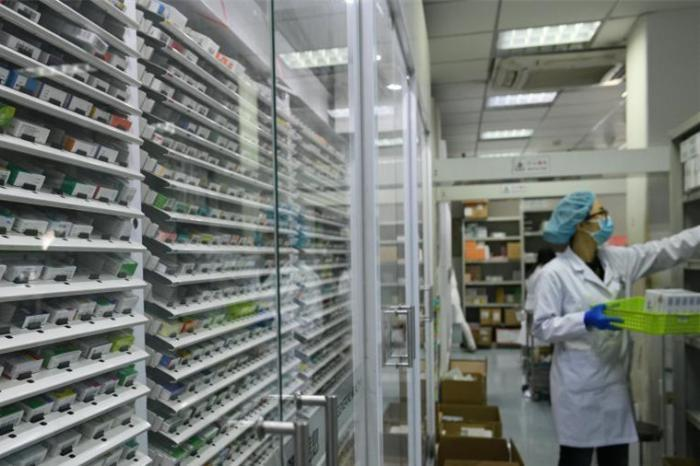

# 第八批药品国采今日开标：共涉40个大品种，肝素类药物首次纳入

中新网3月29日电 今日，第八批国采将在海南省陵水县开标。此次国采共涉及40个大品种，肝素类药物首次被纳入。此外，奥司他韦干混悬剂也位列其中。

_资料图：自动分药系统(图文无关)
中新社记者 佟郁 摄_

**第八批国采今日开标肝素类药物首次纳入**

3月初，国家组织药品联合采购办公室发布了《全国药品集中采购文件》的相关文件。依照文件，第八批国采将于3月29日上午7点30分开始接收申报材料，上午10点公开申报信息，下午2点确认供应地区。

第八批国采品种共涉及40个大品种，覆盖了抗感染、肝素类、抗血栓、高血压等药品领域，肝素类产品首次被纳入国采。

据媒体报道，此次集采的品种中，不少都是市场销量超10亿元的大品种。值得一提的是，市场规模较大的肝素类产品今年首次纳入集采，此类药物作为抗凝血、抗血栓的临床用药，在心肌梗死、心血管手术、血液透析等一系列疾病的治疗中广泛使用。

有业内专家曾表示，该类药品虽然首次被纳入，但是竞争却十分激烈。这将有利于临床使用肝素的患者降低医疗费用。

另外，抗病毒药物奥司他韦干混悬剂也位列其中。

不过这不是奥司他韦首次进入集采，在上一批集采中，奥司他韦每片从平均4.5元降至1元。而此次纳入的干混悬剂则是近年来市场新推出的剂型。

_资料图
复旦大学附属华山医院供图_

**集采药品平均降价超50% 中成药市场也将被搅动**

今年1月召开的全国医疗保障工作会议披露，2018年国家医保局组建以来，持续挤压药品耗材虚高价格水分，国家组织集采7批294种药品平均降价超50%，3批4类耗材平均降价超80%；叠加地方联盟集采，累计降低药耗费用超4000亿元。

第七批药品集采，平均降价达到48%；脊柱类耗材集采产品平均降价84%；胰岛素集采中选结果落地，惠及超1000万患者。

此外，集采品种中使用高质量药品的患者比例从50%提高到90%以上。药品“带金销售”的空间持续被压缩。

本月初，国家医疗保障局公布通知，部署2023年医药集中采购和价格管理工作。其中明确，到2023年底，每个省份的国家和省级集采药品数累计达到450种，其中省级集采药品应达到130种，化学药、中成药、生物药均应有所覆盖。

另外值得一提的是，2022年9月全国中成药联合采购办公室成立，湖北省医疗保障局承担联合采购办公室日常工作并负责具体实施。同时，《全国中成药联盟采购公告》对外发布，16个类别42个中成药将进入首批中成药集采。

就在本月23日，全国中成药联合采购办公室在武汉召开中成药联盟采购企业沟通会，介绍全国中成药联盟采购相关规则并征求企业意见建议。有业内人士分析，中成药全国集采，或将搅动3000亿元规模的中成药市场。

首都医科大学国家医疗保障研究院院长助理蒋昌松就曾撰文表示，药品集中采购制度发展到以“国家组织、联盟采购、平台操作”为总体思路和“带量采购、量价挂钩、招采合一、保证使用、确保质量、保障供应、保障回款”为基本原则的带量采购模式，该模式将在2025年前成为我国最主流的药品采购模式。

显然，集采政策背景下，药械降价已成为大势所趋，虚高价格水分挤出后，患者也将最终受益。(完)

