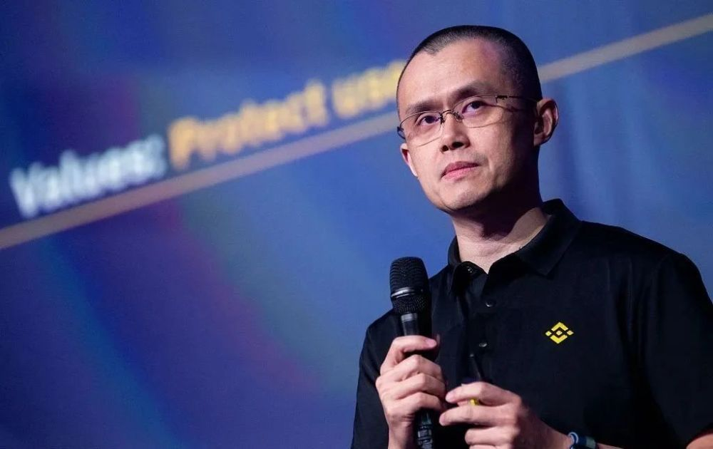

# 起底“前华人首富”赵长鹏在美隐秘往事，聊天记录曝光涉嫌洗钱

_赵长鹏。来源：视觉中国_

**作者 | 陈弗也 编辑 | 杨布丁**

**出品 | 棱镜·腾讯小满工作室**

欢迎下载腾讯新闻APP，阅读更多优质资讯

币安又被起诉了，这一次的指控方为美国商品期货交易委员会（CFTC）。

3月27日，CFTC在官网上发布声明，称已在伊利诺伊州北区地方法院提起民事诉讼，指控币安违反《商品交易法》和CFTC的规定，希望没收币安的非法所得，并对其进行罚款，永久禁止它在美国的注册和交易。

根据起诉书内容，币安CEO赵长鹏是第一被告，同为被告的还有Binance Holdings Limited、Binance Holdings (IE)
Limited和Binance (Services) Holdings Limited三家企业，以及币安前首席合规官Samuel Lim。

赵长鹏是一位出生在江苏连云港的加拿大籍华人，根据实时更新的“彭博亿万富豪指数”，他的身价一度接近千亿美金，曾多次超越农夫山泉董事长钟睒睒，成为全球“华人首富”。

今年以来，比特币的价格一度跌破2万美金，他的身价也严重缩水，但依然高达258亿美元，在全球位列第51名，比拼多多创始人黄铮的身价多了50亿美金。

在那份长达74页的起诉书中，CFTC详细讲述了赵长鹏和币安在美国的违法事宜，比如，在明知违规的情况下，依然向美国用户提供交易服务，在防止恐怖主义融资和洗钱的事情上没有尽责，等等。

3月28日，赵长鹏发表长文回应称对此次诉讼感到意外和失望，并否认了一些指控。

有币圈人士分析认为，CFTC起诉的案件，往往会涉及巨额的资金量，在2021年10月，CFTC曾让数字货币交易所Bitfinex和Tether支付了4250万美元的罚款，相对来说，币安的体量要比Bitfinex和Tether大很多，他们可能会被要求支付天价罚款。由于CFTC的起诉是民事起诉，不会对赵长鹏的人身自由构成威胁。

**无许可进入美国市场**

2017年，赵长鹏在上海创办币安，并一度短暂活跃在中国市场上。

当年9月4日，央行、网信办等七部门联合发布了《关于防范代币发行融资风险的公告》，币圈迎来了一次影响深远的强监管，赵长鹏也带领着三十多人的团队离开了中国。此后，他和币安走上了四海为家、居无定所的“全球化”道路。

没用几个月，币安便成为了全球最大的数字货币交易所，其官网显示，目前，币安拥有1.2亿用户，24小时的交易量达到380亿美元。

美国一直都是币安觊觎的市场，那里对数字货币交易有着极其严格的监管，但没有完全禁止，并且活跃着一批高端玩家，全球第二大数字货币交易所Coinbase就诞生于此。2021年4月，Coinbase在纳斯达克成功上市，成为了币圈走向主流社会的一座里程碑。

根据起诉书，早在2019年7月之前，币安就进入了美国市场，开始向美国用户提供数字货币交易服务。起诉书称，由于没有获得经营许可，币安的这一市场行为不符合美国法律。

一位熟知美国监管的人士向作者表示，美国的监管非常严格，对一家企业来说，即便在之后的运行处于合规状态，监管方也不会忽视他们早期的违法行为，要想在美国市场获得认可，从一开始就要合规。

CFTC在起诉书中写道，赵长鹏和他的币安都知道，如果要为美国客户提供服务，就需要遵守美国的监管要求，交易所也需要向CFTC申请注册，但是赵长鹏和币安无视了这些要求，并通过制定一些无效的合规计划来帮助自己和客户规避被监管的风险。

CFTC认为，在运行的前两年，币安没有采取任何措施来限制美国用户的交易，即便是此后采取了相关限制措施，在一些地区，依然可以让美国用户注册、入金和交易。

尤其是对于那些VIP客户来说，币安还提供了规避风险的帮助，CFTC认为，这些VIP客户对于币安来说，拥有更大的商业价值，他们是币安流动性的保障。

CFTC认为，币安之所以这样做，是因为美国已经成为了他们的重要市场。币安在2020年8月的一份文件中写道，当月，他们赚到了6300万美元的交易费用，其中16%的交易账户由美国客户所持有。

而上述人士则表示，币安一直希望能够在美国合规化，从而获得主流社会的认可。

值得注意的是，2019年9月，币安曾上线了Binance.US（币安美国版），这是一个专门针对美国客户开设的交易平台。根据币安官网介绍，Binance.US与币安都是由赵长鹏持有，但他们是两家独立的实体，Binance.US已在美国几乎所有州和地区获得了运营许可。

在此次诉讼中，CFTC并未针对Binance.US，后者也不是此次诉讼的被告人。

**涉嫌洗钱、帮助美国用户隐匿地址**

Binance.US的上线，是币安在美国市场和规划的重要一步，当时，币安的使用条款首次声明“无法向美国用户提供服务”。一位在美国生活的华人也向作者介绍，美国居民在下载币安时会被提醒无法使用，并引导用户去下载Binance.US。

事实上，由于可选择交易的数字货币少，交易费用高，Binance.US的交易量并不大。赵长鹏在去年3月转发了一条推特，显示Binance.US在2021年的交易量为2780亿美元，这对于24小时交易量达到数百亿美元的币安来说，只是九牛一毛。

而数字货币种类更多、玩法更丰富的币安，依然吸引了不少美国用户。

CFTC引用币安的内部报告称，在2020年1月，币安19.9%的客户来自美国，当年6月，依然有17.8%的客户来自美国。

币安曾经采取了一些技术手段，让IP地址在美国的客户无法使用币安进行交易，但是CFTC却认为，币安曾指示美国客户使用VPN来隐藏IP地址。2019年4月，币安发布了一份“VPN新手指南”，并表示：“您可以使用VPN解锁在您所在国家/地区受限制的网站。”

2020年2月的一份聊天记录则显示，币安的高层对此是知晓的。

当时，一位员工在工作期间发现很多客户来自美国，但币安阻止了这些客户的注册。他询问时任首席合规官的Lim，币安是否还有这样的硬性要求。Lim则回答说，依然有，如果美国客户使用币安，他们将会受收到SEC、CFTC等部门的监管，但币安会尝试帮助用户使用VPN或者证明他们不是美国客户的文件来规避监管。

“表面上，我们没有美国用户；实际上，我们应该通过其他创造性的方式获得他们。”Lim这样回应道。

赵长鹏在3月28日发布的长文中，重点回应了这个问题。他说，币安是第一个实施强制性实名制的非美国交易所，并且执行的是最高标准。其通过国籍、IP地址、移动运营商、设备指纹、银行存取款、银行卡号码等方面来阻止美国客户。

“据我们所知，没有其他公司使用比币安更全面、更有效的系统了。”赵长鹏写道。

此外，CFTC还引用了一些聊天记录、内部邮件来佐证币安曾助长了潜在的非法活动，如帮助恐怖分子洗钱等。

比如，2019年2月，币安收到了一份交易消息后，Lim对一位同事说，恐怖分子一般会发送小额款项，因为大额款项可能会构成洗钱行为。这位同事则回答说：“600美金勉强能够买一把AK47。”

再比如，2020年7月，一位员工给Lim发邮件称，有超过500万美元的交易与非法活动有关，是否要对其进行关闭。Lim则回应道，让交易方注意他们的资金流动，尤其是来自暗网的资金，并称他们可以更换一个账号。

**“无总部模式”遭遇挑战**

如今的币安，已经是一家拥有交易所、数字货币、数据网站、数字钱包、研究院、慈善基金会等多项业务的数字货币王国，但是很少有人知道它的总部在哪里。

这种“无总部模式”一直都是币安所标榜的，有币圈人士认为，这种模式践行了区块链的“去中心化”，但在此次的诉讼中，该模式受到了挑战。

CFTC委员Kristin N.
Johnson在一份声明中写道，赵长鹏曾表示，币安的总部位于他自己所在的位置，她认为，赵长鹏是在有意规避当地的监管，这种老板所在地即为公司总部的做法不符合《美国商品交易法》以及世界上很多地区的司法规定。

起诉书写道，在2019年6月的一次内部会议里，赵长鹏曾解释过这种“无总部模式”的策略，他说，币安在不同司法辖区注册主体来开展业务，又通过不在任何地方登陆币安的方式，来保持他们在每个地方都不犯法。

根据起诉书，币安没有董事会，赵长鹏就是币安的最高负责人。

赵长鹏不仅要负责币安的重大战略决策，还会具体参与一些琐碎的运营事件。比如，2021年1月，赵长鹏批准了一项与办公产品相关的费用，这笔费用的金额为60美元，而当月币安的收入超过7亿美元。

2021年5月，赵长鹏在接受媒体采访时曾说，币安拥有近3000名员工，这些员工分布在60多个国家和地区，日常会用各种办公软件来远程协作。

事实上，很少有人知道赵长鹏在哪里，他很少购置房产、车辆，认为这些资产与数字货币相比，不具有流动性。2021年11月，华尔街日报的一篇文章曾提到，疫情的两年时间里，他一直在新加坡，时常骑一辆电动滑板车去上班。

他最活跃的地方是推特，几乎每天都会发布几条推文，他在那里拥有830万粉丝，是粉丝数量最多的币圈大佬，但他却隐藏了推特的位置信息，外界无法得知他的实时位置。

2021年底，赵长鹏在迪拜购置了一栋公寓，外界一度认为币安可能会将全球总部落在迪拜。CFTC起诉书称，根据最新的媒体报道，赵长鹏可能在迪拜。

这不是币安第一次遭到美国监管部门的调查。根据华尔街日报的报道，美国司法部已经就币安可能违反美国洗钱法的行为进行调查。今年2月，币安首席战略官Patrick
Hillmann在接受采访时说，他们预计将会支付罚款来与美国监管部门和司法部门进行和解。

事实上，过去几年，币安也聘请了大量来自监管部门的人员来进行合规化。

根据币安公布的最新信息，他们拥有一支由约750名人员组成的合规化团队，其中近80名人员具有执法或监管机构工作经验，约260名人员拥有合规专业证书。

比如，现任的首席合规官曾在摩根士丹利担任金融犯罪全球负责人，并在纽约东区担任助理检察官，全球合规官兼洗钱报告官曾在美国国税局刑事调查部门担任特工，合规部全球主管曾在美国财政部恐怖主义融资和金融犯罪办公室担任高级政策顾问，等等。

**腾讯新闻出品内容，未经授权，不得复制和转载，否则将追究法律责任。**

