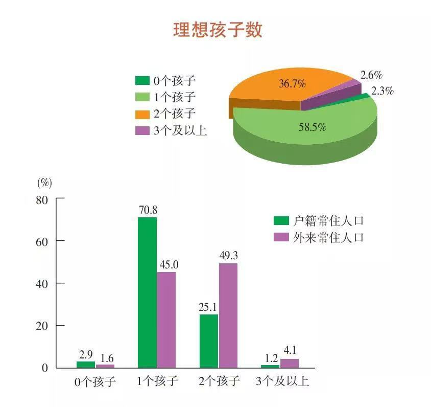
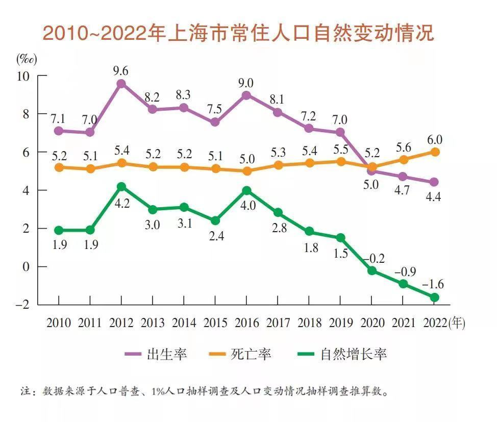

# 近6成上海常住人口理想只生1个孩子，不想生育下一个的最大原因找到

上海市统计局近日发布2022年人口变动情况抽样调查数据结果。根据调查，上海人口出生率继续呈现下降，“不打算生育（下一个孩子）的最主要原因”和“理想孩子数”的调查数据也出现在其中。记者从上海市统计局获悉，该数据系首次发布在该项统计报告中。

_不打算生育（下一个孩子）的最主要原因
本文图源：上海统计局_

相关数据显示，在上海常住人口中，不打算生育（下一个孩子）的最主要原因为“对现状满意”，占比近半，为41.8%，其次为“抚养成本高、经济负担重”，占比28.5%，“年龄或身体原因”占比13%，其后依次为“其他”“子女无人照料”“希望生活更加轻松自由”“担心工作或个人发展受影响”“缺少合适的入托、入学公共服务”（并列）“其他家庭成员的意见”（并列）。

而在“理想孩子数量”的调研上，1个孩子仍占上海常住人口理想孩子数的多数，占比为58.5%。2个孩子、3个及以上占比分别为36.7%、2.6%，理想孩子数为0的占比为2.3%。超七成上海户籍常住人口希望生一个孩子，近半数的外来常住人口的希望有2个孩子。

对于该项新数据的发布，复旦大学文科资深教授、发展研究院常务副院长彭希哲向澎湃新闻（www.thepaper.cn）记者表示，国家发改委等17部门于去年印发了《关于进一步完善和落实积极生育支持措施的指导意见》，要求加快建立生育支持政策体系，“一老一小”的问题也是民众最为关心的问题之一，因而统计局调查市民对“小”的讨论、通过数据回应老百姓最关切的问题，是很自然的事情。

**专家：生育内驱力不足问题凸显，对数据仍有待深入研究**

“我们经常说育龄人群是因为养育负担太重不想生，你仔细看数据，占比不是很高。”彭希哲指出，数据的发布或可为相关部门制定下一步的配套政策提供参考，“比如担忧子女无人照料的占比不高。我们推进0-3岁托育服务、3-6岁学前教育的配套设施建设，主要是为了缓解子女无人照料的问题，因此对这个数据要有更深入地研究，以便更合理有效地探索这部分的服务接下去如何推行、布点，或者我们下一个着力点放在哪里。”

不过彭希哲也指出，数据中“对现状满意”的选项，问题的指向性略模糊，或可在未来的发布中呈现更细化的分析，“选择这个选项的人，我们很难判断他是否是丁克、已有一个孩子或两个孩子，所以才没有下一个孩子的生育意愿，事实上这几部分人群的情况和诉求很不同，我们很难判断更具体的原因，也难以做出精准的政策回应了。”

上海户籍常住人口和外来常住人口理想子女数的差异，彭希哲认为，也体现了地域间的生育意愿差异，比如像河南、安徽、苏北等上海外来常住人口较多的地区，观念上或许会更喜欢两个小孩，“值得注意的是，生育意愿不代表实际在上海生育抚养，很多外来务工人员会选择回到家乡生育，这也会产生很多留守儿童的问题。”

华东师范大学校长助理吴瑞君是人口学领域的专家，她告诉澎湃新闻（www.thepaper.cn）记者，“对现状满意”的人群比重接近一半，有些超出她的预料。在今年的全国两会期间，吴瑞君曾指出，生育问题要分“不想生”和“想生不敢生”两类来探讨，在她看来，“对现状满意”的人群与“不想生”的人群应是高度吻合的，体现的是当下社会生育内驱力不足的问题。

“不想生这中间的问题是很复杂的，应该是整体的原因，比如养育成本越来越高、生育给家庭带来的效益越来越小、自己在机会成本等方面的考量，综合下来，就会不想生或不想多生。”吴瑞君说。

吴瑞君指出，“想生不敢生”的群体还可以以问题为导向制定政策，但针对内驱力不足的问题，碎片化的政策很难刺激，因此应着力建立一体化的生育支持体系，在今年的全国两会期间，她曾提交《关于完善婚嫁生育养育教育一体化生育支持政策体系的提案》，呼吁按照群众多元化的生育需求，长远结合，婚嫁、生育、养育、教育一体考虑，推进生育支持政策体系的建立。“生育文化的普及、就业环境的改善、女性友好育婴设施的建设、男性的育儿假等等，要全方位地去看待和推进这些问题，碎片化的政策现阶段能起到的效果已没那么理想，这个是我看到的生育的问题。”吴瑞君说。

**产科医生：女性生育年龄正在推迟，建议女性一胎生育在30岁左右**

生育问题也直观地体现在出生率持续下降的数据中。记者注意到，2010-2022年上海市常住人口自然变动情况表中显示，到2022年底出生率下降到了4.4，为近十年来最低。

_2010-2022年上海市常住人口自然变动情况表。_

上海市第一妇婴保健院西院产科主任黄一颖告诉澎湃新闻记者，作为一名产科医生，她注意到，近年来在临床上确实是出现了分娩量的下降。该院分娩量常年位居上海各大产科医院之首、全国前列，被市民们称为“上海大摇篮”。此前，伴随国家全面二孩政策的放开，2016年该院迎来分娩量最高值，一年达到近3.4万。“近几年，分娩量出现一些下降的趋势，在2.5万-3万之间，2022年，医院的分娩量达到2.6万余。”

不仅如此，黄一颖也感受到，由于女性的生育年龄正在推迟，生育第一个宝宝的年龄就相应有所推迟。一些女性会反映带娃压力大，尤其是职场女性，“谁来带孩子”这个问题是育龄女性思考的主要问题。

“一些女性生育第一个孩子的年龄如果在35岁了，那么如果要生二孩，一般情况下如果是剖腹产的话，需要至少间隔1年半，这样的话，超过35岁就会被列为高龄产妇，生育风险可能就高了。如果孕产妇有高血压、糖尿病等方面的基础性疾病，那考虑生育二孩就会更加慎重。”黄一颖说。

黄一颖进一步表示，随着医学技术的不断发展，从技术上来说，高龄分娩是可行的，尤其是在像上海这样的优质医疗资源富足的地方，但高龄伴随而来的是心脏和整个机体功能的退化，高龄怀孕对人体的负荷是会增加的，在妊娠期有可能一些潜在的疾病就会表现出来，出现不孕、流产的比例也会有所提高，怀孕可能会影响到孕产妇本身的安全。因此高龄女性的备孕、孕育新生命全过程，需要专业孕产医疗团队的精心保驾护航。

黄一颖建议，女性适龄生育一直是临床反复强调的，她建议女性生育第一个孩子最好在30岁左右，这样可以实现优生优育，同时如果有再生育一个孩子的打算，也可以留出时间，“一般情况下，如果女性生育第一个宝宝采取的是自然分娩，考虑到哺乳期以及身体的恢复时间，建议1年后再怀孕，这样2个宝宝间隔2-3岁是相对比较好的；而如果生育第一个宝宝采取的是剖宫产，剖宫产至少间隔1年半后再生，需要在生育前开展全面的检查，甚至可能包含生殖方面的检查，需要女性及其家庭给予更多的时间去关注。目前，我们也提出要为女性提供全生命周期的健康管理和服务的理念，做好优生优育工作，保障妇女儿童的生命健康。”

