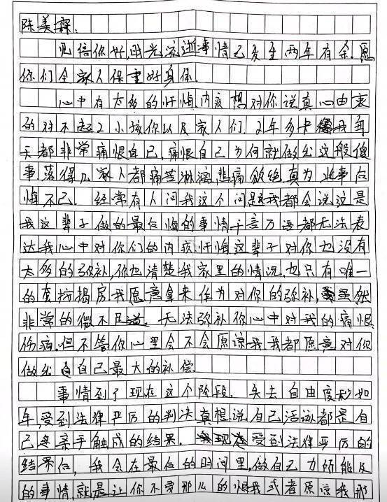
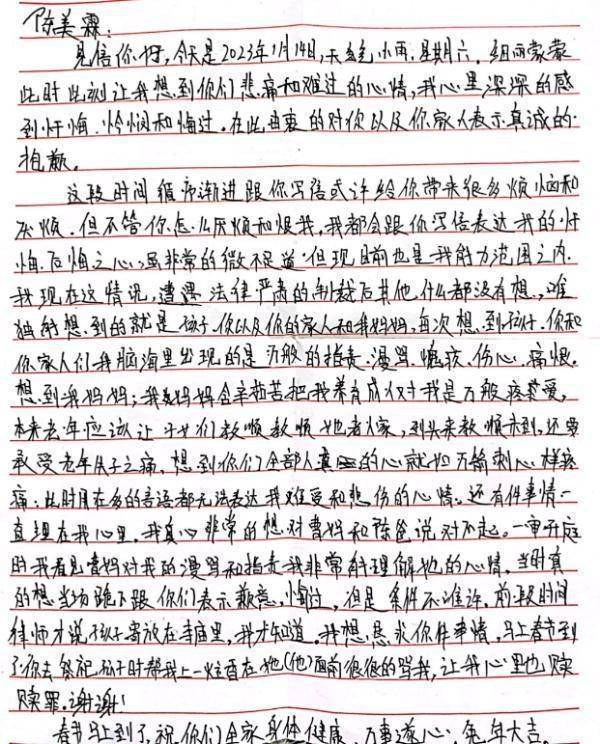
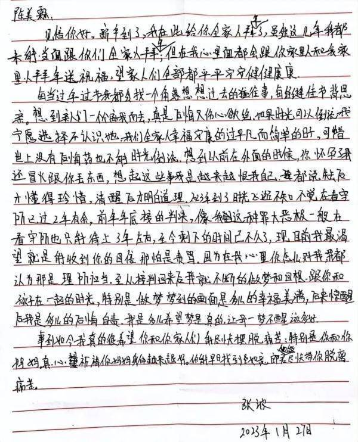

# 重庆姐弟坠亡案二审临近，生母发声：作为妈妈，拼了命都要他们死

据澎湃新闻3月28日消息，记者从重庆姐弟坠亡案两遇害小孩母亲陈美霖和权威渠道了解到，重庆市高院3月27日就该案召开庭前会议。庭前会议上，该案二审开庭时间暂定在4月3日。

_图/九派新闻_

2020年11月2日下午3时30分许，居住在重庆市南岸区锦江华府4单元15楼的雪雪（化名，殁年2岁）、洋洋（化名，殁年1岁）坠楼身亡。经重庆南岸区警方侦查，该起坠楼事件是一起故意杀人案，两个幼童的爸爸张波及其女友叶诚尘是嫌疑人。

据悉，在二审开庭前夕，案发后一直沉寂的张波突然在今年1月1日、1月14日、1月27日给前妻陈美霖写信表达忏悔，并请求她原谅。

28日，据九派新闻视频报道，遇害姐弟母亲陈美霖表示，后来还收到了前夫寄来的信，还在打感情牌。“信中说，几十年牢出来后，要怎么补偿我”。

陈美霖说，“我作为一个妈妈，拼了命我都要他们死，不管让我付出什么代价。”陈美霖说。

_杀子父亲及其女友。图/澎湃新闻_

据媒体此前报道，杀子父亲张波曾连续写信给陈美霖表达忏悔，并请求她原谅。

张波的第一封来信，也是他和陈美霖结婚多年以来给她写的第一封信，内容总结下来大致是这样的：

他感到内心无比的内疚和自责，痛恨自己的所作所为，想要对陈美霖全家人道歉，愿意把自己的一套按揭房赠给陈美霖当做补偿，希望能够获得一些原谅。

_图/光明网_

张波的第二封来信，主要内容依然是忏悔和道歉，开始借两个已离世的孩子来打感情牌，用大量的笔墨描绘了自己内心世界的挣扎和苦楚。随后话锋一转，恳求陈美霖去祭祀孩子时，能够帮他也上一炷香，在孩子面前狠狠骂他，以此减轻他的负罪感，让他心里舒服一些。

_图/光明网_

第三封信仍然还是以致歉和恳求原谅为主，说倘若时光能够倒流，他宁愿选择不认识叶诚尘，也要守住全家人幸福且平凡的简单日子。他渴望能够收到陈美霖的回信，哪怕是责骂，接着开始回忆以前两人在一起的点点滴滴。

_图/光明网_

思虑再三，陈美霖还是在今年2月8日给张波写了一封回信。在回信中，陈美霖表示，“如果像你和叶诚尘这样丧尽天良的行为都不能被判处死刑，那所有的孩子都将不再安全。所有的人伦良知都不再是生而为人最基本的底线。发生在我身上的悲剧不能再重演，不能再让任何一个孩子的母亲、父亲、爷爷奶奶、外婆外公去感受我和我父母现在每日每夜、每分每秒的痛苦和折磨。”

陈美霖的家人3月28日表示，命案发生至今，张波、叶诚尘的家人在明知他们家住址的情况下，从未就张波、叶诚尘犯下的丧失人性的命案向他们及陈美霖表达歉意，这让他们无法理解也不可接受。

2020年11月2日，一对姐弟坠楼身亡。案发当天视频里显示，两个幼童坠楼后，生父张波曾瘫坐在地上，边哭边拍打双腿，表现“悲痛”。然而警方侦查后发现，该坠楼事件是故意杀人案，父亲张波及其女友叶诚尘正是嫌疑人。

2021年12月28日，重庆市第五中级人民法院一审宣判：以故意杀人罪判处张波（生父）、叶诚尘（生父的女友）死刑，剥夺政治权利终身。

（来源：九派新闻、澎湃新闻、光明网、上海新闻广播）

