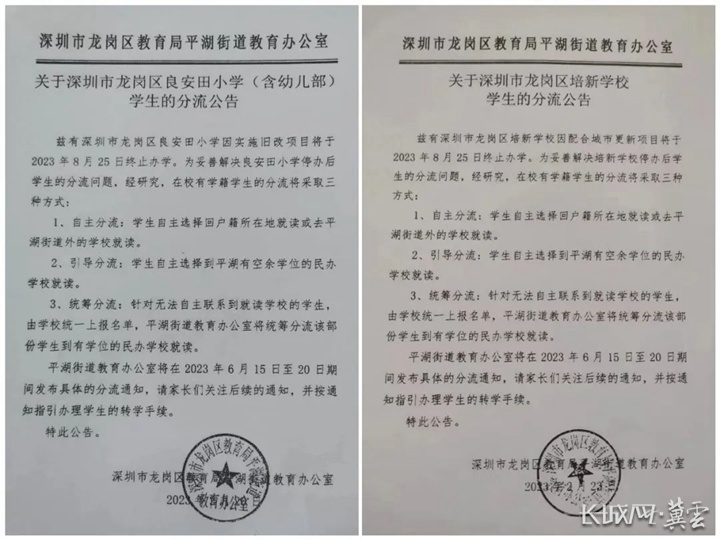

# 长城调查｜焦作惠州深圳四学校停办 民办学校倒闭潮或将来临？

**长城网·冀云客户端记者 吴新光**

继河南省焦作市武陟县私立学校——北街小学突然停办（见河南焦作一学校突然停办，当地教体局通报：正对学生逐个协调分流，24日所有学生正常就学）之后，近日，广东惠州、深圳两地又接连传出三所民办学校停办的消息。长城新媒体记者采访得知，事发地教育部门已介入处理，学生就近分流入学。一个月内，四所民办学校停摆，引发舆论广泛关注。

近期多地民办学校倒闭

近日，有家长在网络平台反映称，广东惠州仲恺高新区阳光实验学校倒闭了。

学生家长张先生证实了学校倒闭的消息。3年前，张先生的孩子转到阳光实验学校上学，现在读五年级。这学期开学，他刚刚给孩子交了1万多元的学费。“学校前段时间还在收校服钱，结果突然倒闭了。”张先生对记者说。

新学期开学还不到两个月，收了学生数千元至上万元的学费和伙食费等，却突然说孩子不能上学了，家长们非常气愤，心急如焚。

关于阳光实验学校倒闭的原因，有网友透露，该校拟定规模为27个班，包括小学18个班、初中9个班，而现在小学初中9个年级只有500多名学生，显然，这些学生的学费难以维持学校运营。

据阳光实验学校官方微信公众号介绍，该校是惠源教育集团在仲恺高新区开办的一所九年一贯制学校，系一所民办学校。

无独有偶，深圳龙岗区的两所民办学校近期也相继宣布停办。涉事的培新学校和良安田小学声称，将在本学期结束后不再办学。

公开资料显示，培新学校位于深圳市龙岗区平湖街道鹅公岭居委会旁，于2002年经龙岗区教育局审批，是九年制民办学校，2010年被评为深圳市一级学校；良安田小学位于平湖街道良安田社区丹平路旁，成立于2006年01月12日，为区一级民办学校，建有小学和幼儿园。

教育部门积极介入处理

3月27日下午，广东惠州仲恺高新区管委会宣教文卫办公室工作人员在接受长城新媒体记者采访时表示，由于阳光实验学校经营不善、运营困难，近一两周已经无法维持学校正常运转。教育部门积极介入处理，主动与校方、家长开展对接，收集诉求，回应学生家长关切，启动学生分流工作，全校400多名学生已经全部按照就近原则安排到仲恺高新区内公办学校就读，学生家长对分流安排普遍满意。

有阳光实验学校学生家长称：学校是给学生安排了，但是这学期交的学费、午托费、午餐费没有退给家长。那么，学生家长有没有可能拿回这些钱呢？这名工作人员说，仲恺高新区教育、劳动保障等部门联动，有关人员已组成劳动仲裁小组，将积极帮助学生家长依法维权。

3月27日下午，长城新媒体记者拨通深圳市龙岗区教育局电话，询问培新学校和良安田小学的分流安排。该局一位工作人员告诉记者，区教育局公布了一个学生分流方案，这两所学校已通过家长群告知了每一名学生家长。

_深圳市龙岗区教育局平湖街道教育办公室发布的分流公告。网络图片_

深圳市龙岗区教育局平湖街道教育办公室发布的分流公告显示，良安田小学因实施旧改项目、培新学校因配合城市更新项目，均将于2023年8月25日终止办学。公告称，对学生将采取三种分流方式：一是自主分流，学生自主选择回户籍所在地就读或去平湖街道外的学校就读；二是引导分流，学生自主选择到平湖有空余学位的民办学校就读；三是统筹分流，针对无法自主联系到就读学校的学生，由学校统一上报名单，平湖街道教育办公室将统筹分流该部分学生到有学位的民办学校就读。

相比河南武陟县北街小学的突然停办，深圳两所民办学校，给了家长一定的缓冲机会。这两所学校学生多为外来务工人员子女，因此，这两所学校的家长更关心的是分流问题。

龙岗区教育局回应称，对于提出需要政府部门统筹分流的学生，将在平湖街道内的民办学校进行分流，确保都有学上。经调查摸底，目前在平湖街道区域内的民办学校可满足两所停办学校所有学生的统筹分流需求。

深圳两所民办学校的部分家长认为，虽然当地教育局给了学生分流方案，承诺人人有书读，实际离家近的学校学位很少，都是偏远学校，部分学校还没有校车，家长们感到比较焦虑。

民办学校倒闭或成常态？

多所民办学校接连停办、倒闭，这是偶发事件？还是社会发展的必然趋势？

许多网友表示，民办学校倒闭、关停，各有各的原因。有的是因经营不善，出现资金链断裂，老师发不了工资，只能选择倒闭；有的是因生源减少，办学收入减少难以继续办学；还有的则因缺乏特色，在规范民办义务教育背景下，失去生存空间。不仅仅是近期爆出来的四所民办学校，正常来说，其他民办学校可能也有日子不好过的，学生数量多的可能会好一点，学生少的基本很难再维持下去。

_深圳市良安田小学家长在等待孩子放学。网络图片_

统计数据显示，2020年，全国共有各级各类民办学校18.67万所，比上年减少4820所。

网友“东东学说”分析，随着人口出生率的降低，生源会越来越少，人口流失大的地方，部分公办学校估计都难以招满，合并已经是大势所趋。而民办学校是自负盈亏，学费是学校主要收入，一旦生源减少，就难以生存，倒闭或许不可避免。3月份四所民办学校发生的一系列事情，估计只是多米诺骨牌的开始，未来可能会有更多民办学校出现财务困难。

网友“教而育之”说，控制招生规模、政府部门出台收费指导价等政策限制了民办中小学校的发展。义务教育具有强制性、普惠性。部分民办学校把办教育当成生意，不符合义务教育的特点，国家收紧政策，也是现实需要。随着新生人口不断减少，加上国家实施义务教育阶段民办学校的紧缩政策，民办学校关停潮可能会加速。

“如今，一些私立学校说倒闭就倒闭，受害的还是学生及家长。学校倒闭的事情并非小事，学校一旦倒闭，将直接对学生造成影响。”网友“教育小匠”认为，对于许多学生而言，他们已经适应了在原学校就读的环境，因为学校倒闭，他们不得不去其他学校就读，要适应新的环境，中途转学对学生来说是个不小的挑战。

我国《民办教育促进法实施条例》第十条规定，举办民办学校，应当按时、足额履行出资义务。民办学校存续期间，举办者不得抽逃出资，不得挪用办学经费。

教育学者熊丙奇表示，根据《民办教育促进法》，民办学校的举办者可以自主选择设立非营利性或者营利性民办学校。但是，不得设立实施义务教育的营利性民办学校。人民政府委托民办学校承担义务教育任务，应当按照委托协议拨付相应的教育经费。

为此，熊丙奇建议，应该完善应对机制，以保障每个适龄学生的求学权利。对于陷入办学危机的民办学校，地方政府部门不能袖手旁观。对于无法通过救助摆脱困境的民办学校，政府部门要妥善做好学生的分流、安置，在分流、安置过程中，要充分听取学生家长意见，坚持做到让这些学生就近入学。

**欢迎提供新闻线索：ccxmtxs@163.com**

