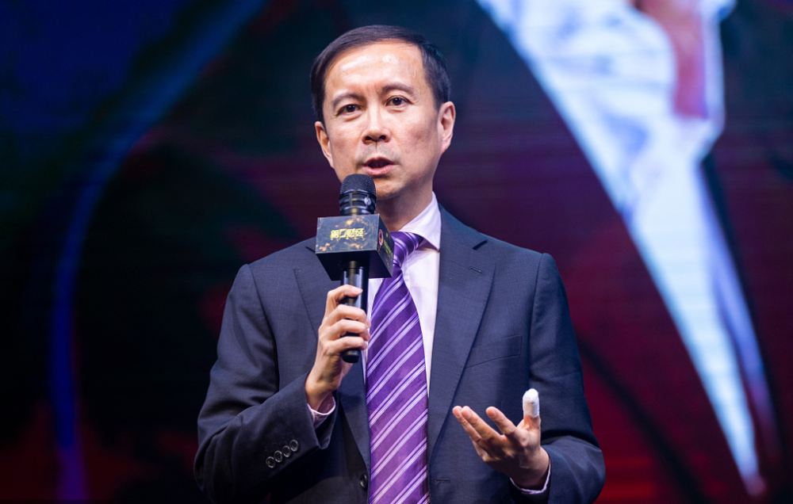

# 马云时代一去不复返：张勇拆散阿里巴巴，六大业务独立以后靠自己

_来源：视觉中国_

作者丨程潇熠

编辑丨康晓

出品丨深网·腾讯新闻小满工作室

在经历24年来最大的组织变革后，阿里巴巴正朝向一家控股集团发展，在放权给子业务部门的同时，也避免向超级平台过度发展。

3月28日，阿里巴巴集团董事会主席兼CEO张勇（逍遥子）发布全员信，开启成立24年以来堪称最大的组织变革，将业务拆分为六大业务集团和多家业务公司，独立运营且未来都有独立融资和上市的可能性。阿里巴巴集团则将全面实行控股公司管理。

这意味着曾经执着于将不同业务与阿里基因相融合，从上到下达成组织架构“大一统”的阿里巴巴集团正式放权，各业务分而治之。

**“公司大了以后，与其通过各种方式来鼓励大家协同，不如真正用市场方式来双向选择。”**
张勇在阿里内部称让各个业务独立、上市能解决员工“为谁而战”的问题，“大家不是为了完成绩效聚在一起，而是共同做一项事业”，事业是否成功不靠绩效考评，而靠市场检验。

张勇的期盼是，阿里巴巴集团能跑出若干个上市公司，经过几年后还能“生儿育女”，分出更多的上市公司，“这样我们业务才算走向繁荣。”

**企业管理注重效率。2015年，张勇提出“大中台-
小前台”中台战略时为的是效率——最大限度减少重复造车轮行为，尽可能复用已有能力。2023年，张勇推翻中台战略为的也是效率——阿里业务从地域上横跨全球，领域囊括消费、硬科技、文娱等，行业特质与周期各不同，组织分比合更敏捷。**

这一改变可以简单理解为：孩子很小的时候需要的营养类似，做大锅饭性价比最高；长大了各有口味和需求，分锅好算账也方便自驱动去觅食。

一位阿里巴巴内部人士告诉《深网》，大中台战略时代，电商业务是阿里核心和基石，其他诸多收购等方式组成的子业务集团，往往需要承担为天猫淘宝服务的任务，使得自身缺乏业务应有的创造性，而电商业务也因为给子业务输血缺乏足够活力；从未来趋势看，电商在阿里巴巴的战略地位不断下降，因此阿里弃中台、分而治之，激发子业务的活力也是顺势而为。

当然另一方面，未来张勇对子业务的干预和直接管理也不可避免会减少。

**阿里打算抹除“0.5组织”**

总结张勇的话来说：如今阿里的调整不是开始，而是阶段性成果，阿里从2020年开始就已在为业务拆分独立做准备。

2021年，阿里开始推行多元化治理结构下的经营责任制。同年双十一结束后，张勇在自己与事业群总裁间设立了四个分管大总裁，据《晚点》报道，分别为负责中国数字商业的戴珊、负责本地生活服务的俞永福，负责云业务的张建锋，以及负责海外数字商业的蒋凡。

阿里内部将四位分管大总裁形容为夹在0层CEO和1层事业群间的0.5层组织。

“6个大的业务集团，从0.5层变成真正的0层组织，为自己业务负全责。”张勇在内部称，此次阿里推出的“1+6+N”的组织结构，“1”是一个阿里（上市公司主体），“6+N”是六大业务集团和多家业务公司。“6+N”会建立独立的董事会，实行在该董事会领导下的CEO责任制，具体分配如下：

**·** 云智能集团，阿里巴巴集团董事会主席兼CEO张勇兼任CEO；

**·** 淘宝天猫商业集团，戴珊（苏荃）任CEO；

**·** 菜鸟集团，万霖任CEO；

**·** 国际数字商业集团，蒋凡任CEO；

**·** 大文娱集团，樊路远（木华黎）担任CEO。

**·** 除了这六个业务集团，还有盒马、平头哥、阿里健康等业务公司。

业务划分暗藏阿里的营收转变。

曾经的阿里集团靠淘宝、天猫两大营收支柱输血，供养阿里动物园。如今，阿里电商业务先是受拼多多冲击，被抢走了未来的增量市场；后是因直播电商的崛起，核心优势业务又受抖音、快手等平台挤占。GMV萎缩的同时，广告业务又被小红书、抖音等平台分吃，变现率下降。阿里其他业务需要扛起营收重任。

阿里巴巴集团的最新组织架构形式其实并不罕见。

2015年，谷歌重组。谷歌联合创始人兼CEO拉里·佩奇（Larry Page）与谢尔盖·布林（Sergey
Brin）创办了一家新的控股公司Alphabet，分别出任CEO和总裁。谷歌成为这家新控股公司旗下最大的子公司，而与谷歌核心互联网业务区别较大的业务则被分拆为新的子公司归为Alphabet的子公司。

彼时佩奇和布林的所作所为也是为了让日渐庞大的谷歌公司变得更为敏捷，“像创业公司一样有活力”。

中国自主品牌吉利控股集团也是类似的架构。吉利控股集团下设多个汽车集团及科技类子公司，吉利控股更多承担投资、战略等顶层设计任务，在这个组织架构下，吉利收购的沃尔沃、路特斯等车企都能在与集团协同的情况下保持独立性。

但问题在于，虽然这类架构是为了缩短决策流程，让组织更敏捷、决策更快速，但大的决策、财务审批仍需上报控股集团审批拍板，想要彻底抹除“0.5组织”这一流程环节难度极大。

**未来或将有更大规模企业重组**

张勇偏好用“横与纵”厘清战略思路。他对组织设计的总结是“在特定的时间点，解决纵和横、分和合的问题”，追求速度时要让业务分开纵向快跑，追求效率时要把一些东西横过来，让沉淀下来的基础支撑体系共享给其他团队。

“解决生产力的发展和创造不同，首先必须从生产关系的变革入手”。张勇在内部信中说。

一位资深互联网研究人士告诉《深网》，虽然我们已经身处信息时代，但仍在沿用工业时代便出现的科层制公司组织架构。

“公司发展，往往开始追求效率和速度，后面追求秩序，大公司病其实就是过于追求秩序的副产品。”上述人士说，因为科层制保证公司能够“有序”运作，但创新突破需要更充足的信息和讨论作为基础，“这就很难做到了。”

互联网行业及IT行业都是技术创新驱动的行业，创新突破对于各大公司下一时代的卡位至关重要。谷歌和华为目前的应对方式是推出小型“军团”。

“军团是Google的一个特殊组织，这个组织是由博士、科学家、工程师和营销专家组成的一个群体，这个群体一般也就五六十个人，但是他们的目标就是要做世界第一，不能做到世界第一，他们决不退出这个团体。”任正非直言华为的军团制借鉴了谷歌。

早在2004年，《纽约时报》就曾报道，“博士军团”是让仅有2000人的谷歌在创新能力上胜过3万人的微软的制胜法宝。如今，华为也通过军团模式正在快速切入煤矿、公路、海关、港口等传统行业以协助传统行业进行数字化和智能化转型。

但“军团制”并非通用良药，现代企业仍需探索出更符合智能时代要求的企业组织形态。

**腾讯新闻出品内容，未经授权，不得复制和转载，否则将追究法律责任。**

