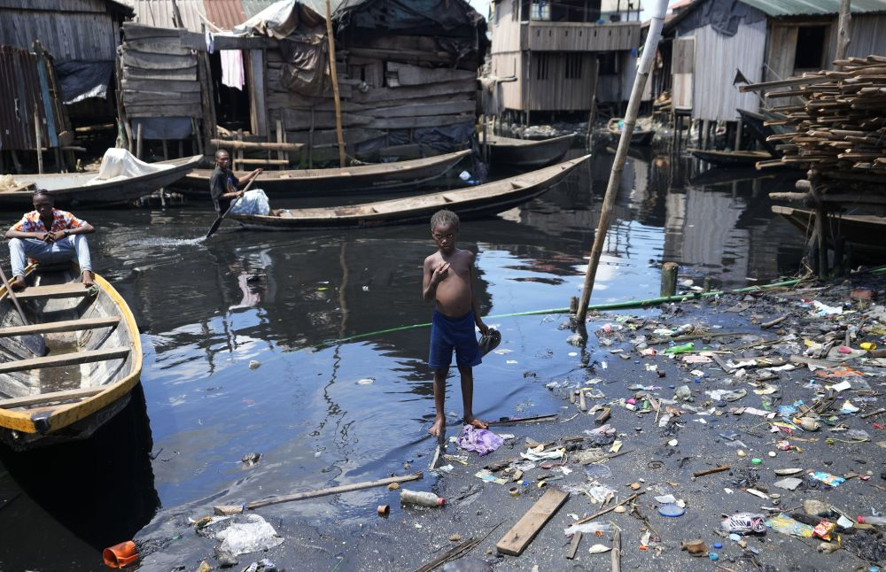
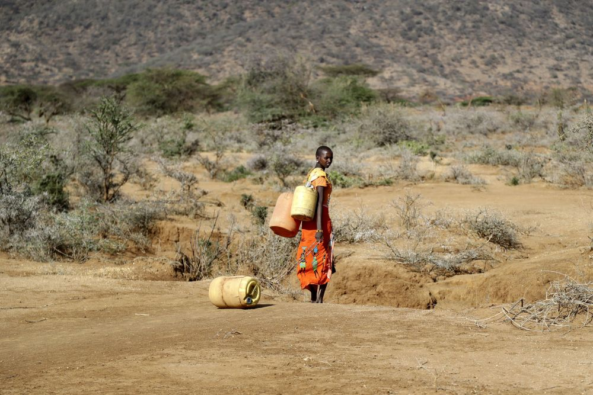
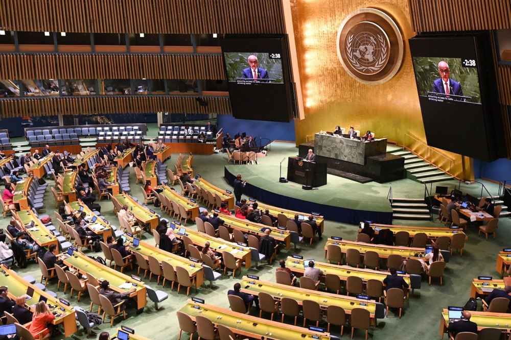

# 20亿人喝不上安全饮用水，人类或面临一场“水战争”

早在1995年，世界银行前副行长伊斯梅尔·萨拉杰丁曾说过：“如果本世纪的战争都是为石油而战，那么下个世纪的战争将是为水资源而战——除非我们改变管理这一宝贵且关键的资源的方法。”

近30年后，联合国在2023年3月21日发出警告：全球水资源危机已迫在眉睫。联合国当天发布的最新报告指出，目前全球10%的人口居住在高度或严重缺水的国家，近四分之一人口没有干净的饮用水，而到2050年，全球面临缺水问题的城市人口将翻倍。

“水是一项人权，也是塑造更美好未来的共同发展标准。但目前，水陷入了巨大的麻烦中。”联合国秘书长古特雷斯表示。

为应对这一危机，联合国时隔近半个世纪再次召开水事会议。外界本期待此次会议成为类似2015年巴黎气候大会一样的分水岭时刻，然而三天的会议结束，许多专家认为，国际社会在水危机上的行动还远远不够。

**20亿人喝不上安全饮用水**

水是生命之源。然而，面对这个和空气一般不可或缺的自然资源，人类的处境并不佳。

最新一期《联合国世界水发展报告》指出，目前，全球有20亿人（约占世界人口的26%）没有安全饮用水，36亿人缺乏管理得当的卫生设施。20亿-30亿人每年至少有一个月会面临缺水问题，这给他们的生计造成严重风险，尤其是粮食安全和电力供应方面。

而人类对于水资源的需求仍在持续增长。报告称，过去40年中，全球用水量以每年约1%的速度增长。在人口增长、社会经济发展和消费模式变化等因素的共同推动下，预计直到2050年，全球用水量仍将以类似的速度继续增长。这部分增长主要集中在中低收入国家，尤其是新兴经济体。

全球范围内的城市用水需求增长尤为明显，预计到2050年，城市用水需求将增长80%。而城市人口中面临缺水问题的比例正在上升。报告预测，未来几十年内，全球面临水资源短缺问题的城市人口将翻倍，从2016年的9.3亿增长至2050年的17亿-24亿。

地球表面大约70%的面积都被水覆盖，坐拥巨大的“水的行星”，为何人类仍会面临水危机？

美国西北大学海洋和气候科学教授布莱恩·赫尔穆特（Brian
Helmuth）对新京报记者解释称，“地球上水的总量大约为14亿立方千米，但这些水中绝大部分都是海水，只有大约0.01%可以作为人类和生态系统使用的淡水资源。其余的水要么是咸的，要么被封锁在永久冻土和冰川中，要么被污染了……”

_当地时间2023年3月20日，尼日利亚拉各斯，一个孩子站在被垃圾包围的脏水里。图/视觉中国_

在占地表面积70%的水中，海水占比高达97.5%。“除非我们能够提取出海水中的盐分，否则它不能作为淡水使用。”赫尔穆特称，“但海水淡化耗能巨大、成本也非常高，此外它还可能会造成巨大的环境代价。”

“所以说，我们谈到水危机，说的不仅仅是获得水本身，而是获得清洁、可使用的水资源。”赫尔穆特指出。

淡水资源有限，但随着经济的发展和全球人口的增加，人类对于水资源的需求也在不断增加。统计数据显示，从1960年到2014年，全世界的用水量增加了250%，但目前全球人均供水量比1970年减少了1/3。

全球水资源经济委员会（Global Commission on the Economics of
Water）3月中旬发布报告称，到2030年，全球淡水供应短缺将达到40%。

目前，全球水资源供应的不确定性正在增加。《联合国世界水发展报告》主作者理查德·康纳（Richard
Connor）在发布该报告的新闻发布会上称，若是不采取有效措施解决缺水问题，“这必将成为一场全球危机”。

**气候变化加剧水危机**

“世界正盲目地走在一条危险的道路上……吸血鬼式的过度消耗和过度发展、不可持续的用水、污染以及不加抑制的全球变暖正在一滴一滴耗尽人类的生命线。”联合国秘书长古特雷斯日前在谈到全球水危机时表示。

据美国有线电视新闻网（CNN）报道，康纳在新闻发布会上表示，城市和工业增长以及农业发展加剧了当前水资源短缺的问题。仅仅是农业用水一项，就消耗了全球供水量的70%。而城市扩张和工业化导致水供应减少、水资源需求增加，进一步恶化了缺水危机。

“可以看到，水资源短缺的问题正在全球范围内蔓延。”赫尔穆特指出，“但比较明显的是，干燥的地方正变得越来越干燥，譬如北非和中东地区的水资源压力尤其大。”

《联合国世界水发展报告》也指出，中东、非洲萨赫勒等水资源本就稀缺的地区，缺水问题无疑在恶化。而中非、东亚和南美洲部分地区等水资源较为丰富的地区，也面临着季节性缺水问题加剧的难题。

_当地时间2022年10月16日，肯尼亚桑布鲁县，一名妇女在取水。受气候变化影响，肯尼亚地区干旱加剧。图/视觉中国_

对此，赫尔穆特表示，随着城市化、工业化的发展，除水资源分布不均本身导致的缺水问题外，其他方面的因素正在导致水资源短缺问题恶化。譬如污染正在导致许多淡水资源丰富的地区也面临缺水危机，因为当地的水资源被化肥、杀虫剂、牲畜粪便等物质污染了。

举例来说，美国墨西哥湾的“氧气死区”（oxygen dead zones）就是由于陆地农业活动中的化肥通过密西西比河排入墨西哥湾造成的。

另一个重要因素则是气候变化导致降雨量出现变化。赫尔穆特称，譬如在美国西部地区，阶段性的强降雨之后是阶段性的长期干旱，这些不仅影响了当地的水资源供应，也导致当地面临土壤侵蚀、野火肆虐的风险。

气候变化被认为是加剧全球水资源危机的一个关键因素。康纳此前指出，气候危机导致极端、长期的干旱变得更加频繁和严重，这无疑会给生态系统带来巨大压力，由此也给动植物物种生存造成“可怕的后果”。

联合国政府间气候变化专门委员会上周发布的第六次评估报告的综合报告指出，全球大约一半的人口每年至少一部分时间会面临严重的缺水问题。而随着气候变化影响加剧，面临缺水问题的人口将持续增加。若是全球比工业化前升温幅度达到1.5摄氏度，世界上许多地区发生极端农业干旱的可能性将翻倍。

“气候变化可以说是一种‘威胁倍增器’，它会使原本存在的很多问题变得更糟糕，从而导致危机加剧。”赫尔穆特表示，水危机也是如此。

**水资源可能引发战争**

“水引发战争、浇灭大火，也是人类生存的关键。”《联合国世界水发展报告》指出。

水资源短缺正在引发移民、战争和冲突，让全球成百上千万人流离失所。《印度时报》2022年11月曾刊发一篇题为《水和第三次世界大战》的文章。文章称，全球正陷入一种生态失序的状态，由此水资源必将成为点燃第三次世界大战的导火索。

赫尔穆特也意识到水资源可能引发的冲突。他对新京报记者表示，“许多专家认为，水资源很快将成为全球地缘政治舞台上的一个重要角色，类似于我们现在看到的石油的角色。”

过去一个多世纪以来，为争夺战略性的油气资源，全球已爆发多起规模大小不一的“石油战争”，尤其是在油气资源丰富的中东地区。

而随着全球水危机不断加剧，多位国际组织领导人曾发出水资源可能引发战争的警告。1985年，联合国前秘书长布特罗斯-
加利曾说：“中东的下一场战争将是为水而战，而不是政治”。另一位前秘书长潘基文2007年也曾警告称：“水资源短缺威胁到经济和社会收益，也是战争和冲突的有力燃料”。

太平洋研究所（Pacific Institute）创始人皮特·格雷克（Peter
Gleick）过去几十年来一直在研究水资源短缺和冲突以及移民的关系。在他看来，关于水资源的冲突明显处于上升趋势。格雷克2021年在接受路透社采访时称，除了极少数例外，基本上没有人真的因为口渴而死亡，“但越来越多的人正在因为被污染的水和关于水资源的冲突而死亡”。

格雷克和他的团队编写了“水资源冲突年表”。根据他们的研究，截至2022年底，全球共发生过1200余起和水资源相关的冲突。这些冲突有全面战争，也有邻国间的小规模争端。格雷克表示，水在冲突中的角色可以分为三类：冲突的“导火索”、冲突的“武器”、冲突的“目标”。

为避免因为水资源爆发冲突，最好的解决方案是合作。当地时间3月21日，在被记者问及水资源短缺是否会引发战争时，康纳称，水这一必要的自然资源“应该引领和平与合作，而不是冲突”。

他表示，加强国际合作是避免因为水资源引发冲突的重要途径。据他介绍，全球153个国家共享大约900条河流、湖泊或水资源体系，其中过半已经签署了相关合作协议。

事实上，联合国方面已强调，水需要成为“全球政治议程的中心”。
古特雷斯表示，无论是防止疾病传播还是与贫困作斗争，无论是应对气候变化还是缺水和污染，水资源贯穿于2030年可持续发展议程及其17个可持续发展目标的方方面面。

最新发布的《联合国世界水发展报告》也重点强调国际合作对于缓解水危机的重要性，因为几乎所有与水相关的干预措施都涉及某种合作。“在关于如何使用和管理水资源方面加强国际合作，是防止未来几十年出现全球水危机的唯一途径。”报告称。

联合国教科文组织总干事奥德蕾·阿祖莱（Audrey
Azoulay）在报告发布时表示，“建立有力的国际机制，以防止全球水危机走向失控非常紧急且必要。水是我们共同的未来，因此共同努力以实现平等共享、可持续管理非常必要。”

赫尔穆特则认为，面对当前的水危机，将获得干净的水资源视为一项基本人权而不是一种可以买卖的商品，这一点非常关键。“就像空气一样，人类的生存离不开干净的水，因此地球上所有人都应该能够获得干净的水。”

**从马德普拉塔到纽约的46年**

时间退回到46年前。1977年3月，来自118个国家和地区的代表齐聚阿根廷马德普拉塔，参加首届联合国水会议。当时与会科学家就提出，水资源短缺的问题未来将成为一场深刻的社会危机。

在经过12天的磋商谈判后，与会代表达成了《联合国水会议宣言》，目标是在1990年前让所有国家共享干净卫生的水资源，避免在20世纪末期出现全球水危机。

这个目标显然未能实现。反之，近半个世纪后，全球面临着愈加严峻的水危机。而在过去的近半个世纪内，联合国再未召开聚焦水资源的大会。

为何过去近半个世纪没有召开水事会议？“答案很简单，那就是水资源问题在国际可持续发展议程上一直没能处于前排位置，至少迄今为止一直如此。”国际水资源管理研究所副总干事瑞秋·麦克唐纳（Rachael
McDonnell）认为。

_当地时间2023年3月23日，美国纽约，联合国水事会议现场。图/视觉中国_

1977年的水事会议之后，联合国于2015年通过了2030年可继续发展议程，设定了17项可持续发展目标。其中第6项目标就是关于水资源，“为所有人提供水和环境卫生，并对其进行可持续管理”。

而此后几年不管是联合国粮食安全会议，还是联合国气候大会，都未将水资源问题作为优先议程。荷兰国际水务特别代表亨克·欧文克（Henk
Ovink）称，水资源问题必须在未来的联合国议程中占据稳固的位置，“我们不能再等一个46年，因为目前正在发生的已经太可怕，且它还会恶化。”

在这样的危机时刻，联合国于当地时间3月22日至3月24日第二次召开了水事会议。会议由荷兰和塔吉克斯坦共同主办，超过2000名全球各界代表齐聚美国纽约联合国总部，共同商讨如何应对愈演愈烈的全球水危机。

会议开始前，荷兰和塔吉克斯坦的特别代表曾表示，此次会议或成为水资源问题的“巴黎时刻”。2015年的巴黎气候大会上，与会代表通过了《巴黎协定》，设定了将全球平均升温幅度努力控制在1.5摄氏度以内的目标，这被认为是气候变化议题的分水岭时刻。

本次会议通过了《水行动议程》（Water Action
Agenda），包含近700项来自各方旨在保护“人类最宝贵的全球共同利益”——水资源的相关承诺。联合国称，该议程提出了一系列务实的、改变游戏规则的承诺，包括作出更明智的食物选择，对水作为强大经济驱动力意义的重新评估，以及承认水是地球文化遗产的一部分等。

古特雷斯在闭幕致辞中表示，过去几天，2000多名与会者共同打造了一个“雄心勃勃的愿景”。“你们致力于行动和变革，正在推动我们为了全人类和地球迈向一个可持续、公平和包容的水安全未来。”

然而，许多观察人士和专家认为，此次会议的结果并不尽如人意。《卫报》报道指出，面对当前不断加剧的全球水危机，世界需要的不是一系列并无约束力的承诺，而是一个类似于2015年《巴黎协定》、2022年《昆明-
蒙特利尔全球生物多样性框架》的正式全球协议，以及一个保护全球水供应的财政机制。

3月24日上午，来自五大洲研究机构和民间社会团体的100多位水资源专家联合致信联合国秘书长，抨击此次会议缺乏“责任、严谨和雄心”。

“试图通过自愿承诺和基于不成熟证据达成的方案来解决人类面临的最大挑战之一，就像拿着刀去参加枪战。”致力于推动水资源可持续管理的组织Water Witness
International创始人尼克·赫普沃斯称。有专家认为，在这700多项承诺中，大约只有三分之一可以明显改善水危机。

但第77届联大主席克勒希在闭幕致辞中表示，虽然这次会议的成果不是一份具有法律约束力的文件，但它翻开了“历史性的一页”。他指出，各方为支持《水行动议程》作出的3000亿美元的承诺，有可能释放出至少1万亿美元的社会经济和生态系统收益。

联合国在应对水危机问题上的行动力也在加强。欧文克表示，联合国将在今年7月的另一次水资源会议前对此次会议提出的计划进行审查。此外，古特雷斯将在今年9月的可持续发展目标峰会前任命一名水务问题特使。

不过，虽然此次峰会让世界走在应对水危机的正确道路上，许多与会专家表示，国际社会的行动力仍然不足。正如《国际湿地公约》秘书长穆桑达·蒙巴在其总结发言中所说：“水危机无处不在……我们已经没时间了。”

新京报记者 谢莲

编辑 张磊 校对 谢莲

