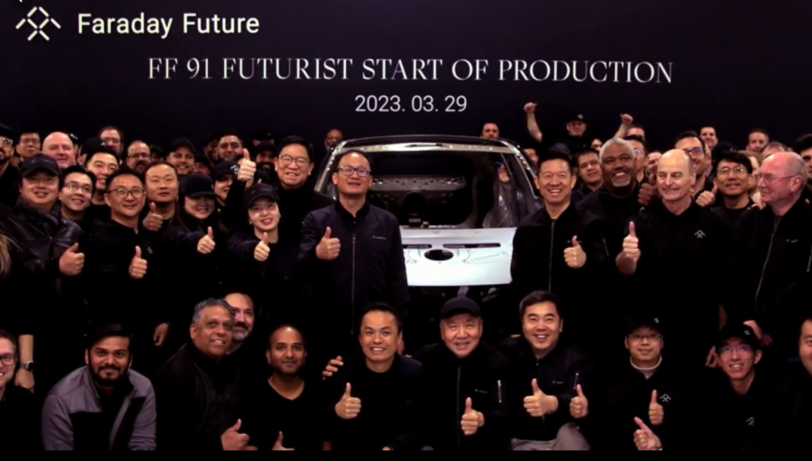
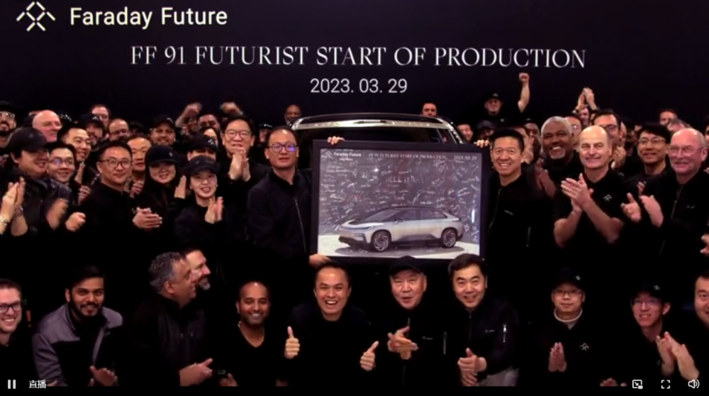
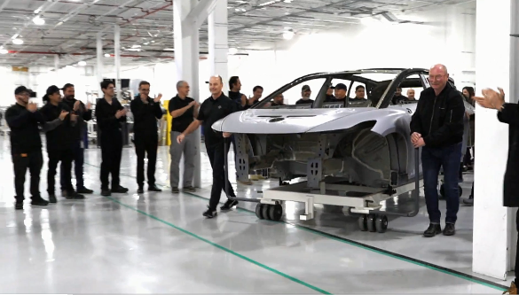
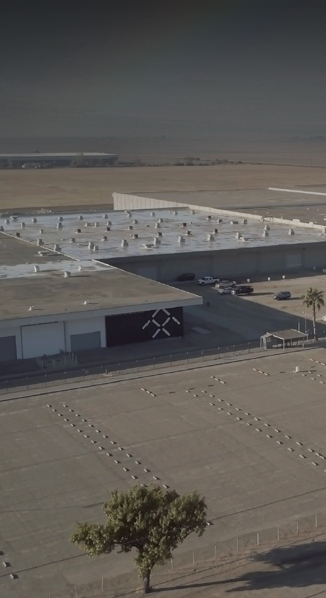
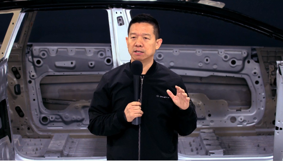
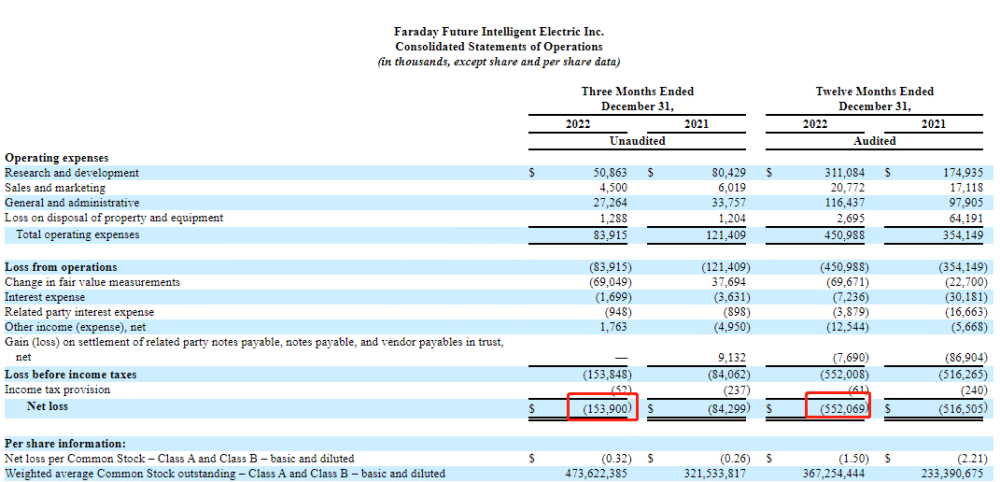

# FF 91官宣启动生产，贾跃亭：九年，为梦想窒息，终于迎来巅峰时刻

每经编辑：杜宇

据法拉第未来官方微博3月29日消息，北京时间3月30日上午7:30，FF ieFactory California正式启动生产FF 91
Futurist，现场举行发布活动，FF全球CEO陈雪峰先生、FF创始人兼CPUO贾跃亭先生、FF全球产品执行高级副总裁Matthias
Aydt等进行演讲并展示FF ieFactory California工厂现场。这是极智科技奢华超级塔尖市场的开创者Faraday
Future首次正式宣布启动生产FF 91 Futurist。

_图片来源：法拉第官方微博_

_图片来源：法拉第官方微博_

_图片来源：法拉第官方微博_

_图片来源：法拉第官方微博_

**贾跃亭在演讲中感叹到：“九年，为梦想窒息，终于迎来巅峰时刻”。**

_图片来源：法拉第官方微博_

作为唯一一款下一代极智科技奢华的智能互联网电动车产品， **FF 91 Futurist对标法拉利、迈巴赫、劳斯莱斯和宾利**
，以极限科技、极致用户体验和完整生态的产品DNA，带来了独特的智能互联网电动车出行体验。FF 91 Futurist拥有行业领先的1,050匹马力，
EPA认证续航里程381英里，0-60英里加速仅需2.27秒。

财报显示，2022年年度， **FF净亏损为5.52亿美元（折合人民币约38.49亿元）**
，而上年同期的净亏损为5.16亿美元。其中，2022年第四季度，FF亏损1.54亿美元，2021年同期三个月的净亏损则8430万美元。

_图片来源：FF公告_

对于2022年度公司净亏损加大的原因，FF方面解释称，主要是因为公司2022年工程、设计和测试（ED&T）费用成本增加，以及2022年某些以公允价值计量的应付票据和认股权证负债的公允价值计量变动增加等影响。

公开数据显示，自2014年成立至2022年年底， **FF累计亏损已达34.35亿美元（折合人民币约239.4亿元）** 。

截至当地时间3月29日美股收盘，法拉第未来报0.355美元，涨幅2.01%，市值2.69亿美元。

每日经济新闻综合法拉第未来官方微博、公开资料

FF 91 Futurist开始生产，贾跃亭：将分三类别三阶段交付

