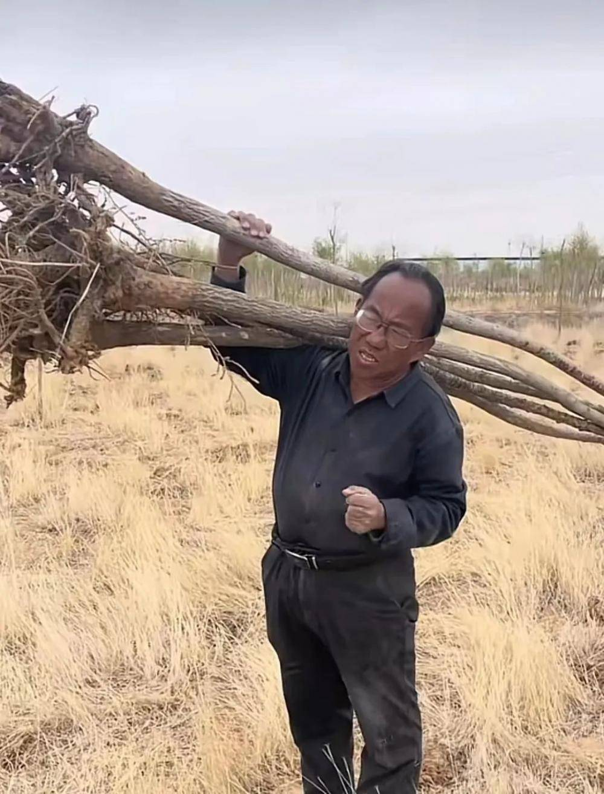

# “跪哭求水”背后：一文看懂宁夏黄沙中种树有多难

宁夏灵武一林场树木被煤矿“断水”面临枯死，六旬林场主跪地求救，此事引发网友关注。在宁夏黄沙中植树有多难？上游新闻整理了一组资料。

**“养娃娃容易，沙漠里种树难”**

“养个娃娃容易，在沙漠里种棵树难”，这句流传在治沙人口中的俗语生动形象反映了在沙漠中种树的难度：比养娃还难。

“一年一场风，从春刮到冬。天上无飞鸟，地上无寸草。”这句在甘肃当地流传的顺口溜，道尽了沙漠给当地百姓带来的苦楚。

2008年，中国广播网的一则新闻中提到，宁夏生态环境十分脆弱，荒漠化土地占国土总面积的57.2%，2008年出台的《国务院关于进一步促进宁夏经济社会发展的若干意见》中明确提出，制约宁夏的主要因素是水资源短缺和生态脆弱。按照该新闻发出时的统计，与全国平均水平相比，宁夏的森林覆盖率、林木绿化率、绿地率还有很大差距。其中，主要原因是成活率不高，保存率较低。

**在当地水有多金贵？**

在宁夏种植乔木比较消耗水，是否应该种植低矮灌木？孙国友表示，自己种植乔木，正是因为林场有水源。

据西部决策报道，宁夏是全国水资源最匮乏的省份之一。水资源人均占有量只有全国平均水平的1/13，黄河流域的1/3。

资料显示，宁夏灵武地处毛乌素沙漠西部。毛乌素沙漠是我国四大沙地之一，横跨内蒙古鄂尔多斯、陕西榆林、宁夏盐池，面积超过4.2万平方公里。这里本是广袤原野，唐代以后，受连年兵燹、滥垦滥牧影响，加之气候变迁，逐渐沦为沙海。千百年来，黄沙滚滚，逼得周边城市连连后退，村庄支离破碎，百姓苦不堪言。原本在塞北的流沙，到1949年已越过长城50多公里，并以每年百米左右的速度向南扩张。当时专家预测，不出20年，4万多平方公里的榆林将被黄沙彻底吞没。

央视财经在报道治沙英雄王友德时，展示了出生于宁夏灵武马家滩镇的王有德的一段回忆，展现了当地早年间的情况。马家滩镇也正是媒体报道孙国友承包林场的地方。

在王有德最早的记忆中，家乡的村庄周边是长满了各种植物的沙地。因为过度的放牧和挖掘沙漠药材，使这里的生态环境形成恶性循环，风沙越发地猖獗。难以忍受的风沙，贫穷和饥饿，让王有德的童年记忆痛彻肺腑。

人退沙进，沙进人退。十几年里，马家滩镇前后有20多个村子被黄沙掩埋，3万多人被迫迁移，200多种动植物随之消失。

**黄沙中植树有多难？**

在中国妇女杂志对毛乌素“治沙女王”殷玉珍的一篇报道中，或可见端倪。最早，夫妻二人用工钱换回600棵树苗子，殷玉珍全栽到了房前屋后，但最后只活了不到10棵。能活10棵就能活100棵、1000棵……接着种！有一次夫妻俩正在种树，突然刮起了沙尘暴，一时间天昏地暗，分不清东南西北，最后循着自家的狗叫声才慢慢摸了回去。这样的场景，活脱脱现实版的《山海情》。

毛乌素也不是“铁板一块”，中国治沙人在多年摸索中已经有自己的成功经验——“草方格”，让在沙地中种出绿洲成为了可能。

具体操作就是，把废弃的麦秆或者麦草一束束呈方格形状铺在沙丘上，然后再用铁锹轧进沙子里，把麦草的1/3或一半自然坚立在四边，接着把方格中央的沙子移到四周麦草的根部，让麦草牢牢地固定在沙地上。

也可以在方格中间撒上草籽，这样一来麦草不仅阻止了流沙，草籽还会在下雨的时候发芽，腐烂干枯的麦草又作为肥料滋养草种的生长。

别小看这一简单的“草方格”，在沙漠里治沙、种树，靠的就是这个方法。位于陕西和内蒙古之间的毛乌素沙漠，就是这样被“干掉”的。位于河北省北部的塞罕坝，荒寒遐僻之地上，也种出了世界最大人工林。

光明网今年1月报道中提及的最新统计数字显示：毛乌素沙区治理率超过80%，林木覆盖率达30%，流沙基本“拴牢”，森林小气候效应初步显现。专家的结论是，毛乌素已完成世界上最大面积的生态逆转。

综合中国广播网、光明网、央视财经、西部决策、杭州日报等

编辑：邹渝

责编：王蓉 官毅

审核：冯飞

