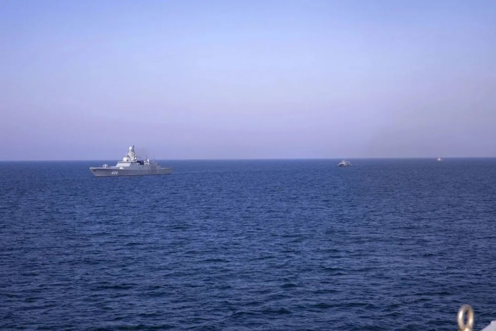
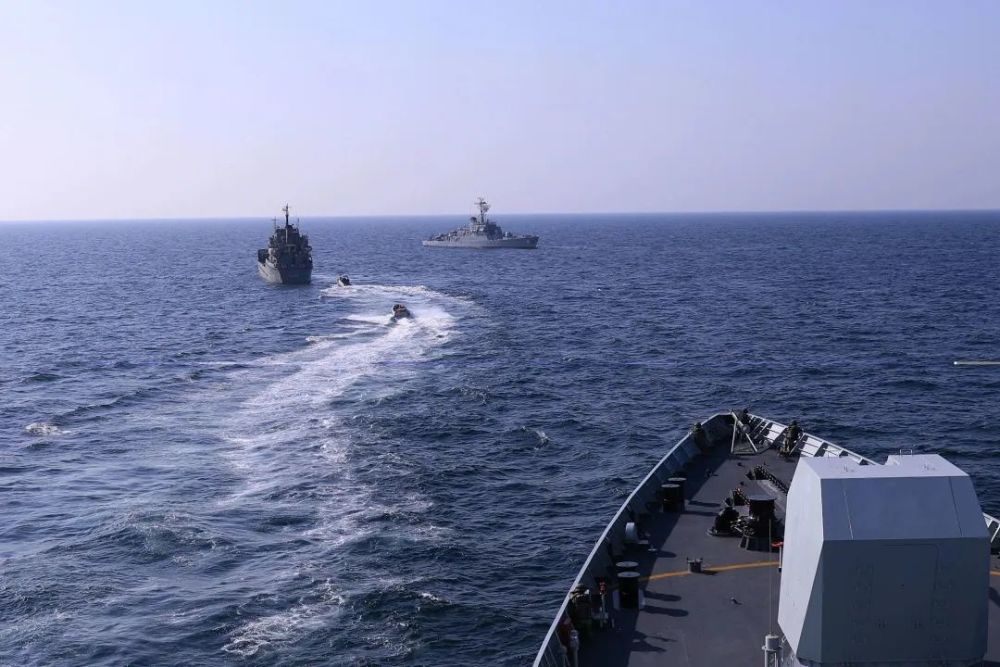
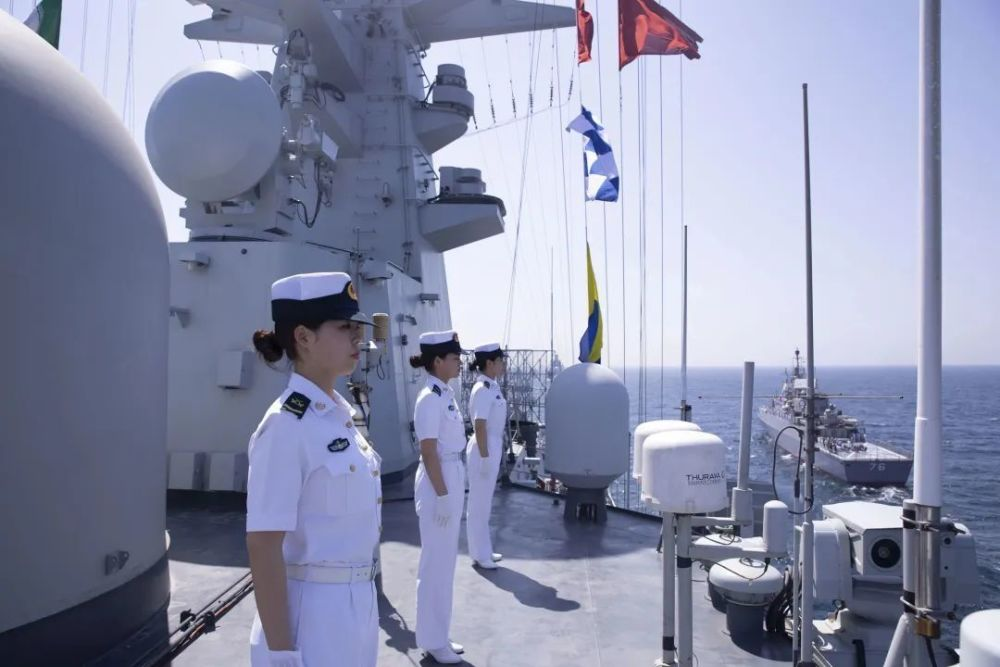

# 中、伊、俄近期举行海上联合军演，国防部介绍有关情况

**“安全纽带-2023”为维护海上安全和地区和平稳定贡献积极力量**

3月30日下午，国防部举行例行记者会，国防部新闻发言人谭克非大校答记者问。

记者：据报道，中国、伊朗、俄罗斯三国海军近期举行“安全纽带-2023”海上联合军事演习。请发言人进一步介绍联演有关情况。

谭克非：3月15日至19日，中国、伊朗、俄罗斯三国海军在阿曼湾海域举行“安全纽带-2023”海上联合军事演习。这是中伊俄三国继2019年、2022年之后第三次举行海上联演。三方共派出12艘舰艇及特战分队、潜水分队等兵力参演，主要进行了空中搜索、武力营救、临检拿捕、海上救援等科目演练，并举行海上分列式。

此次演习，提升了中伊俄三国海军共同遂行海上多样化军事任务能力，进一步深化了传统友谊和务实合作，为维护海上安全和地区和平稳定、服务构建海洋命运共同体贡献了积极力量。

_参演舰艇向指定海域集结。吴亢慈 摄_

_参演舰艇进行演练。吴亢慈
摄_

_海军南宁舰参加阅舰式。吴亢慈
摄_

来源 国防部发布

实习编辑 赵司尧

流程编辑 马晓双

**相关报道：**

中国军队采取必要措施，坚决捍卫自身领土主权和海洋权益

