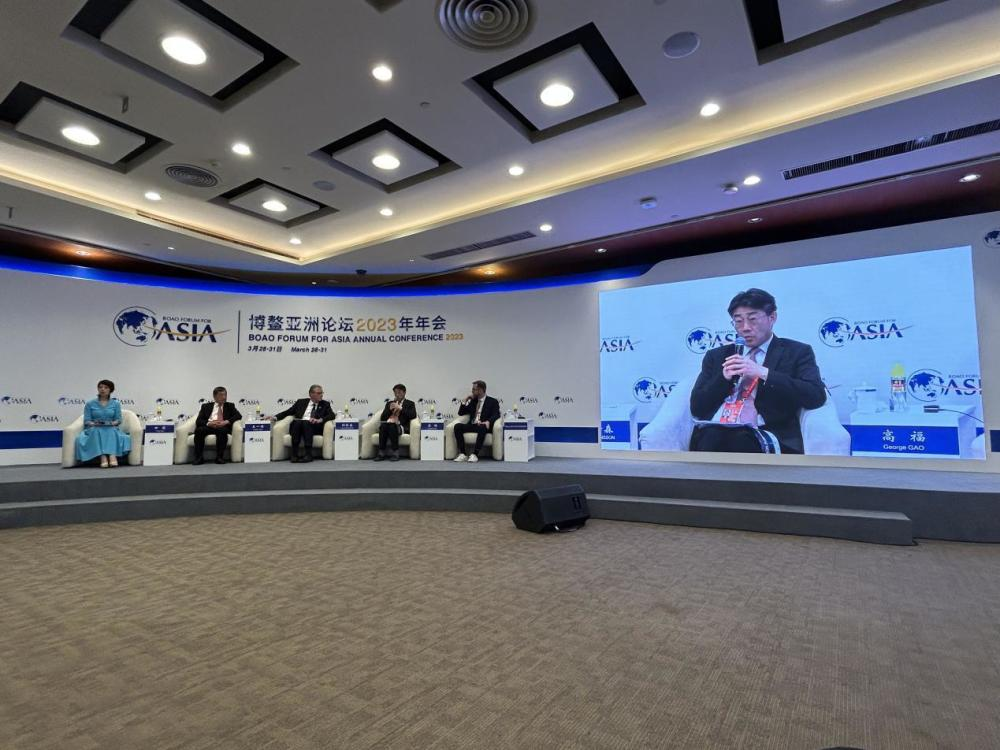

# 中疾控原主任高福：在等世卫组织宣布疫情终结，“长新冠”是明显事实

_2023年3月29日，高福在博鳌亚洲论坛年会“终结新冠大流行”分论坛上。 （南方周末记者
韩谦/图）_

新冠疫情暴发已过3年，现在还应不应该担忧新冠？

“我们既不能有新冠恐惧症，也不能有新冠忽视症。”2023年3月29日，在博鳌亚洲论坛年会一场主题为“终结新冠大流行”的分论坛上，中国科学院院士、中国疾病预防控制中心原主任高福回应了主持人抛出的这个问题。

会场里，聚集了近百名参与年会的代表和媒体记者，已经有不少人不再佩戴口罩。在高福看来，“我们在等待世界卫生组织来宣布新冠疫情终结，现在已经不是大流行，而是变成了地方性流行疾病”。

不过，当有记者问及是否还需要打第四针、第五针新冠疫苗时，高福的回答是“我们的判断还是要打”。

此外，高福提醒在场者，根据中国的数据，已经有很多证据表明存在长新冠的现象。“长新冠是一个很明显的事实。事实就是事实，这才是科学”。

所谓长新冠，通俗的理解就是新冠后遗症。根据世界卫生组织的定义，长新冠是指感染新冠病毒3个月后还有症状，最少持续2个月，且不能用其他疾病来解释这些症状。长新冠常见症状包括疲劳、呼吸短促和认知功能障碍等。这些症状可能在从急性新冠发作初步恢复后出现，或在最初新冠感染后持续存在。

深圳市第三人民医院院长卢洪洲在此前接受媒体采访时就表示，“长新冠”会对呼吸、心血管、神经、消化、泌尿等系统造成一定损伤。比如，呼吸系统的后遗症包括肺部炎症、肺纤维化。重症患者会有肺部血栓形成等，患者康复后仍会留下一些慢性的肺功能损伤。随访两年后发现，这部分患者的肺功能检测指标显示异常，尤其重症的患者，这种损伤表现更为明显，持续时间更久。

在这场关于新冠疫情的分论坛上，主持人还问及高福，回顾过去三年，在中国对疫情的应对中，哪些方面做得好，哪些方面可以改善，以更好地应对下一次可能发生的大流行病。

高福回应，2019年12月底，中国注意到了新冠病毒，做了很多努力，“我们表现得很好”。此外，高福建议，需要关注基础研究，加大对卫生领域的投资。对于疫情初期信息存在不透明的问题，高福则表示，“我们不想把所有原数据不做任何合理分析就发布出来，开放、透明以及负责任的态度是我们的战略性政策。”

南方周末记者 韩谦

