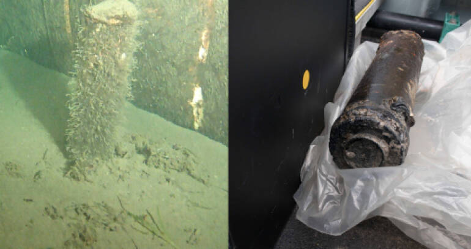

# 丹麦发布声明：“北溪-2”附近不明物体系海上浮标，无安全风险

（观察者网讯）据丹麦《贝林时报》当地时间29日报道，丹麦能源署当天表示，此前在“北溪-2”天然气管道附近发现的不明物体系海上浮标，不会构成安全风险。该浮标现已被移交给丹麦情报部门。

据悉，丹麦海军当地时间28日在
“北溪-2”股份公司代表的监督下，从73米深的海底将该物体打捞上来。丹麦能源署在一份简短的声明中写道：“调查表明，该物体是一个空的海上烟雾浮标，用于视觉标记。该物体并不构成安全风险。”

报道称，烟雾浮标形似手榴弹，可在海上喷出橙红色烟雾。这能帮助落水人员发出信号，争取救援等。丹麦国防部在一份给《贝林时报》的电子邮件中透露，该物体现已被移交给丹麦国防情报局做进一步调查。

_丹麦《贝林时报》报道截图_

_被打捞上来的浮标。图片来源：丹麦能源署_

丹麦早前检查“北溪-2”剩余最后一条完整管道时，发现了这个高约40厘米、直径约10厘米的圆柱形物体。为进一步弄清其性质，丹麦当局其后邀请“北溪-2”管道运营商一同参与打捞行动。塔斯社当时的报道提到，在距离爆炸现场约30公里处，俄罗斯专家发现了一个圆柱状物体。俄专家推测，这可能是接收信号的天线，用于引爆可能埋设在管道下方的爆炸装置。

去年9月底，由俄罗斯经波罗的海向德国等欧洲国家输送天然气的“北溪-1”和“北溪-2”管道发生爆炸泄漏，各方普遍认为这一事件系“蓄意破坏”。在丹麦境内的泄漏点位于东部博恩霍尔姆岛附近，《贝林时报》29日援引博恩霍尔姆电视二台报道称，烟雾浮标经常被冲到博恩霍尔姆岛的海岸上。

丹麦、瑞典和德国正分别开始对此进行独立调查。俄罗斯方面曾多次呼吁共同调查，但遭西方国家拒绝。今年2月8日，美国知名调查记者西摩·赫什在其个人网站发布调查报道，指“北溪”天然气管道系由美国和挪威军方在拜登的授意下策划炸毁，但西方政府和媒体却对此保持“诡异的沉默”。

在这一重磅爆料后近一个月，美国《纽约时报》和多家德国媒体本月7日同时援引不同消息人士放出新料，前者指认幕后黑手为“亲乌”团体，后者亦声称“线索指向乌克兰”。乌克兰总统办公室顾问波多利亚克否认乌克兰与北溪管道事故有关，克里姆林宫则回应说，美德媒体的最新报道是在“协同释放假消息”，企图把公众视线从真正的袭击元凶身上转移。

就在丹麦公布此次调查结果前，联合国安理会当地时间27日未通过一项由俄罗斯提交的、推动联合国对“北溪”管道爆炸事件开展国际调查的决议草案。俄罗斯、中国和巴西投票赞成，其他安理会成员弃权，该草案未能获得批准所需的9票。

俄总统新闻秘书佩斯科夫28日回应称，俄方对联合国安理会未通过有关决议草案表示遗憾。他强调，俄方将继续为各方参与客观调查努力。俄外交部发言人扎哈罗娃也对投票结果表达了失望。她指出，由于西方代表以保护国家安全利益为借口阻挠调查，国际社会错过了机会，没有及时发出明确信号以表明“类似袭击不可接受”，将导致全球能源基础设施安全处于直接威胁之下。

中国常驻联合国副代表耿爽27日出席联合国安理会会议时强调，安理会成员虽未就授权开展国际调查达成一致，但各方都支持查明真相，早日将肇事者绳之以法。中方期待开展国别调查的国家增强紧迫感，及时、定期向安理会报告调查进展，尽早查明并公布调查结果。安理会有责任继续对爆炸事件保持关注，包括定期举行通报、采取必要的进一步行动等，切实肩负起维护国际和平与安全的责任。

**本文系观察者网独家稿件，未经授权，不得转载。**

