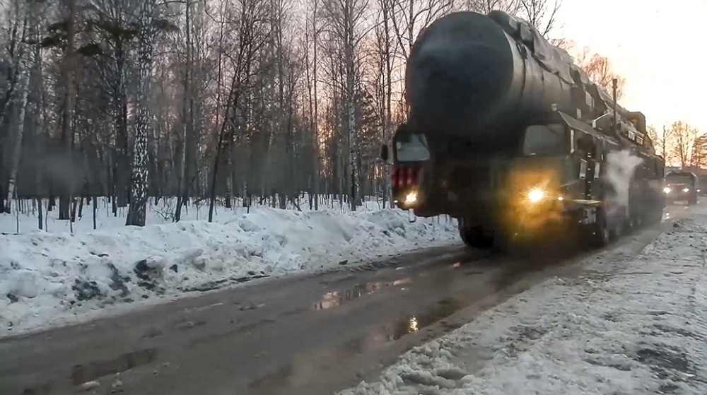
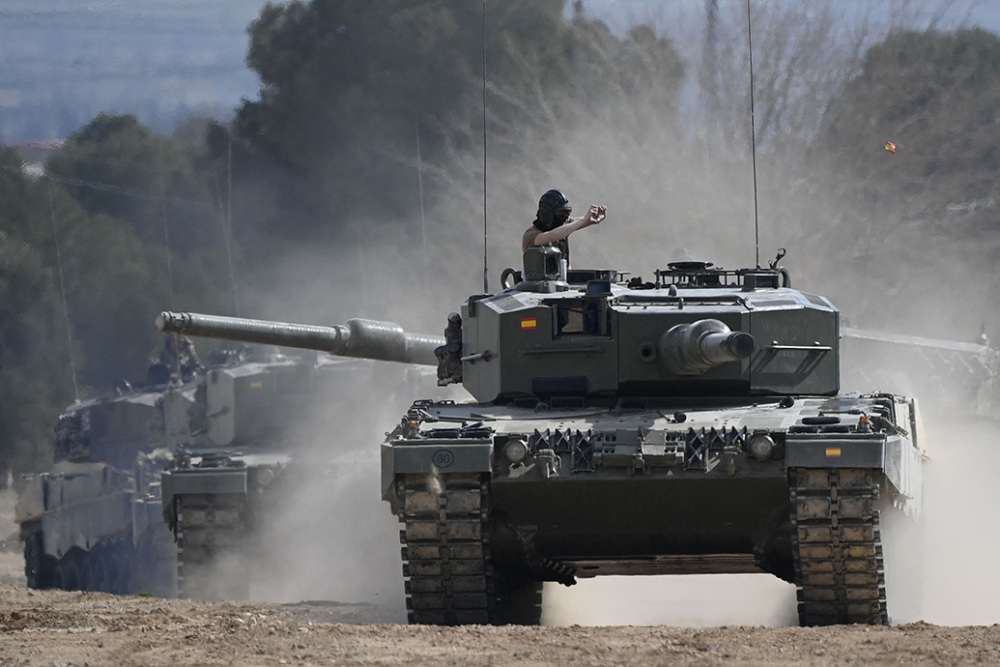
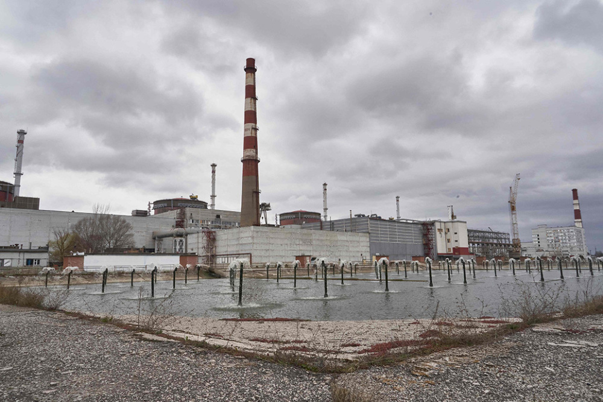
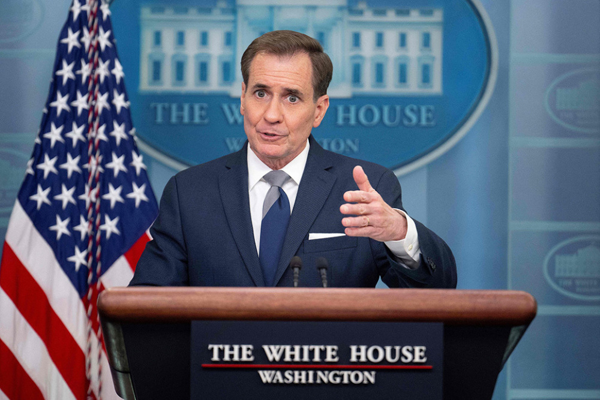

# 俄乌冲突已持续400天，双方均未取得明显进展，美俄停止交换核数据

截至3月30日，俄乌冲突已持续400天，双方均未取得明显进展，乌东部城市巴赫穆特仍然是冲突焦点，该城镇和周边地区不断受到轰炸。

与此同时，俄乌两军在乌克兰扎波罗热核电站及周边地区的战事也不断升级，国际原子能机构（IAEA）总干事对此警告称当地局势危急，希望俄乌早日就有关核电站安全保护的事宜达成一致。

_当地时间2023年3月26日，顿涅茨克地区，乌克兰军队与俄罗斯军队激战的巴赫穆特，烟雾从建筑物中升起。本文图均为视觉中国图_

“就像末世电影中的场景”

路透社3月30日报道称，在俄乌冲突中，矿业城市巴赫穆特和乌顿涅茨克州东部工业区的周边城镇一直是冲突的焦点。双方皆损失惨重。

乌克兰武装部队总参谋部在其例行的夜间报告中说：“敌军在攻击巴赫穆特的行动中取得了一定程度的成功，但我们的守军守住了这座城市，击退了无数次敌人的进攻。”

另据《卫报》29日消息，俄罗斯私人军事集团瓦格纳的负责人叶夫根尼·普里戈津表示，巴赫穆特的战斗“几乎摧毁了”乌克兰军队，但他的部队也“受到严重破坏”。俄罗斯在该地区扶持的当局领导人表示，尽管遭到激烈抵抗，俄罗斯军队仍在巴赫穆特前进，并几乎完全控制了那里的一家金属厂。

《纽约时报》29日报道称，在仅剩数百人居住的顿涅茨克州小镇阿夫迪夫卡（Avdiivka），俄军对当地的炮击近来几乎没有停止。虽然一年前俄军就开始努力夺取阿夫迪夫卡，但近期俄军对顿涅茨克州的攻势愈演愈烈。虽然俄军的推进进程缓慢，目前还未占领任何主要城镇，但冲突的影响是毁灭性的，当地不少城镇因战事变为废墟。对此，阿夫迪夫卡当地官员称该小镇眼下“就像末世电影中的场景”。

_当地时间2023年3月29日，俄罗斯，俄罗斯武装部队的“亚尔斯”洲际导弹发射车正在一个秘密地点行驶。_

俄实施亚尔斯洲际导弹系统演习

俄罗斯国防部3月29日表示，装备有亚尔斯洲际导弹系统的新西伯利亚导弹部队正在进行指挥人员演习，3000多名士兵和约300台装备参加了演习。

土耳其广播电视公司（TRT）报道称，亚尔斯洲际导弹的射程为11000至12000公里。亚尔斯洲际导弹于2007年进行了首次测试，2010年首次投产。

报道称，此次演习涉及俄战略导弹部队对鄂木斯克导弹编队的全面控制检查，以及与配备亚尔斯洲际导弹的新西伯利亚导弹编队的指挥和参谋演习。俄罗斯国防部还在声明中表示，“此外，战略导弹部队将与中央军区和空天军的编队和单位合作，实施一系列伪装和对抗现代空中侦察手段的措施。”

_当地时间2023年3月13日，西班牙萨拉戈萨，圣格雷戈里奥训练中心，乌克兰军事人员在德国制造的豹2主战坦克上接受装甲机动训练。_

德国西班牙再增对乌军援

据路透社29日消息，德国政府已同意向乌克兰额外提供价值120亿欧元（约合人民币897亿元）的军事援助。德外交部称，自俄乌冲突开始以来，为了援助乌克兰，德国政府已提供了超过142亿欧元的支持。

《卫报》29日报道称，此次德国将提供的120亿欧元中的80亿欧元将被直接用于为乌克兰采购武器和设备，另外40亿欧元将用于为德军补充库存。西班牙国防大臣罗伯斯表示，西班牙将在复活节后向乌克兰派遣6辆豹2A4主战坦克。

《卫报》报道称，乌克兰总统泽连斯基近日表示，乌克兰需要20
套“爱国者”防空系统来抵御俄罗斯的导弹袭击，但即使这样也可能不够，“因为世界上没有哪个国家遭到过如此多的导弹袭击”。

_当地时间2023年3月29日，扎波罗热地区，扎波罗热核电站。_

扎波罗热核电站地区冲突加剧

《华盛顿邮报》29日报道称，国际原子能机构总干事格罗西近日在视察欧洲最大核电站——乌克兰扎波罗热核电站时表示，随着俄军和乌军在该地区的冲突日益加剧，保护欧洲扎波罗热核电站的措施需要改变。

由于西方军事援助的到来，以及前线泥泞的地形随着天气变化将变得更容易通行，该地区的战斗将在未来几周内升级。格罗西说，这使得预防核事故发生的努力变得更加紧迫。

《纽约时报》29日消息称，格罗西表示：“很明显，整个地区的军事活动都在增加。因此该工厂无法得到保护。”美国政治新闻网站Politico
29日报道称，自去年9月以来，格罗斯一直在敦促乌克兰和俄罗斯同意将扎波罗热核电站排除在军事冲突之外。

《华盛顿邮报》29日报道称，泽连斯基指责俄罗斯将该工厂用作“辐射勒索”，并警告说，“俄罗斯占领扎波罗热核电站的时间越长，对乌克兰、欧洲和世界安全的威胁就越大。”

格罗西说，他相信双方可以根据“在任何情况下都不应该攻击核电站……也不应该用来攻击他人的基本原则”达成协议。“一场具有放射性后果的核事故不会放过任何人：俄罗斯、乌克兰和欧洲其他国家。”他说，“这是一座核电站，而不是军事基地。”

_美国国家安全委员会发言人约翰·柯比_

美俄停止交换核数据

据半岛电视台29日消息，白宫方面表示，美国已经告知俄罗斯，将会停止同俄方交换有关其核武器库存的详细数据，并称此举是对俄罗斯暂停参与《新削减战略武器条约》的回应。

虽然俄罗斯总统普京尚未正式退出这项条约，但他在今年2月份宣布暂停参与该条约，已经危及美俄核军备控制的最后支柱。

美国与俄罗斯拥有世界上近90%的核弹头——足以数次摧毁整个地球。而《新削减战略武器条约》则限制了各国部署的战略核弹头数量。

美国国家安全委员会发言人约翰·柯比28日在电话会议中对记者表示，“俄罗斯没有完全遵守条约，并且拒绝根据我们在《新削减战略武器条约》中达成的每年分享两次数据的要求，来与我们分享这些数据。”

他表示，“由于他们拒绝遵守条约，我们也同样决定不再共享这些数据。我们更愿意能够这样做，但这需要他们也同样愿意这样做。”

柯比明确表示，只有当俄罗斯也愿意这样做时，美国才会再次共享数据。

