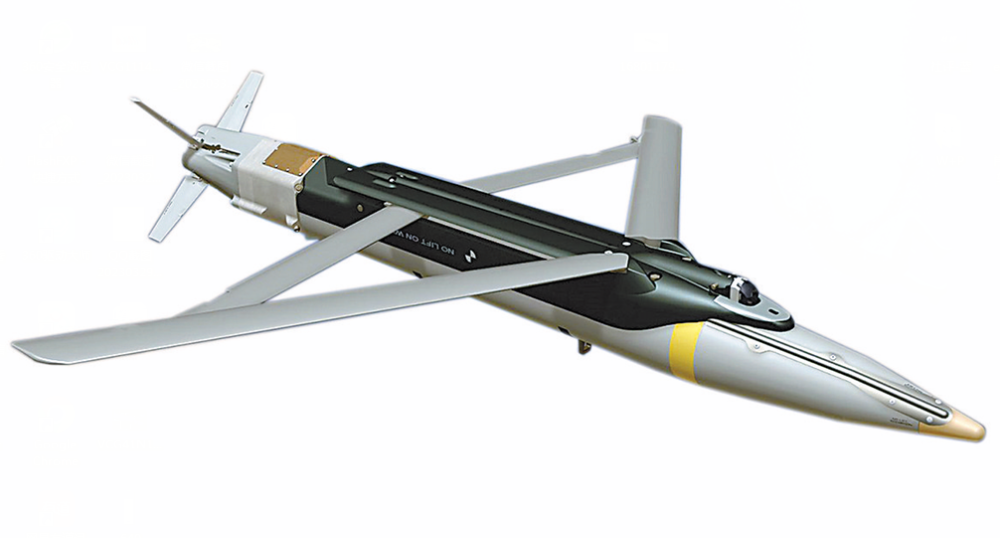

# 俄首次成功拦截美援乌“智能炸弹”，俄媒称“具有里程碑意义”

【环球时报特约记者 张锦 柳玉鹏 环球时报记者
刘扬】俄罗斯国防部28日称，俄罗斯防空部队首次拦截了美国援助乌克兰的“陆射小直径炸弹”（GLSDB）。俄媒体将其称为一个“具有里程碑意义的事件”。中国军事专家表示，对于俄军现有防空能力而言，在有准备的情况下拦截小直径炸弹不难，难的是用比较经济的手段拦住绝大多数瞄准自身高价值目标的“陆射小直径炸弹”。

**俄对拦截成功很兴奋**

据塔斯社网站28日报道，俄罗斯国防部发言人科纳申科夫当天表示，俄罗斯防空部队在乌克兰的特别军事行动中首次拦截“陆射小直径炸弹”这种智能弹药。在过去24小时内，俄防空部队拦截了18枚“海马斯”多管火箭炮系统的火箭弹和一枚“陆射小直径炸弹”。

俄罗斯卫星新闻网报道称，今年1月，美国首次宣布向乌克兰供应这些炸弹。这是波音公司和瑞典萨博公司联合开发的项目，在航空炸弹上加装火箭发动机，使其可以由“海马斯”火箭炮发射。萨博公司称，这种精确制导炸弹的射程超过150公里。俄罗斯《观点报》网站称，“陆射小直径炸弹”是M-31火箭弹（火箭发动机）和GBU-39/B滑翔制导炸弹的结合体。发射一段时间后，“陆射小直径炸弹”“抛掉”发动机和助推器，然后像一个具有较小反射面的滑翔炸弹一样工作。

据俄罗斯《真理报》29日报道，俄国防部没有透露使用何种防空系统拦截“陆射小直径炸弹”，但俄专家认为，可能是“道尔-M2”防空系统。

俄媒对拦截“陆射小直径炸弹”给予高度评价。俄罗斯《观点报》网站称，从乌军的角度来看，GLSDB的主要任务是打击俄罗斯武装部队的后方设施和关键基础设施，这些设施位于通往克里米亚的陆地走廊和半岛上。按照乌方的设想，这将使乌克兰部队在亚速海和黑海地区发动进攻时取得重大成功。因此，对“陆射小直径炸弹”的拦截是一个具有里程碑意义的事件。

《观点报》认为，这次拦截为未来高效拦截这种弹药奠定了基础。报道援引军事专家尤里·克努托夫的话称，“陆射小直径炸弹”是一种高技术装备，需要一种特殊的方法来消灭它。成功拦截这样的目标意味着俄防空系统升级了特定的软件。“陆射小直径炸弹”被拦截的事实意味着俄军已经成功完成对这款炸弹的情报积累阶段，现在可以更详细地了解这款炸弹的性能及工作频率，这将使俄防空导弹系统和电子战系统有效对抗它。“我们还可以对现有软件进行一些改进，未来对‘陆射小直径炸弹’的拦截成功概率几乎可达到100%。”

**这种炸弹厉害在哪**

中国军事专家张学峰对《环球时报》记者分析说，这次俄方公布拦截“陆射小直径炸弹”，并强调这次拦截的里程碑意义，有助于提高俄军士气。在有准备的情况下，拦截“陆射小直径炸弹”要比拦截“海马斯”火箭弹容易一些。张学峰表示，“陆射小直径炸弹”先由固体火箭发动机把小直径炸弹助推到一定高度和速度，然后固体火箭发动机脱落。小直径炸弹的折叠式弹翼弹开进行滑翔飞行。因为弹翼展弦比较高，整个炸弹可以获得比较好的滑翔性能。这样就可以比“海马斯”发射的M30、M31制导火箭弹获得更远的射程。而且，在滑翔过程中，小直径炸弹并不是按照抛物线飞行，不仅具备俯仰机动能力，理论上还具有一定的侧向机动能力。这样它的落点不容易精确判断，可以实现所谓的瞄A打B，是一种缩水版的助推滑翔型武器。

此外，萨博公司公开的图片显示，多枚“陆射小直径炸弹”可以通过机动，从不同方向对同一目标发起进攻，让对方防空系统难以兼顾。

不过，在飞行的后半段，小直径炸弹受到空气阻力不断减速，速度会相对较慢。小直径炸弹有比较大的弹翼，相对比较脆弱，且雷达散射截面更大，“这时候要比速度更快的M30更为容易拦截”。

张学峰认为，俄军之前曾对一些防空系统的软件进行升级，用于拦截速度较快、但飞行路线比较呆板的“海马斯”火箭弹，而拦截这种“陆射小直径炸弹”可能不需要这种升级，因为它更接近于一种空气动力目标。

**“拦截一枚容易，拦截每一枚却很难”**

张学峰认为，除了使用防空导弹进行硬杀伤以外，还可通过电子战手段进行干扰。因为这种炸弹主要依靠GPS信号制导，其携带的惯性制导系统用于辅助制导，累积误差较大。而GPS信号较弱，相对较为容易干扰压制。如果在目标区周围对GPS信号进行高强度干扰，就会大幅度降低打击精度。

不过张学峰认为，尽管在预有准备的情况下相对容易拦截，但从之前的案例来看，乌克兰方面也在改进战术，其攻击往往出其不意。“拦截一枚容易，拦截每一枚却很难。”

首先是24小时全覆盖难。传统的防空作战模式是，先由对空警戒系统、预警系统探测发现目标，然后向防空反导系统发出警报，后者开机或开始对空辐射，锁定目标后拦截。但“海马斯”发射的火箭弹和“陆射小直径炸弹”飞行时间比较短，如果等对空警戒系统发现目标后，防空系统从冷机状态启动，就可能来不及拦截。如果让防空反导系统全天24小时开机，一方面容易暴露自身位置，使自身处于危险之中，另一方面在连续运行时间、可靠性等参数上较难做到这一点。

其次，俄军现有的防空系统并非针对这种火箭弹或火箭助推制导炸弹专门设计的。在拦截这类弹药时性价比不高，效率也有待提高。比如，如果用S-300这类远程防空系统拦截，代价过于高昂。如果使用“铠甲”-S1、“道尔”这类防空导弹系统拦截，抗饱和攻击能力又相对较低。上述近程防空系统只能同时拦截2-3个目标。从这个角度来看，研制性价比较高、专门针对这类弹药，类似以色列“铁穹”的反火箭炮、火炮和迫击炮系统（C-RAM）应该是一个选项。而广域的卫星导航信号干扰系统，也不能24小时开机，否则会干扰己方无人机的运用。这显然是一个矛盾。所以未来一段时间，如果乌军使用更多的“陆射小直径炸弹”，对俄军的应对方案是个重大考验。

