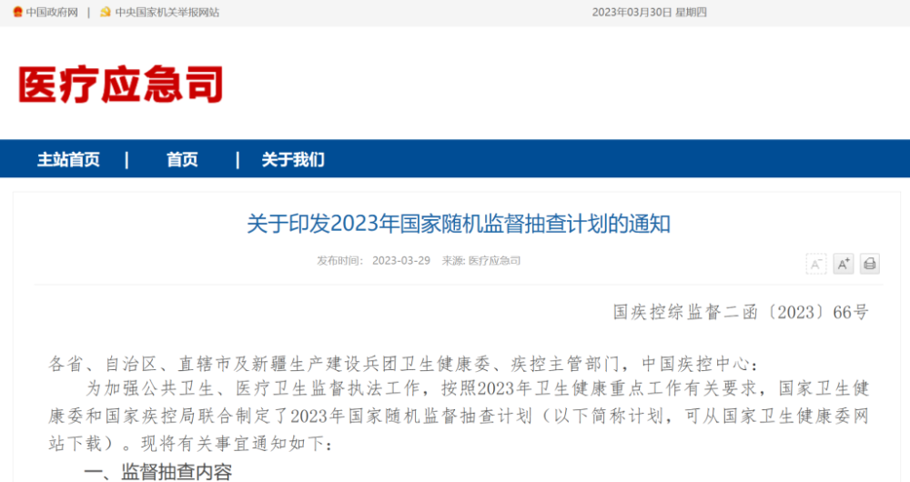

# 国家卫健委：今年重点检查疫情报告是否存在瞒报缓报谎报等情况

3月29日，据国家卫健委消息，为加强公共卫生、医疗卫生监督执法工作，按照2023年卫生健康重点工作有关要求，国家卫生健康委和国家疾控局联合制定了2023年国家随机监督抽查计划。根据计划，两部门将进一步加大对开展医疗美容、辅助生殖、医学检验、健康体检等服务的医疗机构的抽查力度，依法依规严肃查处违法行为情况。

具体如下：

一、监督抽查内容

（一）学校、公共场所、生活饮用水供水单位和餐具饮具集中消毒服务单位卫生管理情况；

（二）用人单位及职业健康检查、职业病诊断、放射诊疗机构落实职业病防治法律法规情况；职业卫生技术服务机构、放射卫生技术服务机构依法执业情况；

（三）医疗卫生机构预防接种管理，重点检查新冠病毒疫苗的接收、储存、接种等情况。医疗卫生机构传染病疫情报告，重点检查新冠病毒感染疫情报告是否存在瞒报、缓报、谎报等情况。医疗卫生机构传染病疫情控制、消毒隔离措施落实、医疗废物管理、病原微生物实验室生物安全管理等情况；

（四）消毒产品和涉及饮用水卫生安全产品生产经营情况；

（五）医疗机构（包括民营医疗机构）、采供血机构、母婴保健技术服务机构依法执业情况。持续巩固医疗美容行业突出问题专项治理和打击整治人类辅助生殖技术应用领域违法违规行为工作成果，进一步加大对开展医疗美容、辅助生殖、医学检验、健康体检等服务的医疗机构的抽查力度，依法依规严肃查处违法行为情况。

二、组织实施

（一）2023年国家随机监督抽查工作由各省级卫生健康行政部门（疾控主管部门）按照要求自行抽取，对同一检查对象，要在兼顾各专业需求的基础上争取一次性完成抽查事项，避免对检查单位造成不必要的干扰。要做好国家随机监督抽查任务与地方日常监督工作的衔接，将国家随机监督抽查作为日常监督工作的一部分进行统筹安排。已下发省级抽查计划的省份及新疆生产建设兵团可将相关任务纳入国家抽查任务一并统计。

（二）各地要加强人员培训，提高监督执法人员发现问题、查处问题的能力，发现违法行为符合立案条件的，要坚决立案查处，维护国家随机监督抽查的严肃性。强化对下级的指导督促和检查，确保工作顺利开展。

（三）各地随机监督抽查任务抽取后原则上不得随意调整。在执行过程中，执法检查人员有特殊原因难以执行抽查任务的，可由省级卫生健康行政部门（疾控主管部门）进行调整，调整比例原则上不得超过抽取人员总数的15%。

（四）各地要积极争取地方财政资金支持，保障国家随机监督抽查工作经费。抽查任务中涉及到的检测任务，原则上应当由当地疾控机构承担，不具备相应检测能力的，可由第三方检测机构承担。

三、工作要求

（一）各地应当在抽查任务完成后按照“谁检查、谁录入、谁公开”的原则，将抽查结果信息通过官方网站依法向社会公开。抽查结果信息包括：抽查未发现问题、发现问题已责令改正、行政处罚、无法联系（检查时单位已关闭等情形）等4类。未发现问题、发现问题已责令改正和无法联系的信息应当在抽查任务完成之日起20个工作日内向社会公开，行政处罚信息自作出行政处罚决定之日起7个工作日内向社会公开。

（二）各地要按照计划要求，通过卫生健康监督信息系统按时上报相关信息。

（来源：人民日报健康客户端）

