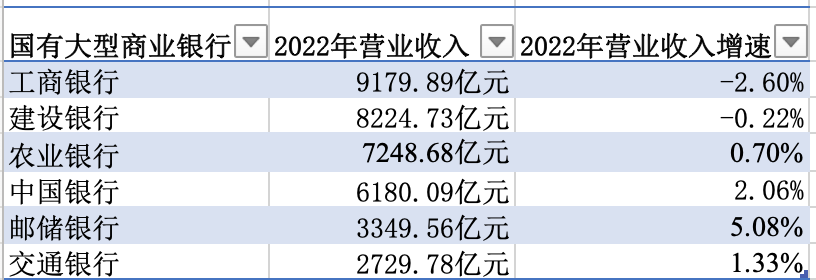

# 国有六大行去年日赚近37亿，个人住房贷款不良率集体走高

国有六大行2022年呈现净利润增速下滑、营业收入放缓、不良贷款率总体改善的局面。

国有六大银行（工商银行、农业银行、中国银行、建设银行、交通银行和邮储银行）3月30日晚间交齐2022年成绩单：实现归属于股东的净利润（下同）总计13482.96亿元，较2021年的12723.44亿元增长近6%，逊于上年11%的增幅，去年合计日赚超36.9亿元。

资产质量方面，国有六大行去年不良贷款余额集体多增，个人住房贷款不良率也全部走高。

**净利润增速集体回落，两家营业收入下降**

2022年国有六大行在资产规模和净利润排名，均与2021年相同。

_截至2022年末国有六大行资产规模和净利润一览_

以资产计，截至2022年末，工行、建行、农行、中行、邮储银行和交行是中国前六大商业银行。

在赚钱能力上，“宇宙第一大行”工行的赚钱能力依旧是最强的，归属该行股东的净利润3604.83亿元，建行、农行、中行、交行和邮储银行分别归属该行股东的净利润3238.61亿元、2591.4亿元、2274.39亿元、921.49亿元和852.24亿元。

不同于2021年国有六大行都实现两位数的净利润增速，2022年，只有邮储银行净利润增速超过10%。

具体来说，工行、建行、农行、中行、邮储银行和交行去年实现归属于股东的净利润增速分别为3.49%、7.06%、7.40%、5.02%、11.89%和5.22%，而2021年增速分别为10.27%、11.61%、11.70%、12.28%、11.89%和18.65%。

相比2021年，国有六大行的营业收入增速下滑，其中两家出现了营业收入下降。

工行和建行2022年实现营业收入9179.89亿元和8224.73亿元，较上年下降2.6%和0.22%。

_2022年末国有六大行营业收入情况_

**不良贷款余额集体走高**

资产质量方面，国有六大行的不良贷款余额集体走高，不良率方面，除邮储银行外，其余5家均较上年出现回落。

_2022年末国有六大行资产质量一览_

交行是在国有六大行中连续两年不良贷款率降幅最大的，2022年不良率为1.35%，下降了0.13个百分点。

尽管小幅升高，但邮储银行0.84%的不良率依旧远低于其他五家。2022年末，工行、建行、农行、中行的不良贷款率分别为1.38%、1.38%、1.37%和1.32%。

2022年国有六大行的个人住房贷款不良率全部走高。

具体来说，去年末工行、建行、农行、中行、邮储和交行的个人住房贷款不良率0.39%、0.37%、0.51%、0.47%、0.57%、0.44%，2021年末个人住房贷款不良率分别为0.24%、0.20%、0.36%、0.27%、0.44%和0.34%。

建行行长张金良3月30日在业绩说明会上表示，个人住房贷款不良率升高0.17个百分点，符合预期，没有对其整体资产质量的稳定造成冲击。

